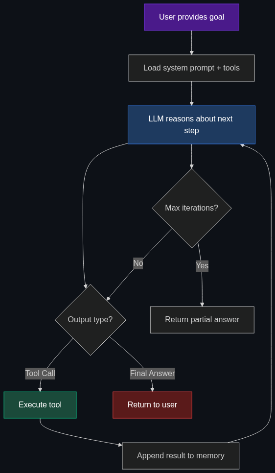

# 🤖 Agents / Autonomous Agents

> **AI systems designed to perceive a request, make a plan, use tools, and take actions independently to achieve a specific goal without human hand-holding.**

---

## Phase 1: Core Foundations & Pre-requisites

### Prerequisites
- **LLMs & Prompt Engineering** — How language models generate text and follow instructions
- **API Basics** — REST endpoints, JSON, authentication
- **Function Calling** — How models output structured tool calls (see [04_Function_Calling_Tool_Use.md](04_Function_Calling_Tool_Use.md))

### Definition
An **AI Agent** is a software system built around an LLM that can:
1. **Perceive** — Receive a goal or observe its environment
2. **Reason** — Break the goal into sub-tasks and form a plan
3. **Act** — Execute actions using external tools (APIs, code, databases)
4. **Observe** — Evaluate the results of its actions
5. **Iterate** — Refine its plan based on feedback and repeat until the goal is achieved

Unlike a simple chatbot, an agent operates in a **loop** — working autonomously until the task is done.

### The Problem It Solves

| Traditional AI (Chatbot) | AI Agent |
|--------------------------|----------|
| Single turn: prompt → response | Multi-turn: goal → plan → act → observe → refine |
| Cannot access external systems | Connects to APIs, databases, file systems |
| User must orchestrate every step | Agent orchestrates autonomously |
| No memory of actions within a task | Maintains working memory across lifecycle |

**Legacy Issue:** Before agents, using AI for real work required a human to manually copy-paste between the AI and external tools — slow, error-prone, unscalable.

### The Solution
Agents wrap an LLM inside a **perception-reasoning-action loop** (the "ReAct loop"). The LLM decides *what* to do, calls tools to *do* it, observes the result, and decides the next step.

### Real-World Example — Automated Incident Response
A production alert fires at 2 AM: "Database latency spike."

An autonomous agent:
1. **Perceives** the PagerDuty alert via webhook
2. **Queries** the Datadog API for latency metrics
3. **Checks** active DB connections via monitoring tool
4. **Identifies** a runaway query from a recent deployment
5. **Cross-references** Git history to find the offending PR
6. **Drafts** a Slack message with root cause analysis
7. **Executes** a safe query kill (with human approval gate)
8. **Monitors** recovery and closes the incident ticket

### Trade-off Table

| Dimension | Chatbot | AI Agent | Human + Scripts |
|-----------|---------|----------|-----------------|
| **Autonomy** | ❌ None | ✅ High | ⚠️ Medium |
| **Flexibility** | ✅ Any text | ✅ Any task w/ tools | ❌ Only scripted |
| **Reliability** | ✅ Predictable | ⚠️ Can hallucinate | ✅ Predictable |
| **Cost/task** | 💰 Low | 💰💰 Medium | 💰💰💰 High |
| **Scalability** | 🟢 Instant | 🟢 Instant | 🔴 Headcount |

### 🧩 Mini-Quiz

> **Q1:** What separates a chatbot from an agent?
> <details><summary>Answer</summary>A chatbot does single prompt-response. An agent loops: reason → act → observe → refine until goal achieved.</details>

> **Q2:** Why is tool access essential for agents?
> <details><summary>Answer</summary>Agents must *do* things (query DBs, call APIs). Without tools, it's just a chatbot.</details>

---

## Phase 2: Anatomy & Internal Mechanisms

### Atomic Components

| Component | Role |
|-----------|------|
| **System Prompt** | Defines persona, constraints, behavioral guidelines |
| **Working Memory** | Stores conversation history, tool results, reasoning (bounded by context window) |
| **Tool Registry** | Catalog of tools with names, descriptions, input schemas |
| **LLM (Brain)** | Takes state → outputs final answer OR tool call |
| **Orchestrator** | Code managing the loop: LLM → parse → execute → append → repeat |

### Agent Lifecycle



### Key Reasoning Frameworks

| Framework | How It Works | Best For |
|-----------|-------------|----------|
| **ReAct** | Alternates `Thought:` → `Action:` steps | Most popular; simple & effective |
| **Plan-and-Execute** | Full plan upfront, then step-by-step | Long-horizon tasks |
| **Reflexion** | Reflects on past failures to self-improve | Self-correcting agents |
| **LATS** | Explores multiple paths like tree search | Highest quality; most costly |

### 🃏 Flashcard

> **Front:** What is ReAct?
> <details><summary>Flip</summary><b>Reasoning + Acting.</b> LLM alternates between writing reasoning (Thought) and taking actions (Action/Observation). Most widely used agent pattern. Yao et al. (2022).</details>

---

## Phase 3: Advanced / Enterprise Patterns & Pitfalls

### At Scale
- **Coding Assistants** (Copilot, Cursor, Devin) — Read codebase → write code → run tests → iterate
- **Customer Support** (Klarna) — Replaced 700 agents; handles 2/3 of chats autonomously
- **Data Analysis** (Code Interpreter) — Upload data → write Python → execute → visualize → iterate

### Edge Cases & Mitigations

| Issue | Mitigation |
|-------|------------|
| **Infinite loops** | `max_iterations` (10-25); loop detection |
| **Context overflow** | Summarize old messages; sliding window |
| **Hallucinated tool calls** | Strict schema validation; reject malformed |
| **Cascading failures** | Per-tool error handling; re-plan ability |
| **Cost explosion** | Token budgets; cheap models for simple steps |
| **Safety risks** | Human-in-the-loop for destructive actions |

### Anti-Patterns

- ❌ **"God Agent"** — 50+ tools, no specialization → Split into sub-agents
- ❌ **No guardrails** — Unconfirmed destructive actions → Gate writes/deletes
- ❌ **Ignoring cost** — GPT-4 for every step → Cheap model for planning
- ❌ **No observability** — No logging → Trace every step (LangSmith, Arize)

---

## Phase 4: Practical Implementation

### Minimal Agent Loop (Python + OpenAI)

```python
import openai, json

# 1. Define tools
tools = [{
    "type": "function",
    "function": {
        "name": "get_weather",
        "description": "Get weather for a city",
        "parameters": {
            "type": "object",
            "properties": {"city": {"type": "string"}},
            "required": ["city"]
        }
    }
}]

# 2. Implement tools
def get_weather(city: str) -> str:
    return json.dumps({"city": city, "temp": "72°F", "condition": "Sunny"})

TOOL_MAP = {"get_weather": get_weather}

# 3. Agent Loop — the core pattern behind every framework
def run_agent(goal: str, max_iter: int = 10):
    client = openai.OpenAI()
    messages = [
        {"role": "system", "content": "You are a helpful assistant. Use tools when needed."},
        {"role": "user", "content": goal}
    ]
    
    for i in range(max_iter):
        resp = client.chat.completions.create(
            model="gpt-4o", messages=messages,
            tools=tools, tool_choice="auto"
        )
        msg = resp.choices[0].message
        messages.append(msg)
        
        if msg.tool_calls:
            for tc in msg.tool_calls:
                result = TOOL_MAP[tc.function.name](
                    **json.loads(tc.function.arguments)
                )
                messages.append({
                    "role": "tool",
                    "tool_call_id": tc.id,
                    "content": result
                })
        else:
            return msg.content  # Final answer
    
    return "Max iterations reached"
```

### Popular Agent Frameworks

| Framework | Creator | Best For |
|-----------|---------|----------|
| **LangGraph** | LangChain | Complex stateful agent graphs |
| **CrewAI** | Community | Role-based multi-agent teams |
| **AutoGen** | Microsoft | Multi-agent research |
| **OpenAI Agents SDK** | OpenAI | OpenAI-native agents |
| **Google ADK** | Google | Gemini ecosystem |

---

## Phase 5: Interview Preparation

### Q1: "Design an agent for production incident debugging."
<details><summary><b>STAR Answer</b></summary>

**Situation:** Production alerts need immediate investigation; human on-call is a bottleneck.

**Task:** Agent that autonomously triages and investigates incidents.

**Action:** Trigger via PagerDuty webhook → Query Datadog metrics → Check recent deploys (GitHub API) → Search runbooks (RAG) → Get logs (CloudWatch) → Post findings to Slack. **Safety:** Read-only tools auto-execute; write actions need human approval.

**Result:** Mean-time-to-diagnose drops from 30 min to 3 min.
</details>

### Q2: "What happens when an agent's context window fills up?"
<details><summary><b>Answer</b></summary>

| Strategy | Trade-off |
|----------|-----------|
| **Sliding Window** | Drop oldest messages — may forget the goal |
| **Summarization** | Compress old messages — lossy but effective |
| **Hierarchical Memory** | Short-term (context) + Long-term (vector DB) — complex |
| **Checkpointing** | Save plan + progress externally — enables crash recovery |

**Best:** Summarization + checkpointing. Every N iterations, summarize and save state.
</details>

### Q3: "ReAct vs Plan-and-Execute — when do you choose each?"
<details><summary><b>Answer</b></summary>

- **ReAct:** Short tasks (< 5 steps), exploratory, next step depends on previous result
- **Plan-and-Execute:** Long tasks (10+), well-defined workflows, scope known upfront
- **Hybrid (best):** Plan-and-Execute macro-level + ReAct within each step
</details>

---

## Phase 6: Summary Cheatsheet & Action Plan

### 📋 TL;DR

| Concept | Key Point |
|---------|-----------|
| **Agent** | LLM + Tools + Loop = autonomous task completion |
| **Core Loop** | Perceive → Reason → Act → Observe → Repeat |
| **ReAct** | Most popular: alternates Thought ↔ Action |
| **Safety** | Gate dangerous actions behind human approval |
| **Cost** | Cheap models for planning, expensive for critical decisions |

### 📖 Industry Reads
1. **Paper:** [ReAct: Synergizing Reasoning and Acting](https://arxiv.org/abs/2210.03629) — Yao et al. (2022)
2. **Blog:** [LLM Powered Autonomous Agents](https://lilianweng.github.io/posts/2023-06-23-agent/) — Lilian Weng (OpenAI)

### 🚀 Do These Now
1. **Build the loop (30 min):** Use the Python code above with real APIs (OpenWeatherMap, Tavily)
2. **Try a framework (1 hr):** `pip install langgraph` → build the quickstart ReAct agent
3. **Add tracing (30 min):** Sign up for [LangSmith](https://smith.langchain.com/) free tier, observe agent steps

### 🧭 Next Topic
> How would you coordinate *multiple* specialized agents? → [02_Multi_Agent_Systems.md](02_Multi_Agent_Systems.md)
