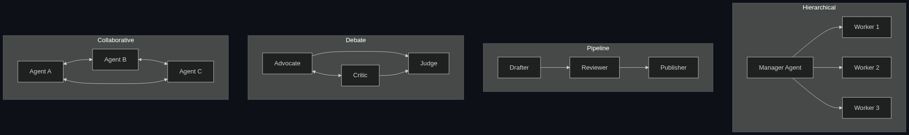

# 🌐 Multi-Agent Systems

> **An architecture where multiple AI agents, often with different personas or specialties, work together (or debate each other) to solve highly complex problems.**

---

## Phase 1: Core Foundations & Pre-requisites

### Prerequisites
- **Single Agent Architecture** — Understand the agent loop (see [01_Agents_Autonomous_Agents.md](01_Agents_Autonomous_Agents.md))
- **Distributed Systems Basics** — Message passing, coordination, consensus
- **Prompt Engineering** — Role-based personas, system prompts

### Definition
A **Multi-Agent System (MAS)** is an architecture where 2+ AI agents — each with its own role, tools, and persona — collaborate to solve a problem that would be too complex, too broad, or too unreliable for a single agent.

Each agent is a specialist:
- **Researcher Agent** — Searches the web, gathers information
- **Coder Agent** — Writes and debugs code
- **Reviewer Agent** — Critiques and validates work
- **Manager Agent** — Orchestrates the team, delegates tasks

### The Problem It Solves

| Single Agent | Multi-Agent System |
|-------------|-------------------|
| One persona with all tools (overloaded) | Each agent has focused tools & expertise |
| Long context = confused reasoning | Each agent has clean, focused context |
| No self-checking | Agents review each other's work |
| Single point of failure | Redundancy through collaboration |
| Struggles with 10+ step tasks | Divides complex work into parallel streams |

**Legacy Issue:** Single agents with 50+ tools and complex goals tend to "forget" their mission, hallucinate, or make cascading errors. Multi-agent splits the cognitive load.

### The Solution
Decompose a complex task into roles. Each agent gets a narrow mandate, limited tools, and a focused system prompt. A coordination pattern (hierarchy, debate, or pipeline) connects them.

### Real-World Example — AI Software Engineering Team
**Task:** "Build a REST API for user authentication with tests and documentation."

| Agent | Role | Tools |
|-------|------|-------|
| **PM Agent** | Breaks requirements into tickets | Jira API |
| **Backend Agent** | Writes FastAPI code | Code editor, terminal |
| **Test Agent** | Writes and runs pytest suites | Terminal, test runner |
| **Reviewer Agent** | Reviews code for bugs & security | Code reader, linter |
| **Docs Agent** | Generates API documentation | Markdown writer |

### Trade-off Table

| Dimension | Single Agent | Multi-Agent | Human Team |
|-----------|-------------|-------------|------------|
| **Complexity handling** | ⚠️ Medium | ✅ High | ✅ High |
| **Quality (self-checking)** | ❌ No | ✅ Yes | ✅ Yes |
| **Setup effort** | 🟢 Low | 🟡 Medium | 🔴 High |
| **Cost (tokens)** | 💰 Low | 💰💰💰 High | 💰💰💰💰 |
| **Latency** | 🟢 Fast | 🔴 Slower (multiple LLM calls) | 🔴 Slowest |
| **Debugging** | 🟢 Easy | 🔴 Complex (inter-agent issues) | 🟡 Medium |

### 🧩 Mini-Quiz

> **Q1:** Why not just give one agent all the tools?
> <details><summary>Answer</summary>Too many tools confuse the LLM's tool selection. The context becomes overloaded, leading to hallucinated tool calls and lost focus. Specialization improves reliability.</details>

> **Q2:** What is the biggest cost trade-off of multi-agent systems?
> <details><summary>Answer</summary>Token cost and latency. Each agent makes separate LLM calls, and inter-agent communication multiplies the total tokens consumed.</details>

---

## Phase 2: Anatomy & Internal Mechanisms

### Communication Topologies



### Topology Comparison

| Pattern | How It Works | Best For |
|---------|-------------|----------|
| **Hierarchical** | Manager delegates, workers report back | Task decomposition, project management |
| **Pipeline** | Output of one agent feeds into the next | Content creation, data processing |
| **Debate** | Agents argue opposing views; judge decides | Decision-making, research analysis |
| **Collaborative** | Peers share context and build on each other | Creative brainstorming, complex research |

### Agent Communication Protocol

Each agent message typically contains:
```json
{
  "from": "researcher_agent",
  "to": "coder_agent",
  "type": "task_result",
  "content": "Here are the API specs I found: ...",
  "metadata": {
    "confidence": 0.92,
    "sources": ["https://docs.api.com/v2"],
    "iteration": 3
  }
}
```

### State Management

| Approach | Description | Trade-off |
|----------|-------------|-----------|
| **Shared Memory** | All agents read/write to a common state object | Simple but creates race conditions |
| **Message Passing** | Agents communicate only through messages | Clean isolation; more overhead |
| **Blackboard** | Shared knowledge base agents read from and contribute to | Good for research; complex to manage |
| **Graph State** (LangGraph) | State flows along edges of a directed graph | Best for complex workflows |

### 🃏 Flashcard

> **Front:** What's the "Debate" pattern in multi-agent systems?
> <details><summary>Flip</summary>Two agents argue opposing positions on a question. A third "judge" agent evaluates both arguments and makes a final decision. This mirrors adversarial processes (courts, peer review) and produces higher-quality, more nuanced outputs than a single agent.</details>

---

## Phase 3: Advanced / Enterprise Patterns & Pitfalls

### At Scale
- **ChatDev** — Simulates a software company with CEO, CTO, Programmer, Tester agents
- **MetaGPT** — Multi-agent framework generating full software from a one-line spec
- **AutoGen (Microsoft)** — Production multi-agent conversations for enterprise workflows
- **CrewAI** — Role-based agents with memory and tool delegation

### Edge Cases & Mitigations

| Issue | Mitigation |
|-------|------------|
| **Echo chamber** | Agents agree on wrong answer → Add a dedicated critic/skeptic agent |
| **Deadlock** | Agents wait for each other indefinitely → Set timeouts + manager escalation |
| **Context drift** | Agents lose track of original goal → Include goal in every agent's prompt |
| **Blame assignment** | Hard to debug which agent caused failure → Full trace logging per agent |
| **Token cost explosion** | N agents × M iterations × K tokens → Budget caps per agent; summarization |
| **Conflicting outputs** | Agents produce contradictory results → Resolution agent or voting mechanism |

### Anti-Patterns

- ❌ **Too many agents** — 10+ agents for a simple task → Use 2-3 focused agents max
- ❌ **Identical agents** — Multiple agents with same prompt → Differentiate roles clearly
- ❌ **No termination condition** — Agents loop forever → Set max rounds + consensus criteria
- ❌ **No shared context** — Agents can't see each other's work → Shared state or message log

---

## Phase 4: Practical Implementation

### CrewAI Example — Research & Writing Team

```python
from crewai import Agent, Task, Crew, Process

# 1. Define specialized agents
researcher = Agent(
    role="Senior Research Analyst",
    goal="Find comprehensive, accurate information on the given topic",
    backstory="You're a veteran researcher with 15 years at top think tanks.",
    tools=[search_tool, web_scraper],  # Each agent gets focused tools
    verbose=True
)

writer = Agent(
    role="Technical Content Writer",
    goal="Transform research into clear, engaging technical articles",
    backstory="You're an award-winning tech writer known for making complex topics accessible.",
    tools=[],  # Writer doesn't need search — gets info from researcher
    verbose=True
)

reviewer = Agent(
    role="Senior Editor & Fact Checker",
    goal="Ensure accuracy, clarity, and completeness of the final article",
    backstory="You're a meticulous editor who catches every error and gap.",
    tools=[search_tool],  # Can verify claims
    verbose=True
)

# 2. Define tasks (pipeline pattern)
research_task = Task(
    description="Research 'AI Agents in Production' — gather key patterns, frameworks, and case studies.",
    expected_output="A structured research brief with key findings, sources, and data points.",
    agent=researcher
)

writing_task = Task(
    description="Write a 1500-word technical article based on the research brief.",
    expected_output="A polished article with intro, sections, code examples, and conclusion.",
    agent=writer,
    context=[research_task]  # Writer receives researcher's output
)

review_task = Task(
    description="Review the article for accuracy, completeness, and readability.",
    expected_output="Final article with corrections applied + review notes.",
    agent=reviewer,
    context=[research_task, writing_task]  # Reviewer sees both
)

# 3. Assemble the crew
crew = Crew(
    agents=[researcher, writer, reviewer],
    tasks=[research_task, writing_task, review_task],
    process=Process.sequential,  # Pipeline: research → write → review
    verbose=True
)

result = crew.kickoff()
```

### LangGraph Multi-Agent Example

```python
from langgraph.graph import StateGraph, MessagesState

# Define state that flows between agents
class TeamState(MessagesState):
    plan: str = ""
    code: str = ""
    review: str = ""
    current_agent: str = "planner"

# Each agent is a node in the graph
def planner_node(state: TeamState):
    # LLM call with planner persona
    plan = call_llm("You are a senior architect. Create a plan for: " + state.messages[-1])
    return {"plan": plan, "current_agent": "coder"}

def coder_node(state: TeamState):
    code = call_llm(f"Implement this plan:\n{state.plan}")
    return {"code": code, "current_agent": "reviewer"}

def reviewer_node(state: TeamState):
    review = call_llm(f"Review this code:\n{state.code}\nAgainst plan:\n{state.plan}")
    return {"review": review, "current_agent": "done"}

# Build the graph
graph = StateGraph(TeamState)
graph.add_node("planner", planner_node)
graph.add_node("coder", coder_node)
graph.add_node("reviewer", reviewer_node)

# Define edges (flow)
graph.add_edge("planner", "coder")
graph.add_edge("coder", "reviewer")
graph.set_entry_point("planner")

app = graph.compile()
```

### Framework Comparison

| Framework | Topology | Learning Curve | Production Ready |
|-----------|----------|---------------|-----------------|
| **CrewAI** | Role-based teams | 🟢 Easy | 🟡 Maturing |
| **AutoGen** | Conversation-based | 🟡 Medium | 🟡 Maturing |
| **LangGraph** | Graph-based | 🔴 Steep | ✅ Yes |
| **MetaGPT** | SOPs + roles | 🟡 Medium | 🟡 Research |

---

## Phase 5: Interview Preparation

### Q1: "When would you use multi-agent vs. single-agent?"
<details><summary><b>Answer</b></summary>

**Single Agent:** Task is well-defined, < 5 tools, < 5 steps. Adding agents adds unnecessary cost and latency.

**Multi-Agent:** Task requires diverse expertise (research + coding + review), quality demands self-checking, or a single agent's context would be overloaded with 10+ tools.

**Rule of thumb:** Start with one agent. Only split when you observe failures caused by context overload or lack of self-checking.
</details>

### Q2: "How do you handle disagreements between agents?"
<details><summary><b>Answer</b></summary>

Three strategies:
1. **Voting** — Each agent votes; majority wins (simple but shallow)
2. **Debate + Judge** — Agents argue; a judge agent with access to ground truth decides (higher quality)
3. **Escalation** — If agents can't agree after N rounds, escalate to human (safest for high-stakes)

Choice depends on stakes: voting for low-risk, judge for medium, human for high-risk decisions.
</details>

### Q3: "Design a multi-agent system for automated code review."
<details><summary><b>STAR Answer</b></summary>

**Situation:** Engineering team receives 50+ PRs/day; human reviewers are bottlenecked.

**Task:** Multi-agent system that provides first-pass code review.

**Action:**
- **Security Agent** — Scans for vulnerabilities (OWASP, secrets in code)
- **Style Agent** — Checks formatting, naming conventions, linting
- **Logic Agent** — Reviews business logic, edge cases, error handling
- **Test Agent** — Verifies test coverage, suggests missing test cases
- **Synthesizer Agent** — Aggregates all reviews into a single PR comment

Each agent gets only the diff + relevant context (not entire codebase). Manager routes based on changed file types.

**Result:** 80% of reviews automated; human reviewers focus on architecture and design decisions.
</details>

---

## Phase 6: Summary Cheatsheet & Action Plan

### 📋 TL;DR

| Concept | Key Point |
|---------|-----------|
| **MAS** | Multiple specialized agents > one overloaded agent |
| **Topologies** | Hierarchical, Pipeline, Debate, Collaborative |
| **Communication** | Shared state OR message passing |
| **When to use** | Complex tasks, diverse expertise, self-checking needed |
| **Key risk** | Cost explosion — N agents × M rounds × K tokens |
| **Termination** | Always set max rounds + consensus/completion criteria |

### 📖 Industry Reads
1. **Paper:** [Communicative Agents for Software Development](https://arxiv.org/abs/2307.07924) — ChatDev paper
2. **Docs:** [CrewAI Documentation](https://docs.crewai.com/) — Best starting point for hands-on MAS

### 🚀 Do These Now
1. **Build a 2-agent pipeline (45 min):** `pip install crewai` → Create a researcher + writer team
2. **Add a critic agent (30 min):** Add a reviewer that checks the writer's output for errors
3. **Compare topologies (1 hr):** Run the same task with sequential vs. hierarchical process in CrewAI

### 🧭 Next Topic
> How do agents securely connect to external data sources and tools? → [03_MCP_Model_Context_Protocol.md](03_MCP_Model_Context_Protocol.md)
