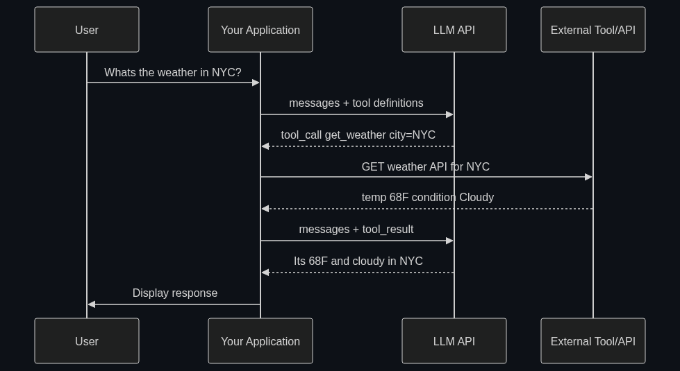

# ⚙️ Function Calling / Tool Use

> **Giving an AI the ability to output structured commands that trigger external code. This is how an AI uses "skills" like searching the web, checking the weather, or booking a flight.**

---

## Phase 1: Core Foundations & Pre-requisites

### Prerequisites
- **LLMs & Chat APIs** — How chat completions work (messages, roles, responses)
- **JSON & JSON Schema** — Structured data, schema definitions with types and required fields
- **REST APIs** — HTTP requests, request/response patterns

### Definition
**Function Calling** (also called **Tool Use**) is a capability where an LLM, instead of responding with plain text, outputs a **structured JSON object** representing a function to call with specific arguments.

The LLM does NOT execute the function itself. It produces a structured *intent* — your code catches that intent, runs the actual function, and feeds the result back.

```
User: "What's the weather in Tokyo?"

WITHOUT Function Calling:
  LLM: "I don't have real-time weather data, but Tokyo is generally..."  (hallucinated guess)

WITH Function Calling:
  LLM: {"name": "get_weather", "arguments": {"city": "Tokyo"}}  (structured command)
  Your Code: calls OpenWeatherMap API → gets real data
  LLM (with result): "It's currently 22°C and sunny in Tokyo."  (grounded answer)
```

### The Problem It Solves

| Without Function Calling | With Function Calling |
|-------------------------|----------------------|
| LLM guesses facts (hallucination) | LLM fetches real data |
| Can only generate text | Can trigger real-world actions |
| Output is unstructured (hard to parse) | Output is structured JSON (easy to parse) |
| No connection to external systems | Bridge between LLM and any API/database |

**Legacy Issue:** Early LLMs (GPT-3, early ChatGPT) could only produce text. Getting structured output required fragile regex parsing of the LLM's text output. Function Calling made structured output a **first-class feature** of the model.

### The Solution
Model providers (OpenAI, Anthropic, Google) fine-tune their models to:
1. **Understand tool definitions** — Read JSON schemas describing available functions
2. **Decide when to use a tool** — Based on the user's request and context
3. **Output valid JSON** — Matching the tool's parameter schema exactly
4. **Interpret results** — Take the tool's output and weave it into a natural language response

### Real-World Example — E-Commerce Customer Service Bot
**User:** "Where's my order #12345?"

The AI has these tools available:
- `lookup_order(order_id: str)` → Returns order status, tracking, ETA
- `initiate_refund(order_id: str, reason: str)` → Starts refund process
- `transfer_to_human(reason: str)` → Escalates to human agent

**Flow:**
1. LLM reads user message + tool definitions
2. LLM outputs: `{"name": "lookup_order", "arguments": {"order_id": "12345"}}`
3. Backend calls order DB → Returns `{"status": "shipped", "eta": "April 30"}`
4. LLM responds: "Your order #12345 has shipped and is expected to arrive by April 30!"

### Trade-off Table

| Dimension | Raw Text Output | Function Calling | Structured Output (JSON mode) |
|-----------|----------------|-----------------|------------------------------|
| **Reliability** | ⚠️ Regex parsing breaks | ✅ Validated JSON | ✅ Validated JSON |
| **Real-world actions** | ❌ Can't trigger code | ✅ Designed for this | ⚠️ Possible but not semantic |
| **Model support** | ✅ Any model | ⚠️ Specific models | ✅ Most modern models |
| **Multiple tools** | 🔴 Confusing | ✅ Native parallel calls | ❌ Not designed for this |

### 🧩 Mini-Quiz

> **Q1:** Does the LLM actually execute the function?
> <details><summary>Answer</summary>No! The LLM only outputs a structured JSON intent. Your application code executes the actual function and sends the result back to the LLM.</details>

> **Q2:** What would happen without function calling if you asked an LLM for today's stock price?
> <details><summary>Answer</summary>It would either hallucinate a number (training data is outdated) or say "I can't access real-time data." Function calling lets it trigger a stock API and return real data.</details>

---

## Phase 2: Anatomy & Internal Mechanisms

### The Function Calling Flow



### Tool Definition Schema (OpenAI Format)

```json
{
  "type": "function",
  "function": {
    "name": "search_flights",
    "description": "Search for available flights between two cities on a given date. Use this when the user wants to find or book flights.",
    "parameters": {
      "type": "object",
      "properties": {
        "origin": {
          "type": "string",
          "description": "Departure city IATA code (e.g., 'JFK')"
        },
        "destination": {
          "type": "string",
          "description": "Arrival city IATA code (e.g., 'LAX')"
        },
        "date": {
          "type": "string",
          "description": "Travel date in YYYY-MM-DD format"
        },
        "max_price": {
          "type": "number",
          "description": "Maximum price in USD (optional)"
        }
      },
      "required": ["origin", "destination", "date"]
    }
  }
}
```

**Critical parts the LLM reads:**
- **`name`** — Must be unique; LLM uses this to identify the tool
- **`description`** — This is the **most important field**. The LLM decides when to use the tool based primarily on this text. Write it like documentation for a colleague.
- **`parameters`** — JSON Schema defining expected inputs. The LLM generates arguments matching this schema.

### Parallel Function Calling

Modern models can call **multiple tools simultaneously** when they're independent:

```
User: "What's the weather in NYC and Tokyo?"

LLM outputs TWO tool calls in one response:
  1. get_weather(city="NYC")
  2. get_weather(city="Tokyo")

Your code executes both in parallel → sends both results back → LLM combines them.
```

### Provider Comparison

| Feature | OpenAI | Anthropic (Claude) | Google (Gemini) |
|---------|--------|-------------------|-----------------|
| **Term used** | Function Calling | Tool Use | Function Calling |
| **Parallel calls** | ✅ Yes | ✅ Yes | ✅ Yes |
| **Forced tool use** | `tool_choice: {"type": "function", "function": {"name": "X"}}` | `tool_choice: {"type": "tool", "name": "X"}` | `tool_config: {mode: "ANY"}` |
| **Auto mode** | `tool_choice: "auto"` | `tool_choice: {"type": "auto"}` | `tool_config: {mode: "AUTO"}` |
| **Strict schema** | `strict: true` (guaranteed schema match) | N/A (generally reliable) | N/A |

### 🃏 Flashcard

> **Front:** What's the difference between `tool_choice: "auto"` and `tool_choice: "required"`?
> <details><summary>Flip</summary><b>auto:</b> LLM decides whether to call a tool or respond with text. Use for general assistants.<br/><b>required:</b> LLM MUST call at least one tool. Use when you know the user's request needs a tool (e.g., always search before answering).</details>

---

## Phase 3: Advanced / Enterprise Patterns & Pitfalls

### At Scale
- **OpenAI Assistants API** — Built entirely on function calling + code interpreter
- **Shopify Sidekick** — Function calling to query store data, create discounts, manage inventory
- **Stripe Agent Toolkit** — Financial operations via function calling (create charges, refunds)

### Edge Cases & Mitigations

| Issue | Mitigation |
|-------|------------|
| **Wrong tool selected** | Improve tool descriptions; reduce tool count; add few-shot examples |
| **Invalid arguments** | Use `strict: true` (OpenAI); validate params before execution |
| **Tool not called when it should be** | Use `tool_choice: "required"` or rephrase tool description |
| **Too many tools (>20)** | Group tools into categories; use a "router" tool that suggests which to use |
| **Sensitive actions** | Add confirmation step before executing (e.g., "Are you sure you want to delete?") |

### Writing Effective Tool Descriptions

| ❌ Bad | ✅ Good |
|--------|---------|
| `"Gets weather"` | `"Get the current weather conditions for a specified city. Returns temperature, humidity, and forecast. Use when the user asks about weather, temperature, or if they should bring an umbrella."` |
| `"Database query"` | `"Execute a read-only SQL SELECT query against the orders database. Returns up to 100 rows. Use when the user asks about order status, sales data, or customer information."` |

**Rule:** Describe *what it does*, *what it returns*, and *when to use it*.

### Anti-Patterns

- ❌ **Vague descriptions** — LLM can't decide when to use the tool → Be explicit about use cases
- ❌ **No error returns** — Tool crashes, LLM gets nothing → Return error as text, not exception
- ❌ **Exposing raw SQL tool** — SQL injection risk → Use parameterized, scoped query tools
- ❌ **Returning huge payloads** — 10K rows back to LLM → Paginate, summarize, or limit results

---

## Phase 4: Practical Implementation

### Complete Example: Multi-Tool Assistant (Python + OpenAI)

```python
import openai
import json
from datetime import datetime

client = openai.OpenAI()

# ── Tool Definitions ────────────────────────────────────
tools = [
    {
        "type": "function",
        "function": {
            "name": "get_current_time",
            "description": "Get the current date and time. Use when asked about the current time or date.",
            "parameters": {"type": "object", "properties": {}}
        }
    },
    {
        "type": "function",
        "function": {
            "name": "calculate",
            "description": "Perform mathematical calculations. Use for any arithmetic the user requests.",
            "parameters": {
                "type": "object",
                "properties": {
                    "expression": {
                        "type": "string",
                        "description": "Math expression to evaluate, e.g. '2 + 2' or '15% of 200'"
                    }
                },
                "required": ["expression"]
            }
        }
    }
]

# ── Tool Implementations ────────────────────────────────
def get_current_time() -> str:
    return json.dumps({"time": datetime.now().isoformat()})

def calculate(expression: str) -> str:
    try:
        # Safety: only allow math operations (production: use a proper math parser)
        allowed_chars = set("0123456789+-*/().% ")
        if all(c in allowed_chars for c in expression):
            result = eval(expression)  # ⚠️ Use a safe math parser in production!
            return json.dumps({"result": result})
        return json.dumps({"error": "Invalid expression"})
    except Exception as e:
        return json.dumps({"error": str(e)})

TOOL_MAP = {
    "get_current_time": lambda: get_current_time(),
    "calculate": lambda **kwargs: calculate(**kwargs),
}

# ── Single Turn with Tool Use ───────────────────────────
def chat_with_tools(user_message: str) -> str:
    messages = [{"role": "user", "content": user_message}]
    
    # First call: LLM decides whether to use tools
    response = client.chat.completions.create(
        model="gpt-4o",
        messages=messages,
        tools=tools,
        tool_choice="auto"
    )
    
    msg = response.choices[0].message
    
    # If no tool calls, return text response directly
    if not msg.tool_calls:
        return msg.content
    
    # Execute all tool calls (may be parallel)
    messages.append(msg)
    for tool_call in msg.tool_calls:
        fn_name = tool_call.function.name
        fn_args = json.loads(tool_call.function.arguments) if tool_call.function.arguments else {}
        
        print(f"  🔧 {fn_name}({fn_args})")
        result = TOOL_MAP[fn_name](**fn_args)
        
        messages.append({
            "role": "tool",
            "tool_call_id": tool_call.id,
            "content": result
        })
    
    # Second call: LLM incorporates tool results into final answer
    final = client.chat.completions.create(
        model="gpt-4o",
        messages=messages
    )
    return final.choices[0].message.content

# ── Usage ───────────────────────────────────────────────
print(chat_with_tools("What time is it and what's 15% of 847?"))
```

### Anthropic (Claude) Tool Use Format

```python
import anthropic

client = anthropic.Anthropic()

response = client.messages.create(
    model="claude-sonnet-4-20250514",
    max_tokens=1024,
    tools=[{
        "name": "get_weather",
        "description": "Get weather for a city",
        "input_schema": {  # Note: 'input_schema' not 'parameters'
            "type": "object",
            "properties": {
                "city": {"type": "string", "description": "City name"}
            },
            "required": ["city"]
        }
    }],
    messages=[{"role": "user", "content": "Weather in Paris?"}]
)

# Claude uses content blocks instead of tool_calls
for block in response.content:
    if block.type == "tool_use":
        print(f"Tool: {block.name}, Args: {block.input}")
```

---

## Phase 5: Interview Preparation

### Q1: "How does function calling work under the hood in LLMs?"
<details><summary><b>Answer</b></summary>

The model is **fine-tuned** on examples of conversations where the correct response is a structured JSON tool call instead of text. During inference:

1. Tool definitions are serialized and injected into the system/user prompt (invisible to user)
2. The model's output logits are **constrained** to produce valid JSON matching the schema (when `strict: true`)
3. The model has learned to recognize when a user request matches a tool's description
4. It generates the function name + arguments as tokens, just like generating text — but structured

It's NOT a separate model. The same transformer generates both text and tool calls; it's been trained to know when each is appropriate.
</details>

### Q2: "You have 50 tools. The LLM keeps picking the wrong one. How do you fix this?"
<details><summary><b>Answer</b></summary>

Graduated approach:
1. **Improve descriptions** (highest ROI) — Add "Use when..." and "Do NOT use when..." to each tool
2. **Reduce tool count** — Group related tools; create a "router" tool that suggests categories
3. **Few-shot examples** — Show the model examples of correct tool selection in the system prompt
4. **Two-stage routing** — First call: LLM selects a category (3-4 options). Second call: LLM picks from tools within that category (5-10 options)
5. **Fine-tuning** — Last resort: fine-tune on your specific tool selection patterns
</details>

### Q3: "Function Calling vs. JSON Mode vs. Structured Output — when do you use each?"
<details><summary><b>Answer</b></summary>

| Method | When to Use |
|--------|-------------|
| **Function Calling** | When the LLM needs to trigger an action or fetch data from an external system |
| **JSON Mode** | When you need any valid JSON output but don't need tool semantics (e.g., extracting structured data from text) |
| **Structured Output** | When you need the output to match a specific schema exactly (e.g., always return `{name, age, email}`) |

Function Calling has *semantic meaning* (the model understands it's requesting an action). JSON Mode and Structured Output are about *format control* (making the output parseable).
</details>

---

## Phase 6: Summary Cheatsheet & Action Plan

### 📋 TL;DR

| Concept | Key Point |
|---------|-----------|
| **Function Calling** | LLM outputs structured JSON to trigger external code |
| **LLM doesn't execute** | It only produces the *intent*; your code runs the function |
| **Tool Description** | The #1 factor in correct tool selection — write like documentation |
| **Parallel Calls** | Modern models can call multiple tools simultaneously |
| **Strict Mode** | OpenAI `strict: true` guarantees schema-valid output |
| **Error Handling** | Return errors as text, not exceptions — let the LLM recover |

### 📖 Industry Reads
1. **Docs:** [OpenAI Function Calling Guide](https://platform.openai.com/docs/guides/function-calling) — The definitive reference
2. **Docs:** [Anthropic Tool Use Guide](https://docs.anthropic.com/en/docs/build-with-claude/tool-use) — Claude's approach

### 🚀 Do These Now
1. **Call your first tool (20 min):** Run the Python example above with a real OpenAI key
2. **Add a real API (30 min):** Replace the simulated `get_weather` with [OpenWeatherMap](https://openweathermap.org/api)
3. **Test edge cases (30 min):** Ask ambiguous questions — see when the model picks the wrong tool, then improve the description

### 🧭 Next Topic
> How do you chain these tool calls into iterative, self-improving workflows? → [05_Agentic_Workflows.md](05_Agentic_Workflows.md)
