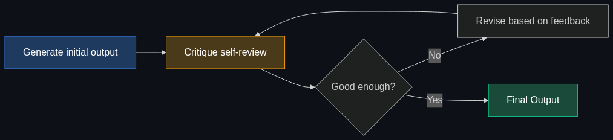
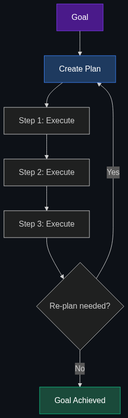
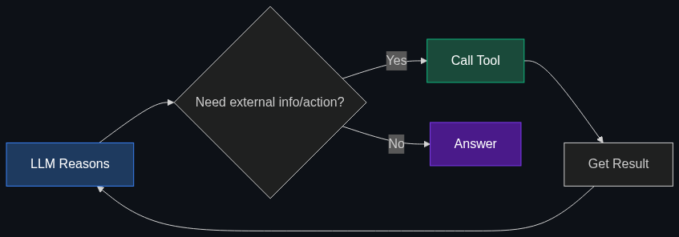
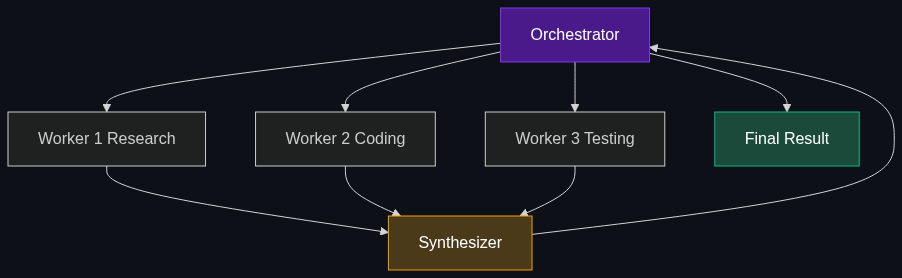

# 🔄 Agentic Workflows

> **Instead of asking an AI to do something in one shot, this is the process of breaking a task into a loop where the AI plans, drafts, reviews its own work, and refines it iteratively.**

---

## Phase 1: Core Foundations & Pre-requisites

### Prerequisites
- **AI Agents** — The core agent loop (see [01_Agents_Autonomous_Agents.md](01_Agents_Autonomous_Agents.md))
- **Function Calling** — How LLMs trigger external actions (see [04_Function_Calling_Tool_Use.md](04_Function_Calling_Tool_Use.md))
- **Software Design Patterns** — State machines, pipelines, event-driven architecture

### Definition
An **Agentic Workflow** is a design pattern where an AI system is orchestrated through a structured, multi-step process — typically involving planning, execution, self-evaluation, and iterative refinement — rather than producing output in a single LLM call.

**Key Insight (Andrew Ng):**
> *"An agentic workflow, where you ask the AI to iterate over a task, can give dramatically better results than a zero-shot prompt — even when using a weaker model with an agentic workflow vs. a stronger model without one."*

### The Problem It Solves

| One-Shot Prompting | Agentic Workflow |
|-------------------|-----------------|
| One LLM call → one output | Multiple calls → iteratively improved output |
| No self-checking | Built-in review and refinement |
| Entire task in one context | Decomposed into manageable sub-tasks |
| Quality varies wildly | Consistently higher quality |
| Can't recover from mistakes | Self-correcting through feedback loops |

**The core issue:** Asking an LLM to write a 2000-word essay, debug complex code, or analyze a dataset in one shot produces mediocre results. Humans don't work that way either — we plan, draft, review, revise. Agentic workflows give AI the same iterative process.

### The Solution
Structure the AI's work into discrete phases with feedback loops. The four foundational agentic patterns (per Andrew Ng):

| Pattern | Description |
|---------|-------------|
| **Reflection** | AI generates output, then critiques its own work and improves it |
| **Tool Use** | AI calls external tools to gather info or take actions |
| **Planning** | AI decomposes a goal into a step-by-step plan before executing |
| **Multi-Agent** | Multiple specialized AIs collaborate on the task |

### Real-World Example — Agentic Code Generation

**Task:** "Write a Python REST API for user management with authentication."

**One-shot:** LLM generates code in one response. Missing edge cases, no tests, possible bugs.

**Agentic Workflow:**
1. **Plan:** Decompose into endpoints, data models, auth strategy
2. **Generate:** Write code for each component
3. **Review:** Self-critique for security issues, missing error handling
4. **Test:** Generate and run test cases
5. **Fix:** Address failing tests and review feedback
6. **Refine:** Optimize, add docstrings, clean up

### Trade-off Table

| Dimension | One-Shot | Agentic Workflow |
|-----------|---------|-----------------|
| **Quality** | ⚠️ Varies | ✅ Consistently higher |
| **Latency** | ✅ Fast (1 call) | 🔴 Slow (5-20 calls) |
| **Cost** | 💰 Low | 💰💰💰 High (many calls) |
| **Complexity** | 🟢 Simple | 🟡 Medium to high |
| **Self-correction** | ❌ None | ✅ Built-in |
| **Determinism** | ⚠️ Variable | ⚠️ Variable but bounded |

### 🧩 Mini-Quiz

> **Q1:** Why does an agentic workflow on GPT-4o-mini sometimes outperform one-shot GPT-4o?
> <details><summary>Answer</summary>The iterative process (plan → draft → review → refine) compensates for the weaker model's limitations. Self-correction catches errors that the stronger model would also make in a single pass.</details>

> **Q2:** What are Andrew Ng's four foundational agentic patterns?
> <details><summary>Answer</summary>Reflection, Tool Use, Planning, Multi-Agent Collaboration.</details>

---

## Phase 2: Anatomy & Internal Mechanisms

### The Four Core Workflow Patterns

#### 1. Reflection Pattern



**How it works:**
- **Generator LLM:** Produces the initial output
- **Critic LLM:** Reviews the output against criteria (can be the same model with a different prompt)
- **Loop:** Generator revises based on critic's feedback until quality threshold met

#### 2. Planning Pattern



**How it works:**
- **Planner LLM:** Decomposes the goal into ordered sub-tasks
- **Executor LLM(s):** Executes each sub-task sequentially or in parallel
- **Re-planner:** Adjusts the plan if a step fails or new information emerges

#### 3. Tool-Augmented Pattern



(This is the core agent loop — see [01_Agents](01_Agents_Autonomous_Agents.md) for full details)

#### 4. Orchestrator-Workers Pattern



### Workflow State Management

| Approach | Description | Example |
|----------|-------------|---------|
| **In-Memory Dict** | Simple Python dict passed between steps | Good for prototypes |
| **Graph State** (LangGraph) | Typed state object flowing through a graph | Production workflows |
| **Database-Backed** | Persist state to DB for durability and resumability | Long-running workflows |
| **Event-Sourced** | Log every state change as an event | Audit-heavy environments |

### 🃏 Flashcard

> **Front:** What's the "Reflection" pattern?
> <details><summary>Flip</summary>The AI generates output, then <b>critiques its own work</b> against quality criteria, and <b>revises iteratively</b> until the output meets the threshold. It's the simplest agentic pattern and often the highest ROI improvement over one-shot prompting.</details>

---

## Phase 3: Advanced / Enterprise Patterns & Pitfalls

### At Scale — Production Agentic Workflows

| Product | Workflow Pattern |
|---------|-----------------|
| **Cursor / Copilot** | Plan → Generate Code → Run Lint/Tests → Fix Errors → Repeat |
| **Devin** | Full SDLC: Plan → Code → Test → Debug → Deploy |
| **Perplexity** | Query → Search Web → Extract → Synthesize → Cite → Refine |
| **Jasper AI** | Brief → Draft → Brand voice check → SEO optimize → Review |

### Advanced Patterns

**Evaluator-Optimizer Loop:**
```
Generate → Evaluate (score 0-100) → If score < 80, optimize → Re-evaluate → Repeat
```
Use when you can define a quantitative quality metric.

**Human-in-the-Loop:**
```
Plan → [HUMAN APPROVES] → Execute → Draft → [HUMAN REVIEWS] → Finalize
```
Use for high-stakes workflows (financial, medical, legal).

**Checkpoint & Resume:**
```
Step 1 → Save State → Step 2 → Save State → [CRASH] → Resume from Step 2
```
Essential for long-running workflows that may fail mid-execution.

### Edge Cases & Mitigations

| Issue | Mitigation |
|-------|------------|
| **Infinite refinement** | Set max iterations (3-5 for reflection) + quality threshold |
| **Plan becomes stale** | Re-plan periodically (every N steps) when observations contradict plan |
| **Over-planning** | For simple tasks, skip planning — use direct execution |
| **Review blindness** | Use a different model or prompt for the critic vs. the generator |
| **State corruption** | Validate state between steps; add schema checks |
| **Cost per workflow** | Budget per workflow; early-exit if good enough |

### Anti-Patterns

- ❌ **Agentic everything** — Simple Q&A doesn't need a workflow → Use one-shot for simple tasks
- ❌ **No termination criteria** — "Keep improving forever" → Define "done" (score, max rounds, human approval)
- ❌ **Same prompt for generate and critique** — Self-review is biased → Use different personas/criteria
- ❌ **No observability** — Can't debug multi-step failures → Log every step's input, output, and decision

---

## Phase 4: Practical Implementation

### Reflection Workflow (Python)

```python
import openai
import json

client = openai.OpenAI()

def reflection_workflow(task: str, max_rounds: int = 3) -> str:
    """
    Reflection pattern: Generate → Critique → Revise → Repeat.
    
    This is the simplest and often most effective agentic pattern.
    """
    
    # Step 1: Initial generation
    draft = client.chat.completions.create(
        model="gpt-4o",
        messages=[
            {"role": "system", "content": "You are a senior technical writer."},
            {"role": "user", "content": task}
        ]
    ).choices[0].message.content
    
    print(f"📝 Initial draft generated ({len(draft)} chars)")
    
    for round_num in range(max_rounds):
        # Step 2: Critique the draft
        critique = client.chat.completions.create(
            model="gpt-4o",
            messages=[
                {"role": "system", "content": (
                    "You are a meticulous senior editor. Review the following draft "
                    "and provide specific, actionable feedback. Rate it 1-10. "
                    "If it's 8+, respond with exactly 'APPROVED'. "
                    "Otherwise, list specific improvements needed."
                )},
                {"role": "user", "content": f"Draft to review:\n\n{draft}"}
            ]
        ).choices[0].message.content
        
        print(f"🔍 Round {round_num + 1} critique: {critique[:100]}...")
        
        # Step 3: Check if approved
        if "APPROVED" in critique.upper():
            print(f"✅ Approved after {round_num + 1} rounds!")
            return draft
        
        # Step 4: Revise based on feedback
        draft = client.chat.completions.create(
            model="gpt-4o",
            messages=[
                {"role": "system", "content": "You are a senior technical writer. Revise your draft based on the editor's feedback."},
                {"role": "user", "content": f"Original draft:\n{draft}\n\nEditor feedback:\n{critique}\n\nPlease revise."}
            ]
        ).choices[0].message.content
        
        print(f"✏️ Revised draft ({len(draft)} chars)")
    
    print(f"⚠️ Max rounds reached, returning best draft")
    return draft

# Usage
result = reflection_workflow(
    "Write a technical blog post about the benefits of MCP (Model Context Protocol) "
    "for enterprise AI deployments. Include code examples."
)
```

### LangGraph Workflow (Plan → Execute → Review)

```python
from langgraph.graph import StateGraph, END
from typing import TypedDict, Literal

class WorkflowState(TypedDict):
    task: str
    plan: str
    draft: str
    review: str
    revision_count: int
    status: Literal["planning", "drafting", "reviewing", "done"]

def plan_step(state: WorkflowState) -> WorkflowState:
    """Break the task into a structured plan."""
    plan = call_llm(f"Create a detailed plan for: {state['task']}")
    return {"plan": plan, "status": "drafting"}

def draft_step(state: WorkflowState) -> WorkflowState:
    """Execute the plan to create a draft."""
    draft = call_llm(f"Follow this plan:\n{state['plan']}\n\nCreate the output.")
    return {"draft": draft, "status": "reviewing"}

def review_step(state: WorkflowState) -> WorkflowState:
    """Review the draft and decide: approve or revise."""
    review = call_llm(
        f"Review this draft:\n{state['draft']}\n"
        f"Against this plan:\n{state['plan']}\n"
        f"Respond with 'APPROVED' or specific feedback."
    )
    return {"review": review, "revision_count": state["revision_count"] + 1}

def should_continue(state: WorkflowState) -> str:
    """Routing logic: continue revising or finish."""
    if "APPROVED" in state["review"].upper():
        return "done"
    if state["revision_count"] >= 3:
        return "done"
    return "revise"

# Build the graph
graph = StateGraph(WorkflowState)
graph.add_node("plan", plan_step)
graph.add_node("draft", draft_step)
graph.add_node("review", review_step)

graph.set_entry_point("plan")
graph.add_edge("plan", "draft")
graph.add_edge("draft", "review")
graph.add_conditional_edges("review", should_continue, {
    "revise": "draft",  # Loop back for revision
    "done": END
})

workflow = graph.compile()
```

### Choosing the Right Pattern

| Your Task | Recommended Pattern | Why |
|-----------|-------------------|-----|
| **Improve writing quality** | Reflection | Simple, highest ROI |
| **Multi-step research** | Planning + Tool Use | Needs decomposition + external data |
| **Code generation** | Plan → Generate → Test → Fix | Automated validation via tests |
| **Complex analysis** | Orchestrator-Workers | Parallelize independent sub-analyses |
| **Content pipeline** | Sequential Pipeline | Each stage builds on the last |
| **High-stakes decisions** | Any + Human-in-the-Loop | Human approval at critical gates |

---

## Phase 5: Interview Preparation

### Q1: "When would you use an agentic workflow vs. a single LLM call?"
<details><summary><b>Answer</b></summary>

**Single LLM call:** Simple, well-defined tasks where quality is "good enough" on the first try. Examples: translation, summarization, simple Q&A. Priority is speed and cost.

**Agentic workflow:** Complex tasks where quality matters and self-correction is valuable. Examples: code generation (need to run tests), research (need to search and synthesize), content creation (need editing). The extra latency and cost are justified by significantly higher output quality.

**Rule of thumb:** If a human would do it in one step, use one call. If a human would plan, draft, review, and revise — use an agentic workflow.
</details>

### Q2: "Design an agentic workflow for automated report generation from raw data."
<details><summary><b>STAR Answer</b></summary>

**Situation:** Business analysts spend 4 hours weekly generating reports from multiple data sources.

**Task:** Automate the workflow end-to-end.

**Action — Workflow Design:**
1. **Data Collection** (Tool Use) — Query SQL databases, pull from APIs, read spreadsheets
2. **Data Analysis** (Code Execution) — Run Python/Pandas analysis in a sandbox
3. **Draft Generation** (Planning) — Structure findings into executive summary, key metrics, trends
4. **Visualization** (Tool Use) — Generate charts using matplotlib/plotly
5. **Review** (Reflection) — Self-check for data accuracy, narrative coherence, missing insights
6. **Human Gate** — Analyst reviews and approves before distribution
7. **Distribution** (Tool Use) — Email report, post to Slack, update dashboard

**Result:** Analyst time reduced from 4 hours to 15 minutes (review only). Reports are more consistent and data-backed.
</details>

### Q3: "How do you prevent an agentic workflow from running forever or costing too much?"
<details><summary><b>Answer</b></summary>

**Termination controls:**
1. **Max iterations** — Hard cap on loop count (e.g., 3 reflection rounds, 15 agent steps)
2. **Quality threshold** — Quantitative score (e.g., test pass rate > 95%, review score > 8/10)
3. **Token budget** — Max tokens per workflow (e.g., 100K tokens total)
4. **Time budget** — Max wall-clock time (e.g., 5 minutes)
5. **Early exit** — If the first draft meets criteria, skip refinement

**Cost controls:**
- Use cheap models (GPT-4o-mini) for planning and review; expensive models only for critical generation
- Cache tool results to avoid redundant calls
- Set per-step token limits
</details>

---

## Phase 6: Summary Cheatsheet & Action Plan

### 📋 TL;DR

| Concept | Key Point |
|---------|-----------|
| **Agentic Workflow** | Structured multi-step process: plan → draft → review → refine |
| **Core Patterns** | Reflection, Tool Use, Planning, Multi-Agent |
| **Reflection** | Simplest and often highest-ROI pattern |
| **Key Insight** | Weak model + agentic workflow > Strong model + one-shot |
| **Termination** | Always set max iterations + quality threshold + budget |
| **When NOT to use** | Simple tasks where one-shot is good enough |

### 📖 Industry Reads
1. **Talk:** [Andrew Ng — Agentic Design Patterns](https://www.deeplearning.ai/the-batch/how-agents-can-improve-llm-performance/) — The definitive overview
2. **Docs:** [LangGraph Tutorials](https://langchain-ai.github.io/langgraph/tutorials/) — Hands-on workflow building

### 🚀 Do These Now
1. **Build a reflection loop (30 min):** Use the Python reflection example above — compare one-shot vs. 3-round reflection quality
2. **Add a planning step (30 min):** Before generating, have the LLM create a plan, then follow it
3. **Measure the difference (30 min):** Run both approaches on 5 tasks and score the outputs — you'll see the quality gap

### 🧭 Continue Learning
> You've now covered the entire "Agents & Action" layer! Review the [README](README.md) to revisit any topic or explore the next module in your learning path.
