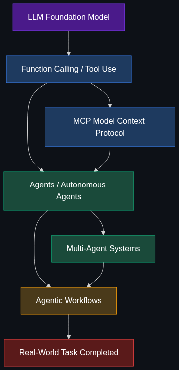

# 🤖 Agents & Action — The "Doing" Layer

> **Moving AI from just talking to actually doing tasks.**

This module covers the architectural layer where AI systems transition from passive text generation to **autonomous action-taking**. These are the patterns, protocols, and workflows that turn a language model into a reliable digital worker.

---

## 📚 Topics Covered

| # | Topic | File | Core Idea |
|---|-------|------|-----------|
| 1 | [Agents / Autonomous Agents](01_Agents_Autonomous_Agents.md) | `01_Agents_Autonomous_Agents.md` | AI that perceives → plans → acts → learns independently |
| 2 | [Multi-Agent Systems](02_Multi_Agent_Systems.md) | `02_Multi_Agent_Systems.md` | Multiple specialized AI agents collaborating or debating |
| 3 | [MCP (Model Context Protocol)](03_MCP_Model_Context_Protocol.md) | `03_MCP_Model_Context_Protocol.md` | Open standard for connecting AI to external tools/data |
| 4 | [Function Calling / Tool Use](04_Function_Calling_Tool_Use.md) | `04_Function_Calling_Tool_Use.md` | Structured outputs that trigger real-world actions |
| 5 | [Agentic Workflows](05_Agentic_Workflows.md) | `05_Agentic_Workflows.md` | Iterative plan → draft → review → refine loops |

---

## 🗺️ How These Topics Connect

---

## 🎯 Learning Path

**Recommended order:**

1. **Start** with [Function Calling / Tool Use](04_Function_Calling_Tool_Use.md) — the atomic primitive
2. **Then** [MCP](03_MCP_Model_Context_Protocol.md) — the standardized connection layer
3. **Then** [Agents](01_Agents_Autonomous_Agents.md) — single-agent autonomy
4. **Then** [Multi-Agent Systems](02_Multi_Agent_Systems.md) — scaling to teams
5. **Finally** [Agentic Workflows](05_Agentic_Workflows.md) — the orchestration patterns

---

## 🧠 Prerequisites

Before diving into this module, ensure you understand:

- **LLMs & Prompting** — How language models generate text, prompt engineering basics
- **APIs & REST** — HTTP methods, JSON payloads, auth patterns
- **Basic System Design** — Client-server architecture, message queues, event-driven design
- **Python Basics** — Most examples use Python with popular frameworks

---

## 🏭 Industry Relevance (2025–2026)

| Company | How They Use This Layer |
|---------|------------------------|
| **OpenAI** | GPT with function calling, Assistants API (agent loop), custom GPTs |
| **Google DeepMind** | Gemini tool use, Project Mariner (browser agent), A2A protocol |
| **Anthropic** | Claude with tool use, MCP (creator of the standard), computer use |
| **Microsoft** | AutoGen (multi-agent framework), Copilot Studio agents |
| **LangChain** | LangGraph (agentic workflow graphs), tool abstractions |
| **CrewAI** | Multi-agent orchestration with role-based personas |

---

> **💡 Key Insight:** The "Doing" layer is the fastest-evolving part of the AI stack in 2025-2026. Mastering these concepts positions you at the intersection of AI and software engineering — exactly where senior roles are being created.

---

*Each topic file follows the [Educator Skill](../.github/Educator_skill.md) 6-phase teaching methodology: Foundations → Anatomy → Enterprise Patterns → Implementation → Interview Prep → Cheatsheet.*
