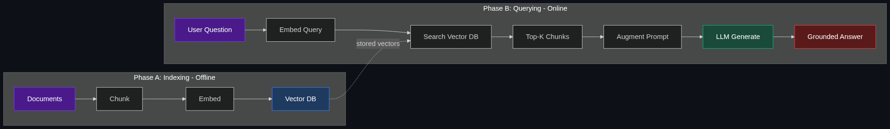

# 🔍 RAG — Retrieval-Augmented Generation

> **The standard way to stop an AI from guessing. Hook the AI up to a custom database so it can search for facts, documents, or company data before it generates an answer.**

---

## Phase 1: Core Foundations & Pre-requisites

### Prerequisites
- **LLMs & Prompting** — How models generate text from a prompt
- **Embeddings** — Text represented as numerical vectors (see [03_Vector_Database.md](03_Vector_Database.md))
- **Basic API Knowledge** — REST calls, JSON payloads

### Definition
**RAG (Retrieval-Augmented Generation)** is an architecture pattern where an LLM is paired with an external knowledge source. Before generating an answer, the system **retrieves** relevant documents from a database and **injects** them into the LLM's prompt as context.

```
User Question → Search Knowledge Base → Retrieve Top-K Documents → Inject into Prompt → LLM Generates Grounded Answer
```

The LLM never accesses the database directly — it simply receives the retrieved text as part of its input and uses it to craft an answer.

### The Problem It Solves

| Without RAG | With RAG |
|-------------|----------|
| LLM relies on training data (stale, generic) | LLM accesses live, domain-specific data |
| Hallucination on company-specific questions | Answers grounded in actual documents |
| Retraining needed for new knowledge | Just update the document store |
| No source attribution | Can cite exact documents/pages |
| Generic, one-size-fits-all answers | Tailored to your organization's data |

**Legacy Issue:** Fine-tuning an LLM on proprietary data is expensive ($10K-$100K+), slow (days-weeks), and the model can still hallucinate. RAG provides the same domain knowledge at a fraction of the cost and with real-time updates.

### The Solution
Instead of baking knowledge *into* the model (fine-tuning), **give it knowledge *at inference time*** by retrieving relevant documents and including them in the prompt. The model reads these documents and synthesizes an answer — like an open-book exam.

### Real-World Example — Enterprise Knowledge Base
**Scenario:** New engineers at a 5,000-person company need answers about internal systems.

**Without RAG:** They ask ChatGPT, which knows nothing about internal architecture. They get generic or hallucinated answers.

**With RAG:**
1. All internal docs (Confluence, runbooks, architecture docs) are chunked and embedded into a vector database
2. Engineer asks: "How does our payment service handle retries?"
3. System searches the vector DB → retrieves the 3 most relevant doc chunks
4. LLM reads the chunks and generates: "Based on the Payment Service Architecture Doc (v2.3), retries use exponential backoff with a max of 3 attempts..."

### Trade-off Table

| Dimension | Fine-Tuning | RAG | Prompt Stuffing |
|-----------|------------|-----|-----------------|
| **Knowledge freshness** | ❌ Static (training time) | ✅ Real-time updates | ✅ Real-time |
| **Cost** | 💰💰💰 High ($10K+) | 💰 Low | 💰 Low |
| **Hallucination control** | ⚠️ Medium | ✅ High (cites sources) | ✅ High |
| **Data volume** | ✅ Unlimited | ✅ Unlimited | ❌ Limited by context window |
| **Setup complexity** | 🔴 High | 🟡 Medium | 🟢 Low |
| **Latency** | 🟢 Fast (no retrieval) | 🟡 +200-500ms (retrieval step) | 🟢 Fast |
| **Best for** | Changing model behavior/style | Adding domain knowledge | Small datasets (<50 pages) |

### 🧩 Mini-Quiz

> **Q1:** Why is RAG often preferred over fine-tuning for enterprise knowledge?
> <details><summary>Answer</summary>RAG is cheaper, faster to set up, supports real-time data updates (no retraining), and provides source attribution. Fine-tuning is better for changing the model's behavior or style, not for adding factual knowledge.</details>

> **Q2:** What does the "Retrieval" in RAG actually retrieve?
> <details><summary>Answer</summary>It retrieves document chunks (text passages) from a vector database by finding chunks whose embeddings are semantically similar to the user's query embedding.</details>

---

## Phase 2: Anatomy & Internal Mechanisms

### The RAG Pipeline — Two Phases

**Phase A: Indexing (Offline — done once)**

```
Documents → Chunk → Embed → Store in Vector DB
```

1. **Load** — Ingest documents (PDFs, Confluence, Slack, code repos)
2. **Chunk** — Split into smaller pieces (500-1000 tokens each)
3. **Embed** — Convert each chunk to a vector using an embedding model
4. **Store** — Save vectors + original text in a vector database

**Phase B: Querying (Online — every user question)**

```
Question → Embed → Search Vector DB → Retrieve Top-K → Augment Prompt → Generate
```

1. **Embed Query** — Convert user's question to a vector
2. **Search** — Find the K most similar document chunks (cosine similarity)
3. **Augment** — Inject retrieved chunks into the LLM prompt
4. **Generate** — LLM produces answer grounded in the retrieved context

### RAG Architecture Diagram



### Key Components Deep-Dive

| Component | Role | Popular Options |
|-----------|------|-----------------|
| **Document Loader** | Ingest files from various sources | LangChain loaders, LlamaIndex readers, Unstructured.io |
| **Text Splitter** | Chunk documents intelligently | RecursiveCharacterTextSplitter, semantic chunking |
| **Embedding Model** | Convert text → vectors | OpenAI `text-embedding-3-small`, Cohere, `all-MiniLM-L6-v2` |
| **Vector Store** | Store & search vectors | Pinecone, Weaviate, Chroma, pgvector, Qdrant |
| **Retriever** | Find top-K relevant chunks | Similarity search, MMR, hybrid search |
| **LLM** | Generate final answer | GPT-4o, Claude, Gemini, Llama 3 |

### Chunking Strategies

| Strategy | How It Works | Best For |
|----------|-------------|----------|
| **Fixed-size** | Split every N characters/tokens | Simple, fast, predictable |
| **Recursive** | Split by paragraphs → sentences → words | General-purpose (most popular) |
| **Semantic** | Split at topic/meaning boundaries using embeddings | Higher quality; slower |
| **Document-aware** | Split by headings, sections, pages | Structured docs (markdown, HTML) |
| **Sliding window** | Overlapping chunks (e.g., 500 tokens, 100 overlap) | Prevents context loss at boundaries |

### 🃏 Flashcard

> **Front:** What is the difference between the "indexing" and "querying" phases of RAG?
> <details><summary>Flip</summary><b>Indexing (offline):</b> Documents are chunked, embedded, and stored in a vector DB. Done once or on schedule.<br/><b>Querying (online):</b> User question is embedded, similar chunks are retrieved, injected into the LLM prompt, and the model generates a grounded answer. Done on every request.</details>

---

## Phase 3: Advanced / Enterprise Patterns & Pitfalls

### At Scale
- **Notion AI** — RAG over your workspace pages for contextual Q&A
- **GitHub Copilot Chat** — RAG over your codebase for code-aware answers
- **Salesforce Einstein** — RAG over CRM data for customer insights
- **Bloomberg GPT** — Financial RAG over proprietary market data

### Advanced RAG Patterns

| Pattern | Description | When to Use |
|---------|-------------|-------------|
| **Naive RAG** | Simple embed → search → generate | Prototypes, simple Q&A |
| **Advanced RAG** | + query rewriting, reranking, hybrid search | Production systems |
| **Modular RAG** | Swappable components, routing, multi-index | Enterprise-grade |
| **Corrective RAG (CRAG)** | Evaluates retrieval quality; falls back to web search if poor | High-reliability systems |
| **Self-RAG** | Model decides whether it needs retrieval at all | Efficiency optimization |
| **Agentic RAG** | Agent decides what to retrieve, from which source, iteratively | Complex research tasks |

### Retrieval Quality Boosters

| Technique | What It Does | Impact |
|-----------|-------------|--------|
| **Query Rewriting** | Rephrase user query for better retrieval | +10-20% recall |
| **Hypothetical Document Embeddings (HyDE)** | Generate a hypothetical answer, embed that, search with it | +15% on complex queries |
| **Reranking** | Score retrieved chunks with a cross-encoder model before passing to LLM | +20-30% precision |
| **Hybrid Search** | Combine vector search + keyword search (BM25) | Handles exact terms + meaning |
| **Multi-Query** | Generate multiple query variations, retrieve for each, merge results | Better coverage |
| **Contextual Retrieval** | Prepend document context to each chunk before embedding (Anthropic) | +49% retrieval accuracy |

### Edge Cases & Mitigations

| Issue | Mitigation |
|-------|------------|
| **Wrong chunks retrieved** | Better chunking, reranking, hybrid search |
| **Answer ignores retrieved context** | Stronger system prompt: "Answer ONLY based on the provided context" |
| **Too many/few chunks** | Tune K (top-K); dynamic K based on relevance scores |
| **Stale data** | Incremental indexing pipeline; scheduled re-ingestion |
| **Multi-hop questions** | Agentic RAG: retrieve → reason → retrieve again iteratively |
| **Conflicting documents** | Include timestamps/versions; let LLM note the conflict |

### Anti-Patterns

- ❌ **Chunk too large** (5K+ tokens) — LLM gets distracted by irrelevant content → Keep chunks 500-1000 tokens
- ❌ **Chunk too small** (50 tokens) — Loses context, fragments meaning → Use overlap or semantic chunking
- ❌ **No metadata** — Can't filter by date, source, or department → Always store metadata with chunks
- ❌ **Ignoring retrieval quality** — Only tuning the LLM prompt → Retrieval quality is 80% of RAG success
- ❌ **No evaluation** — "Vibes-based" quality checks → Use RAGAS, DeepEval, or custom eval frameworks

---

## Phase 4: Practical Implementation

### Basic RAG Pipeline (Python + LangChain + OpenAI)

```python
from langchain_community.document_loaders import DirectoryLoader, TextLoader
from langchain.text_splitter import RecursiveCharacterTextSplitter
from langchain_openai import OpenAIEmbeddings, ChatOpenAI
from langchain_community.vectorstores import Chroma
from langchain.chains import RetrievalQA

# ── Phase A: Indexing ────────────────────────────────────
# 1. Load documents from a directory
loader = DirectoryLoader(
    "./company_docs/",
    glob="**/*.md",
    loader_cls=TextLoader
)
documents = loader.load()
print(f"Loaded {len(documents)} documents")

# 2. Chunk documents — recursive splitting is the gold standard
splitter = RecursiveCharacterTextSplitter(
    chunk_size=800,       # ~800 tokens per chunk (sweet spot)
    chunk_overlap=100,    # 100 token overlap prevents context loss at boundaries
    separators=["\n\n", "\n", ". ", " ", ""]  # Split hierarchy
)
chunks = splitter.split_documents(documents)
print(f"Split into {len(chunks)} chunks")

# 3. Embed & store in Chroma (local vector DB — great for prototyping)
embeddings = OpenAIEmbeddings(model="text-embedding-3-small")  # $0.02/1M tokens
vectorstore = Chroma.from_documents(
    documents=chunks,
    embedding=embeddings,
    persist_directory="./chroma_db"  # Persists to disk
)
print("Indexing complete!")

# ── Phase B: Querying ────────────────────────────────────
# 4. Build the RAG chain
llm = ChatOpenAI(model="gpt-4o", temperature=0)  # Low temp = factual
retriever = vectorstore.as_retriever(
    search_type="similarity",  # Also try "mmr" for diversity
    search_kwargs={"k": 5}     # Retrieve top 5 chunks
)

rag_chain = RetrievalQA.from_chain_type(
    llm=llm,
    chain_type="stuff",  # "stuff" = inject all chunks into one prompt
    retriever=retriever,
    return_source_documents=True  # Include sources for transparency
)

# 5. Query!
result = rag_chain.invoke({"query": "How does our auth service handle token refresh?"})
print(f"Answer: {result['result']}")
print(f"Sources: {[doc.metadata['source'] for doc in result['source_documents']]}")
```

### Production RAG with Reranking

```python
from langchain.retrievers import ContextualCompressionRetriever
from langchain_cohere import CohereRerank

# Add a reranker on top of base retrieval — significantly improves precision
reranker = CohereRerank(model="rerank-english-v3.0", top_n=3)

compression_retriever = ContextualCompressionRetriever(
    base_compressor=reranker,
    base_retriever=vectorstore.as_retriever(search_kwargs={"k": 20})
    # Retrieve 20 candidates, rerank, keep top 3
)

# Now use compression_retriever instead of base retriever
# This typically improves answer quality by 20-30%
```

### RAG Evaluation (RAGAS)

```python
from ragas import evaluate
from ragas.metrics import faithfulness, answer_relevancy, context_precision

# Evaluate your RAG pipeline with standardized metrics
results = evaluate(
    dataset=eval_dataset,  # Questions + ground truth answers
    metrics=[
        faithfulness,         # Does the answer stick to the retrieved context?
        answer_relevancy,     # Is the answer relevant to the question?
        context_precision,    # Were the right chunks retrieved?
    ]
)
print(results)
# {'faithfulness': 0.92, 'answer_relevancy': 0.88, 'context_precision': 0.85}
```

---

## Phase 5: Interview Preparation

### Q1: "Design a RAG system for a company with 10,000 internal documents."
<details><summary><b>STAR Answer</b></summary>

**Situation:** Engineers waste 2+ hours/day searching Confluence, Slack, and Google Drive for answers.

**Task:** Build a RAG-powered Q&A system over all internal knowledge.

**Action:**
1. **Ingestion Pipeline:** Scheduled crawlers for Confluence, Slack, Google Drive → parse documents → chunk (800 tokens, 100 overlap) → embed (text-embedding-3-small) → store in Pinecone
2. **Metadata:** Source URL, last modified date, team, document type → enables filtering
3. **Retrieval:** Hybrid search (vector + BM25) → rerank with Cohere → top 5 chunks
4. **Generation:** GPT-4o with system prompt enforcing "cite your sources" → includes source links in response
5. **Freshness:** Incremental ingestion every 6 hours; webhook-triggered for Confluence edits
6. **Evaluation:** Weekly RAGAS eval on 200 curated Q&A pairs; Slack thumbs-up/down feedback loop

**Result:** Average search time drops from 15 min to 30 seconds. 90%+ user satisfaction after 2 iterations.
</details>

### Q2: "Retrieved chunks are relevant but the LLM ignores them. Why and how do you fix it?"
<details><summary><b>Answer</b></summary>

**Why it happens:**
- LLM's parametric knowledge (training data) conflicts with retrieved context
- System prompt doesn't strongly enough instruct the LLM to use the context
- Too much context (too many chunks or chunks too long) — LLM gets "lost in the middle"

**Fixes (ranked by impact):**
1. **Stronger system prompt:** "Answer ONLY using the provided context. If the context doesn't contain the answer, say 'I don't have that information.'"
2. **Reduce noise:** Use reranking to keep only highly relevant chunks (3-5, not 10+)
3. **Lost-in-the-middle mitigation:** Put most relevant chunks first and last (not in the middle)
4. **Smaller, focused chunks:** 500-800 tokens with clear boundaries
5. **Temperature = 0:** Reduces creative deviation from the context
</details>

### Q3: "RAG vs. Fine-Tuning vs. Long Context — when do you use each?"
<details><summary><b>Answer</b></summary>

| Method | When to Use | When NOT to Use |
|--------|-------------|-----------------|
| **RAG** | Adding factual knowledge, need citations, data changes frequently | Need to change model's writing style or behavior |
| **Fine-Tuning** | Changing model behavior, specific format/tone, domain-specific jargon | Just adding knowledge (use RAG instead) |
| **Long Context** | Small datasets (<100 pages), one-off analysis, data fits in context | Large datasets (cost-prohibitive), need persistent knowledge |

They're **complementary**: Fine-tune for behavior + RAG for knowledge is the strongest combination.
</details>

---

## Phase 6: Summary Cheatsheet & Action Plan

### 📋 TL;DR

| Concept | Key Point |
|---------|-----------|
| **RAG** | Retrieve relevant docs → inject into prompt → grounded answer |
| **Two phases** | Indexing (offline: chunk → embed → store) + Querying (online: search → augment → generate) |
| **Chunking** | 500-1000 tokens, recursive splitting, with overlap |
| **Embedding** | text-embedding-3-small (cheap) or text-embedding-3-large (better) |
| **Retrieval quality** | 80% of RAG success — invest in reranking + hybrid search |
| **Evaluation** | RAGAS: faithfulness, relevancy, context precision |

### 📖 Industry Reads
1. **Paper:** [Retrieval-Augmented Generation for Knowledge-Intensive NLP Tasks](https://arxiv.org/abs/2005.11401) — Lewis et al. (2020). The original RAG paper.
2. **Blog:** [Anthropic: Introducing Contextual Retrieval](https://www.anthropic.com/news/contextual-retrieval) — 49% improvement in retrieval accuracy.

### 🚀 Do These Now
1. **Build basic RAG (45 min):** Use the LangChain code above with 5-10 markdown files from your own docs
2. **Add reranking (20 min):** Add Cohere rerank on top — compare answer quality before/after
3. **Evaluate (30 min):** Create 10 test questions with expected answers, run RAGAS metrics

### 🧭 Next Topic
> What happens when simple keyword/vector search isn't enough and you need to understand *relationships* between entities? → [02_GraphRAG.md](02_GraphRAG.md)
