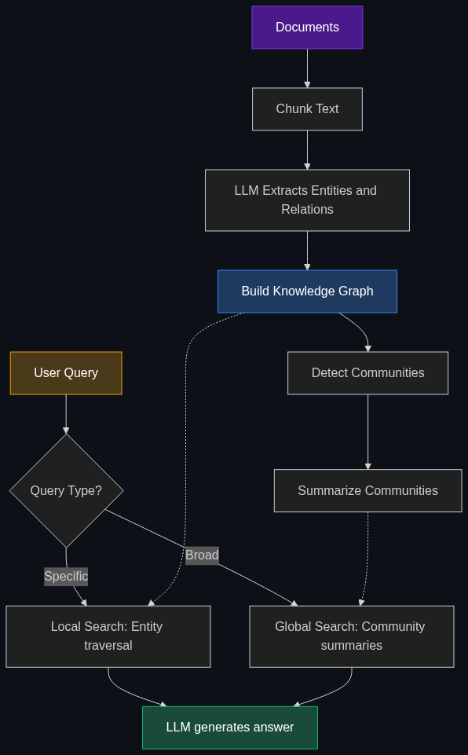

# 🕸️ GraphRAG

> **The next evolution of RAG. It uses Knowledge Graphs (which map out relationships between entities) combined with traditional RAG to help the AI understand complex connections across massive datasets, rather than just doing simple keyword matching.**

---

## Phase 1: Core Foundations & Pre-requisites

### Prerequisites
- **RAG Fundamentals** — The retrieve → augment → generate pattern (see [01_RAG](01_RAG_Retrieval_Augmented_Generation.md))
- **Vector Databases** — Embedding-based semantic search (see [03_Vector_Database.md](03_Vector_Database.md))
- **Graph Theory Basics** — Nodes, edges, relationships, traversal

### Definition
**GraphRAG** is an advanced retrieval architecture that combines **Knowledge Graphs** (structured, relationship-rich representations of information) with traditional vector-based RAG to enable retrieval that understands **connections, hierarchies, and multi-hop relationships** between entities.

A Knowledge Graph stores facts as **triples**: `(Entity A) —[Relationship]→ (Entity B)`
```
(Microsoft) —[acquired]→ (GitHub)
(GitHub) —[hosts]→ (Copilot)
(Copilot) —[uses]→ (GPT-4)
```

### The Problem It Solves

| Standard RAG | GraphRAG |
|-------------|----------|
| Retrieves isolated text chunks | Understands entity relationships across documents |
| Struggles with "connect the dots" queries | Excels at multi-hop reasoning |
| No global understanding of the corpus | Builds a holistic map of all entities and connections |
| "Which doc mentions X?" | "How does X relate to Y through Z?" |
| Flat retrieval (all chunks equal) | Structured traversal (follow relationship paths) |

**Legacy Issue:** Standard RAG retrieves the 5 most similar chunks — but what if the answer requires connecting information across 3 different documents? Vector similarity alone can't traverse relationships.

**Example query standard RAG fails at:**
> "Which companies that Microsoft acquired are now contributing to open-source AI?"

This requires: finding acquisitions → linking acquired entities to open-source projects → synthesizing. Standard RAG would retrieve random chunks about Microsoft, but miss the connection chain.

### The Solution
Build a **Knowledge Graph** from your documents, then use it alongside (or instead of) vector search:
1. **Extract entities and relationships** from documents using an LLM
2. **Build a graph** connecting entities with labeled relationships
3. **Query the graph** for structured paths + vector search for supporting context
4. **Generate** answers using both graph structure and retrieved text

### Real-World Example — Pharmaceutical Drug Discovery
**Query:** "What proteins does Drug X target, and what other drugs target the same proteins?"

- **Standard RAG:** Might retrieve a paper mentioning Drug X, but miss the connection to other drugs
- **GraphRAG:** Traverses: `Drug X → targets → Protein Y → targeted_by → [Drug A, Drug B, Drug C]` and retrieves the full relationship chain

### Trade-off Table

| Dimension | Standard RAG | GraphRAG | Full Knowledge Graph |
|-----------|-------------|----------|---------------------|
| **Setup complexity** | 🟢 Low | 🔴 High | 🔴 Very High |
| **Multi-hop queries** | ❌ Poor | ✅ Excellent | ✅ Excellent |
| **Global understanding** | ❌ None | ✅ Community summaries | ✅ Full graph |
| **Cost** | 💰 Low | 💰💰💰 High (LLM extraction) | 💰💰 Medium |
| **Latency** | 🟢 Fast | 🟡 Medium | 🟢 Fast (pre-built) |
| **Data freshness** | ✅ Easy updates | 🟡 Need to re-extract | 🟡 Need to maintain |
| **Best for** | Simple Q&A over docs | Complex analytical queries | Structured domain data |

### 🧩 Mini-Quiz

> **Q1:** What can GraphRAG answer that standard RAG cannot?
> <details><summary>Answer</summary>Multi-hop questions requiring connecting information across multiple documents through entity relationships, and global summarization queries ("What are the main themes across all documents?").</details>

> **Q2:** What is a Knowledge Graph triple?
> <details><summary>Answer</summary>A triple is (Subject) —[Predicate/Relationship]→ (Object). Example: (Python) —[is_used_in]→ (Machine Learning). It's the atomic unit of a Knowledge Graph.</details>

---

## Phase 2: Anatomy & Internal Mechanisms

### GraphRAG Architecture



### The Microsoft GraphRAG Pipeline

Microsoft Research released the most influential GraphRAG implementation (2024). Its pipeline:

| Step | What Happens | Output |
|------|-------------|--------|
| **1. Chunk** | Split documents into text chunks | Text chunks |
| **2. Extract** | LLM extracts entities + relationships from each chunk | Entity/relationship tuples |
| **3. Summarize** | LLM summarizes each entity's descriptions across all mentions | Entity summaries |
| **4. Build Graph** | Connect entities via their relationships | Knowledge Graph |
| **5. Detect Communities** | Use Leiden algorithm to find clusters of related entities | Community groups |
| **6. Summarize Communities** | LLM generates a summary for each community | Community summaries |
| **7. Query** | Route query to local search (specific) or global search (broad) | Answer |

### Two Query Modes

| Mode | When to Use | How It Works |
|------|-------------|-------------|
| **Local Search** | Specific questions about particular entities | Find entity in graph → traverse neighbors → retrieve related chunks → generate |
| **Global Search** | Broad, thematic, or summarization questions | Use community summaries → map-reduce across all communities → synthesize |

**Local Search Example:** "What is Entity X's role in Project Y?"
- Find Entity X → get its relationships → find Project Y connection → retrieve supporting chunks → answer

**Global Search Example:** "What are the top 5 themes across all research papers?"
- Retrieve all community summaries → LLM extracts themes from each → aggregate → rank → answer

### Graph vs. Vector: Complementary Retrieval

| Retrieval Type | How It Finds Information | Strength |
|---------------|------------------------|----------|
| **Vector Search** | Semantic similarity of embeddings | "Find text that *means* something similar" |
| **Graph Traversal** | Follow labeled edges between nodes | "Find what's *connected* to this entity" |
| **Hybrid (best)** | Both: graph for structure + vector for semantics | Best of both worlds |

### 🃏 Flashcard

> **Front:** What are "community summaries" in Microsoft's GraphRAG?
> <details><summary>Flip</summary>After building the Knowledge Graph, the Leiden algorithm clusters related entities into <b>communities</b> (groups of tightly connected nodes). An LLM then generates a <b>summary</b> for each community, capturing the key themes and relationships within that cluster. These summaries power <b>Global Search</b> — enabling broad questions across the entire corpus.</details>

---

## Phase 3: Advanced / Enterprise Patterns & Pitfalls

### At Scale
- **Microsoft Research** — Original GraphRAG paper and open-source implementation
- **Neo4j + LangChain** — Graph-powered RAG with Cypher query generation
- **Amazon (Product Knowledge Graph)** — Billions of product entities and relationships
- **Financial Services** — Risk network analysis, fraud detection via entity connections

### Advanced Patterns

| Pattern | Description |
|---------|-------------|
| **Hybrid Graph+Vector RAG** | Use graph for structure-aware retrieval + vector for semantic fallback |
| **Dynamic Graph Construction** | Build/update graph incrementally as new documents arrive |
| **Multi-Source Graphs** | Merge graphs from different data sources (docs, DB, APIs) |
| **Graph-Guided Chunking** | Use entity co-occurrence to decide chunk boundaries |
| **LLM-as-Graph-Query** | LLM generates Cypher/SPARQL queries to traverse the graph |

### Edge Cases & Mitigations

| Issue | Mitigation |
|-------|------------|
| **Entity extraction errors** | Use few-shot examples; validate with entity linking |
| **Duplicate entities** | Entity resolution: merge "Microsoft Corp" / "MSFT" / "Microsoft" |
| **Relationship hallucination** | Cross-reference extracted relationships against source text |
| **Graph too sparse** | Increase extraction sensitivity; add indirect relationships |
| **Graph too noisy** | Filter low-confidence edges; prune rarely-connected nodes |
| **Extraction cost** | LLM calls per chunk add up — use cheaper models for extraction |

### Anti-Patterns

- ❌ **GraphRAG for simple Q&A** — Overkill for "What does this doc say?" → Use standard RAG
- ❌ **Skipping entity resolution** — Graph full of duplicate nodes → Always deduplicate entities
- ❌ **No graph visualization** — Can't debug what you can't see → Use Neo4j Browser or Gephi
- ❌ **Ignoring extraction cost** — 10K docs × LLM call per chunk = expensive → Budget carefully

---

## Phase 4: Practical Implementation

### GraphRAG with LangChain + Neo4j

```python
from langchain_community.graphs import Neo4jGraph
from langchain_openai import ChatOpenAI
from langchain.chains import GraphCypherQAChain

# 1. Connect to Neo4j (graph database)
graph = Neo4jGraph(
    url="bolt://localhost:7687",
    username="neo4j",
    password="password"
)

# 2. See what's in the graph
print(graph.schema)
# Node types: [Person, Company, Product]
# Relationships: [WORKS_AT, ACQUIRED, BUILDS]

# 3. Build a chain that converts natural language → Cypher query → answer
llm = ChatOpenAI(model="gpt-4o", temperature=0)

chain = GraphCypherQAChain.from_llm(
    llm=llm,
    graph=graph,
    verbose=True,
    # LLM generates Cypher queries like:
    # MATCH (c:Company)-[:ACQUIRED]->(t:Company)
    # WHERE c.name = 'Microsoft'
    # RETURN t.name
)

result = chain.invoke({"query": "Which companies did Microsoft acquire that build AI products?"})
# LLM generates Cypher → Neo4j executes → LLM interprets results → answer
```

### Microsoft GraphRAG (CLI)

```bash
# Install
pip install graphrag

# Initialize project
graphrag init --root ./my_graphrag_project

# Index documents (extract entities, build graph, create community summaries)
graphrag index --root ./my_graphrag_project

# Query — Local Search (specific entity questions)
graphrag query --root ./my_graphrag_project \
  --method local \
  --query "What is Entity X's relationship with Entity Y?"

# Query — Global Search (broad thematic questions)
graphrag query --root ./my_graphrag_project \
  --method global \
  --query "What are the top themes across all documents?"
```

### When to Choose Which RAG

| Your Use Case | Recommendation |
|---------------|----------------|
| Simple document Q&A | Standard RAG |
| "How does X relate to Y?" | GraphRAG |
| "Summarize all documents" | GraphRAG (Global Search) |
| Structured data (SQL tables) | Text-to-SQL, not RAG |
| Huge corpus + complex queries | Hybrid: GraphRAG + Vector RAG |

---

## Phase 5: Interview Preparation

### Q1: "When would you use GraphRAG over standard RAG?"
<details><summary><b>Answer</b></summary>

Use GraphRAG when:
1. Queries require **multi-hop reasoning** across documents (e.g., "A relates to B, B relates to C, what's the connection?")
2. You need **global understanding** of a large corpus (themes, summaries across everything)
3. Your data is inherently **relational** (organizational charts, supply chains, research citation networks)
4. Standard RAG produces fragmented answers that miss the big picture

Stick with standard RAG when queries are straightforward lookups against specific documents.
</details>

### Q2: "What's the biggest cost/complexity trade-off of GraphRAG?"
<details><summary><b>Answer</b></summary>

**Cost:** Entity/relationship extraction requires an LLM call per chunk during indexing. For 10K documents, this can cost $50-$500+ and take hours. Standard RAG only needs cheap embedding calls (~$0.20 for the same dataset).

**Complexity:** You need a graph database (Neo4j), entity resolution logic, community detection, and two different query modes. Standard RAG needs just a vector DB and one retrieval step.

**Mitigation:** Use cheaper models for extraction (GPT-4o-mini), cache results, and run extraction incrementally. Only invest in GraphRAG when standard RAG demonstrably fails on your queries.
</details>

---

## Phase 6: Summary Cheatsheet & Action Plan

### 📋 TL;DR

| Concept | Key Point |
|---------|-----------|
| **GraphRAG** | RAG + Knowledge Graphs = relationship-aware retrieval |
| **Knowledge Graph** | Entities connected by labeled relationships (triples) |
| **Local Search** | Specific entity queries → traverse graph neighbors |
| **Global Search** | Broad thematic queries → community summaries + map-reduce |
| **When to use** | Multi-hop queries, relationship questions, corpus summarization |
| **Cost** | Higher than standard RAG (LLM extraction at indexing time) |

### 📖 Industry Reads
1. **Paper:** [From Local to Global: A Graph RAG Approach](https://arxiv.org/abs/2404.16130) — Microsoft Research (2024)
2. **Repo:** [microsoft/graphrag](https://github.com/microsoft/graphrag) — Open-source implementation

### 🚀 Do These Now
1. **Try Microsoft GraphRAG (1 hr):** `pip install graphrag` → index a small set of docs → run local and global queries
2. **Visualize the graph (30 min):** Export the graph to Neo4j and explore the entity-relationship map
3. **Compare (30 min):** Run the same 5 queries on standard RAG vs. GraphRAG — note which answers better

### 🧭 Next Topic
> Where do those embedding vectors actually get stored and searched? → [03_Vector_Database.md](03_Vector_Database.md)
