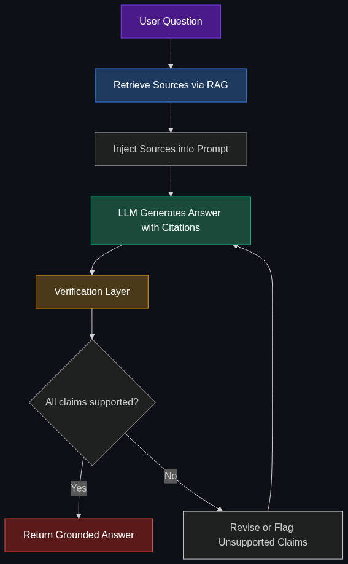

# 🎯 Grounding

> **The process of forcing an AI to base its answers strictly on provided, factual sources to prevent it from making things up.**

---

## Phase 1: Core Foundations & Pre-requisites

### Prerequisites
- **LLM Hallucination** — Understanding why models fabricate information
- **RAG** — Retrieval-augmented generation (see [01_RAG](01_RAG_Retrieval_Augmented_Generation.md))
- **Prompt Engineering** — System prompts, instructions, formatting

### Definition
**Grounding** is the practice of constraining an LLM's responses to be based on **verifiable, provided sources** rather than the model's parametric knowledge (training data). A grounded AI answer includes:
1. **Factual content** derived from specific source documents
2. **Citations** pointing to exactly where the information came from
3. **Refusal** when the sources don't contain the answer (instead of guessing)

### The Problem It Solves

| Ungrounded AI | Grounded AI |
|---------------|-------------|
| Confidently states false "facts" | Only states what's in the sources |
| No way to verify claims | Every claim has a citation |
| "Makes up" plausible-sounding information | Says "I don't know" when sources lack the answer |
| Unreliable for enterprise/legal/medical use | Trustworthy for high-stakes applications |
| Liability risk — who's responsible for wrong info? | Traceable — source documents are accountable |

**Legacy Issue:** LLMs hallucinate because they're trained to produce **plausible text**, not **true text**. Without grounding, a legal AI might cite fake case law, a medical AI might recommend a non-existent drug, and a financial AI might invent statistics. This is the #1 barrier to enterprise AI adoption.

### The Solution
Ground the model using one or more of these techniques:

| Technique | How It Works |
|-----------|-------------|
| **RAG + Citations** | Retrieve docs → inject into prompt → instruct LLM to cite sources |
| **Google Grounding (Search)** | Gemini can ground answers using real-time Google Search results |
| **System Prompt Instructions** | "Answer ONLY based on the provided context. If unsure, say 'I don't know.'" |
| **Structured Output** | Force LLM to output `{"answer": "...", "sources": [...], "confidence": 0.9}` |
| **Post-hoc Verification** | A second LLM checks if the answer is supported by the sources |

### Real-World Example — Legal Research Assistant
**User:** "Does the GDPR require explicit consent for cookies?"

**Ungrounded response:** "Yes, the GDPR requires explicit consent for all cookies." ← *Partially wrong! GDPR + ePrivacy Directive distinction is nuanced.*

**Grounded response:** "According to Article 7 of the GDPR [Source: GDPR Full Text, Art. 7] and Recital 32, consent must be freely given and specific. However, cookie consent is primarily governed by the ePrivacy Directive (2002/58/EC), not the GDPR directly [Source: EU ePrivacy Directive, Art. 5(3)]. The GDPR defines the standard for what counts as valid consent."

### Trade-off Table

| Dimension | No Grounding | RAG Grounding | Google Search Grounding | Fine-tuned + Grounding |
|-----------|-------------|---------------|------------------------|----------------------|
| **Hallucination rate** | 🔴 High (15-25%) | 🟢 Low (3-8%) | 🟢 Low (2-5%) | 🟢 Very low (1-3%) |
| **Source transparency** | ❌ None | ✅ Document citations | ✅ URL citations | ⚠️ Implicit |
| **Setup** | 🟢 None | 🟡 Medium | 🟢 Easy (API flag) | 🔴 Complex |
| **Freshness** | ❌ Training cutoff | ✅ Your data | ✅ Real-time web | ❌ Training cutoff |
| **Cost** | 💰 Base | 💰💰 + retrieval | 💰💰 + search API | 💰💰💰 + training |

### 🧩 Mini-Quiz

> **Q1:** What's the difference between "hallucination" and "ungrounded"?
> <details><summary>Answer</summary>Hallucination is the symptom — the model generates false information. Ungrounded is the cause — the model isn't constrained to use verified sources. Grounding is the cure — forcing the model to base answers on provided facts.</details>

> **Q2:** Why can't we just tell the model "don't hallucinate" in the prompt?
> <details><summary>Answer</summary>Instructions alone reduce but don't eliminate hallucination. The model needs actual source material to ground against. Without sources, it has nothing to verify its own claims against. The combination of sources + instructions + verification is what works.</details>

---

## Phase 2: Anatomy & Internal Mechanisms

### Grounding Architecture



### The Grounding Spectrum

```
No Grounding                                                    Full Grounding
    │                                                                  │
    ▼                                                                  ▼
 [Raw LLM] → [System Prompt] → [RAG] → [RAG+Citations] → [RAG+Verify+Cite]
    │              │              │            │                    │
 15-25%         10-15%         3-8%          2-5%               <1%
 hallucination  hallucination  hallucination  hallucination    hallucination
```

### Grounding Techniques Deep-Dive

**1. Prompt-Based Grounding (Simplest)**
```
System: You are a factual assistant. Answer ONLY using the context below.
If the context doesn't contain the answer, respond: "I don't have that information."
Never use your training data to answer. Always cite the source document.

Context:
[Document 1: ...]
[Document 2: ...]

User: What is X?
```

**2. Citation-Backed Grounding (Production Standard)**
```json
{
  "answer": "The payment retry limit is 3 attempts with exponential backoff.",
  "citations": [
    {
      "text": "Retry limit: 3 attempts",
      "source": "payment-service-docs.md",
      "page": 12,
      "confidence": 0.95
    }
  ],
  "grounded": true
}
```

**3. Post-Generation Verification**
```
Step 1: LLM generates answer from context
Step 2: Verifier LLM checks: "Is every claim in this answer supported by the context?"
Step 3: If unsupported claims found → revise or flag
```

### Types of Grounding Sources

| Source Type | Examples | Freshness | Reliability |
|-------------|---------|-----------|-------------|
| **Private documents** | Company docs, contracts, manuals | As updated | High (your data) |
| **Web search** | Google, Bing, Brave | Real-time | Medium (web quality varies) |
| **Databases** | SQL, graph DB, vector DB | Live | High (structured) |
| **APIs** | Weather, stock prices, shipping status | Real-time | High (authoritative) |
| **Knowledge Graphs** | Wikidata, internal KGs | Maintained | High (curated) |

### 🃏 Flashcard

> **Front:** What is "post-hoc verification" in grounding?
> <details><summary>Flip</summary>After the primary LLM generates an answer, a <b>second LLM (or the same model with a different prompt)</b> checks whether every claim in the answer is explicitly supported by the provided source documents. Unsupported claims are flagged, removed, or revised. This acts as a "fact-check" layer and is used in high-stakes applications (legal, medical, financial).</details>

---

## Phase 3: Advanced / Enterprise Patterns & Pitfalls

### At Scale
- **Google Gemini** — Native grounding with Google Search (toggle in API)
- **Perplexity** — Every answer cites web sources with numbered references
- **Anthropic Claude** — Contextual retrieval + citation support
- **Microsoft Copilot** — Grounded in enterprise data (SharePoint, Teams, email)
- **NotebookLM** — Grounded exclusively in user-uploaded documents

### Grounding in Major Platforms

| Platform | Grounding Method | API Feature |
|----------|-----------------|-------------|
| **Google Gemini** | `google_search_retrieval` tool | `grounding: { google_search: {} }` in API |
| **OpenAI** | RAG via Assistants API file search | `file_search` tool in Assistants |
| **Anthropic** | Prompt-based + contextual retrieval | System prompt + citations |
| **Perplexity** | Built-in web search + citation | Every response includes sources |

### Advanced Grounding Patterns

| Pattern | Description | Use Case |
|---------|-------------|----------|
| **Multi-Source Grounding** | Ground against multiple sources (docs + web + DB) | Enterprise assistants |
| **Confidence Scoring** | Each claim gets a confidence score based on source support | Risk-sensitive applications |
| **Claim Decomposition** | Break answer into individual claims; verify each independently | Legal/medical AI |
| **Attributable generation** | Model generates text with inline citations as it writes | Research assistants |
| **Guardrail layers** | Post-processing filters that catch ungrounded claims | Production safety nets |

### Edge Cases & Mitigations

| Issue | Mitigation |
|-------|------------|
| **Sources conflict** | Surface both versions with sources; let user decide |
| **Source is wrong** | Grounding doesn't guarantee truth — it guarantees traceability |
| **No relevant source** | Model must say "I don't have information on this" — not guess |
| **Over-reliance on sources** | Model misses nuance or context → Tune system prompt |
| **Citation fabrication** | Model cites a source but misrepresents its content → Post-hoc verification |

### Anti-Patterns

- ❌ **Grounding without verification** — LLM cites sources but misrepresents them → Add verification step
- ❌ **"Just don't hallucinate" prompt** — Instructions alone don't work → Provide actual source material
- ❌ **Grounding against stale data** — Docs from 2 years ago → Keep sources current
- ❌ **No fallback** — Model forced to answer even without sources → Allow "I don't know" responses

---

## Phase 4: Practical Implementation

### RAG + Grounding with Citations (Python)

```python
from openai import OpenAI
import json

client = OpenAI()

def grounded_answer(question: str, context_docs: list[dict]) -> dict:
    """
    Generate a grounded answer with citations.
    
    context_docs: [{"source": "doc_name", "content": "text..."}]
    """
    # Format context with source labels
    formatted_context = "\n\n".join([
        f"[Source: {doc['source']}]\n{doc['content']}"
        for doc in context_docs
    ])
    
    response = client.chat.completions.create(
        model="gpt-4o",
        temperature=0,  # Low temperature for factual answers
        response_format={"type": "json_object"},  # Structured output
        messages=[
            {
                "role": "system",
                "content": """You are a factual assistant. You MUST follow these rules:

1. Answer ONLY using the provided context documents.
2. For every claim, cite the source in [brackets].
3. If the context doesn't contain the answer, respond with:
   {"answer": "I don't have enough information to answer this.", "citations": [], "grounded": false}
4. Never use your training data — only the provided context.
5. Return a JSON object with: answer, citations (list of {text, source}), grounded (boolean)."""
            },
            {
                "role": "user",
                "content": f"Context:\n{formatted_context}\n\nQuestion: {question}"
            }
        ]
    )
    
    return json.loads(response.choices[0].message.content)

# Example usage
docs = [
    {
        "source": "payment-service-v2.3.md",
        "content": "The payment service retries failed transactions up to 3 times "
                   "using exponential backoff. Initial delay is 1 second, doubling each retry."
    },
    {
        "source": "sla-agreements-2024.md",
        "content": "Payment processing SLA: 99.95% uptime. Maximum allowed "
                   "downtime: 22 minutes per month."
    }
]

result = grounded_answer("What is our payment retry strategy?", docs)
print(json.dumps(result, indent=2))
# {
#   "answer": "The payment service retries failed transactions up to 3 times using 
#              exponential backoff, starting with a 1-second delay that doubles each 
#              retry [payment-service-v2.3.md].",
#   "citations": [
#     {"text": "retries failed transactions up to 3 times using exponential backoff",
#      "source": "payment-service-v2.3.md"}
#   ],
#   "grounded": true
# }
```

### Google Gemini Grounding with Search

```python
import google.generativeai as genai

genai.configure(api_key="YOUR_API_KEY")

model = genai.GenerativeModel("gemini-1.5-pro")

# Enable Google Search grounding — model uses live web search
response = model.generate_content(
    "What were the latest AI announcements at Google I/O 2025?",
    tools=[{"google_search_retrieval": {}}]  # Enables grounding
)

print(response.text)
# Answer includes real-time web data with source URLs
print(response.candidates[0].grounding_metadata)
# Includes search queries used and source citations
```

### Grounding Verification Layer

```python
def verify_grounding(answer: str, sources: str) -> dict:
    """
    Verify that every claim in the answer is supported by the sources.
    Acts as a post-hoc fact-check.
    """
    response = client.chat.completions.create(
        model="gpt-4o",
        temperature=0,
        response_format={"type": "json_object"},
        messages=[
            {
                "role": "system",
                "content": """You are a fact-checker. For each claim in the ANSWER,
determine if it is SUPPORTED, PARTIALLY SUPPORTED, or NOT SUPPORTED by the SOURCES.

Return JSON: {
  "claims": [{"claim": "...", "verdict": "SUPPORTED|NOT_SUPPORTED", "evidence": "..."}],
  "overall_grounded": true/false,
  "unsupported_claims": ["..."]
}"""
            },
            {
                "role": "user",
                "content": f"SOURCES:\n{sources}\n\nANSWER:\n{answer}"
            }
        ]
    )
    return json.loads(response.choices[0].message.content)
```

---

## Phase 5: Interview Preparation

### Q1: "How would you build a grounded AI system for a healthcare company?"
<details><summary><b>STAR Answer</b></summary>

**Situation:** Healthcare company wants an AI assistant for doctors to query drug interactions and treatment guidelines.

**Task:** Zero tolerance for hallucination. Regulatory compliance (HIPAA). Every answer must cite approved medical sources.

**Action:**
1. **Sources:** Curated medical databases (FDA labels, UpToDate, clinical guidelines) — not open web
2. **RAG Pipeline:** Embed approved documents → retrieve with high precision (reranking) → inject into prompt
3. **Grounding Prompt:** "Answer ONLY from provided medical sources. Cite source + publication date. If unsure, say 'Please consult a medical professional.'"
4. **Verification Layer:** Second LLM verifies every claim against sources (claim decomposition)
5. **Confidence Scoring:** Claims below 0.8 confidence are flagged for human review
6. **Guardrails:** Block responses that recommend treatments not in approved sources
7. **Audit Trail:** Log every query, retrieved docs, generated answer, and verification result

**Result:** Hallucination rate < 0.5%. Every answer traceable to FDA-approved sources. HIPAA-compliant logging.
</details>

### Q2: "Grounding reduces hallucination but doesn't eliminate it. Why?"
<details><summary><b>Answer</b></summary>

Three residual failure modes:
1. **Misrepresentation** — Model cites a source correctly but paraphrases it inaccurately
2. **Inference beyond sources** — Model draws conclusions that aren't explicitly stated in sources
3. **Source selection bias** — Model picks a less relevant source and ignores the correct one

**Mitigations:** Post-hoc verification (check every claim), claim decomposition (verify atomic claims), and human-in-the-loop for high-stakes answers.
</details>

### Q3: "Google Search grounding vs. RAG grounding — when do you use each?"
<details><summary><b>Answer</b></summary>

| Factor | Google Search Grounding | RAG Grounding |
|--------|------------------------|---------------|
| **Data source** | Public web | Your private data |
| **Freshness** | Real-time | As fresh as your pipeline |
| **Privacy** | ⚠️ Query goes to Google | ✅ Data stays internal |
| **Control** | ❌ Can't control sources | ✅ You control the corpus |
| **Best for** | Current events, public facts | Company-specific knowledge |

**Use both:** RAG for internal knowledge + Google Search for current events.
</details>

---

## Phase 6: Summary Cheatsheet & Action Plan

### 📋 TL;DR

| Concept | Key Point |
|---------|-----------|
| **Grounding** | Force AI to base answers on verifiable sources |
| **Why needed** | LLMs hallucinate 15-25% without grounding |
| **Techniques** | RAG + citations, Google Search, verification layers |
| **Citations** | Every claim should link to its source document |
| **"I don't know"** | Grounded AI must refuse to guess when sources lack the answer |
| **Verification** | Post-hoc fact-checking catches misrepresentations |

### 📖 Industry Reads
1. **Blog:** [Google: Grounding with Google Search](https://ai.google.dev/gemini-api/docs/grounding) — Official API docs
2. **Paper:** [FActScore: Fine-grained Atomic Evaluation of Factual Precision](https://arxiv.org/abs/2305.14251) — Min et al. (2023)

### 🚀 Do These Now
1. **Build grounded Q&A (30 min):** Use the Python code above to build a citation-backed answering system over your own docs
2. **Add verification (30 min):** Implement the verification layer — check if claims match sources
3. **Test hallucination rate (30 min):** Ask 20 questions — 10 answerable from sources, 10 not. Measure how often it guesses vs. says "I don't know"

### 🧭 Continue Learning
> You've now covered the entire "Data & Context" layer! Review the [README](README.md) to revisit any topic or explore the next module.
