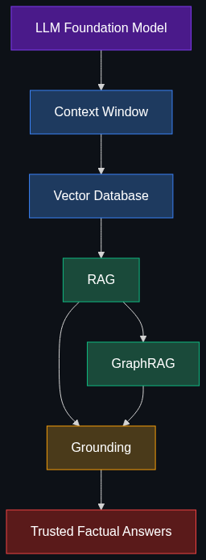

# 📚 Data & Context — The "Knowing" Layer

> **How we give AI access to our specific data so it stops guessing and starts knowing.**

This module covers the architectural layer where AI systems connect to real-world knowledge — your documents, databases, and domain expertise. These are the techniques that transform a general-purpose language model into a **domain-expert** grounded in facts.

---

## 📚 Topics Covered

| # | Topic | File | Core Idea |
|---|-------|------|-----------|
| 1 | [RAG (Retrieval-Augmented Generation)](01_RAG_Retrieval_Augmented_Generation.md) | `01_RAG_...md` | Search a knowledge base before answering — stop hallucinating |
| 2 | [GraphRAG](02_GraphRAG.md) | `02_GraphRAG.md` | RAG + Knowledge Graphs for relationship-aware retrieval |
| 3 | [Vector Database](03_Vector_Database.md) | `03_Vector_Database.md` | Store & search by meaning, not keywords |
| 4 | [Context Window](04_Context_Window.md) | `04_Context_Window.md` | The AI's short-term memory — size, limits, and strategies |
| 5 | [Grounding](05_Grounding.md) | `05_Grounding.md` | Force AI to cite sources — eliminate hallucination |

---

## 🗺️ How These Topics Connect

---

## 🎯 Learning Path

**Recommended order:**

1. **Start** with [Context Window](04_Context_Window.md) — understand the fundamental constraint
2. **Then** [Vector Database](03_Vector_Database.md) — the storage primitive for semantic search
3. **Then** [RAG](01_RAG_Retrieval_Augmented_Generation.md) — the core retrieval-generation pattern
4. **Then** [GraphRAG](02_GraphRAG.md) — the advanced evolution
5. **Finally** [Grounding](05_Grounding.md) — the quality enforcement layer

---

## 🧠 Prerequisites

Before diving into this module, ensure you understand:

- **LLMs & Prompting** — How language models generate text, tokenization basics
- **Embeddings** — The concept of representing text as numerical vectors
- **Databases (SQL/NoSQL)** — Basic CRUD operations, indexing
- **Module 1: Agents & Action** — How agents use tools and workflows (see [01_Agents_and_Action](../01_Agents_and_Action_The_Doing_Layer/README.md))

---

## 🏭 Industry Relevance (2025–2026)

| Company | How They Use This Layer |
|---------|------------------------|
| **OpenAI** | ChatGPT file search, Assistants API with retrieval, GPT knowledge bases |
| **Google** | Vertex AI Search, Gemini grounding with Google Search, NotebookLM |
| **Anthropic** | Claude with citation-backed answers, contextual retrieval |
| **Microsoft** | Azure AI Search + RAG, Copilot with enterprise data grounding |
| **Pinecone** | Leading managed vector database for production RAG |
| **Neo4j** | Graph database powering GraphRAG pipelines |

---

> **💡 Key Insight:** The "Knowing" layer is what separates a toy demo from a production AI system. Any enterprise deployment of AI must solve the problem of "how does this model know about *our* data?" — and that's exactly what this module teaches.

---

*Each topic file follows the [Educator Skill](../.github/Educator_skill.md) 6-phase teaching methodology: Foundations → Anatomy → Enterprise Patterns → Implementation → Interview Prep → Cheatsheet.*
