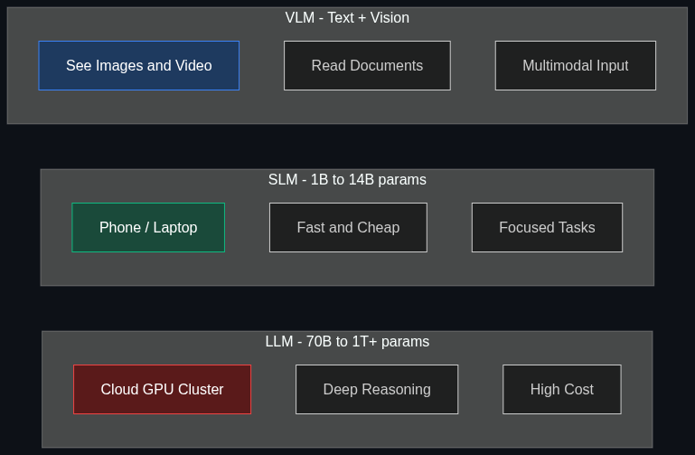

# 🧠 LLMs vs. SLMs vs. VLMs

> **LLMs are the massive brains like GPT-4 or Gemini. SLMs are efficient, focused models that run locally on your phone or laptop. VLMs can "see" and understand images and video just as well as text.**

---

## Phase 1: Core Foundations & Pre-requisites

### Prerequisites
- **Transformer Architecture** — Self-attention, encoder-decoder structure
- **Parameters & Model Size** — What "175 billion parameters" means
- **Inference vs. Training** — Running a model vs. training a model

### Definitions

**LLM (Large Language Model)**
A neural network with **tens to hundreds of billions of parameters**, trained on massive text corpora. Designed for broad, general-purpose language understanding and generation. Runs in the cloud on GPU clusters.

**SLM (Small Language Model)**
A neural network with **1 to 10 billion parameters**, optimized for efficiency. Designed to run **on-device** (phone, laptop, edge) or as a cheap cloud alternative. Trades some capability for speed, cost, and privacy.

**VLM (Vision Language Model)**
A model that processes **both text and images/video** natively. Can describe images, answer questions about photos, read documents with charts, and understand visual context alongside text.

### The Landscape (2025)

| Category | Parameter Range | Examples | Runs On |
|----------|----------------|---------|---------|
| **LLM** | 70B–1T+ | GPT-4o, Claude 4 Opus, Gemini 2.0 Pro, Llama 3.1 405B | Cloud GPU clusters |
| **SLM** | 1B–14B | Phi-4 (14B), Gemma 3 (4B), Llama 3.2 (3B), Mistral Small | Laptop, phone, edge |
| **VLM** | 7B–1T+ | GPT-4V, Gemini 2.0, Claude 3.5 (vision), Llama 3.2 Vision | Cloud (mostly) |

### The Problem Each Solves

| Problem | Solution |
|---------|----------|
| Need broad, deep reasoning capability | **LLM** — More parameters = more knowledge & reasoning |
| Need AI on a phone/laptop without internet | **SLM** — Small enough to run locally |
| Need to process images, screenshots, or documents | **VLM** — Understands visual + textual input |
| Need cheap, fast inference for simple tasks | **SLM** — 10-100x cheaper than LLMs |
| Need to analyze charts, diagrams, or UI screenshots | **VLM** — Reads visual content natively |

### Real-World Example — Multi-Model Architecture

A production AI assistant might use ALL THREE:

| Component | Model Type | Why |
|-----------|-----------|-----|
| **Router** | SLM (Phi-4) | Classify user intent locally — fast, cheap |
| **Simple Q&A** | SLM (Gemma 3) | Answer FAQ-type questions on-device — no cloud needed |
| **Complex reasoning** | LLM (GPT-4o) | Multi-step analysis, code generation — needs power |
| **Image understanding** | VLM (GPT-4V) | User uploads a screenshot — needs vision |
| **Document analysis** | VLM (Gemini 2.0) | Parse PDF with charts and tables — multimodal |

### Trade-off Table

| Dimension | LLM | SLM | VLM |
|-----------|-----|-----|-----|
| **Parameters** | 70B–1T+ | 1B–14B | 7B–1T+ |
| **Capability** | ✅ Highest | ⚠️ Focused/limited | ✅ High (text + vision) |
| **Cost per query** | 💰💰💰 High | 💰 Very low | 💰💰💰 High |
| **Latency** | 🟡 Medium | ✅ Fast | 🟡 Medium |
| **Privacy** | ❌ Cloud (data leaves device) | ✅ On-device (data stays local) | ❌ Mostly cloud |
| **Runs on** | GPU cluster | Phone/laptop/edge | GPU cluster |
| **Best for** | Complex reasoning, coding, analysis | Classification, extraction, chat | Image/doc understanding |

### 🧩 Mini-Quiz

> **Q1:** When would you choose an SLM over an LLM?
> <details><summary>Answer</summary>When you need: (1) on-device inference for privacy, (2) low latency for real-time tasks, (3) low cost for high-volume simple tasks, or (4) offline capability without internet. SLMs trade some reasoning depth for speed, cost, and privacy.</details>

> **Q2:** What makes a VLM different from an LLM + a separate image model?
> <details><summary>Answer</summary>A VLM processes text and images in a single unified model with shared attention — it can reason about the relationship between what it sees and what it reads simultaneously. A separate image model + LLM requires a pipeline and loses the ability to jointly reason across modalities.</details>

---

## Phase 2: Anatomy & Internal Mechanisms

### Architecture Comparison



### LLM Architecture (Decoder-Only Transformer)

Most modern LLMs (GPT-4, Claude, Llama) use a **decoder-only** Transformer:

| Component | What It Does |
|-----------|-------------|
| **Token Embedding** | Convert input tokens → dense vectors |
| **Positional Encoding** | Add position information (RoPE in most modern models) |
| **Self-Attention Layers** | Each token attends to all previous tokens (causal masking) |
| **Feed-Forward Layers** | Process each token independently through MLP |
| **Layer Norm** | Stabilize training (pre-norm is standard now) |
| **Output Head** | Project to vocabulary size → predict next token |

**Scaling Law (Kaplan et al., 2020):**
$$L(N) \propto N^{-0.076}$$
Loss decreases as a power law of parameter count N — more parameters = better performance (with diminishing returns).

### SLM Efficiency Techniques

SLMs achieve competitive performance at small sizes through:

| Technique | How It Works | Example |
|-----------|-------------|---------|
| **Knowledge Distillation** | Train small model to mimic a large model's outputs | Phi-4 trained on GPT-4 synthetic data |
| **High-Quality Data** | Curate training data heavily instead of just scaling parameters | "Textbook-quality" data (Phi series) |
| **Quantization** | Reduce weight precision (FP32 → INT4) — 4x memory reduction | GGUF, GPTQ, AWQ formats |
| **Pruning** | Remove less important weights/neurons | Structured pruning |
| **Architecture Optimization** | Grouped Query Attention, SwiGLU, efficient attention | Llama 3.2, Gemma 3 |

### VLM Architecture

VLMs add a **vision encoder** to a language model:

```
Image → Vision Encoder (ViT/SigLIP) → Visual Tokens → [Projection] → LLM Decoder
Text  → Token Embedding ──────────────────────────────→ LLM Decoder
                                                         ↓
                                                   Unified Output
```

| Component | Role | Example |
|-----------|------|---------|
| **Vision Encoder** | Extract visual features from images | ViT, SigLIP, CLIP |
| **Projection Layer** | Map visual features to the LLM's embedding space | Linear projection or MLP |
| **LLM Backbone** | Process text + visual tokens together | GPT-4, Gemini, Llama |
| **Interleaved Attention** | Jointly attend to text and image tokens | Cross-attention or unified |

### Model Size Quick Reference (2025)

| Model | Params | Size (FP16) | Size (INT4) | Runs On |
|-------|--------|-------------|-------------|---------|
| Llama 3.2 1B | 1B | 2 GB | 0.5 GB | Phone |
| Phi-4 | 14B | 28 GB | 7 GB | Laptop |
| Llama 3.1 70B | 70B | 140 GB | 35 GB | 1x A100 |
| GPT-4o | ~200B (est.) | ~400 GB | ~100 GB | Cloud cluster |
| Llama 3.1 405B | 405B | 810 GB | 200 GB | 8x A100s |

### 🃏 Flashcard

> **Front:** What is "quantization" and why does it matter for SLMs?
> <details><summary>Flip</summary><b>Quantization</b> reduces the precision of model weights (e.g., from 32-bit floats to 4-bit integers). This shrinks model size by 4-8x with only 1-3% quality loss, enabling models that normally need a GPU server to run on a laptop or phone. INT4 quantization (GGUF format) is the standard for local deployment.</details>

---

## Phase 3: Advanced / Enterprise Patterns & Pitfalls

### At Scale — Who Uses What

| Use Case | Model Choice | Why |
|----------|-------------|-----|
| **ChatGPT** | GPT-4o (LLM) + GPT-4o-mini (SLM) | Route simple queries to mini, complex to full |
| **Apple Intelligence** | On-device SLM + cloud LLM | Privacy-first; on-device for sensitive data |
| **Google Lens** | VLM (Gemini) | Real-time image understanding |
| **Copilot (Microsoft)** | GPT-4o + Phi-4 | Phi for quick completions, GPT-4o for complex edits |
| **Tesla FSD** | VLM for road scene understanding | Process camera feeds in real-time |
| **WhatsApp/Meta** | Llama 3.2 on-device | Private message suggestions without cloud |

### The Model Selection Decision Tree

```
Is the task simple (classification, extraction, FAQ)?
├── Yes → SLM (Phi-4, Gemma 3, Llama 3.2 3B)
└── No → Does it involve images or visual content?
    ├── Yes → VLM (GPT-4V, Gemini 2.0, Llama 3.2 Vision)
    └── No → Does it require deep reasoning, coding, or long context?
        ├── Yes → LLM (GPT-4o, Claude 4, Gemini 2.0 Pro)
        └── No → SLM is probably sufficient
```

### Edge Cases & Mitigations

| Issue | Mitigation |
|-------|------------|
| **SLM hallucination rate higher than LLM** | Use SLM for low-risk tasks; LLM for high-stakes |
| **VLM misreads handwriting or charts** | Provide text description alongside image; use multiple attempts |
| **LLM cost too high for simple queries** | Route simple queries to SLM; use LLM only when needed |
| **On-device SLM battery drain** | Batch requests; use quantized (INT4) models; limit context |
| **VLM latency for real-time video** | Use frame sampling; process keyframes only |

### Anti-Patterns

- ❌ **LLM for everything** — Using GPT-4o for classification tasks → SLM is 100x cheaper, equally accurate
- ❌ **SLM for complex reasoning** — Expecting Phi-4 to match GPT-4o on hard math → Know your model's limits
- ❌ **Ignoring quantization** — Running FP16 models locally → INT4 is 4x smaller with ~1% quality loss
- ❌ **Separate vision pipeline** — Using OCR + LLM instead of a VLM → VLMs handle this natively and better

---

## Phase 4: Practical Implementation

### Running an SLM Locally (Ollama)

```bash
# Install Ollama (runs models locally on your machine)
# macOS/Linux:
curl -fsSL https://ollama.com/install.sh | sh

# Pull and run a model
ollama pull llama3.2:3b          # 3B SLM — runs on any laptop
ollama pull phi4:14b             # 14B — needs 8GB+ RAM
ollama pull llama3.2-vision:11b  # 11B VLM — understands images

# Chat
ollama run llama3.2:3b
>>> What is the capital of France?
Paris is the capital of France.

# Use from Python
import requests
response = requests.post("http://localhost:11434/api/generate", json={
    "model": "llama3.2:3b",
    "prompt": "Explain Docker in 3 bullet points",
    "stream": False
})
print(response.json()["response"])
```

### Model Routing — SLM + LLM Together (Python)

```python
from openai import OpenAI

client = OpenAI()

def smart_route(user_message: str) -> str:
    """
    Route simple queries to cheap SLM, complex to expensive LLM.
    This is how production systems save 70-90% on API costs.
    """
    # Step 1: Classify complexity with the cheap model
    classification = client.chat.completions.create(
        model="gpt-4o-mini",  # SLM-class: fast, cheap
        messages=[{
            "role": "system",
            "content": "Classify the user's query as SIMPLE or COMPLEX. "
                       "SIMPLE: factual lookups, definitions, translations. "
                       "COMPLEX: multi-step reasoning, code generation, analysis. "
                       "Respond with only: SIMPLE or COMPLEX"
        }, {
            "role": "user",
            "content": user_message
        }],
        max_tokens=10
    )
    
    complexity = classification.choices[0].message.content.strip()
    
    # Step 2: Route to appropriate model
    model = "gpt-4o-mini" if complexity == "SIMPLE" else "gpt-4o"
    print(f"  Routed to: {model} (complexity: {complexity})")
    
    response = client.chat.completions.create(
        model=model,
        messages=[{"role": "user", "content": user_message}]
    )
    return response.choices[0].message.content

# Usage
print(smart_route("What is the capital of Japan?"))     # → gpt-4o-mini
print(smart_route("Design a distributed cache system")) # → gpt-4o
```

### Using a VLM to Analyze Images (OpenAI)

```python
import base64
from openai import OpenAI

client = OpenAI()

def analyze_image(image_path: str, question: str) -> str:
    """
    Use a VLM to understand and answer questions about an image.
    Works with screenshots, charts, diagrams, photos, documents.
    """
    with open(image_path, "rb") as f:
        image_b64 = base64.b64encode(f.read()).decode()
    
    response = client.chat.completions.create(
        model="gpt-4o",  # GPT-4o is a VLM — handles both text and images
        messages=[{
            "role": "user",
            "content": [
                {"type": "text", "text": question},
                {"type": "image_url", "image_url": {
                    "url": f"data:image/png;base64,{image_b64}",
                    "detail": "high"  # "low" for faster/cheaper, "high" for accuracy
                }}
            ]
        }],
        max_tokens=1000
    )
    return response.choices[0].message.content

# Example: Analyze a system architecture diagram
result = analyze_image("architecture_diagram.png", 
    "Describe this system architecture. What are the main components and data flows?")
print(result)
```

---

## Phase 5: Interview Preparation

### Q1: "You're building a customer service AI. When would you use an SLM vs. LLM?"
<details><summary><b>STAR Answer</b></summary>

**Situation:** E-commerce platform with 50K daily support chats. Mix of simple (FAQ, order status) and complex (refund disputes, technical troubleshooting).

**Task:** Minimize cost while maintaining quality.

**Action:**
1. **Intent Classifier** — SLM (Phi-4 or GPT-4o-mini) classifies each message: FAQ, order lookup, complex issue
2. **Tier 1 (70% of volume)** — SLM handles FAQs and order lookups (cost: $0.15/1M tokens)
3. **Tier 2 (25%)** — LLM handles nuanced issues requiring multi-step reasoning ($2.50/1M tokens)
4. **Tier 3 (5%)** — Escalate to human agents for edge cases the LLM flags as uncertain
5. **Quality monitoring** — Run LLM evaluation on a sample of SLM responses; alert if quality drops

**Result:** 85% cost reduction vs. using LLM for everything. Response quality stays above 95% satisfaction.
</details>

### Q2: "Explain the trade-offs between a VLM and a traditional OCR + LLM pipeline."
<details><summary><b>Answer</b></summary>

| Dimension | OCR + LLM Pipeline | VLM (Native Vision) |
|-----------|-------------------|---------------------|
| **Setup** | Two separate systems (OCR → text → LLM) | One model handles everything |
| **Charts/Diagrams** | ❌ OCR can't interpret visual meaning | ✅ Understands visual content |
| **Layout understanding** | ⚠️ Loses spatial relationships | ✅ Sees the full layout |
| **Handwriting** | ⚠️ OCR struggles | ✅ Better recognition |
| **Cost** | 💰 Cheaper (OCR is cheap) | 💰💰 More expensive |
| **Latency** | 🟡 Two-step | 🟡 Single step but heavier model |

**Recommendation:** Use VLM when you need to *understand* visual content (charts, diagrams, UI screenshots). Use OCR + LLM when you just need to *extract text* from clean documents.
</details>

### Q3: "How does quantization affect model quality? When is it acceptable?"
<details><summary><b>Answer</b></summary>

| Quantization Level | Size Reduction | Quality Loss | Acceptable For |
|-------------------|---------------|-------------|----------------|
| FP16 (half precision) | 2x | ~0% | Always |
| INT8 | 4x | ~0.5% | Production inference |
| INT4 (GPTQ/AWQ) | 8x | ~1-3% | On-device, cost-sensitive |
| INT2-3 | 10-16x | ~5-10% | Extreme edge cases only |

**Rule of thumb:** INT4 quantization is the sweet spot — 8x smaller with barely noticeable quality loss. Acceptable for all but the most precision-critical tasks (math, code generation with exact syntax).
</details>

---

## Phase 6: Summary Cheatsheet & Action Plan

### 📋 TL;DR

| Concept | Key Point |
|---------|-----------|
| **LLM** | 70B+ params; best reasoning; cloud-only; expensive |
| **SLM** | 1-14B params; runs on-device; fast; cheap; limited depth |
| **VLM** | Text + images in one model; understands visual content |
| **Quantization** | INT4 = 8x smaller, ~1% quality loss — sweet spot for local |
| **Model routing** | Use SLM for simple tasks, LLM for complex — saves 70-90% cost |
| **Key trend** | Industry moving from "one big model" to spectrum of specialized models |

### 📖 Industry Reads
1. **Paper:** [Textbooks Are All You Need](https://arxiv.org/abs/2306.11644) — Gunasekar et al. (Microsoft). How Phi proved small models can be highly capable with curated data.
2. **Blog:** [Meta Llama 3.2](https://ai.meta.com/blog/llama-3-2-connect-2024-vision-edge-mobile-devices/) — On-device SLMs and vision models.

### 🚀 Do These Now
1. **Run a local SLM (20 min):** Install [Ollama](https://ollama.com/) → `ollama run llama3.2:3b` → chat with it
2. **Build a router (30 min):** Implement the Python routing code above — test with 10 queries
3. **Try a VLM (15 min):** Send a screenshot to GPT-4o's vision API — see how well it understands visual content

### 🧭 Next Topic
> How do models handle massive sizes efficiently without activating every parameter? → [02_MoE_Mixture_of_Experts.md](02_MoE_Mixture_of_Experts.md)
