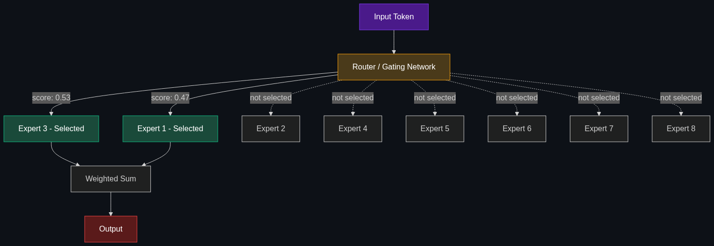

# ⚡ MoE — Mixture of Experts

> **A popular architecture trick. Instead of activating the whole massive "brain" for every question, an MoE model routes your prompt to smaller, specialized "expert" sub-networks. It makes models much faster and cheaper to run.**

---

## Phase 1: Core Foundations & Pre-requisites

### Prerequisites
- **Transformer Architecture** — Feed-forward layers, attention mechanism
- **Model Parameters** — What "175B parameters" means for compute and memory
- **LLMs vs. SLMs** — The model size spectrum (see [01_LLMs_vs_SLMs_vs_VLMs.md](01_LLMs_vs_SLMs_vs_VLMs.md))

### Definition
**MoE (Mixture of Experts)** is a neural network architecture where the standard feed-forward layer in each Transformer block is replaced by **multiple parallel "expert" networks** and a **router (gating network)** that decides which experts to activate for each input token.

**Key idea:** Instead of running all parameters on every input, only a **subset of experts** (typically 2 out of 8-64) are activated per token. This means:
- **Total parameters:** Very large (e.g., 1.8 trillion)
- **Active parameters per token:** Much smaller (e.g., ~130 billion)
- **Result:** Quality of a huge model, speed/cost of a smaller one

```
Dense Model (175B):    Every token uses all 175B parameters
MoE Model (1.8T/130B): Every token uses only 130B of 1.8T parameters
                        → Same quality, ~13x fewer compute per token
```

### The Problem It Solves

| Dense Model (Traditional) | MoE Model |
|--------------------------|-----------|
| All parameters activated for every token | Only K experts activated per token |
| Compute scales linearly with total params | Compute scales with active params only |
| Bigger model = proportionally slower | Bigger model ≈ same speed (few experts active) |
| Cost grows with model size | Cost decoupled from total parameters |
| Training requires full model on every sample | Experts specialize in different domains |

**Legacy Issue:** Dense scaling hits a wall — making GPT-3 (175B) into GPT-4 (rumored ~1T+) would be 6x more expensive per query if dense. MoE breaks this linearity.

### The Solution
Replace the single feed-forward network (FFN) in each Transformer layer with:
1. **A Router (Gating Network)** — A small neural network that scores each expert for the current token
2. **N Expert Networks** — N separate feed-forward networks (e.g., 8 experts)
3. **Top-K Selection** — Only the top K experts (e.g., 2) are activated and their outputs combined

### Real-World Example — Mixtral 8x7B
Mistral's **Mixtral 8x7B** model:
- **8 experts**, each ~7B parameters
- **Total parameters:** ~46.7B (shared attention layers + 8 expert FFNs)
- **Active parameters per token:** ~12.9B (2 of 8 experts activated)
- **Performance:** Matches or beats Llama 2 70B (a dense model 5x larger in active params)
- **Speed:** 6x faster inference than a 70B dense model

### Trade-off Table

| Dimension | Dense Model | MoE Model |
|-----------|------------|-----------|
| **Quality per FLOP** | ⚠️ Standard | ✅ Higher (more total knowledge) |
| **Inference speed** | 🟡 Scales with params | ✅ Fast (few experts active) |
| **Memory (VRAM)** | Proportional to params | 🔴 ALL experts must be in memory |
| **Training efficiency** | 🟡 Standard | ✅ More efficient at scale |
| **Implementation complexity** | 🟢 Simple | 🟡 Router balancing is tricky |
| **Fine-tuning** | 🟢 Straightforward | 🟡 Expert collapse risk |

### 🧩 Mini-Quiz

> **Q1:** If Mixtral has 46.7B total parameters but only uses ~12.9B per token, why isn't it just a 12.9B model?
> <details><summary>Answer</summary>Because different tokens activate different experts. The model's total knowledge is spread across all 46.7B parameters — different experts specialize in different domains. Any individual token only needs 2 experts, but across a full conversation, many more experts contribute. This is why MoE models outperform dense models of the same active parameter count.</details>

> **Q2:** What is the biggest memory trade-off of MoE models?
> <details><summary>Answer</summary>All experts must be loaded into VRAM, even though only 2 are active per token. Mixtral 8x7B needs ~90GB VRAM (FP16) even though it only computes with ~12.9B params per token. Memory scales with TOTAL params, not active params.</details>

---

## Phase 2: Anatomy & Internal Mechanisms

### MoE Architecture Diagram



### How the Router Works

The router (gating network) is typically a simple linear layer:

$$G(x) = \text{softmax}(\text{TopK}(W_g \cdot x))$$

For each input token x:
1. **Score all experts:** Multiply token embedding by gating weights → score per expert
2. **Select Top-K:** Keep only the K highest-scoring experts (typically K=2)
3. **Softmax:** Normalize selected scores into weights
4. **Weighted sum:** Final output = weighted combination of selected experts' outputs

```
Token: "The quick brown fox"
       ↓
Router scores: [E1: 0.8, E2: 0.1, E3: 0.9, E4: 0.3, E5: 0.2, E6: 0.4, E7: 0.1, E8: 0.5]
       ↓
Top-2 selected: E3 (weight: 0.53), E1 (weight: 0.47)
       ↓
Output = 0.53 × E3(token) + 0.47 × E1(token)
```

### Layer-by-Layer Structure

| Layer Type | Dense Model | MoE Model |
|-----------|------------|-----------|
| **Self-Attention** | Standard multi-head attention | **Same** — shared across all tokens |
| **Feed-Forward (FFN)** | Single FFN for all tokens | **Multiple expert FFNs** — router selects K |
| **Layer Norm** | Standard | **Same** |

**Key insight:** Only the FFN layer is replaced with experts. Self-attention is shared — this is why "total parameters" in MoE is less than N × expert_size (shared attention + N × FFN_expert_size).

### Expert Specialization

Research shows that experts tend to **naturally specialize** during training:

| Expert | Tends to Specialize In |
|--------|----------------------|
| Expert 1 | Factual knowledge, named entities |
| Expert 2 | Code and technical syntax |
| Expert 3 | Mathematical reasoning |
| Expert 4 | Conversational patterns |
| Expert 5 | Multilingual content |
| ... | Different domains emerge organically |

This specialization is **emergent** — it's not manually designed. The router learns to send tokens to the most appropriate expert.

### MoE Model Comparison

| Model | Experts | Active | Total Params | Active Params | Performance |
|-------|---------|--------|-------------|---------------|-------------|
| **Mixtral 8x7B** | 8 | 2 | 46.7B | 12.9B | ≈ Llama 2 70B |
| **Mixtral 8x22B** | 8 | 2 | 141B | 39B | ≈ GPT-3.5-turbo |
| **DeepSeek-V3** | 256 | 8 | 671B | 37B | ≈ GPT-4o level |
| **GPT-4** (rumored) | ~16 | ~2 | ~1.8T | ~280B | Frontier |
| **Gemini 1.5** | MoE | N/A | Undisclosed | Undisclosed | Frontier |

### 🃏 Flashcard

> **Front:** What is "expert collapse" in MoE training?
> <details><summary>Flip</summary><b>Expert collapse</b> is when the router learns to always send tokens to the same 1-2 experts, ignoring the rest. This defeats the purpose of MoE since most expert capacity is wasted. <b>Fix:</b> Use auxiliary load-balancing losses that penalize the router for uneven expert utilization. Most MoE implementations add a loss term: <code>L_balance = α × CV(expert_loads)²</code> to encourage balanced routing.</details>

---

## Phase 3: Advanced / Enterprise Patterns & Pitfalls

### At Scale
- **Google** — Gemini models use MoE internally (undisclosed details)
- **Mistral** — Mixtral series pioneered accessible open-source MoE
- **DeepSeek** — DeepSeek-V3 (256 experts, 671B) — frontier-class at fraction of cost
- **OpenAI** — GPT-4 is widely believed to be MoE (unconfirmed by OpenAI)
- **Meta** — Research on MoE variants for Llama future versions

### Advanced MoE Patterns

| Pattern | Description |
|---------|-------------|
| **Fine-Grained Experts** | More, smaller experts (256 in DeepSeek-V3) for better specialization |
| **Expert Parallelism** | Distribute experts across GPUs — each GPU hosts different experts |
| **Shared Experts** | Some experts are always active (shared) + routing for others | 
| **Hierarchical MoE** | Two levels of routing — coarse then fine |
| **Soft MoE** | Route at the token level with learned soft assignments |

### Edge Cases & Mitigations

| Issue | Mitigation |
|-------|------------|
| **Expert collapse** | Load-balancing auxiliary loss; capacity factor limits |
| **Memory overhead** | All experts in VRAM → Expert parallelism across GPUs |
| **Token routing imbalance** | Capacity factors; buffer tokens; auxiliary loss |
| **Fine-tuning instability** | Freeze router; fine-tune only active experts |
| **Inference with expert offloading** | Load experts to/from CPU RAM on demand — increases latency |

### Anti-Patterns

- ❌ **Thinking MoE is free** — Memory scales with TOTAL params; you need enough VRAM for all experts
- ❌ **Fine-tuning all experts equally** — Can destabilize routing → Fine-tune selectively
- ❌ **Ignoring load balance** — Imbalanced routing wastes capacity → Always monitor expert utilization
- ❌ **MoE for small models** — Overhead of routing not worth it below ~7B → Use dense for small models

---

## Phase 4: Practical Implementation

### Running Mixtral Locally (Ollama)

```bash
# Pull Mixtral 8x7B (requires ~26GB RAM with Q4 quantization)
ollama pull mixtral:8x7b

# Run it
ollama run mixtral:8x7b
>>> Explain the difference between MoE and dense models
```

### Using Mixtral via API (Mistral Platform)

```python
from mistralai import Mistral

client = Mistral(api_key="your-api-key")

response = client.chat.complete(
    model="open-mixtral-8x22b",  # MoE model — fast + capable
    messages=[{
        "role": "user",
        "content": "Explain how MoE routing works in neural networks"
    }]
)
print(response.choices[0].message.content)
```

### DeepSeek-V3 via API

```python
from openai import OpenAI

# DeepSeek uses OpenAI-compatible API
client = OpenAI(
    api_key="your-deepseek-key",
    base_url="https://api.deepseek.com"
)

response = client.chat.completions.create(
    model="deepseek-chat",  # DeepSeek-V3: 671B MoE, 37B active
    messages=[{
        "role": "user",
        "content": "Design a distributed caching system"
    }],
    max_tokens=2000
)
print(response.choices[0].message.content)
# Quality comparable to GPT-4o at ~$0.27/1M input tokens (vs $2.50)
```

### Understanding MoE Compute Savings

```python
# Why MoE saves compute — simple illustration

# Dense model: 70B parameters
dense_params = 70e9
dense_flops_per_token = 2 * dense_params  # ~140 TFLOPS per token
# Forward pass FLOPS ≈ 2 × parameters (rough estimate)

# MoE model: Mixtral 8x7B
total_params = 46.7e9    # Total parameters
active_params = 12.9e9   # 2 of 8 experts active
moe_flops_per_token = 2 * active_params  # ~25.8 TFLOPS per token

speedup = dense_flops_per_token / moe_flops_per_token
print(f"MoE is {speedup:.1f}x faster per token")
# MoE is 5.4x faster per token
# But matches the 70B dense model's quality!

# Memory comparison
dense_memory_fp16 = dense_params * 2 / 1e9  # 140 GB
moe_memory_fp16 = total_params * 2 / 1e9    # 93.4 GB (ALL experts loaded)
print(f"Dense VRAM: {dense_memory_fp16:.0f} GB")
print(f"MoE VRAM: {moe_memory_fp16:.0f} GB")
# Note: MoE needs LESS memory than dense 70B, but MORE than a dense 12.9B
```

---

## Phase 5: Interview Preparation

### Q1: "Explain MoE architecture. Why is it gaining popularity?"
<details><summary><b>Answer</b></summary>

MoE replaces the single feed-forward layer in each Transformer block with multiple "expert" FFNs and a router. For each token, the router selects the top-K experts (typically 2). This means:

- **Quality** of a model with N total parameters
- **Speed** of a model with only K/N of those parameters active
- **Cost** decoupled from total model size

**Why popular now:** Scaling dense models hits diminishing returns — doubling params gives ~7% better quality but doubles cost. MoE gives 4-6x better compute efficiency, making frontier-quality models economically viable.

**Key trade-off:** Memory still scales with total params (all experts must be loaded). MoE saves compute, not memory.
</details>

### Q2: "You have a 671B MoE model but only 80GB of VRAM. How do you serve it?"
<details><summary><b>Answer</b></summary>

**Strategies (ranked by preference):**

1. **Expert Parallelism** — Distribute experts across multiple GPUs (e.g., 8x A100 80GB = 640GB). Each GPU hosts a subset of experts. Best latency.

2. **Quantization** — INT4 quantization reduces 671B from ~1.3TB (FP16) to ~335GB. Still needs multiple GPUs but fewer.

3. **Expert Offloading** — Keep hot experts in VRAM, offload cold experts to CPU RAM. Load on demand. Increases latency but works with limited VRAM.

4. **Tensor Parallelism + Expert Parallelism** — Split both attention layers (tensor parallel) and expert layers (expert parallel) across GPUs.

**Production choice:** Expert parallelism across a GPU cluster with INT8 quantization, using frameworks like vLLM or TensorRT-LLM that natively support MoE routing.
</details>

### Q3: "MoE vs. Dense for a production API — how do you decide?"
<details><summary><b>Answer</b></summary>

| Factor | Choose Dense | Choose MoE |
|--------|-------------|------------|
| **Model size needed** | < 14B | > 30B |
| **Compute budget** | Ample | Constrained |
| **Memory** | Limited (dense uses less per quality level) | Ample (can load all experts) |
| **Fine-tuning** | Need to fine-tune heavily | Inference-only or light fine-tuning |
| **Simplicity** | Prefer simple deployment | Can handle routing complexity |

**Rule of thumb:** Below 14B, dense is simpler and sufficient. Above 30B, MoE gives dramatically better quality-per-FLOP.
</details>

---

## Phase 6: Summary Cheatsheet & Action Plan

### 📋 TL;DR

| Concept | Key Point |
|---------|-----------|
| **MoE** | Multiple expert FFNs + router; only K experts active per token |
| **Benefit** | Quality of huge model, speed of smaller model |
| **Trade-off** | Saves compute, NOT memory (all experts must be loaded) |
| **Router** | Small network scoring experts; selects Top-K |
| **Expert collapse** | Router ignores most experts → fix with load-balancing loss |
| **Key models** | Mixtral 8x7B, DeepSeek-V3 (256 experts), GPT-4 (rumored) |

### 📖 Industry Reads
1. **Paper:** [Outrageously Large Neural Networks: The Sparsely-Gated Mixture-of-Experts Layer](https://arxiv.org/abs/1701.06538) — Shazeer et al. (Google, 2017). The seminal paper.
2. **Blog:** [Mistral: Mixtral of Experts](https://mistral.ai/news/mixtral-of-experts/) — Practical open-source MoE.

### 🚀 Do These Now
1. **Run Mixtral (20 min):** `ollama run mixtral:8x7b` — compare its speed and quality to a dense 70B model
2. **Try DeepSeek-V3 API (15 min):** Use the code above — compare quality and cost to GPT-4o
3. **Benchmark (30 min):** Run the same 10 prompts on Mixtral 8x7B vs. Llama 3.1 70B — note speed and quality differences

### 🧭 Next Topic
> What are the massive pre-trained models that everything else is built on? → [03_Foundation_Models.md](03_Foundation_Models.md)
