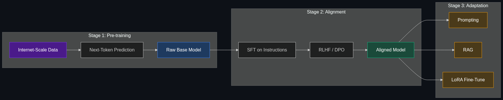

# 🏛️ Foundation Models

> **Massive models trained on broad data that serve as the flexible foundation upon which thousands of other specific apps and fine-tuned models are built.**

---

## Phase 1: Core Foundations & Pre-requisites

### Prerequisites
- **Neural Networks** — Layers, weights, training basics
- **Pre-training vs. Fine-tuning** — General training vs. task-specific adaptation
- **LLMs & Model Types** — The model spectrum (see [01_LLMs_vs_SLMs_vs_VLMs.md](01_LLMs_vs_SLMs_vs_VLMs.md))

### Definition
A **Foundation Model** is a large AI model trained on massive, broad, diverse datasets using self-supervised learning. It is not designed for any single task — instead, it serves as a **general-purpose base** that can be adapted (via fine-tuning, prompting, or RAG) to thousands of downstream tasks.

**The term was coined by Stanford HAI (2021):**
> *"A foundation model is any model that is trained on broad data (generally using self-supervision at scale) that can be adapted to a wide range of downstream tasks."*

### The Problem It Solves

| Before Foundation Models | With Foundation Models |
|-------------------------|----------------------|
| Train a separate model for each task | One model adapted to many tasks |
| Needs labeled data for every task | Pre-trains on unlabeled data; few-shot for tasks |
| Narrow: sentiment model can't translate | Broad: one model can summarize, translate, code |
| Starting from scratch every time | Transfer learning from a powerful base |
| Custom model per company/app | Foundation → fine-tune → deploy |

**Legacy Issue:** In the pre-foundation era (~2018), every NLP task needed a custom model with thousands of labeled examples. Sentiment analysis, translation, summarization, QA — all separate models, separate datasets, separate training runs. Foundation models unified this.

### The Solution
Train one enormous model on the internet's worth of text (and increasingly images, audio, video). This model learns:
- **Language** — Grammar, syntax, semantics
- **World knowledge** — Facts, relationships, common sense
- **Reasoning patterns** — Logic, cause-and-effect, step-by-step thinking
- **Coding** — Programming languages, algorithms, APIs

Then **adapt** it to any specific task cheaply:

```
Foundation Model (pre-trained on internet-scale data)
    ├── Fine-tune for customer support → Support Bot
    ├── Fine-tune for medical Q&A → Medical Assistant
    ├── Prompt engineering → General Chatbot
    ├── RAG + Company docs → Enterprise Search
    └── Fine-tune for code → Coding Assistant
```

### Real-World Example — GPT-4 as a Foundation Model
GPT-4 (the foundation model) powers:
- **ChatGPT** — General conversation (prompting)
- **GitHub Copilot** — Code generation (fine-tuned + context)
- **Khan Academy Khanmigo** — Education tutoring (system prompt + RAG)
- **Stripe Docs** — Developer documentation search (RAG)
- **Morgan Stanley** — Financial advisor assistant (fine-tuned + RAG + guardrails)

All of these are **different products** built on the **same foundation model**.

### Trade-off Table

| Dimension | Foundation Model | Task-Specific Model | Rule-Based System |
|-----------|-----------------|---------------------|-------------------|
| **Breadth** | ✅ Thousands of tasks | ❌ One task | ❌ One task |
| **Training cost** | 💰💰💰💰 $10M-$100M+ | 💰 $100-$10K | 💰 Dev time only |
| **Adaptation cost** | 💰 Low (prompt/fine-tune) | 💰💰 Medium (full training) | 💰💰 High (engineering) |
| **Flexibility** | ✅ High (prompt for new tasks) | ❌ Fixed | ❌ Fixed |
| **Accuracy on specific task** | ⚠️ Good (not perfect) | ✅ Best (specialized) | ✅ Deterministic |
| **Data needed for new task** | 🟢 0-100 examples | 🔴 1K-100K examples | 🔴 Manual rules |

### 🧩 Mini-Quiz

> **Q1:** Why is GPT-4 called a "foundation" model?
> <details><summary>Answer</summary>Because it's trained on broad data (internet text) and serves as a general-purpose base that is adapted to thousands of downstream tasks — chatbots, coding assistants, medical advisors, search — without being retrained for each one.</details>

> **Q2:** What is the key difference between a foundation model and a task-specific model?
> <details><summary>Answer</summary>A foundation model is pre-trained on broad data and adapted to many tasks. A task-specific model is trained from scratch (or fine-tuned heavily) for a single task. Foundation models trade peak task-specific accuracy for massive flexibility and breadth.</details>

---

## Phase 2: Anatomy & Internal Mechanisms

### The Foundation Model Lifecycle



### The Three Stages

**Stage 1: Pre-training (Months, $10M-$100M+)**
- **Data:** Trillions of tokens from the internet (web pages, books, code, papers)
- **Objective:** Next-token prediction (autoregressive) or masked language modeling
- **Compute:** Thousands of GPUs for weeks-months
- **Output:** A raw base model with broad knowledge but no instruction-following

**Stage 2: Alignment / Post-training (Weeks, $100K-$1M)**
- **SFT (Supervised Fine-Tuning):** Train on (instruction, response) pairs
- **RLHF (Reinforcement Learning from Human Feedback):** Humans rank outputs; model learns to prefer better ones
- **DPO (Direct Preference Optimization):** Simpler alternative to RLHF
- **Output:** An instruction-following, safe, helpful model (e.g., ChatGPT)

**Stage 3: Adaptation (Hours-Days, $0-$10K)**
- **Prompting:** Zero-shot or few-shot (free, instant)
- **RAG:** Connect to external knowledge (see [Module 2](../02_Data_and_Context_The_Knowing_Layer/README.md))
- **Fine-tuning:** LoRA/QLoRA on domain-specific data (cheap, fast)
- **Output:** Task-specific application (e.g., legal assistant, coding copilot)

### The Foundation Model Stack

| Layer | What | Who |
|-------|------|-----|
| **Applications** | ChatGPT, Copilot, Khanmigo | App developers |
| **Adaptation** | Fine-tuning, RAG, prompting | ML engineers |
| **Alignment** | SFT, RLHF, DPO, safety | Model providers |
| **Pre-training** | Next-token prediction on trillions of tokens | Foundation model labs |
| **Data** | Internet text, code, books, papers | Curated datasets |
| **Compute** | Thousands of GPUs (H100, TPUv5) | Cloud providers (NVIDIA, Google) |

### Pre-Training Objective

The fundamental objective for most foundation models:

$$\mathcal{L} = -\sum_{t=1}^{T} \log P(x_t | x_1, x_2, ..., x_{t-1}; \theta)$$

"Predict the next token, given all previous tokens." This simple objective, at massive scale, produces emergent capabilities: reasoning, coding, translation, summarization — none of which were explicitly trained.

### Major Foundation Models (2025)

| Model | Creator | Params | Open? | Key Strength |
|-------|---------|--------|-------|-------------|
| **GPT-4o** | OpenAI | ~200B (est.) | ❌ Closed | Best all-around; multimodal |
| **Claude 4** | Anthropic | Undisclosed | ❌ Closed | Safety, long context (200K) |
| **Gemini 2.0** | Google | Undisclosed | ❌ Closed | 1M context, native multimodal |
| **Llama 3.1** | Meta | 8B / 70B / 405B | ✅ Open | Best open-source; permissive license |
| **Mistral Large** | Mistral | Undisclosed | ❌ Closed | European; strong reasoning |
| **DeepSeek-V3** | DeepSeek | 671B (MoE) | ✅ Open | Frontier quality at low cost |
| **Phi-4** | Microsoft | 14B | ✅ Open | Best SLM; "textbook quality" data |
| **Gemma 3** | Google | 1B / 4B / 12B / 27B | ✅ Open | Efficient; on-device capable |

### 🃏 Flashcard

> **Front:** What is RLHF and why is it important for foundation models?
> <details><summary>Flip</summary><b>Reinforcement Learning from Human Feedback.</b> After pre-training, the model doesn't follow instructions well and may generate harmful content. RLHF has human raters rank model outputs (A > B), trains a reward model on these preferences, then uses RL (PPO) to optimize the model toward human-preferred outputs. This is what turns a raw text predictor into a helpful, harmless assistant. Used in ChatGPT, Claude, and most aligned models.</details>

---

## Phase 3: Advanced / Enterprise Patterns & Pitfalls

### At Scale
- **OpenAI** — Sells GPT-4o as a foundation via API; partners build on top
- **Meta** — Open-sources Llama for the ecosystem to build on
- **Google** — Gemini powers Search, Workspace, Android, Cloud
- **Hugging Face** — Hosts 500K+ fine-tuned models built on top of foundations
- **Stability AI** — Stable Diffusion as a foundation for image generation

### Open vs. Closed Foundation Models

| Dimension | Open (Llama, Mistral, Gemma) | Closed (GPT-4, Claude, Gemini) |
|-----------|------------------------------|--------------------------------|
| **Cost** | Free weights; pay for compute | Pay per API call |
| **Privacy** | Data stays on your infra | Data sent to provider |
| **Customization** | Full fine-tuning, modification | Limited fine-tuning via API |
| **Quality** | ⚠️ Slightly behind frontier | ✅ Frontier quality |
| **Support** | Community-driven | Enterprise SLAs |
| **Deployment** | You manage infrastructure | Provider manages everything |
| **Best for** | Privacy, customization, cost control | Maximum quality, minimal ops |

### Adaptation Methods Compared

| Method | Cost | Effort | Quality Impact | Data Needed |
|--------|------|--------|---------------|-------------|
| **Zero-shot prompting** | Free | Minutes | ⚠️ Variable | 0 examples |
| **Few-shot prompting** | Free | Minutes | 🟢 Good | 3-10 examples |
| **RAG** | 💰 Low | Days | ✅ High for knowledge tasks | Your documents |
| **LoRA fine-tuning** | 💰💰 | Days | ✅ High for behavior change | 1K-10K examples |
| **Full fine-tuning** | 💰💰💰 | Weeks | ✅ Highest | 10K-100K+ examples |

### Edge Cases & Mitigations

| Issue | Mitigation |
|-------|------------|
| **Catastrophic forgetting** | LoRA preserves base knowledge; use replay buffers |
| **Benchmark overfitting** | Evaluate on real-world tasks, not just benchmarks |
| **Data contamination** | Test on post-training-cutoff data; use canary strings |
| **Emergent unalignment** | Red-teaming, safety benchmarks, ongoing monitoring |
| **Vendor lock-in** | Use open models; abstract behind API layers |

### Anti-Patterns

- ❌ **Training from scratch** — Building a foundation model when you can fine-tune Llama → Only justified if you're OpenAI/Google scale
- ❌ **Fine-tuning for factual knowledge** — Trying to teach facts via fine-tuning → Use RAG instead
- ❌ **Ignoring open models** — Assuming closed models are always better → Llama 3.1 405B matches GPT-4 on many tasks
- ❌ **Over-fine-tuning** — Losing the foundation's general capabilities → Use LoRA; keep it lightweight

---

## Phase 4: Practical Implementation

### Fine-Tuning a Foundation Model with LoRA (Python)

```python
from transformers import AutoModelForCausalLM, AutoTokenizer, TrainingArguments
from peft import LoraConfig, get_peft_model
from datasets import load_dataset
from trl import SFTTrainer

# 1. Load a foundation model (e.g., Llama 3.2 3B)
model_name = "meta-llama/Llama-3.2-3B-Instruct"
model = AutoModelForCausalLM.from_pretrained(
    model_name,
    torch_dtype="auto",
    device_map="auto"  # Automatically distribute across GPUs
)
tokenizer = AutoTokenizer.from_pretrained(model_name)

# 2. Configure LoRA — only train 0.1% of parameters
lora_config = LoraConfig(
    r=16,                # Rank of the low-rank matrices
    lora_alpha=32,       # Scaling factor
    lora_dropout=0.05,   # Regularization
    target_modules=["q_proj", "v_proj"],  # Which layers to adapt
    task_type="CAUSAL_LM"
)
model = get_peft_model(model, lora_config)
model.print_trainable_parameters()
# trainable params: 4,194,304 || all params: 3,213,892,608 || trainable%: 0.13%

# 3. Prepare your domain-specific dataset
# Format: {"instruction": "...", "response": "..."}
dataset = load_dataset("json", data_files="my_domain_data.jsonl")

# 4. Fine-tune
trainer = SFTTrainer(
    model=model,
    train_dataset=dataset["train"],
    args=TrainingArguments(
        output_dir="./fine_tuned_model",
        num_train_epochs=3,
        per_device_train_batch_size=4,
        learning_rate=2e-4,
        logging_steps=10,
    ),
    tokenizer=tokenizer,
)
trainer.train()

# 5. Save & use
model.save_pretrained("./fine_tuned_model")
# This adapter is only ~17MB — sits on top of the 6GB base model
```

### Comparing Foundation Models (Python)

```python
from openai import OpenAI
import anthropic
import google.generativeai as genai

# Test the same prompt across 3 foundation models
test_prompt = "Explain the CAP theorem in distributed systems with a practical example."

# GPT-4o
openai_client = OpenAI()
gpt4_response = openai_client.chat.completions.create(
    model="gpt-4o",
    messages=[{"role": "user", "content": test_prompt}]
).choices[0].message.content

# Claude
claude_client = anthropic.Anthropic()
claude_response = claude_client.messages.create(
    model="claude-sonnet-4-20250514",
    max_tokens=1024,
    messages=[{"role": "user", "content": test_prompt}]
).content[0].text

# Gemini
genai.configure(api_key="YOUR_KEY")
gemini_model = genai.GenerativeModel("gemini-2.0-flash")
gemini_response = gemini_model.generate_content(test_prompt).text

# Compare responses
for name, resp in [("GPT-4o", gpt4_response), ("Claude", claude_response), ("Gemini", gemini_response)]:
    print(f"\n{'='*60}\n{name} ({len(resp)} chars):\n{resp[:300]}...")
```

### Choosing a Foundation Model

| Your Situation | Recommended Model | Why |
|---------------|------------------|-----|
| **Maximum quality, any cost** | GPT-4o or Claude 4 Opus | Frontier reasoning |
| **Balance quality + cost** | GPT-4o-mini or Claude Haiku | 90% quality at 10% cost |
| **Privacy / on-premise** | Llama 3.1 70B | Open weights; self-hosted |
| **On-device / mobile** | Llama 3.2 3B or Gemma 3 4B | Small enough for phones |
| **Long documents (500+ pages)** | Gemini 2.0 Pro | 1M token context |
| **Budget-conscious API** | DeepSeek-V3 | GPT-4o quality at ~$0.27/1M |
| **Code generation** | GPT-4o or Claude 4 Sonnet | Best code benchmarks |

---

## Phase 5: Interview Preparation

### Q1: "What is a foundation model and why did it change AI?"
<details><summary><b>Answer</b></summary>

A foundation model is a large neural network pre-trained on broad, diverse data (internet text, code, images) using self-supervised learning. It changed AI by:

1. **Unifying tasks** — One model replaces hundreds of task-specific models
2. **Reducing data requirements** — Few-shot learning instead of thousands of labeled examples
3. **Enabling transfer learning** — Pre-trained knowledge transfers to any domain
4. **Creating an ecosystem** — Thousands of apps built on top of the same base model
5. **Emergent capabilities** — Abilities (reasoning, coding, translation) emerge from scale that weren't explicitly trained

The shift is analogous to the iPhone: before → specialized devices (camera, phone, GPS, music player). After → one device adapted to everything via apps.
</details>

### Q2: "Open vs. closed foundation models — how do you decide for enterprise?"
<details><summary><b>Answer</b></summary>

**Choose Open (Llama, Mistral):**
- Data can't leave your infrastructure (HIPAA, GDPR, classified)
- Need deep customization (full fine-tuning, architecture modifications)
- Want to avoid vendor lock-in
- High-volume, cost-sensitive workloads

**Choose Closed (GPT-4o, Claude):**
- Need frontier-quality reasoning with minimal ops effort
- Don't have GPU infrastructure or ML ops team
- Need enterprise SLAs and support
- Rapid prototyping and iteration

**Hybrid (most common in enterprise):** Closed APIs for complex tasks + open models for high-volume simple tasks and privacy-sensitive data.
</details>

### Q3: "How would you fine-tune a foundation model for a legal domain?"
<details><summary><b>STAR Answer</b></summary>

**Situation:** Law firm wants an AI assistant that understands legal terminology, citations, and can draft documents.

**Task:** Adapt a foundation model to the legal domain.

**Action:**
1. **Base Model:** Llama 3.1 70B (open, can self-host for attorney-client privilege)
2. **Data Curation:** Collect 50K legal documents (contracts, briefs, case law) — clean and format as (instruction, response) pairs
3. **Fine-tuning:** LoRA (rank=32) on legal Q&A + document drafting tasks. Train for 3 epochs. Cost: ~$500 on 4x A100s
4. **RAG Layer:** Embed firm's case database + precedent library into vector DB for grounding
5. **Guardrails:** "This is not legal advice" disclaimers; human review for any external-facing output
6. **Evaluation:** Test on 200 legal reasoning questions; compare to base model + GPT-4o

**Result:** 40% improvement in legal terminology accuracy over base model. Grounded answers cite specific case law. Lawyers save 2+ hours/day on research.
</details>

---

## Phase 6: Summary Cheatsheet & Action Plan

### 📋 TL;DR

| Concept | Key Point |
|---------|-----------|
| **Foundation Model** | Broad pre-training → adapt to thousands of tasks |
| **Pre-training** | Next-token prediction on trillions of tokens ($10M-$100M+) |
| **Alignment** | SFT + RLHF/DPO turns a text predictor into a helpful assistant |
| **Adaptation** | Prompting (free) → RAG (days) → LoRA (days) → Full fine-tune (weeks) |
| **Open vs. Closed** | Open = privacy + customization; Closed = quality + simplicity |
| **Key trend** | Ecosystem: one foundation → thousands of specialized apps |

### 📖 Industry Reads
1. **Paper:** [On the Opportunities and Risks of Foundation Models](https://arxiv.org/abs/2108.07258) — Stanford HAI (2021). The paper that coined the term.
2. **Blog:** [Meta Llama 3.1](https://ai.meta.com/blog/meta-llama-3-1/) — How Meta builds and releases open foundation models.

### 🚀 Do These Now
1. **Compare 3 models (30 min):** Use the comparison code above to test GPT-4o, Claude, and Gemini on the same 5 prompts
2. **Fine-tune with LoRA (1 hr):** Follow the LoRA code above on a Llama 3.2 3B model with your own Q&A data
3. **Explore Hugging Face (20 min):** Browse [huggingface.co/models](https://huggingface.co/models) — see how many fine-tuned variants exist for Llama alone

### 🧭 Continue Learning
> You've completed the "Models & Architectures" module! Review the [README](README.md) to revisit any topic, or continue to the next module in your AI learning path.
