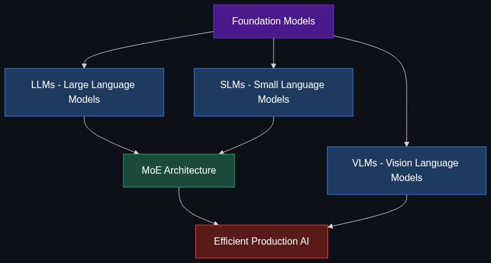

# 🏗️ Models & Architectures — The "Brain" Layer

> **Understanding what's inside the AI models themselves — how they're built, how they differ, and why architecture choices matter.**

This module covers the foundational architectures that power modern AI. From massive frontier models to tiny on-device models, from monolithic networks to clever routing systems — these are the building blocks every senior engineer needs to understand.

---

## 📚 Topics Covered

| # | Topic | File | Core Idea |
|---|-------|------|-----------|
| 1 | [LLMs vs. SLMs vs. VLMs](01_LLMs_vs_SLMs_vs_VLMs.md) | `01_LLMs_vs_SLMs_vs_VLMs.md` | Large, Small, and Vision Language Models — when to use which |
| 2 | [MoE (Mixture of Experts)](02_MoE_Mixture_of_Experts.md) | `02_MoE_Mixture_of_Experts.md` | Route prompts to specialized sub-networks for speed & cost |
| 3 | [Foundation Models](03_Foundation_Models.md) | `03_Foundation_Models.md` | The massive pre-trained base that everything else is built on |

---

## 🗺️ How These Topics Connect

---

## 🎯 Learning Path

**Recommended order:**

1. **Start** with [Foundation Models](03_Foundation_Models.md) — the conceptual base
2. **Then** [LLMs vs. SLMs vs. VLMs](01_LLMs_vs_SLMs_vs_VLMs.md) — the model spectrum
3. **Finally** [MoE](02_MoE_Mixture_of_Experts.md) — the architecture innovation making it all efficient

---

## 🧠 Prerequisites

Before diving into this module, ensure you understand:

- **Neural Networks Basics** — Layers, weights, forward pass, backpropagation
- **Transformer Architecture** — Self-attention, encoder-decoder, positional encoding
- **Tokenization** — How text becomes numerical input for models
- **Module 1: Agents & Action** — How models are used in practice (see [01_Agents_and_Action](../01_Agents_and_Action_The_Doing_Layer/README.md))
- **Module 2: Data & Context** — How models access knowledge (see [02_Data_and_Context](../02_Data_and_Context_The_Knowing_Layer/README.md))

---

## 🏭 Industry Relevance (2025–2026)

| Company | Model Architecture Strategy |
|---------|----------------------------|
| **OpenAI** | GPT-4o (LLM), GPT-4o-mini (SLM), GPT-4V (VLM), rumored MoE architecture |
| **Google** | Gemini 2.0 (multimodal VLM), Gemma 3 (SLM), Gemini uses MoE internally |
| **Meta** | Llama 3.1 (open-source LLM), Llama 3.2 1B/3B (SLM), Llama 3.2 Vision (VLM) |
| **Anthropic** | Claude 4 (LLM), Claude Haiku (SLM-class efficiency) |
| **Microsoft** | Phi-4 (SLM), partnership with OpenAI for frontier models |
| **Mistral** | Mistral Large (LLM), Mistral Small (SLM), Mixtral (MoE pioneer) |
| **Apple** | Apple Intelligence on-device SLMs, foundation model strategy |

---

> **💡 Key Insight:** The industry is moving from "one huge model does everything" to a **spectrum of specialized models** — tiny models on your phone, expert routers in the cloud, and vision models that see the world. Understanding this landscape is essential for making the right architecture decisions.

---

*Each topic file follows the [Educator Skill](../.github/Educator_skill.md) 6-phase teaching methodology: Foundations → Anatomy → Enterprise Patterns → Implementation → Interview Prep → Cheatsheet.*
