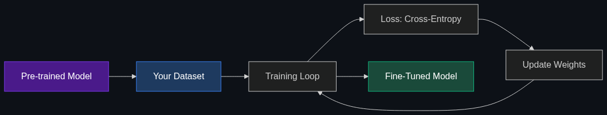

# 🎯 Fine-Tuning

> **Taking a pre-trained model and training it further on your own specific data so it learns a specific style, format, or niche skill.**

---

## Phase 1: Core Foundations & Pre-requisites

### Prerequisites
- **Foundation Models** — What pre-trained models are (see [Module 3](../03_Models_and_Architectures/03_Foundation_Models.md))
- **Gradient Descent** — How neural network weights are updated
- **Loss Functions** — Cross-entropy loss for language models

### Definition
**Fine-tuning** is the process of taking a pre-trained foundation model and continuing its training on a smaller, domain-specific dataset. The model's weights are updated to specialize in new tasks, styles, or knowledge while retaining its general capabilities.

```
Foundation Model (general) + Your Data (specific) → Fine-Tuned Model (specialized)
```

### The Problem It Solves

| Prompting Only | Fine-Tuning |
|---------------|-------------|
| Limited by context window | Knowledge baked into weights |
| Must describe desired behavior every time | Behavior becomes the default |
| Can't change output format reliably | Learns exact output format |
| Same cost per query (long prompts) | Shorter prompts needed = cheaper |
| Style/tone inconsistent | Consistent style/tone |

**When to fine-tune vs. prompt vs. RAG:**

| Method | Best For | NOT For |
|--------|----------|---------|
| **Prompting** | Quick iteration, simple tasks | Changing model behavior deeply |
| **RAG** | Adding factual knowledge | Changing output style or format |
| **Fine-tuning** | Changing behavior, style, format, jargon | Adding factual knowledge (use RAG) |

### Real-World Example
**Scenario:** A legal firm wants the AI to write in formal legal style, use specific citation formats, and never use casual language.

- **Prompting alone:** "Write in legal style..." works 70% of the time. Sometimes reverts to casual.
- **Fine-tuned model:** Trained on 5K legal documents. Now *always* writes in legal style, uses proper citations, and understands domain jargon natively.

### Trade-off Table

| Dimension | No Fine-Tuning | Full Fine-Tuning | PEFT (LoRA) |
|-----------|---------------|-----------------|-------------|
| **Cost** | 💰 Free | 💰💰💰 High (all params) | 💰 Low (0.1% params) |
| **Hardware** | 🟢 CPU/API | 🔴 8x A100 80GB | 🟢 1x A100 or consumer GPU |
| **Time** | 🟢 Instant | 🟡 Hours-days | 🟢 Minutes-hours |
| **Quality gain** | Baseline | ✅ Highest | ✅ Near-highest |
| **Risk** | 🟢 None | 🔴 Catastrophic forgetting | 🟢 Low risk |

### 🧩 Mini-Quiz

> **Q1:** You want the model to answer in JSON format with specific fields. Prompting works 80% of the time. What do you do?
> <details><summary>Answer</summary>Fine-tune on examples of (question → JSON response) pairs. This will make JSON output reliable and consistent. Alternatively, use structured output / response format features if your API supports them (OpenAI, Anthropic).</details>

> **Q2:** Should you fine-tune a model to know about your company's products?
> <details><summary>Answer</summary>No — use RAG instead. Fine-tuning is for changing behavior/style, not adding factual knowledge. Facts can be hallucinated or become stale. RAG retrieves live, grounded information.</details>

---

## Phase 2: Anatomy & Internal Mechanisms

### Fine-Tuning Pipeline



### Types of Fine-Tuning

| Type | What Changes | Data Format | Use Case |
|------|-------------|-------------|----------|
| **Full Fine-Tuning** | All model weights | (input, output) pairs | Maximum customization |
| **SFT (Supervised Fine-Tuning)** | All or subset of weights on instruction data | (instruction, response) | Instruction-following |
| **PEFT / LoRA** | Small adapter weights only | Same as SFT | Efficient customization |
| **Continued Pre-training** | All weights on raw text (no instructions) | Raw text corpus | Domain adaptation |

### Data Format for SFT

```jsonl
{"messages": [{"role": "system", "content": "You are a legal assistant."},
              {"role": "user", "content": "Draft a non-compete clause."},
              {"role": "assistant", "content": "NON-COMPETE AGREEMENT\n\n1. Scope..."}]}
{"messages": [{"role": "user", "content": "Summarize this contract."},
              {"role": "assistant", "content": "This agreement establishes..."}]}
```

### Training Hyperparameters

| Parameter | Typical Value | What It Controls |
|-----------|--------------|-----------------|
| **Learning Rate** | 1e-5 to 5e-5 | How much weights change per step (lower = safer) |
| **Epochs** | 1-5 | How many times to iterate over the dataset |
| **Batch Size** | 4-32 | How many examples per gradient update |
| **Warmup Steps** | 5-10% of total | Gradually increase LR at start |
| **Weight Decay** | 0.01-0.1 | Regularization to prevent overfitting |

### Catastrophic Forgetting

The biggest risk: fine-tuning too aggressively makes the model **forget** its general capabilities.

**Mitigations:**
- Low learning rate (1e-5 or lower)
- Few epochs (1-3 is often enough)
- Mix general data with domain data (10-20% general)
- Use PEFT/LoRA instead of full fine-tuning (preserves base weights)

### 🃏 Flashcard

> **Front:** What is "catastrophic forgetting" in fine-tuning?
> <details><summary>Flip</summary>When a model is fine-tuned too aggressively on narrow data, it <b>overwrites</b> its general knowledge and capabilities. The model becomes good at the new task but loses ability to do other things. <b>Fix:</b> Use LoRA (doesn't modify base weights), low learning rate, few epochs, and mix in general training data.</details>

---

## Phase 3: Advanced / Enterprise Patterns & Pitfalls

### At Scale
- **OpenAI Fine-Tuning API** — Fine-tune GPT-4o-mini and GPT-4o via API
- **Google Vertex AI** — Fine-tune Gemini models
- **Amazon Bedrock** — Fine-tune Claude and Llama models
- **Hugging Face** — AutoTrain for one-click fine-tuning of open models

### Anti-Patterns

- ❌ **Fine-tuning for factual knowledge** → Use RAG
- ❌ **Too much data without quality control** → Quality > quantity; 1K curated > 100K noisy
- ❌ **High learning rate** → Destroys base model capabilities
- ❌ **Too many epochs** → Overfits to training data; memorizes instead of generalizing
- ❌ **No evaluation set** → Can't tell if fine-tuning is actually helping

---

## Phase 4: Practical Implementation

### Fine-Tune via OpenAI API

```python
from openai import OpenAI
client = OpenAI()

# 1. Upload training data (JSONL format)
file = client.files.create(
    file=open("training_data.jsonl", "rb"),
    purpose="fine-tune"
)

# 2. Create fine-tuning job
job = client.fine_tuning.jobs.create(
    training_file=file.id,
    model="gpt-4o-mini-2024-07-18",  # Base model
    hyperparameters={
        "n_epochs": 3,
        "learning_rate_multiplier": 1.8,
        "batch_size": 4
    }
)

# 3. Monitor progress
events = client.fine_tuning.jobs.list_events(fine_tuning_job_id=job.id)
for event in events.data:
    print(f"{event.created_at}: {event.message}")

# 4. Use your fine-tuned model
response = client.chat.completions.create(
    model="ft:gpt-4o-mini-2024-07-18:my-org::abc123",  # Your fine-tuned model ID
    messages=[{"role": "user", "content": "Draft a non-compete clause."}]
)
```

### Fine-Tune Open Source with Hugging Face

```python
from transformers import AutoModelForCausalLM, AutoTokenizer, TrainingArguments
from trl import SFTTrainer
from datasets import load_dataset

model = AutoModelForCausalLM.from_pretrained("meta-llama/Llama-3.2-3B-Instruct", device_map="auto")
tokenizer = AutoTokenizer.from_pretrained("meta-llama/Llama-3.2-3B-Instruct")

dataset = load_dataset("json", data_files="my_data.jsonl")

trainer = SFTTrainer(
    model=model,
    train_dataset=dataset["train"],
    args=TrainingArguments(
        output_dir="./ft_model",
        num_train_epochs=3,
        per_device_train_batch_size=4,
        learning_rate=2e-5,  # Low LR to prevent catastrophic forgetting
        warmup_ratio=0.1,
        logging_steps=10,
        save_strategy="epoch",
    ),
    tokenizer=tokenizer,
)
trainer.train()
```

---

## Phase 5: Interview Preparation

### Q1: "Fine-tuning vs. RAG vs. Prompting — when do you use each?"
<details><summary><b>Answer</b></summary>

| Need | Method | Why |
|------|--------|-----|
| Add domain knowledge | **RAG** | Retrieves facts at query time; always fresh |
| Change output style/format | **Fine-tuning** | Bakes behavior into weights |
| Quick experiment | **Prompting** | Zero cost, instant iteration |
| Consistent JSON output | **Fine-tuning** + structured output | Most reliable |
| Company-specific jargon | **Fine-tuning** | Model learns domain language |

They're **complementary**: fine-tune for behavior + RAG for knowledge + prompting for instructions.
</details>

### Q2: "How do you evaluate if fine-tuning actually improved the model?"
<details><summary><b>Answer</b></summary>

1. **Hold-out eval set** — 10-20% of data never seen during training → measure loss
2. **A/B test** — Run same prompts on base vs. fine-tuned → human or LLM judges rate quality
3. **Task-specific metrics** — Accuracy for classification, BLEU/ROUGE for generation, exact match for extraction
4. **Regression testing** — Ensure general capabilities haven't degraded (test on standard benchmarks)
5. **Production metrics** — User satisfaction, task completion rate, escalation rate
</details>

---

## Phase 6: Summary Cheatsheet & Action Plan

### 📋 TL;DR

| Concept | Key Point |
|---------|-----------|
| **Fine-tuning** | Continue training on your data → specialized model |
| **Best for** | Changing style, format, behavior, jargon |
| **NOT for** | Adding factual knowledge (use RAG) |
| **Risk** | Catastrophic forgetting → mitigate with low LR, few epochs, LoRA |
| **Data** | Quality > quantity; 1K curated pairs often enough |

### 📖 Industry Reads
1. **Docs:** [OpenAI Fine-Tuning Guide](https://platform.openai.com/docs/guides/fine-tuning)
2. **Blog:** [Hugging Face SFT Trainer](https://huggingface.co/docs/trl/sft_trainer)

### 🚀 Do These Now
1. **Fine-tune GPT-4o-mini (30 min):** Create 50 JSONL examples → upload to OpenAI → fine-tune → compare
2. **Measure impact (20 min):** Run 20 test prompts on base vs. fine-tuned; score quality 1-5
3. **Try open-source (1 hr):** Fine-tune Llama 3.2 3B with the HuggingFace code above

### 🧭 Next Topic
> How can we fine-tune without needing all that GPU memory? → [02_PEFT.md](02_PEFT.md)
