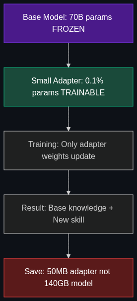

# 🪶 PEFT — Parameter-Efficient Fine-Tuning

> **A clever way to fine-tune a massive model without needing a million-dollar supercomputer. Instead of updating all billions of parameters, update only a tiny fraction.**

---

## Phase 1: Core Foundations & Pre-requisites

### Prerequisites
- **Fine-Tuning Basics** — What fine-tuning does (see [01_Fine_Tuning.md](01_Fine_Tuning.md))
- **Neural Network Parameters** — Weights, gradients, optimizer states
- **GPU/VRAM** — Why memory is the bottleneck for training

### Definition
**PEFT (Parameter-Efficient Fine-Tuning)** is a family of techniques that adapt a large pre-trained model by training only a **small subset of parameters** (typically 0.1-2% of total), keeping the vast majority of original weights frozen. This dramatically reduces the compute, memory, and storage needed to customize a model.

### The Problem It Solves

**Full fine-tuning a 70B model requires:**

| Resource | Full Fine-Tuning | PEFT |
|----------|-----------------|------|
| **VRAM** | ~560 GB (8× A100 80GB) | ~20-40 GB (1× A100) |
| **Cost** | $5,000-$50,000 | $50-$500 |
| **Time** | Days-weeks | Hours |
| **Storage per model** | 140 GB per variant | ~50-200 MB adapter per variant |
| **Risk** | 🔴 Catastrophic forgetting | 🟢 Base model preserved |

**The VRAM problem explained:**
```
Model weights (FP16):        70B × 2 bytes = 140 GB
Gradients:                   70B × 2 bytes = 140 GB
Optimizer states (Adam):     70B × 8 bytes = 560 GB  ← This is the killer
─────────────────────────────────────────────────────
Total for full fine-tuning:  ~840 GB VRAM needed
```

PEFT only computes gradients and optimizer states for 0.1% of parameters → **~1 GB** instead of 700 GB.

### The Solution

Instead of updating all parameters, PEFT methods:
1. **Freeze** the entire base model
2. **Add** small, trainable adapter modules
3. **Train** only the adapters (~millions of params vs. billions)
4. **Merge** adapters with the base model for inference (optional)

### PEFT Methods Overview

| Method | How It Works | Trainable Params | Popularity |
|--------|-------------|-----------------|------------|
| **LoRA** | Low-rank matrices in attention layers | 0.1-1% | ⭐⭐⭐⭐⭐ Most popular |
| **QLoRA** | LoRA + 4-bit quantized base model | 0.1-1% | ⭐⭐⭐⭐⭐ Most popular |
| **Prefix Tuning** | Learnable prefix tokens prepended to input | 0.1% | ⭐⭐ |
| **Prompt Tuning** | Learnable soft prompt embeddings | 0.01% | ⭐⭐ |
| **Adapters** | Small bottleneck layers inserted between Transformer layers | 1-5% | ⭐⭐⭐ |
| **(IA)³** | Learned vectors that scale activations | 0.01% | ⭐ |

### Trade-off Table

| Dimension | Full Fine-Tuning | LoRA (PEFT) | Prompt Tuning |
|-----------|-----------------|-------------|---------------|
| **Quality** | ✅ Best | ✅ ~95-99% of full | ⚠️ 85-90% of full |
| **VRAM** | 🔴 Massive | 🟢 Low | 🟢 Very low |
| **Training speed** | 🔴 Slow | ✅ Fast | ✅ Very fast |
| **Storage per variant** | 🔴 Full model copy | ✅ ~50 MB adapter | ✅ ~1 MB |
| **Multi-task** | 🔴 Separate models | ✅ Swap adapters | ✅ Swap prompts |

### 🧩 Mini-Quiz

> **Q1:** Why does full fine-tuning require ~4x the model's weight size in VRAM?
> <details><summary>Answer</summary>You need: (1) model weights, (2) gradients (same size), (3) optimizer states — Adam stores 2 additional copies (first and second moment estimates). Total: weights + gradients + 2× optimizer = ~4× model size.</details>

---

## Phase 2: Anatomy & Internal Mechanisms

### PEFT Concept Diagram



### Why PEFT Works — The Intrinsic Dimensionality Hypothesis

Research (Aghajanyan et al., 2020) showed that fine-tuning happens in a **low-dimensional subspace**:
- A 175B model's fine-tuning can be captured by updating only **~200 dimensions** (not 175 billion)
- The "useful" changes during fine-tuning are extremely low-rank
- This is why LoRA with rank 8-32 captures 95%+ of full fine-tuning quality

### Multi-Adapter Serving

One base model, many adapters — hot-swap for different tasks:

```
Base Model (Llama 3.1 70B) — loaded once
    ├── LoRA Adapter A: Legal assistant (50 MB)
    ├── LoRA Adapter B: Medical Q&A (50 MB)
    ├── LoRA Adapter C: Code reviewer (50 MB)
    └── LoRA Adapter D: Customer support (50 MB)
    
Total storage: 70B base + 200 MB adapters
vs. Full fine-tuning: 4 × 70B = 280B parameters stored
```

### 🃏 Flashcard

> **Front:** What is the "intrinsic dimensionality" insight behind PEFT?
> <details><summary>Flip</summary>Fine-tuning doesn't actually need to explore the full parameter space. The meaningful changes during adaptation happen in a <b>very low-dimensional subspace</b>. A 175B model's fine-tuning behavior can be captured by changes in only ~200 dimensions. This is why LoRA (rank 8-32) achieves near-full-fine-tuning quality while training only 0.1% of parameters.</details>

---

## Phase 3: Advanced / Enterprise Patterns & Pitfalls

### Anti-Patterns

- ❌ **Full fine-tuning when PEFT suffices** → LoRA gets 95%+ quality at 10x less cost
- ❌ **Ignoring QLoRA** → Quantize base model to 4-bit → fine-tune on consumer GPU
- ❌ **Too-low LoRA rank** → Rank 4 may underfit; start with 16-32
- ❌ **Not comparing to prompting first** → Sometimes good prompting beats bad fine-tuning

---

## Phase 4: Practical Implementation

```python
from peft import LoraConfig, get_peft_model, TaskType
from transformers import AutoModelForCausalLM

# Load base model
model = AutoModelForCausalLM.from_pretrained("meta-llama/Llama-3.2-3B-Instruct", device_map="auto")

# Configure PEFT (LoRA in this case)
peft_config = LoraConfig(
    task_type=TaskType.CAUSAL_LM,
    r=16,              # Rank — higher = more capacity, more params
    lora_alpha=32,     # Scaling factor
    lora_dropout=0.05,
    target_modules=["q_proj", "v_proj", "k_proj", "o_proj"],  # Which layers to adapt
)

# Wrap model with PEFT
model = get_peft_model(model, peft_config)
model.print_trainable_parameters()
# trainable params: 6,553,600 || all params: 3,213,892,608 || trainable%: 0.20%

# Train as normal — only adapter weights update
# After training, save just the adapter (~25 MB):
model.save_pretrained("./my_adapter")

# Later, load base model + adapter:
from peft import PeftModel
base = AutoModelForCausalLM.from_pretrained("meta-llama/Llama-3.2-3B-Instruct")
model = PeftModel.from_pretrained(base, "./my_adapter")
```

---

## Phase 5: Interview Preparation

### Q1: "Why use PEFT instead of full fine-tuning?"
<details><summary><b>Answer</b></summary>

1. **Memory:** 10-100x less VRAM → fine-tune on single GPU instead of a cluster
2. **Cost:** $50 instead of $50,000
3. **Speed:** Hours instead of days
4. **Storage:** 50MB adapter vs. full model copy per variant
5. **Safety:** Base weights frozen → no catastrophic forgetting
6. **Multi-task:** Swap adapters at inference time for different specializations
</details>

---

## Phase 6: Summary Cheatsheet & Action Plan

### 📋 TL;DR

| Concept | Key Point |
|---------|-----------|
| **PEFT** | Train only 0.1-2% of parameters; freeze the rest |
| **Why it works** | Fine-tuning lives in a low-dimensional subspace |
| **LoRA** | Most popular PEFT method; add low-rank matrices |
| **QLoRA** | LoRA + 4-bit quantized base = consumer GPU fine-tuning |
| **Adapter serving** | One base model + many small adapters = multi-task at low cost |

### 🚀 Do These Now
1. **Read:** Hugging Face [PEFT Documentation](https://huggingface.co/docs/peft)
2. **Code:** Run the implementation above on any open model
3. **Compare:** Fine-tune same data with LoRA rank 4 vs. 16 vs. 64 — measure quality vs. speed

### 🧭 Next Topic
> How does LoRA actually work under the hood? → [03_LoRA_QLoRA.md](03_LoRA_QLoRA.md)
