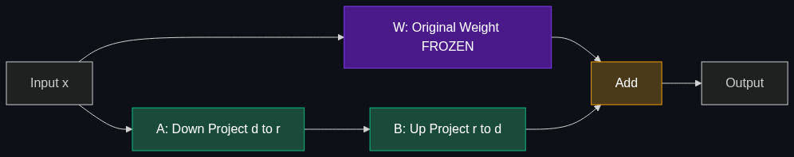

# 🔗 LoRA / QLoRA — Low-Rank Adaptation

> **The most popular techniques under the PEFT umbrella. They allow developers to fine-tune massive models quickly and cheaply on consumer-grade hardware.**

---

## Phase 1: Core Foundations & Pre-requisites

### Prerequisites
- **PEFT** — Why parameter-efficient methods exist (see [02_PEFT.md](02_PEFT.md))
- **Linear Algebra** — Matrix multiplication, matrix rank
- **Quantization** — Reducing weight precision (FP32 → INT4)

### Definition

**LoRA (Low-Rank Adaptation)** decomposes the weight updates during fine-tuning into two small matrices instead of modifying the full weight matrix. Instead of updating a `d × d` weight matrix W directly, LoRA adds a bypass: `W' = W + BA`, where B is `d × r` and A is `r × d`, and `r << d` (typically r=8-32).

**QLoRA** combines LoRA with **4-bit quantization** of the base model, reducing VRAM requirements by another 4x. This enables fine-tuning a 70B model on a single 24GB consumer GPU.

### The Math (Simple Version)

```
Original weight update:     ΔW  = (d × d) matrix  → millions of parameters
LoRA decomposition:         ΔW  = B × A
                            B   = (d × r) matrix  → d × r parameters
                            A   = (r × d) matrix  → r × d parameters
                            
Where r = rank (typically 8-32), d = hidden dimension (e.g., 4096)

Example: d=4096, r=16
  Full ΔW:   4096 × 4096 = 16,777,216 parameters
  LoRA B×A:  4096 × 16 + 16 × 4096 = 131,072 parameters
  Savings:   128x fewer parameters!
```

$$W' = W + \frac{\alpha}{r} \cdot BA$$

Where α (lora_alpha) is a scaling factor that controls the magnitude of the adaptation.

### The Problem It Solves

| Full Fine-Tuning | LoRA | QLoRA |
|-----------------|------|-------|
| Updates ALL weights | Updates ~0.1% of weights | Same as LoRA + 4-bit base |
| 8× A100 80GB for 70B model | 1× A100 for 70B model | 1× RTX 4090 (24GB) for 70B |
| $5,000-$50,000 | $100-$1,000 | $20-$200 |
| Stores full model per variant (140GB) | Stores 50MB adapter per variant | Stores 50MB adapter |
| Risk of catastrophic forgetting | Base weights frozen | Base weights frozen |

### Real-World Example
**Fine-tuning Llama 3.1 70B for customer support:**

| Approach | Hardware | Cost | Time | Quality |
|----------|----------|------|------|---------|
| Full fine-tuning | 8× A100 80GB | $15,000 | 3 days | 100% (baseline) |
| LoRA (r=16) | 1× A100 80GB | $500 | 6 hours | 97% |
| QLoRA (r=16) | 1× RTX 4090 24GB | $50 | 8 hours | 95% |

### Trade-off Table

| Dimension | Full FT | LoRA | QLoRA | Prompt Tuning |
|-----------|---------|------|-------|---------------|
| **Quality** | ✅ 100% | ✅ 97% | ✅ 95% | ⚠️ 85% |
| **VRAM (70B)** | 560 GB | 80 GB | 24 GB | 140 GB |
| **Trainable params** | 100% | 0.1-1% | 0.1-1% | 0.001% |
| **Adapter size** | 140 GB | ~50 MB | ~50 MB | ~1 MB |
| **Consumer GPU?** | ❌ | ⚠️ (small models) | ✅ Yes | ✅ Yes |

### 🧩 Mini-Quiz

> **Q1:** Why does LoRA use "low-rank" matrices?
> <details><summary>Answer</summary>Research showed that the weight changes during fine-tuning have very low intrinsic rank. A 4096×4096 update matrix can be closely approximated by the product of two much smaller matrices (4096×16 and 16×4096). This captures 95%+ of the fine-tuning effect with 128x fewer parameters.</details>

> **Q2:** What does the "Q" in QLoRA add on top of LoRA?
> <details><summary>Answer</summary>Quantization of the base model to 4-bit (NF4 format). The base model weights are compressed 4x in memory, while LoRA adapters are trained in FP16/BF16. This makes the base model's memory footprint 4x smaller, enabling fine-tuning of 70B models on a single 24GB consumer GPU.</details>

---

## Phase 2: Anatomy & Internal Mechanisms

### LoRA Architecture Diagram



### How LoRA Integrates into Transformers

In a standard Transformer, each attention layer has four weight matrices: **Q, K, V, O** (query, key, value, output). LoRA adds low-rank bypasses to selected matrices:

```
Standard:       hidden → W_q → query       (W_q is 4096 × 4096)
With LoRA:      hidden → W_q → query       (frozen, original weights)
                hidden → B_q × A_q → +query  (trainable, rank-r bypass)
                
Final query = W_q(x) + (α/r) × B_q(A_q(x))
```

### Which Layers to Adapt?

| Target Modules | What Gets Adapted | Common Choice |
|---------------|-------------------|---------------|
| `q_proj, v_proj` | Query and Value attention matrices | ✅ Default (most popular) |
| `q_proj, k_proj, v_proj, o_proj` | All attention matrices | Better quality, more params |
| `+ gate_proj, up_proj, down_proj` | Attention + FFN layers | Best quality, most params |

### LoRA Hyperparameters

| Parameter | Range | Effect |
|-----------|-------|--------|
| **r (rank)** | 4-128 | Higher = more capacity, more params. Sweet spot: 16-32 |
| **lora_alpha** | 16-64 | Scaling factor. Common: α = 2×r |
| **lora_dropout** | 0-0.1 | Regularization. 0.05 is typical |
| **target_modules** | varies | Which layers get LoRA adapters |

### QLoRA's Three Innovations

1. **NF4 (4-bit NormalFloat)** — A quantization format optimized for normally distributed weights. Better than standard INT4.

2. **Double Quantization** — Quantize the quantization constants themselves → saves additional 0.37 bits/parameter.

3. **Paged Optimizers** — Use CPU RAM as overflow when GPU VRAM is full → handles memory spikes.

**VRAM breakdown for QLoRA on Llama 70B:**
```
Base model (NF4):     ~35 GB    (vs 140 GB in FP16)
LoRA adapters (BF16): ~0.5 GB
Optimizer states:     ~1 GB     (only for LoRA params)
Activations/batch:    ~3-8 GB
───────────────────────────────
Total:                ~40-45 GB  (fits on 1× A100 48GB!)
```

### 🃏 Flashcard

> **Front:** Explain LoRA in one sentence.
> <details><summary>Flip</summary>LoRA freezes the base model and adds trainable low-rank matrices (B×A where rank r≪d) as bypasses to attention layers, capturing the fine-tuning effect with 0.1% of the parameters. <b>W' = W + (α/r)·BA</b></details>

---

## Phase 3: Advanced / Enterprise Patterns & Pitfalls

### Advanced Variants

| Variant | What's Different |
|---------|-----------------|
| **LoRA+** | Different learning rates for A and B matrices |
| **DoRA** | Decomposes weight into magnitude and direction; applies LoRA to direction |
| **AdaLoRA** | Dynamically adjusts rank per layer based on importance |
| **rsLoRA** | Rank-stabilized scaling: α/√r instead of α/r |
| **LoRA-FA** | Freeze A matrix after initialization; train only B |

### Anti-Patterns

- ❌ **Rank too low (r=1-4)** → Underfits; insufficient capacity for complex adaptations
- ❌ **Rank too high (r=256+)** → Diminishing returns; overfitting risk; negates PEFT benefits
- ❌ **Forgetting to set α** → Default α may be too low; common rule: α = 2×r
- ❌ **Merging then fine-tuning again** → Merge adapter into base only for inference, not for further training

---

## Phase 4: Practical Implementation

### LoRA Fine-Tuning (Full Pipeline)

```python
from transformers import AutoModelForCausalLM, AutoTokenizer, TrainingArguments, BitsAndBytesConfig
from peft import LoraConfig, get_peft_model
from trl import SFTTrainer
from datasets import load_dataset
import torch

# ── QLoRA: Quantize base model to 4-bit ──────────────────
bnb_config = BitsAndBytesConfig(
    load_in_4bit=True,                    # 4-bit quantization
    bnb_4bit_quant_type="nf4",            # NormalFloat4 (QLoRA's innovation)
    bnb_4bit_compute_dtype=torch.bfloat16, # Compute in BF16
    bnb_4bit_use_double_quant=True,       # Double quantization
)

model = AutoModelForCausalLM.from_pretrained(
    "meta-llama/Llama-3.1-8B-Instruct",
    quantization_config=bnb_config,
    device_map="auto"
)
tokenizer = AutoTokenizer.from_pretrained("meta-llama/Llama-3.1-8B-Instruct")
tokenizer.pad_token = tokenizer.eos_token

# ── LoRA Configuration ──────────────────────────────────
lora_config = LoraConfig(
    r=32,                   # Rank 32 — good balance of quality vs efficiency
    lora_alpha=64,          # α = 2×r
    lora_dropout=0.05,
    target_modules=["q_proj", "k_proj", "v_proj", "o_proj",
                    "gate_proj", "up_proj", "down_proj"],  # All key layers
    task_type="CAUSAL_LM"
)

model = get_peft_model(model, lora_config)
model.print_trainable_parameters()
# trainable params: 83,886,080 || all params: 8,114,212,864 || trainable%: 1.03%

# ── Training ─────────────────────────────────────────────
dataset = load_dataset("json", data_files="training_data.jsonl")

trainer = SFTTrainer(
    model=model,
    train_dataset=dataset["train"],
    args=TrainingArguments(
        output_dir="./qlora_output",
        num_train_epochs=3,
        per_device_train_batch_size=4,
        gradient_accumulation_steps=4,  # Effective batch size = 16
        learning_rate=2e-4,             # Higher LR is fine for LoRA
        warmup_ratio=0.1,
        logging_steps=10,
        bf16=True,
        save_strategy="epoch",
    ),
    tokenizer=tokenizer,
)
trainer.train()

# ── Save adapter (only ~200 MB) ─────────────────────────
model.save_pretrained("./my_qlora_adapter")

# ── Merge adapter into base for deployment ───────────────
from peft import PeftModel
base = AutoModelForCausalLM.from_pretrained("meta-llama/Llama-3.1-8B-Instruct", torch_dtype=torch.bfloat16)
merged = PeftModel.from_pretrained(base, "./my_qlora_adapter")
merged = merged.merge_and_unload()  # Merge LoRA weights into base
merged.save_pretrained("./merged_model")
```

---

## Phase 5: Interview Preparation

### Q1: "Explain how LoRA works and why it's so effective."
<details><summary><b>Answer</b></summary>

LoRA exploits the insight that fine-tuning weight updates have **low intrinsic rank**. Instead of updating a full d×d weight matrix (16M params for d=4096), it decomposes the update into two small matrices: B (d×r) × A (r×d), where r≪d (typically 16-32).

**Why effective:**
1. Captures 95-99% of full fine-tuning quality
2. Trains 0.1-1% of parameters → fits on consumer GPUs
3. Base model weights frozen → no catastrophic forgetting
4. Adapter is tiny (~50MB) → easy to store and swap
5. Can be merged into base model at inference → zero latency overhead
</details>

### Q2: "QLoRA enables fine-tuning a 70B model on a consumer GPU. How?"
<details><summary><b>Answer</b></summary>

Three key innovations:
1. **NF4 quantization** — Base model compressed to 4-bit (70B: 140GB → 35GB)
2. **LoRA adapters in BF16** — Only adapters are full precision (~0.5GB for r=16)
3. **Paged optimizers** — Optimizer state overflows to CPU RAM when GPU is full

Result: 70B model fine-tuning needs ~40GB VRAM (fits on 1× A100 48GB or 2× RTX 4090 24GB).
</details>

---

## Phase 6: Summary Cheatsheet & Action Plan

### 📋 TL;DR

| Concept | Key Point |
|---------|-----------|
| **LoRA** | W' = W + (α/r)·BA; decompose updates into low-rank matrices |
| **QLoRA** | LoRA + 4-bit quantized base model → consumer GPU fine-tuning |
| **Rank (r)** | 16-32 is the sweet spot; higher = more capacity |
| **Alpha (α)** | Scaling factor; common rule: α = 2×r |
| **Target modules** | At minimum q_proj, v_proj; ideally all attention + FFN |
| **Adapter size** | ~50-200 MB vs. full model (GB-TB) |

### 📖 Industry Reads
1. **Paper:** [LoRA: Low-Rank Adaptation of Large Language Models](https://arxiv.org/abs/2106.09685) — Hu et al. (2021)
2. **Paper:** [QLoRA: Efficient Finetuning of Quantized LLMs](https://arxiv.org/abs/2305.14314) — Dettmers et al. (2023)

### 🚀 Do These Now
1. **QLoRA on your GPU (1 hr):** Run the full pipeline code above on Llama 3.2 3B with your own data
2. **Experiment with rank (30 min):** Train with r=4, r=16, r=64 — compare quality and speed
3. **Merge and deploy (20 min):** Merge adapter into base model and compare inference quality

### 🧭 Next Topic
> How do we teach models to be helpful and safe? → [04_RLHF.md](04_RLHF.md)
