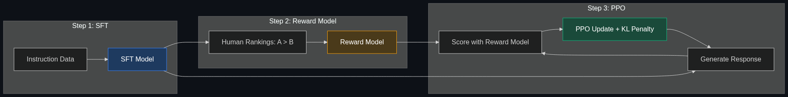

# 👨‍⚖️ RLHF — Reinforcement Learning from Human Feedback

> **Training models to be helpful and harmless by having humans rate their answers (e.g., "Answer A is better than Answer B").**

---

## Phase 1: Core Foundations & Pre-requisites

### Prerequisites
- **Fine-Tuning & SFT** — Supervised fine-tuning (see [01_Fine_Tuning.md](01_Fine_Tuning.md))
- **Reinforcement Learning Basics** — Reward signals, policy optimization
- **Foundation Models** — Pre-training and the alignment problem

### Definition
**RLHF (Reinforcement Learning from Human Feedback)** is a three-step process that aligns a language model with human preferences. Instead of training on "correct answers" (supervised learning), RLHF trains the model to produce outputs that **humans prefer**, making it more helpful, safe, and honest.

**This is what turns GPT-4 (raw text predictor) into ChatGPT (helpful assistant).**

### The Problem It Solves

| Pre-trained Model (no RLHF) | After RLHF |
|-----------------------------|------------|
| Predicts the most likely next token | Generates the most *helpful* response |
| May produce toxic, harmful content | Trained to refuse harmful requests |
| Doesn't follow instructions well | Follows instructions accurately |
| Verbose, rambling responses | Concise, structured responses |
| No awareness of safety guidelines | Built-in safety behaviors |

### The Three Steps of RLHF



**Step 1: Supervised Fine-Tuning (SFT)**
- Train on (instruction, high-quality response) pairs
- Gives the model basic instruction-following ability

**Step 2: Reward Model Training**
- Generate 2+ responses per prompt
- Humans rank them: "A > B" or "B > A"
- Train a reward model to predict human preferences

**Step 3: RL Optimization (PPO)**
- Use the reward model as a scoring function
- Run RL (Proximal Policy Optimization) to maximize reward
- KL divergence penalty keeps model close to the SFT version

### Trade-off Table

| Dimension | SFT Only | SFT + RLHF | SFT + DPO |
|-----------|----------|------------|-----------|
| **Helpfulness** | ⚠️ Medium | ✅ High | ✅ High |
| **Safety** | ❌ Unreliable | ✅ Trained to refuse | ✅ Trained to refuse |
| **Complexity** | 🟢 Simple | 🔴 Complex (3 models) | 🟡 Medium (no reward model) |
| **Cost** | 💰 Low | 💰💰💰 High | 💰💰 Medium |
| **Stability** | ✅ Stable | ⚠️ Reward hacking risk | ✅ More stable |

### 🧩 Mini-Quiz

> **Q1:** Why not just use more supervised fine-tuning instead of RLHF?
> <details><summary>Answer</summary>SFT teaches from single "correct" examples. But many queries have multiple valid answers of different quality. RLHF captures the nuance of "A is better than B" — relative preferences, not binary right/wrong. This is especially important for subjective qualities like helpfulness, tone, and safety.</details>

---

## Phase 2: Anatomy & Internal Mechanisms

### The Reward Model

The reward model is a separate neural network trained to predict human preferences:

```
Input: (prompt, response) → Reward Model → scalar score (e.g., 4.7 out of 5)

Training data:
  Prompt: "Explain quantum computing"
  Response A: [detailed, accurate, well-structured]  ← Human ranked #1
  Response B: [vague, contains errors]                ← Human ranked #2
  
  Loss: maximize score(A) - score(B)
```

### PPO (Proximal Policy Optimization) in RLHF

$$\mathcal{L}_{RLHF} = \mathbb{E}[R_\theta(x, y)] - \beta \cdot D_{KL}[\pi_\theta || \pi_{SFT}]$$

- **R(x, y)** — Reward model score for the response
- **β · D_KL** — Penalty for deviating too far from the SFT model (prevents "reward hacking")

**The KL divergence term is critical:** Without it, the model would find weird exploits to maximize the reward score (e.g., repeating phrases the reward model likes, regardless of actual quality). The KL penalty keeps the model "close" to a known-good SFT baseline.

### Reward Hacking — The Biggest Risk

```
Without KL penalty:
  Model learns: "Say 'I'm glad to help!' 50 times → high reward score"
  This is technically high-reward but useless → "reward hacking"
  
With KL penalty:
  Model is constrained to stay close to SFT behavior
  Can improve helpfulness without drifting into exploit territory
```

### 🃏 Flashcard

> **Front:** What are the three models needed for RLHF?
> <details><summary>Flip</summary>1. <b>SFT Model</b> — The instruction-tuned base (starting point)<br/>2. <b>Reward Model</b> — Trained on human preference data to score responses<br/>3. <b>Policy Model</b> — The SFT model being optimized via PPO to maximize reward while staying close to the SFT base (KL penalty)</details>

---

## Phase 3: Advanced / Enterprise Patterns & Pitfalls

### At Scale
- **OpenAI** — RLHF is core to GPT-4/ChatGPT alignment
- **Anthropic** — Constitutional AI (RLHF + AI-generated feedback)
- **Google DeepMind** — Gemini alignment pipeline
- **Meta** — Llama 3 uses RLHF in its post-training

### Anti-Patterns

- ❌ **Skipping SFT** → RLHF on a raw pre-trained model diverges → Always SFT first
- ❌ **Too few human annotations** → Reward model is noisy → Need 50K+ comparisons for quality
- ❌ **No KL penalty** → Reward hacking → Always include KL divergence term
- ❌ **Over-optimizing** → Model becomes sycophantic (agrees with everything) → Monitor for sycophancy

---

## Phase 4: Practical Implementation

### RLHF with TRL (Simplified)

```python
from trl import PPOTrainer, PPOConfig, AutoModelForCausalLMWithValueHead
from transformers import AutoTokenizer

# 1. Load SFT model with value head (for PPO)
model = AutoModelForCausalLMWithValueHead.from_pretrained("my-sft-model")
tokenizer = AutoTokenizer.from_pretrained("my-sft-model")
ref_model = AutoModelForCausalLMWithValueHead.from_pretrained("my-sft-model")  # Frozen reference

# 2. Configure PPO
ppo_config = PPOConfig(
    batch_size=16,
    learning_rate=1e-5,
    kl_penalty="kl",   # KL divergence penalty
    init_kl_coef=0.2,  # β — strength of KL penalty
)

ppo_trainer = PPOTrainer(
    config=ppo_config,
    model=model,
    ref_model=ref_model,
    tokenizer=tokenizer,
)

# 3. Training loop
for batch in dataloader:
    prompts = batch["prompt"]
    
    # Generate responses from policy model
    responses = ppo_trainer.generate(prompts, max_new_tokens=256)
    
    # Score responses with reward model
    rewards = reward_model.score(prompts, responses)  # Your trained reward model
    
    # PPO update — maximize reward while staying close to SFT model
    stats = ppo_trainer.step(prompts, responses, rewards)
    print(f"Mean reward: {stats['ppo/mean_scores']:.3f}, KL: {stats['ppo/mean_kl']:.3f}")
```

---

## Phase 5: Interview Preparation

### Q1: "Explain RLHF and why it matters."
<details><summary><b>Answer</b></summary>

RLHF aligns models with human preferences through three steps: (1) SFT on instruction data, (2) train a reward model on human preference rankings, (3) optimize the model with PPO to maximize reward while staying close to the SFT baseline via KL penalty.

**Why it matters:** Pre-trained models predict likely text, not helpful text. RLHF teaches the model what humans actually want — helpfulness, safety, honesty. This is what makes ChatGPT helpful vs. GPT-3 being unpredictable.
</details>

---

## Phase 6: Summary Cheatsheet & Action Plan

### 📋 TL;DR

| Concept | Key Point |
|---------|-----------|
| **RLHF** | Train with human preferences, not just correct answers |
| **3 steps** | SFT → Reward Model → PPO optimization |
| **Reward model** | Predicts which response humans prefer |
| **KL penalty** | Prevents reward hacking; keeps model stable |
| **Biggest risk** | Sycophancy + reward hacking if poorly configured |

### 📖 Industry Reads
1. **Paper:** [Training Language Models to Follow Instructions with Human Feedback](https://arxiv.org/abs/2203.02155) — Ouyang et al. (OpenAI, 2022). The InstructGPT paper.
2. **Paper:** [Constitutional AI](https://arxiv.org/abs/2212.08073) — Anthropic (2022). AI-assisted RLHF.

### 🧭 Next Topic
> Is there a simpler way to do this without RL? → [05_DPO.md](05_DPO.md)
