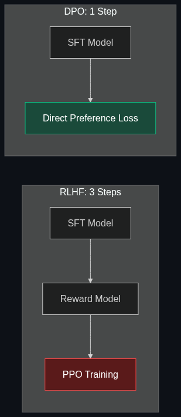

# ⚡ DPO — Direct Preference Optimization

> **A newer, more math-efficient alternative to RLHF that is becoming incredibly popular for aligning AI with human preferences — without needing a separate reward model or RL training.**

---

## Phase 1: Core Foundations & Pre-requisites

### Prerequisites
- **RLHF** — The three-step alignment process (see [04_RLHF.md](04_RLHF.md))
- **Loss Functions** — Cross-entropy, binary cross-entropy
- **Human Preference Data** — (prompt, chosen, rejected) triples

### Definition
**DPO (Direct Preference Optimization)** is an alignment technique that achieves the same goal as RLHF (aligning a model with human preferences) but **skips the reward model and RL entirely**. Instead, it directly optimizes the language model using a clever loss function derived from preference data.

**RLHF:** SFT → Train Reward Model → PPO (3 models, unstable, complex)
**DPO:**  SFT → Train directly on preferences (1 model, stable, simple)

### The Problem It Solves

| RLHF | DPO |
|------|-----|
| 3 separate models (SFT, reward, policy) | 1 model trained directly |
| PPO is unstable and hard to tune | Simple supervised loss function |
| Reward model can be gamed (hacking) | No reward model to hack |
| Expensive (3x compute) | Cheap (1x compute) |
| Complex infrastructure | Standard training loop |

### The Math (Intuition)

DPO's key insight: the reward model in RLHF can be **analytically solved** and folded into a single loss function. Instead of learning a reward then optimizing against it, DPO directly increases the probability of preferred responses and decreases the probability of rejected ones.

$$\mathcal{L}_{DPO} = -\mathbb{E}\left[\log \sigma\left(\beta \log \frac{\pi_\theta(y_w|x)}{\pi_{ref}(y_w|x)} - \beta \log \frac{\pi_\theta(y_l|x)}{\pi_{ref}(y_l|x)}\right)\right]$$

**In English:**
- Increase the model's probability of the **chosen** response (y_w)
- Decrease the model's probability of the **rejected** response (y_l)
- β controls how strongly preferences are enforced

### Trade-off Table

| Dimension | RLHF | DPO | KTO |
|-----------|------|-----|-----|
| **Models needed** | 3 (SFT + Reward + Policy) | 1 | 1 |
| **Stability** | ⚠️ PPO is fragile | ✅ Stable (supervised loss) | ✅ Stable |
| **Quality** | ✅ Strong | ✅ Comparable or better | ✅ Good |
| **Data format** | (prompt, A vs B rankings) | (prompt, chosen, rejected) | (prompt, response, thumbs up/down) |
| **Compute** | 💰💰💰 3x | 💰 1x | 💰 1x |
| **Popularity (2025)** | ⭐⭐⭐ Established | ⭐⭐⭐⭐⭐ Dominant | ⭐⭐ Rising |

### 🧩 Mini-Quiz

> **Q1:** Why is DPO simpler than RLHF?
> <details><summary>Answer</summary>DPO mathematically derives a closed-form solution for the RLHF objective, eliminating the need for a separate reward model and RL optimization. It reduces alignment to a single supervised fine-tuning step with a specialized loss function on preference data.</details>

---

## Phase 2: Anatomy & Internal Mechanisms

### DPO vs RLHF Pipeline Comparison



### Data Format

```jsonl
{
  "prompt": "Explain quantum computing to a 10-year-old",
  "chosen": "Imagine a coin spinning in the air. A regular computer...",
  "rejected": "Quantum computing utilizes superposition of qubits in Hilbert space..."
}
```

The "chosen" response is what humans preferred. The "rejected" is the less-preferred alternative. DPO learns to push the model toward chosen and away from rejected.

### The β (Beta) Parameter

β controls the strength of preference enforcement:

| β Value | Effect | Use Case |
|---------|--------|----------|
| **β = 0.01** | Very weak; model barely changes | Conservative alignment |
| **β = 0.1** | Standard; balanced alignment | Most common (default) |
| **β = 0.5** | Strong; aggressive alignment | When safety is critical |
| **β = 1.0+** | Very strong; may hurt quality | Rarely used |

### DPO Variants (2024-2025)

| Variant | Innovation |
|---------|-----------|
| **IPO** | Regularized DPO; prevents overfitting to preference data |
| **KTO** | Only needs thumbs-up/down (not pairwise); easier data collection |
| **ORPO** | Combines SFT and preference alignment into a single step |
| **SimPO** | Simpler formulation; no reference model needed |
| **SPPO** | Self-play; model generates its own preference data |

### 🃏 Flashcard

> **Front:** What data format does DPO need?
> <details><summary>Flip</summary>Triples of <b>(prompt, chosen_response, rejected_response)</b>. The "chosen" is the human-preferred answer. The "rejected" is the less-preferred one. DPO's loss function increases the probability of "chosen" and decreases "rejected" relative to a frozen reference model.</details>

---

## Phase 3: Advanced / Enterprise Patterns & Pitfalls

### At Scale
- **Meta Llama 3.1** — Uses DPO for alignment (publicly documented)
- **Mistral** — DPO-based alignment for Mistral models
- **Most open-source models** — Community fine-tuning overwhelmingly uses DPO over RLHF
- **Anthropic** — Combines DPO-like methods with Constitutional AI

### Anti-Patterns

- ❌ **Poor quality preference data** → "Garbage in, garbage out" — curate chosen/rejected carefully
- ❌ **β too high** → Model becomes overly cautious; refuses too many queries
- ❌ **No reference model** → DPO needs a frozen ref model for the KL implicit term
- ❌ **Chosen and rejected too similar** → Model can't learn clear preferences; need distinctive pairs

---

## Phase 4: Practical Implementation

### DPO with TRL (Hugging Face)

```python
from trl import DPOTrainer, DPOConfig
from transformers import AutoModelForCausalLM, AutoTokenizer
from datasets import load_dataset

# 1. Load SFT model (your starting point — must be instruction-tuned first)
model = AutoModelForCausalLM.from_pretrained(
    "my-sft-model",
    torch_dtype="auto",
    device_map="auto"
)
tokenizer = AutoTokenizer.from_pretrained("my-sft-model")

# 2. Load reference model (frozen copy of SFT model)
ref_model = AutoModelForCausalLM.from_pretrained(
    "my-sft-model",
    torch_dtype="auto",
    device_map="auto"
)

# 3. Load preference dataset
# Format: {"prompt": "...", "chosen": "...", "rejected": "..."}
dataset = load_dataset("json", data_files="preferences.jsonl")

# 4. Configure DPO
dpo_config = DPOConfig(
    beta=0.1,                        # Preference strength (standard)
    output_dir="./dpo_output",
    num_train_epochs=1,              # 1 epoch is often enough
    per_device_train_batch_size=4,
    learning_rate=5e-7,              # Very low LR for alignment
    logging_steps=10,
    bf16=True,
)

# 5. Train
trainer = DPOTrainer(
    model=model,
    ref_model=ref_model,
    args=dpo_config,
    train_dataset=dataset["train"],
    tokenizer=tokenizer,
)
trainer.train()

# 6. Save aligned model
model.save_pretrained("./aligned_model")
```

### Creating Preference Data

```python
from openai import OpenAI

client = OpenAI()

def generate_preference_pair(prompt: str) -> dict:
    """
    Generate a chosen/rejected pair using an LLM as judge.
    In production, use human annotators for best results.
    """
    # Generate two candidate responses
    responses = []
    for _ in range(2):
        r = client.chat.completions.create(
            model="gpt-4o-mini",
            messages=[{"role": "user", "content": prompt}],
            temperature=0.9  # High temp for diversity
        )
        responses.append(r.choices[0].message.content)
    
    # Use a stronger model to judge
    judgment = client.chat.completions.create(
        model="gpt-4o",
        messages=[{
            "role": "user",
            "content": f"Which response is better for: '{prompt}'?\n\n"
                       f"Response A: {responses[0]}\n\n"
                       f"Response B: {responses[1]}\n\n"
                       f"Reply with only 'A' or 'B'."
        }]
    )
    
    winner = judgment.choices[0].message.content.strip()
    chosen = responses[0] if winner == "A" else responses[1]
    rejected = responses[1] if winner == "A" else responses[0]
    
    return {"prompt": prompt, "chosen": chosen, "rejected": rejected}
```

---

## Phase 5: Interview Preparation

### Q1: "DPO vs. RLHF — when would you still choose RLHF?"
<details><summary><b>Answer</b></summary>

Choose RLHF when:
1. **Online learning** — You want the model to generate and be scored in real-time (PPO's strength)
2. **Complex reward signals** — Multiple reward models (helpfulness + safety + factuality)
3. **Proven at scale** — RLHF has more battle-tested production deployments (GPT-4, early Claude)

Choose DPO when:
1. **Simplicity** — Standard training loop, no RL infrastructure needed
2. **Stability** — No reward hacking risk; deterministic training
3. **Cost** — 3x cheaper (no reward model or RL training)
4. **Most use cases** — DPO is sufficient for the vast majority of alignment needs
</details>

---

## Phase 6: Summary Cheatsheet & Action Plan

### 📋 TL;DR

| Concept | Key Point |
|---------|-----------|
| **DPO** | Align with preferences using a single supervised loss — no RL needed |
| **vs. RLHF** | Same goal, 3x simpler, 3x cheaper, comparable quality |
| **Data** | (prompt, chosen, rejected) triples |
| **β** | Controls preference strength; 0.1 is standard |
| **Key insight** | The RLHF reward model can be analytically solved and folded into the loss |

### 📖 Industry Reads
1. **Paper:** [Direct Preference Optimization: Your Language Model is Secretly a Reward Model](https://arxiv.org/abs/2305.18290) — Rafailov et al. (Stanford, 2023)

### 🚀 Do These Now
1. **Create 50 preference pairs (30 min):** Use the code above to auto-generate preference data
2. **Run DPO (1 hr):** Train a small model (Llama 3.2 3B) with DPO using TRL
3. **Compare (20 min):** Run same prompts on SFT-only vs. SFT+DPO — note quality and safety differences

### 🧭 Continue Learning
> You've completed the "Training & Tweaking" module! → [README](README.md)
