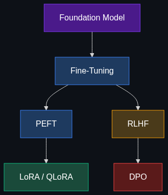

# 🔧 Training & Tweaking — The "Customization" Layer

> **How we take a general-purpose AI and mold it into a specialist — from fine-tuning to alignment.**

This module covers the techniques used to customize foundation models: teaching them your style, aligning them with human values, and doing it all without a million-dollar GPU budget.

---

## 📚 Topics Covered

| # | Topic | File | Core Idea |
|---|-------|------|-----------|
| 1 | [Fine-Tuning](01_Fine_Tuning.md) | `01_Fine_Tuning.md` | Train further on your data for a specific style or skill |
| 2 | [PEFT (Parameter-Efficient Fine-Tuning)](02_PEFT.md) | `02_PEFT.md` | Fine-tune massive models without massive hardware |
| 3 | [LoRA / QLoRA](03_LoRA_QLoRA.md) | `03_LoRA_QLoRA.md` | The most popular PEFT technique — cheap, fast, effective |
| 4 | [RLHF](04_RLHF.md) | `04_RLHF.md` | Align models with human preferences via reward learning |
| 5 | [DPO](05_DPO.md) | `05_DPO.md` | Simpler, math-efficient alternative to RLHF |

---

## 🗺️ How These Topics Connect

---

## 🎯 Learning Path

**Recommended order:**

1. **Start** with [Fine-Tuning](01_Fine_Tuning.md) — the foundational concept
2. **Then** [PEFT](02_PEFT.md) — why full fine-tuning is often impractical
3. **Then** [LoRA / QLoRA](03_LoRA_QLoRA.md) — the dominant practical technique
4. **Then** [RLHF](04_RLHF.md) — how models learn human values
5. **Finally** [DPO](05_DPO.md) — the modern, simpler alternative

---

## 🧠 Prerequisites

- **Foundation Models** — What pre-trained models are (see [Module 3](../03_Models_and_Architectures/README.md))
- **Neural Network Training** — Loss functions, backpropagation, optimizers
- **Gradient Descent** — How weights get updated during training
- **GPU/VRAM Basics** — Why memory matters for training

---

*Each topic file follows the [Educator Skill](../.github/Educator_skill.md) 6-phase teaching methodology.*
