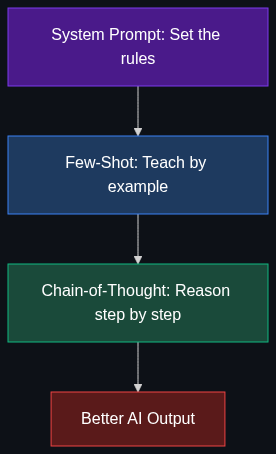

# 💬 Prompting & Reasoning — The "Communicating" Layer

> **How we talk to AI models to get the best possible results — from simple instructions to advanced reasoning techniques.**

This module covers the art and science of prompt engineering: system prompts, few-shot examples, and chain-of-thought reasoning that dramatically improves AI output quality.

---

## 📚 Topics Covered

| # | Topic | File | Core Idea |
|---|-------|------|-----------|
| 1 | [Chain-of-Thought (CoT)](01_Chain_of_Thought.md) | `01_Chain_of_Thought.md` | Force AI to think step-by-step for better reasoning |
| 2 | [System Prompt](02_System_Prompt.md) | `02_System_Prompt.md` | Hidden instructions that govern AI persona and rules |
| 3 | [Few-Shot Prompting](03_Few_Shot_Prompting.md) | `03_Few_Shot_Prompting.md` | Teach by example inside the prompt |

---

## 🗺️ How These Topics Connect

---

## 🎯 Learning Path

1. **Start** with [System Prompt](02_System_Prompt.md) — the foundation of every AI interaction
2. **Then** [Few-Shot Prompting](03_Few_Shot_Prompting.md) — teaching by example
3. **Finally** [Chain-of-Thought](01_Chain_of_Thought.md) — unlocking reasoning

---

## 🧠 Prerequisites

- **LLM Basics** — How models generate text token-by-token
- **API Usage** — OpenAI/Anthropic API message format
- **Module 3: Models** — Understanding model capabilities (see [Module 3](../03_Models_and_Architectures/README.md))

---

*Each topic file follows the [Educator Skill](../.github/Educator_skill.md) 6-phase teaching methodology.*
