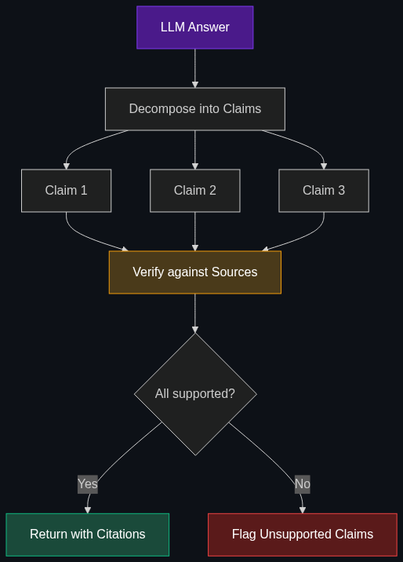

# 👻 Hallucinations

> **When an AI confidently invents facts, fake citations, or entirely fictitious scenarios — and presents them as truth.**

---

## Phase 1: Core Foundations & Pre-requisites

### Prerequisites
- **LLM Basics** — How next-token prediction works
- **Grounding** — How to anchor AI to facts (see [Module 2: Grounding](../02_Data_and_Context_The_Knowing_Layer/05_Grounding.md))

### Definition
**Hallucination** is when an LLM generates content that is factually incorrect, fabricated, or unsupported by its training data or provided context — while presenting it with full confidence. The model doesn't "know" it's lying; it's producing statistically plausible text.

### Types of Hallucination

| Type | Example | Danger Level |
|------|---------|-------------|
| **Factual fabrication** | "The Eiffel Tower was built in 1903" (actually 1889) | 🟡 Medium |
| **Fake citations** | "According to Smith et al. (2021)..." (paper doesn't exist) | 🔴 High |
| **Fictitious entities** | Inventing a non-existent company, person, or law | 🔴 High |
| **Confident nonsense** | Plausible-sounding but completely wrong technical explanations | 🔴 Very High |
| **Intrinsic** | Contradicts its own training data | 🟡 Medium |
| **Extrinsic** | Makes claims not in any source | 🔴 High |

### Why LLMs Hallucinate

| Root Cause | Explanation |
|-----------|-------------|
| **Statistical text generation** | Models predict the most *likely* next token, not the most *true* one |
| **Training on noisy data** | Internet has contradictions, errors, and outdated information |
| **Overconfidence** | RLHF trains models to sound confident and helpful — even when uncertain |
| **Knowledge gaps** | Model doesn't have the info but tries to fill the gap plausibly |
| **Long-tail knowledge** | Rare facts are poorly represented in training data |

**Core insight:** LLMs are **language generators**, not **knowledge databases**. They produce text that *sounds right*, not text that *is right*.

### Hallucination Rates (Approximate, 2025)

| Model | Hallucination Rate (no grounding) | With RAG |
|-------|----------------------------------|----------|
| GPT-4o | ~5-10% | ~2-3% |
| Claude 3.5 Sonnet | ~5-8% | ~1-3% |
| GPT-3.5 | ~15-25% | ~5-8% |
| Open-source 7B | ~20-35% | ~8-12% |

### Trade-off Table

| Mitigation | Effectiveness | Cost | Complexity |
|-----------|--------------|------|-----------|
| **Better prompting** | 🟡 Moderate | 💰 Free | 🟢 Easy |
| **RAG (grounding)** | ✅ High | 💰💰 Medium | 🟡 Medium |
| **Temperature = 0** | 🟡 Helps slightly | 💰 Free | 🟢 Easy |
| **Post-hoc verification** | ✅ High | 💰💰 2x LLM cost | 🟡 Medium |
| **Fine-tuning with "I don't know"** | ✅ High | 💰💰 Fine-tuning cost | 🔴 Hard |
| **Multi-model consensus** | ✅ Very high | 💰💰💰 N× cost | 🟡 Medium |

### 🧩 Mini-Quiz

> **Q1:** Can hallucination be fully eliminated?
> <details><summary>Answer</summary>No. Hallucination is an intrinsic property of statistical text generation. It can be dramatically reduced (from 25% to <1% with grounding + verification) but never fully eliminated. This is why production AI systems always need human oversight for critical decisions.</details>

---

## Phase 2: Anatomy & Internal Mechanisms

### Hallucination Detection Flow



### Detection Methods

| Method | How It Works | Effectiveness |
|--------|-------------|---------------|
| **Self-consistency** | Generate 5+ responses; flag disagreements | ✅ Good for factual claims |
| **Retrieval verification** | Check each claim against a knowledge base | ✅ Best for grounded systems |
| **Claim decomposition** | Break answer into atomic claims; verify each | ✅ Fine-grained detection |
| **Confidence scoring** | Analyze token probabilities for uncertainty | 🟡 Inconsistent |
| **Cross-model verification** | Ask another model to verify claims | ✅ Good for critical apps |

### The Verification Pipeline

```
1. Generate answer
2. Decompose into atomic claims:
   "The Eiffel Tower was built in 1889 by Gustave Eiffel"
   → Claim 1: "The Eiffel Tower was built in 1889"
   → Claim 2: "It was built by Gustave Eiffel"
3. Verify each claim against trusted sources
4. Mark unsupported claims
5. Return answer with confidence indicators
```

### 🃏 Flashcard

> **Front:** Why do RLHF-trained models hallucinate MORE confidently?
> <details><summary>Flip</summary>RLHF trains models to produce responses that humans rate as "helpful" and "confident." Hedging ("I'm not sure...") gets low reward scores. So the model learns to sound confident even when uncertain — making hallucinations harder to detect because they <b>sound</b> authoritative.</details>

---

## Phase 3: Advanced / Enterprise Patterns & Pitfalls

### High-Stakes Hallucination Disasters

| Incident | What Happened | Impact |
|----------|--------------|--------|
| **Lawyer using ChatGPT** | Cited 6 completely fake court cases in a legal brief | Sanctions, national embarrassment |
| **Medical chatbot** | Recommended non-existent drug interactions | Patient safety risk |
| **Financial AI** | Fabricated earnings numbers for a public company | Potential securities fraud |

### Mitigation Strategies (Layered Defense)

```
Layer 1: Prompt Engineering
  → "If you're unsure, say 'I don't know'"
  → Temperature = 0
  
Layer 2: RAG Grounding
  → Retrieve from trusted sources
  → "Answer ONLY based on provided context"
  
Layer 3: Post-Generation Verification
  → Claim decomposition + fact-checking
  → Cross-reference with knowledge base
  
Layer 4: Human-in-the-Loop
  → Flag low-confidence answers for human review
  → Required for legal, medical, financial outputs
```

### Anti-Patterns

- ❌ **Trusting AI output without verification** → Always verify critical claims
- ❌ **"Don't hallucinate" in the prompt** → Instructions alone don't prevent it → Use grounding
- ❌ **High temperature for factual tasks** → More randomness = more hallucination → Use temp=0
- ❌ **No attribution** → Can't verify claims without sources → Always require citations

---

## Phase 4: Practical Implementation

```python
from openai import OpenAI
import json

client = OpenAI()

def detect_hallucinations(question: str, answer: str, sources: str) -> dict:
    """
    Decompose an answer into claims and verify each against sources.
    Returns a verdict for each claim.
    """
    response = client.chat.completions.create(
        model="gpt-4o",
        temperature=0,
        response_format={"type": "json_object"},
        messages=[{
            "role": "system",
            "content": """You are a fact-checker. Given a QUESTION, ANSWER, and SOURCES:
1. Decompose the ANSWER into individual factual claims
2. For each claim, check if it's SUPPORTED, UNSUPPORTED, or CONTRADICTED by the SOURCES
3. Return JSON: {
  "claims": [{"claim": "...", "verdict": "SUPPORTED|UNSUPPORTED|CONTRADICTED", "evidence": "..."}],
  "hallucination_detected": true/false,
  "confidence": 0.0-1.0
}"""
        }, {
            "role": "user",
            "content": f"QUESTION: {question}\n\nANSWER: {answer}\n\nSOURCES: {sources}"
        }]
    )
    return json.loads(response.choices[0].message.content)

# Self-consistency check
def self_consistency_check(question: str, n: int = 5) -> dict:
    """Generate N answers; flag if they disagree."""
    answers = []
    for _ in range(n):
        r = client.chat.completions.create(
            model="gpt-4o",
            temperature=0.7,
            messages=[{"role": "user", "content": question}],
            max_tokens=200
        )
        answers.append(r.choices[0].message.content)
    
    # Check consistency
    check = client.chat.completions.create(
        model="gpt-4o",
        temperature=0,
        messages=[{
            "role": "user",
            "content": f"Do these {n} answers agree on the key facts? List any contradictions.\n\n"
                       + "\n\n".join([f"Answer {i+1}: {a}" for i, a in enumerate(answers)])
        }]
    )
    return {"answers": answers, "consistency_check": check.choices[0].message.content}
```

---

## Phase 5: Interview Preparation

### Q1: "How would you minimize hallucination in a production medical AI?"
<details><summary><b>STAR Answer</b></summary>

**Situation:** Healthcare AI answering doctor queries about drug interactions.

**Task:** Near-zero hallucination tolerance (patient safety).

**Action:**
1. **RAG only from approved sources** — FDA drug labels, PubMed, clinical guidelines (never open web)
2. **Strict system prompt** — "Answer ONLY from provided context. Say 'Please consult a pharmacist' if uncertain"
3. **Claim verification** — Post-generation fact-check against the same sources
4. **Confidence thresholds** — Claims below 0.9 confidence → flagged for human review
5. **Temperature = 0** — Minimize creative generation
6. **Audit logging** — Every query, retrieved source, and answer logged for review

**Result:** Hallucination rate < 0.5%. All answers traceable to FDA-approved sources. Human pharmacist reviews flagged responses.
</details>

---

## Phase 6: Summary Cheatsheet & Action Plan

### 📋 TL;DR

| Concept | Key Point |
|---------|-----------|
| **Hallucination** | AI confidently states false information |
| **Root cause** | Statistical text generation, not knowledge retrieval |
| **Can't eliminate** | Can reduce from ~25% to <1% with layered defenses |
| **Best mitigation** | RAG + citations + post-hoc verification |
| **Key rule** | Never trust AI output on critical facts without verification |

### 📖 Industry Reads
1. **Paper:** [A Survey on Hallucination in LLMs](https://arxiv.org/abs/2311.05232) — Huang et al. (2023)
2. **Paper:** [FActScore](https://arxiv.org/abs/2305.14251) — Fine-grained factual precision evaluation

### 🧭 Next Topic
> How do users intentionally break AI safety? → [02_Jailbreaking.md](02_Jailbreaking.md)
