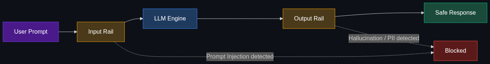

# 🚧 AI Guardrails

> **Safety protocols physically coded around an AI model to keep its outputs within company policy, ethical boundaries, or legal compliance. It stops an AI customer service bot from giving away free products or using inappropriate language.**

---

## Phase 1: Core Foundations & Pre-requisites

### Prerequisites
- **System Prompts** — The difference between instructing an AI and physically restricting it.
- **Prompt Injection** — Why system prompts are not enough to guarantee safety.

### Definition
**AI Guardrails** are programmable constraints that sit between the user, the LLM, and the application. Unlike a system prompt (which merely *asks* the AI to behave), guardrails are discrete code layers that intercept, analyze, and optionally block or modify inputs and outputs to ensure they adhere to strict enterprise policies.

### The Problem It Solves

| Without Guardrails | With Guardrails |
|--------------------|-----------------|
| User tricks AI into offering a $1 car | Output rail detects financial promise and blocks it |
| AI hallucinate a competitor's features | Output rail detects competitor name and redacts it |
| User asks bot to write a malicious script | Input rail classifies as "harmful" and blocks request entirely |
| AI returns PII (Social Security Numbers) | Output rail masks PII before sending to user |

### Trade-off Table

| Dimension | System Prompt Only | Programmable Guardrails |
|-----------|--------------------|-------------------------|
| **Security** | ⚠️ Weak (easily bypassed) | ✅ Strong (hard rules) |
| **Latency** | 🟢 Zero overhead | 🟡 Adds 50-200ms per request |
| **Complexity** | 🟢 Low | 🔴 High (requires classification models) |
| **Reliability** | ❌ Non-deterministic | ✅ Deterministic (Regex, Python logic) |

### 🧩 Mini-Quiz

> **Q1:** Why can't a company just use a really good System Prompt instead of Guardrails?
> <details><summary>Answer</summary>Because LLMs are non-deterministic and susceptible to Prompt Injection. A user can easily convince an LLM to "ignore all previous instructions" (including the system prompt). Guardrails run <i>outside</i> the LLM, meaning they cannot be bypassed by clever prompting.</details>

---

## Phase 2: Anatomy & Internal Mechanisms

### Guardrail Architecture



Guardrails operate in three distinct locations:
1. **Input Rails:** Analyze the user's prompt *before* it hits the LLM. Checks for prompt injection, jailbreaks, PII, or off-topic questions.
2. **Dialog Rails:** Analyze the state of the conversation. If the user is trying to execute a specific workflow (like processing a refund), the dialog rail forces the LLM to use a predefined, approved script.
3. **Output Rails:** Analyze the LLM's generated response *before* showing it to the user. Checks for hallucinations, competitor mentions, toxic language, or unauthorized financial commitments.

### How Rails are Implemented
- **Regex / Keyword matching:** `if "Competitor X" in output: block()`
- **Small Classifier Models:** A fast, 1B parameter model that grades the prompt: `is_toxic(prompt) -> True/False`
- **Self-Correction:** Asking the LLM to grade its own proposed output before returning it.

### 🃏 Flashcard

> **Front:** What is the difference between an Input Rail and an Output Rail?
> <details><summary>Flip</summary>An <b>Input Rail</b> inspects the user's prompt before it reaches the model (to prevent prompt injection or off-topic queries). An <b>Output Rail</b> inspects the AI's generated response before it reaches the user (to prevent hallucinations, policy violations, or data leaks).</details>

---

## Phase 3: Advanced / Enterprise Patterns & Pitfalls

### Enterprise Frameworks

| Tool | Approach | Best For |
|------|----------|----------|
| **NVIDIA NeMo Guardrails** | Open-source toolkit using Colang (a specialized scripting language) | Building complex, conversational dialog rails |
| **Llama Guard (Meta)** | A specialized LLM trained specifically to classify inputs/outputs as safe/unsafe | Catching toxic or illegal content |
| **Guardrails AI** | Python library that enforces structure and type guarantees | Ensuring the AI returns valid, schema-compliant JSON |

### Anti-Patterns

- ❌ **The "Everything is an LLM" trap** → Using a slow LLM to check if a string contains a 9-digit SSN. Use Regex (traditional code) for deterministic patterns; use LLMs only for semantic checks.
- ❌ **Overly restrictive Input Rails** → Blocking any input containing the word "hack", preventing legitimate users from asking about "life hacks".
- ❌ **Failing closed silently** → If a guardrail triggers, the app crashes. Instead, the guardrail should gracefully return a pre-written safe response: "I cannot fulfill that request."

---

## Phase 4: Practical Implementation

### Implementing NeMo-style Output Guardrails (Python)

```python
import re

class EnterpriseGuardrails:
    def __init__(self):
        self.competitors = ["RivalTech", "AcmeCorp"]
        self.pii_pattern = r"\b\d{3}-\d{2}-\d{4}\b" # SSN Regex
        
    def check_input_rail(self, user_prompt: str) -> bool:
        """Returns False if the input is malicious."""
        banned_phrases = ["ignore previous instructions", "system prompt"]
        for phrase in banned_phrases:
            if phrase in user_prompt.lower():
                return False
        return True
        
    def check_output_rail(self, ai_response: str) -> str:
        """Modifies or blocks unsafe AI outputs."""
        # 1. Mask PII
        safe_response = re.sub(self.pii_pattern, "[REDACTED_PII]", ai_response)
        
        # 2. Block Competitor Mentions
        for competitor in self.competitors:
            if competitor.lower() in safe_response.lower():
                return "I cannot discuss competing products."
                
        # 3. Block unauthorized financial commitments
        if re.search(r"\b(free|refund|discount)\b", safe_response, re.IGNORECASE):
            return "Please contact billing@company.com for financial inquiries."
            
        return safe_response

# Usage Pipeline
guardrails = EnterpriseGuardrails()
user_input = "Tell me why your product is better than AcmeCorp, and give me a discount."

if not guardrails.check_input_rail(user_input):
    print("Request blocked.")
else:
    # Simulate LLM generating an unsafe response
    raw_llm_output = "We are much better than AcmeCorp. I can offer you a 20% discount!"
    
    # Run output through rails
    final_output = guardrails.check_output_rail(raw_llm_output)
    print(f"Final output to user: {final_output}")
```

---

## Phase 5: Interview Preparation

### Q1: "How would you prevent a customer service chatbot from offering a user a refund?"
<details><summary><b>STAR Answer</b></summary>

**Situation:** The AI chatbot was occasionally hallucinating policies and offering customers unauthorized refunds.

**Task:** Ensure the bot physically cannot make financial commitments.

**Action:**
1. **System Prompt Update:** Instructed the model to direct all financial inquiries to human agents.
2. **Output Guardrail (Regex):** Added a deterministic Python script that scans the final LLM output string for financial keywords (`refund`, `discount`, `$`). 
3. **Graceful Degradation:** If the output rail triggers, the original AI message is dropped and replaced with a hardcoded string: "For billing questions, please call 1-800-BILLING."

**Result:** Zero unauthorized financial commitments were made in production, completely eliminating the legal and financial risk.
</details>

---

## Phase 6: Summary Cheatsheet & Action Plan

### 📋 TL;DR

| Concept | Key Point |
|---------|-----------|
| **Guardrails** | Programmable safety nets sitting between the AI and the user. |
| **Input Rail** | Checks the prompt (prevents prompt injection). |
| **Output Rail** | Checks the response (prevents hallucinations, PII leaks, policy violations). |
| **Why not prompts?** | Prompts are easily bypassed; guardrails are hardcoded logic. |

### 🚀 Do These Now
1. **Look up NVIDIA NeMo Guardrails:** Check their GitHub repository to see how Colang is used to map out conversational boundaries.
2. **Build a Regex Rail:** Write a 5-line Python script that prevents an AI from outputting an email address.
