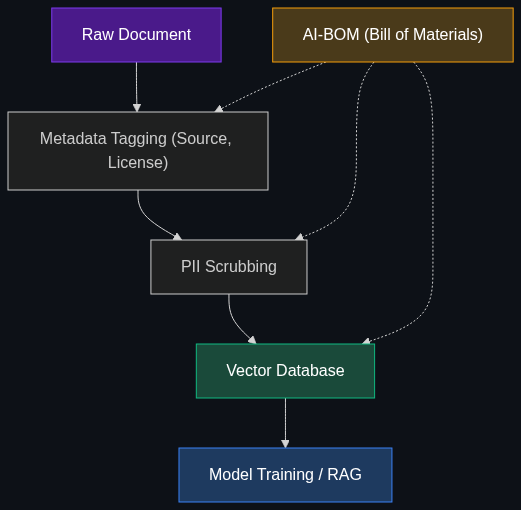

# 📜 Model Provenance (Data Lineage)

> **The exact tracking of where an AI model got its training data. Enterprises are demanding this to avoid massive copyright lawsuits and to ensure their AI isn't trained on protected or biased information.**

---

## Phase 1: Core Foundations & Pre-requisites

### Prerequisites
- **Fine-Tuning** — How models learn from datasets (see [Module 4](../../04_Training_and_Tweaking/01_Fine_Tuning.md)).
- **RAG** — How documents are injected into models (see [Module 2](../../02_Data_and_Context_The_Knowing_Layer/01_RAG.md)).

### Definition
**Model Provenance** (or Data Lineage) is the rigorous, auditable documentation of an AI model's training data. It answers three questions: 
1. Where did this data come from?
2. Do we have the legal right to use it?
3. How was it processed before it entered the neural network?

### The Problem It Solves

| Without Provenance | With Provenance |
|--------------------|-----------------|
| "We scraped the internet" | "We licensed datasets A, B, and C" |
| Generates copyrighted code (GitHub Copilot lawsuit) | Blocks generation of exact licensed code snippets |
| The New York Times sues for copyright infringement | Models only train on public domain or licensed news |
| Model exhibits extreme bias; root cause is unknown | Auditable dataset allows removal of the biased subset |

### The "Clean Room" Concept
Enterprises are increasingly moving toward "Clean Room" or "Commercially Safe" models. For example, **Adobe Firefly** (image generation) was trained *strictly* on Adobe Stock images, openly licensed content, and public domain content. Adobe guarantees its provenance so strictly that they offer financial indemnity to enterprise customers if they are sued for copyright infringement.

### 🧩 Mini-Quiz

> **Q1:** If a developer fine-tunes an open-source LLM on 10,000 PDF documents downloaded from the internet and deploys it internally, what is the enterprise risk?
> <details><summary>Answer</summary><b>Copyright Infringement.</b> The company does not own the intellectual property rights to those PDFs. If the model regurgitates copyrighted material during a business process, the company could face severe legal liability. The model lacks provenance.</details>

---

## Phase 2: Anatomy & Internal Mechanisms

### Tracking Data Lineage (The AI-BOM)



Similar to a Software Bill of Materials (SBOM) which lists every open-source package used in an app, an **AI-BOM (AI Bill of Materials)** tracks the data:

1. **Source Tracking:** `Doc_ID: 1042` came from `Internal_Confluence_HR_Space`.
2. **License Metadata:** Tagged as `Internal_Proprietary`.
3. **Preprocessing Log:** "Removed PII via regex filter on 2025-10-12."
4. **Model Mapping:** Document `1042` was included in the training run for `HR_Support_Bot_v2.1`.

If Document 1042 is later found to contain illegal information, the AI-BOM tells engineers exactly which models need to be deleted and retrained.

### 🃏 Flashcard

> **Front:** What does it mean for a dataset to be "contaminated"?
> <details><summary>Flip</summary><b>Data Contamination</b> happens when the evaluation/testing data accidentally leaks into the training dataset. If a model was trained on the answers to the bar exam, it will look like a legal genius during testing, but fail in the real world. Provenance tracking prevents contamination by strictly walling off train and test sets.</details>

---

## Phase 3: Advanced / Enterprise Patterns & Pitfalls

### Enterprise Patterns

| Requirement | Enterprise Solution |
|-------------|---------------------|
| **Copyright Safety** | Only fine-tune on internal corporate data or explicitly licensed commercial datasets. |
| **Right to be Forgotten** | (GDPR Compliance) If a user requests data deletion, enterprises must use "Machine Unlearning" or simply retrain the model from scratch using the AI-BOM to exclude that user's data. |
| **RAG over Fine-Tuning** | RAG is heavily preferred for enterprise data because provenance is perfect: you know exactly which document the AI cited in real-time, and you can delete the document instantly without retraining. |

### Anti-Patterns

- ❌ **Blindly downloading Hugging Face datasets** → Many open-source datasets (like 'The Pile' or 'BookCorpus') contain pirated books and copyrighted articles. Using them for commercial models is a massive legal risk.
- ❌ **Failing to scrub PII** → Training a model on raw customer service emails without anonymizing names and credit cards. The LLM *will* memorize them.
- ❌ **Losing the raw data** → Keeping the trained weights but deleting the training corpus. You can no longer audit the model for bias or copyright issues.

---

## Phase 4: Practical Implementation

### Implementing an AI-BOM Data Schema

When processing data for fine-tuning, every document should be wrapped in metadata for provenance tracking.

```json
// Example of a Provenance-tracked Training Record
{
  "doc_id": "hr_pol_001_v3",
  "source_system": "SharePoint_HR_Drive",
  "collection_date": "2025-10-15T08:30:00Z",
  "license_type": "internal_proprietary",
  "pii_scrubbed": true,
  "scrubber_version": "pii_masker_v2.1",
  "content": "Employees are entitled to 20 days of PTO...",
  "included_in_models": [
    "hr_assistant_llama3_v1",
    "onboarding_agent_v2"
  ]
}
```

*By storing this in a vector database or document store, compliance officers can instantly query: "Show me every model trained on documents from the deprecated SharePoint drive."*

---

## Phase 5: Interview Preparation

### Q1: "We are building an AI code assistant for our internal developers. How do you handle the training data?"
<details><summary><b>STAR Answer</b></summary>

**Situation:** The company needs an internal coding Copilot, but we cannot risk it generating copyrighted GPL code from the public internet.

**Task:** Design a training pipeline with strict model provenance.

**Action:**
1. **Dataset Curation:** Restricted the training data exclusively to the company's internal Git repositories. 
2. **Filtering Pipeline:** Built a pipeline that filtered out any repositories containing 3rd-party open-source code (to prevent license contamination).
3. **AI-BOM Creation:** Assigned a metadata tag to every code snippet indicating the author, repository, and commit hash.
4. **RAG Integration:** Instead of just fine-tuning, we used RAG so the model cites the exact internal repo and commit it used to generate the suggestion.

**Result:** Deployed a legally safe, highly accurate code assistant tailored specifically to the company's proprietary architecture, with zero risk of external copyright infringement.
</details>

---

## Phase 6: Summary Cheatsheet & Action Plan

### 📋 TL;DR

| Concept | Key Point |
|---------|-----------|
| **Model Provenance** | The auditable paper trail of an AI's training data. |
| **Legal Risk** | Training on copyrighted internet data opens the enterprise to lawsuits. |
| **Clean Room Models** | Models trained entirely on licensed/owned data (e.g., Adobe Firefly). |
| **AI-BOM** | A Bill of Materials tracking source, license, and preprocessing of data. |
| **RAG > Fine-tuning** | RAG is preferred in enterprise because document lineage is perfectly clear at runtime. |

### 🚀 Do These Now
1. **Check Hugging Face Licenses:** Go to huggingface.co/datasets, find a popular dataset, and look for its "License" tag (e.g., MIT, Apache 2.0, or Non-Commercial). 
2. **Review your RAG Pipeline:** Ensure your RAG database stores the `source_url` alongside the text, so the AI can always provide a citation.
