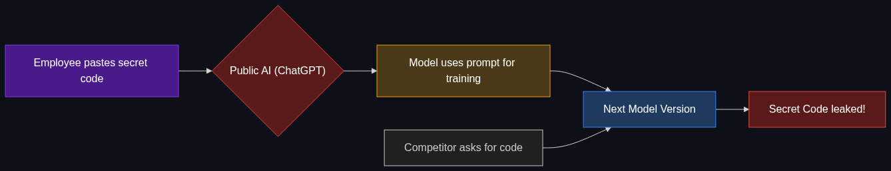

# 🕵️ Shadow AI

> **When employees secretly use unauthorized AI tools (like a public ChatGPT account) to do their company work, accidentally leaking sensitive corporate data or trade secrets in the process.**

---

## Phase 1: Core Foundations & Pre-requisites

### Prerequisites
- **LLM Data Policies** — How consumer AI tools use prompts for training data.
- **Enterprise Governance** — Understanding data classification (Confidential vs. Public data).

### Definition
**Shadow AI** (similar to "Shadow IT") occurs when employees use unsanctioned, unmanaged artificial intelligence applications to perform business tasks. Because these tools are outside the IT department's control, the company cannot enforce security policies, data retention rules, or compliance standards.

**The classic example:** An engineer is struggling with a bug in proprietary, secret source code. To save time, they paste the code into public ChatGPT and ask "Find the bug." ChatGPT finds it, but now that proprietary code lives on OpenAI's servers and may be used to train future models.

### The Problem It Solves

*Shadow AI is the problem, not the solution. Solving it requires Enterprise AI.*

| Public/Consumer AI (Shadow AI) | Enterprise AI (Sanctioned) |
|--------------------------------|----------------------------|
| Prompts are used to train future models | Zero data retention policies (inputs are discarded) |
| No audit logs of who asked what | Centralized IT logging and compliance auditing |
| Employees use personal accounts | SSO (Single Sign-On) integration |
| Runs on public infrastructure | Runs in a private cloud VPC or on-premise |

### Trade-off Table

| Dimension | Ignoring Shadow AI | Banning All AI | Enterprise AI Portal |
|-----------|--------------------|----------------|----------------------|
| **Security** | 🔴 Massive data leak risk | ✅ High | ✅ High |
| **Productivity** | ✅ High | 🔴 Low (Competitors win) | ✅ High |
| **Cost** | 🟢 Free (to the company) | 🟢 Free | 💰 Requires licensing/API costs |
| **Employee Morale** | 🟢 Happy | 🔴 Frustrated | 🟢 Happy |

### 🧩 Mini-Quiz

> **Q1:** If a company explicitly bans ChatGPT on the corporate network, does that solve the Shadow AI problem?
> <details><summary>Answer</summary>No. Employees will simply use their personal smartphones off the corporate Wi-Fi to access the tools, making the problem harder to track. The only effective way to stop Shadow AI is to provide a secure, sanctioned alternative that is just as good and easier to access.</details>

---

## Phase 2: Anatomy & Internal Mechanisms

### How Shadow AI Data Leaks Occur



1. **The Copy-Paste:** Employee copies an internal Q3 Earnings draft before it is publicly released.
2. **The Prompt:** They paste it into a consumer AI: "Summarize this for a PowerPoint."
3. **The Server:** The consumer AI stores the prompt in its training log.
4. **The Training Run:** 6 months later, the consumer AI uses those logs to train its next model.
5. **The Leak:** A competitor prompts the new model: "What are company X's internal Q3 margins?" and the model regurgitates the drafted text.

### The "Zero Data Retention" Clause
To defeat Shadow AI, enterprises negotiate API contracts with providers (like Microsoft Azure OpenAI or AWS Bedrock). These contracts include a strict legal clause: **"Customer inputs and outputs will not be used to train foundational models."** This is the crucial distinction between consumer AI and Enterprise AI.

### 🃏 Flashcard

> **Front:** Why did Samsung ban ChatGPT for its engineers in 2023?
> <details><summary>Flip</summary>Engineers accidentally leaked highly sensitive, proprietary source code and internal meeting notes by pasting them into ChatGPT to check for errors and summarize meetings. Because it was consumer ChatGPT, that data entered OpenAI's servers, causing a massive Shadow AI security breach.</details>

---

## Phase 3: Advanced / Enterprise Patterns & Pitfalls

### Enterprise Mitigation Patterns

| Strategy | Implementation |
|----------|----------------|
| **The "CompanyGPT" Portal** | IT builds an internal web app that looks exactly like ChatGPT, but it connects via a secure Enterprise API. Employees use this instead of public tools. |
| **DLP (Data Loss Prevention)** | Install endpoint software on employee laptops that detects and blocks the pasting of source code or SSNs into known AI web domains. |
| **AI Allow-listing** | Block all unverified AI domains on the corporate firewall, while allowing traffic only to the sanctioned `internal-ai.company.com`. |

### Anti-Patterns

- ❌ **The Draconian Ban** → Telling employees "No AI allowed." They will just do it on their phones, taking the risk entirely out of IT's visibility.
- ❌ **Trusting Free Tools** → If an AI tool is free, *your data is the product*. Never put corporate data into a free tier of an AI service.
- ❌ **Assuming API = Secure** → Not all APIs have zero-data-retention by default. You must explicitly opt-out or sign enterprise agreements.

---

## Phase 4: Practical Implementation

### Building a Secure Enterprise AI Gateway (Python Concept)

To stop Shadow AI, provide a secure gateway. This Python script demonstrates an internal proxy that intercepts employee prompts, logs them for auditing, checks for PII, and routes them to a secure Enterprise API.

```python
import re
from enterprise_logging_system import audit_log
from secure_api_client import azure_openai_client # Simulated secure client

def secure_ai_gateway(employee_id: str, prompt: str) -> str:
    # 1. Audit Logging (Compliance requirement)
    audit_log(employee_id=employee_id, action="AI_PROMPT_SUBMITTED")
    
    # 2. DLP: Check for Social Security Numbers (Basic Input Rail)
    if re.search(r"\b\d{3}-\d{2}-\d{4}\b", prompt):
        return "ERROR: Policy violation. PII (SSN) detected in prompt. Request blocked."
        
    # 3. Route to SECURE API (Zero Data Retention contract)
    # This ensures the data is NOT used to train future models.
    try:
        response = azure_openai_client.generate(prompt)
        return response
    except Exception as e:
        return "Enterprise AI Gateway is temporarily unavailable."

# Example Usage
print(secure_ai_gateway("emp_007", "Write a python script for sorting."))
```

---

## Phase 5: Interview Preparation

### Q1: "How would you address the security risk of employees using AI at work?"
<details><summary><b>STAR Answer</b></summary>

**Situation:** Security audits showed 40% of employees were using unauthorized, public AI tools for tasks like drafting emails and writing code, creating a massive data leak risk (Shadow AI).

**Task:** Secure corporate IP without crippling employee productivity.

**Action:**
1. **Assessment:** Identified the top use cases (writing, coding, summarization).
2. **Build vs Buy:** Partnered with Microsoft Azure to deploy an Enterprise OpenAI instance with a strict zero-data-retention agreement.
3. **Deployment:** Built a simple, branded "InternalGPT" chat interface connected to the secure API and integrated it with Okta for SSO.
4. **Enforcement:** Updated the corporate firewall to block public consumer AI tools and launched a company-wide training session redirecting users to the secure internal tool.

**Result:** Shadow AI usage dropped to near zero. Employee productivity remained high, and IT gained full audit visibility over AI usage while legally protecting corporate IP.
</details>

---

## Phase 6: Summary Cheatsheet & Action Plan

### 📋 TL;DR

| Concept | Key Point |
|---------|-----------|
| **Shadow AI** | Unauthorized use of consumer AI tools for business tasks. |
| **The Risk** | Public AIs use prompts for training; pasting IP leaks it to the world. |
| **The Solution** | Provide a sanctioned Enterprise AI portal with secure APIs. |
| **Zero Data Retention** | The enterprise contract clause stating your data won't train their models. |

### 🚀 Do These Now
1. **Check your own habits:** Are you putting your company's code or internal documents into a free LLM interface? Stop. 
2. **Review API terms:** Go look at the OpenAI or Anthropic API terms of service. Note the specific section where they explicitly state that *API* data (unlike web chat data) is not used for training models by default.
