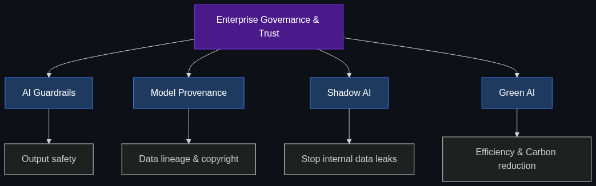

# 🛡️ Enterprise Governance & Trust (The "Suits & Ties" Layer)

> **As companies move from playing with AI to actually relying on it, these terms dictate how they manage risk, legal liability, and corporate security.**

This module covers the core components necessary to safely deploy AI in a corporate environment without risking IP leaks, massive lawsuits, or PR disasters.

---

## 📚 Topics Covered

| # | Topic | File | Core Idea |
|---|-------|------|-----------|
| 1 | [AI Guardrails](01_AI_Guardrails.md) | `01_AI_Guardrails.md` | Safety protocols to keep outputs within company policy |
| 2 | [Model Provenance](02_Model_Provenance.md) | `02_Model_Provenance.md` | Data lineage and avoiding copyright lawsuits |
| 3 | [Shadow AI](03_Shadow_AI.md) | `03_Shadow_AI.md` | The risk of employees leaking data via public AI |
| 4 | [Green AI](04_Green_AI.md) | `04_Green_AI.md` | Reducing the massive carbon footprint of AI models |

---

## 🗺️ How These Topics Connect

---

## 🎯 Learning Path

1. **Start** with [AI Guardrails](01_AI_Guardrails.md) to learn how to control model outputs.
2. **Move to** [Model Provenance](02_Model_Provenance.md) to understand the legal risks of training data.
3. **Explore** [Shadow AI](03_Shadow_AI.md) to understand internal corporate security risks.
4. **Finish with** [Green AI](04_Green_AI.md) to see how enterprises are managing the physical costs of AI.

---

*Each topic file follows the [Educator Skill](../../.github/Educator_skill.md) 6-phase teaching methodology: Foundations → Anatomy → Enterprise Patterns → Implementation → Interview Prep → Cheatsheet.*
