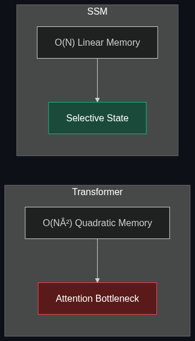

# 🐍 SSMs (State Space Models) / Mamba

> **A rising alternative architecture to Transformers. They are incredibly efficient at processing extremely long documents or sequences of data without the massive memory bottleneck that traditional LLMs face.**

---

## Phase 1: Core Foundations & Pre-requisites

### Prerequisites
- **Transformers** — Understanding self-attention and its quadratic scaling issue.
- **Context Window** — The amount of text a model can hold in memory.

### Definition
**State Space Models (SSMs)**, with **Mamba** being the most famous variant, are a class of neural network architectures designed for sequential data. Unlike Transformers, which look at the entire history of a document all at once (causing massive memory spikes), SSMs compress the history into a "hidden state." 

### The Problem It Solves

| Transformer (The Flaw) | SSM / Mamba (The Fix) |
|------------------------|-----------------------|
| $O(N^2)$ memory scaling: Doubling the context quadruples the memory required. | $O(N)$ memory scaling: Memory grows linearly with sequence length. |
| Slow generation: Re-calculates attention for every new word generated. | Fast generation: Simply updates the hidden state for each new word. |
| Hard limit on context window (e.g., 128k tokens). | Theoretically infinite context window. |

### 🧩 Mini-Quiz

> **Q1:** If SSMs are so efficient, why did Transformers dominate the AI boom?
> <details><summary>Answer</summary>Historically, RNNs and early SSMs could not be trained efficiently in parallel on GPUs, meaning they took too long to train. Transformers could be trained in parallel, allowing massive scale. Mamba solved this by making SSMs hardware-aware, allowing them to train just as fast as Transformers on modern GPUs while keeping linear scaling during inference.</details>

---

## Phase 2: Anatomy & Internal Mechanisms

### The Architecture Comparison



**How Mamba Works (Simplified):**
1. **Continuous to Discrete:** It takes continuous math (differential equations) and discretizes them so a computer can process them step-by-step.
2. **Selective State:** The major breakthrough of Mamba. Older models tried to remember *everything*, which diluted the memory. Mamba's parameters are *input-dependent*; it actively decides whether to remember or forget the current token based on its importance.
3. **Hardware-Aware (FlashAttention):** Mamba is written to keep data in the GPU's ultra-fast SRAM rather than moving it back and forth to slower HBM memory, making it incredibly fast.

### 🃏 Flashcard

> **Front:** What is the "Selective State" mechanism in Mamba?
> <details><summary>Flip</summary>It is Mamba's ability to selectively filter information. Instead of compressing every single word equally into its hidden state, Mamba dynamically decides which tokens are important to remember (like a name or fact) and which to ignore (like filler words), solving the "forgetting" problem of older RNNs.</details>

---

## Phase 3: Advanced / Enterprise Patterns & Pitfalls

### Enterprise Use Cases

| Industry | Mamba Application |
|----------|-------------------|
| **Genomics** | DNA is a continuous sequence of millions of base pairs. Mamba processes the entire genome without running out of VRAM. |
| **Finance** | Processing 10 years of continuous stock ticker data to find macro trends. |
| **Software Dev** | Dropping an entire multi-million line codebase into the context window for whole-repo refactoring. |

### Anti-Patterns

- ❌ **Replacing all LLMs with Mamba immediately** → Transformers still slightly outperform SSMs on highly complex, non-sequential reasoning tasks (like zero-shot math or logic puzzles). 
- ❌ **Using Mamba for short prompts** → If your inputs are only 100 tokens long, the memory benefits of Mamba are negligible. Use standard LLMs.

---

## Phase 4: Practical Implementation

### Using a Mamba Model (Python)

*Mamba models are fully integrated into Hugging Face, meaning you can test them exactly like traditional Transformers.*

```python
# pip install transformers mamba-ssm causal-conv1d
from transformers import AutoTokenizer, AutoModelForCausalLM

model_id = "state-spaces/mamba-130m-hf"

# Load the tokenizer and model
tokenizer = AutoTokenizer.from_pretrained(model_id)
model = AutoModelForCausalLM.from_pretrained(model_id)

# Notice how we can pass in a very long context without OOM (Out Of Memory) errors
long_text = "The quick brown fox jumps over the lazy dog. " * 500 
prompt = f"{long_text}\nQuestion: What animal jumped over the dog? Answer:"

inputs = tokenizer(prompt, return_tensors="pt")

# Generation is incredibly fast because it's O(N) inference
outputs = model.generate(**inputs, max_new_tokens=10)
print(tokenizer.batch_decode(outputs, skip_special_tokens=True)[0])
```

---

## Phase 5: Interview Preparation

### Q1: "Explain why Mamba is considered a potential successor to the Transformer."
<details><summary><b>STAR Answer</b></summary>

**Situation:** The industry relies on Transformers, but self-attention has a quadratic memory bottleneck ($O(N^2)$), making massive context windows economically unviable.

**Task:** Find an architecture that scales linearly while maintaining high performance.

**Action:** Mamba achieves this by reviving the State Space Model (SSM). It uses a "Selective State" to dynamically remember or forget information as it reads, compressing the sequence into a fixed-size hidden state. Furthermore, it is optimized at the hardware level to run entirely in GPU SRAM.

**Result:** Mamba achieves $O(N)$ linear scaling for memory and inference speed, allowing it to process millions of tokens (like whole genomes or codebases) efficiently, matching or beating Transformer accuracy at those scales.
</details>

---

## Phase 6: Summary Cheatsheet & Action Plan

### 📋 TL;DR

| Concept | Key Point |
|---------|-----------|
| **SSM** | State Space Model; processes data as a continuous flow. |
| **Mamba** | A hardware-optimized SSM with selective memory. |
| **The Big Win** | Linear scaling ($O(N)$) vs Transformer's quadratic scaling ($O(N^2)$). |
| **Best For** | Infinite context tasks: Genomes, full codebases, long audio. |

### 🚀 Do These Now
1. **Read the Mamba Paper:** Look up "Mamba: Linear-Time Sequence Modeling with Selective State Spaces" by Albert Gu and Tri Dao (2023) to see the benchmark charts comparing it to Transformers.
