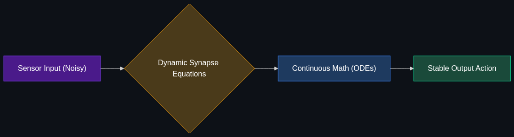

# 💧 Liquid Neural Networks (LNNs)

> **A highly adaptable type of neural network that can change its underlying equations after it's been trained, allowing it to adapt to new situations on the fly. Heavily trending in robotics and autonomous vehicles.**

---

## Phase 1: Core Foundations & Pre-requisites

### Prerequisites
- **Neural Networks** — Weights, biases, and training phases.
- **Differential Equations** — Basic concept of continuous change over time.

### Definition
**Liquid Neural Networks (LNNs)** are a class of continuous-time recurrent neural networks. Unlike standard neural networks where the weights (the "brain connections") are frozen solid after the training phase, an LNN's weights are "liquid"—meaning the equations governing the network can continuously adapt to new data inputs *during inference* (in real-time).

### The Problem It Solves

| Standard Neural Network | Liquid Neural Network |
|-------------------------|-----------------------|
| **Frozen Weights:** Once deployed, it only knows what it was trained on. | **Fluid Weights:** Adapts its equations dynamically to new environments. |
| **Brittle to Noise:** If a drone camera gets muddy, the NN fails completely. | **Robust to Noise:** The network adjusts its internal state to handle the obscured data. |
| **Massive Size:** Needs millions of parameters to account for every possible scenario. | **Tiny Size:** Needs only thousands of parameters because it adapts on the fly. |

### 🧩 Mini-Quiz

> **Q1:** If a self-driving car encounters a massive, unprecedented snowstorm, which architecture is more likely to safely navigate it: a standard Deep Neural Network or an LNN?
> <details><summary>Answer</summary><b>An LNN.</b> A standard DNN will fail because "heavy snow" wasn't in its training data (out-of-distribution). An LNN will continuously adjust its internal equations based on the continuous incoming sensor data, adapting to the visual noise and maintaining stable control.</details>

---

## Phase 2: Anatomy & Internal Mechanisms

### How LNNs Work



1. **Biological Inspiration:** LNNs were inspired by the brain of the *C. elegans* roundworm, which has only 302 neurons but can navigate complex, changing environments.
2. **Ordinary Differential Equations (ODEs):** Instead of calculating inputs through static matrix multiplication ($y = Wx+b$), LNNs use ODEs to compute how the state of a neuron changes continuously over time.
3. **Dynamic Synapses:** The "weight" between two neurons isn't a fixed number; it's an equation dependent on the current input. If the input data gets noisy or weird, the synapse strength changes dynamically to compensate.

### The "Tiny but Mighty" Advantage
Researchers at MIT (where LNNs were invented) trained an LNN to autonomously fly a drone through a forest. 
- A standard neural network required **tens of thousands** of parameters and struggled with different lighting.
- The LNN required only **19 neurons and 253 parameters** and successfully navigated rain, snow, and dense forests it had never seen before.

### 🃏 Flashcard

> **Front:** Can an LNN learn new facts (like the capital of France) after deployment?
> <details><summary>Flip</summary><b>No.</b> LNNs adapt to <i>continuous time-series data</i> (like sensor readings or video feeds) to maintain stable control in noisy environments. They do not "learn new facts" in the sense of storing new knowledge in a database. They are control systems, not knowledge bases.</details>

---

## Phase 3: Advanced / Enterprise Patterns & Pitfalls

### Enterprise Use Cases

| Industry | LNN Application |
|----------|-----------------|
| **Autonomous Vehicles** | Drones and cars navigating unmapped terrain and severe, out-of-distribution weather. |
| **High-Frequency Trading** | Adapting to sudden, unprecedented market volatility or "flash crashes" where historical training data is useless. |
| **Medical Devices** | Pacemakers or continuous glucose monitors adapting to sudden, unique changes in a specific patient's biology. |

### Anti-Patterns

- ❌ **Using LNNs for Text Generation** → LNNs excel at continuous time-series data and control systems. They are currently not suited for generating text or replacing LLMs like GPT-4.
- ❌ **Static environments** → If a task is completely predictable (e.g., sorting perfectly lit apples on a factory line), a standard CNN is cheaper and easier to deploy. LNNs are for *unpredictable* environments.

---

## Phase 4: Practical Implementation

### Conceptualizing LNN Math

*Building LNNs typically relies on specialized research libraries like `ncps` (Neural Circuit Policies) developed by the MIT team.*

```python
# pip install ncps
from ncps.torch import LTC  # Liquid Time-Constant
import torch
import torch.nn as nn

# 1. Define the Liquid Network
# Note how incredibly small this is: 20 neurons.
liquid_layer = LTC(
    input_size=5,     # E.g., 5 drone sensors (alt, speed, pitch, yaw, roll)
    units=20,         # Only 20 "liquid" neurons
    return_sequences=True
)

# 2. Build the model
model = nn.Sequential(
    liquid_layer,
    nn.Linear(20, 2)  # Output: 2 control levers (e.g., throttle, steering)
)

# 3. Simulated continuous time-series input
# [batch_size, time_steps, features]
continuous_sensor_data = torch.randn(32, 100, 5) 

# 4. Inference: The network adapts its weights across the 100 time_steps dynamically
control_outputs, hidden_states = model(continuous_sensor_data)
print(f"Output shape: {control_outputs.shape}")
```

---

## Phase 5: Interview Preparation

### Q1: "Why would an aerospace company prefer an LNN over a massive Deep Neural Network for flight control?"
<details><summary><b>STAR Answer</b></summary>

**Situation:** Drones often crash when encountering environments completely absent from their training data (e.g., severe localized weather).

**Task:** Design a flight control system that handles "out-of-distribution" scenarios.

**Action:** Implemented a Liquid Neural Network (LNN). Because LNN weights are continuous differential equations rather than static numbers, the network adapts its synapses in real-time to the new, noisy sensor data. Furthermore, because LNNs require drastically fewer parameters (hundreds instead of millions), the entire model can be mathematically analyzed for safety compliance.

**Result:** The drone successfully navigated severe weather it was never explicitly trained on, and the tiny parameter count allowed the aerospace engineers to achieve deterministic safety certifications impossible with massive black-box DNNs.
</details>

---

## Phase 6: Summary Cheatsheet & Action Plan

### 📋 TL;DR

| Concept | Key Point |
|---------|-----------|
| **LNN** | Liquid Neural Network; equations adapt *during* inference. |
| **Size** | Tiny parameter counts (hundreds of neurons, not billions). |
| **Robustness** | Excels at handling unexpected noise and out-of-distribution data. |
| **Best For** | Time-series data, robotics, drones, medical monitoring. |

### 🚀 Do These Now
1. **Watch the MIT Demo:** Search YouTube for "MIT Liquid Neural Networks Drone" to see how a 19-neuron brain pilots a drone through an unknown forest.
2. **Review the `ncps` repo:** Look at the `ncps` GitHub repository (Neural Circuit Policies) to see how LNNs are integrated with PyTorch.
