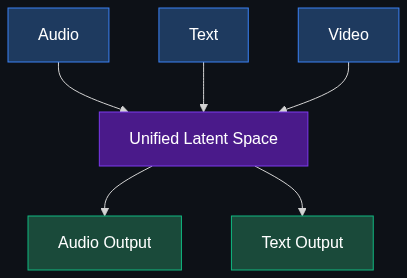

# 👁️ Multimodal AI

> **Models designed from the ground up to natively process and output text, audio, images, and video simultaneously, rather than cobbling different models together.**

---

## Phase 1: Core Foundations & Pre-requisites

### Prerequisites
- **LLMs vs VLMs** — Text vs Vision processing.
- **Embeddings** — How data is converted into vectors.

### Definition
**Native Multimodal AI** refers to a single neural network architecture that is trained jointly on multiple types of data (modalities)—such as text, audio, images, and video—at the exact same time. It inherently understands the relationship between a spoken word, a written word, and a picture of that word.

### The Problem It Solves

**The Old Way: "Cobbled Together" (Pipelined) Models**
To build a voice assistant, companies used to stitch three models together:
1. **ASR (Automatic Speech Recognition):** Converts User Audio → Text.
2. **LLM:** Processes Text → Generates Text Answer.
3. **TTS (Text-to-Speech):** Converts Text Answer → AI Audio.

**The Flaw:** When audio is converted to text, *all emotion, tone, breathing, and background noise is lost*. Furthermore, passing data through three separate models causes severe latency (lag).

**The New Way: Native Multimodal**
Audio in → Neural Network → Audio out. The model hears the sarcasm in your voice, sees the dog in your camera feed, and responds with a sympathetic tone in under 300 milliseconds.

### Trade-off Table

| Dimension | Pipelined (Stitched) | Native Multimodal |
|-----------|----------------------|-------------------|
| **Latency** | 🔴 Slow (1-4 seconds) | ✅ Very Fast (~300ms) |
| **Nuance** | ❌ Loses tone/emotion | ✅ Hears sighs, sarcasm, background noise |
| **Interruption** | ❌ Cannot handle mid-sentence interruptions well | ✅ Reacts instantly to interruptions |
| **Training Cost** | 🟢 Cheaper (train separately) | 🔴 Extremely expensive |

### 🧩 Mini-Quiz

> **Q1:** If you show an AI a video of a leaky pipe and ask "How do I fix this?", how does a native multimodal model process it differently than an older VLM?
> <details><summary>Answer</summary>An older VLM might take a screenshot every 5 seconds, convert the images to text captions, and feed them to an LLM. A Native Multimodal model processes the video frames and the audio of the water dripping directly into the same latent space as your text prompt, understanding the flow of time and sound without converting anything to text first.</details>

---

## Phase 2: Anatomy & Internal Mechanisms

### The Multimodal Latent Space



The magic of native multimodal models (like GPT-4o or Gemini 1.5 Pro) lies in the **Unified Embedding Space**. 
During training, the model is taught that:
- The word "Dog"
- A picture of a Golden Retriever
- The audio file of a bark

...all point to the exact same mathematical location in its brain (the latent space). Because it represents all data types universally, it can seamlessly cross-translate. It doesn't translate Audio → Text → Response. It translates Audio → Unified Concept → Audio Response.

### Tokenizing the World
To make this work with Transformer architectures, everything must become a "token."
- **Text:** Word fragments = tokens.
- **Images:** Image patches (16x16 pixels) = visual tokens.
- **Audio:** Soundwave spectograms = audio tokens.
All these tokens are fed into the same Transformer blocks simultaneously.

### 🃏 Flashcard

> **Front:** What does the "o" in GPT-4o stand for, and why is it significant?
> <details><summary>Flip</summary>The "o" stands for <b>Omni</b>, indicating it is an omni-modal (native multimodal) model. Unlike previous versions where ChatGPT used separate whisper (speech-to-text) and TTS models, GPT-4o processes text, audio, and images natively within a single neural network, enabling real-time, emotive, zero-latency conversation.</details>

---

## Phase 3: Advanced / Enterprise Patterns & Pitfalls

### Enterprise Use Cases

| Industry | Multimodal Application |
|----------|------------------------|
| **Customer Service** | Real-time, voice-to-voice agents that detect customer frustration via tone of voice and de-escalate instantly. |
| **Healthcare** | Reading a patient's X-ray while simultaneously listening to the doctor dictate clinical notes to catch discrepancies. |
| **Manufacturing** | An AI analyzing real-time CCTV video and factory machine audio to predict a mechanical failure before it happens. |

### Anti-Patterns

- ❌ **Using Multimodal for everything** → If you are just extracting text from an invoice, using a massive multimodal model is overkill and wildly expensive. Use a cheaper OCR tool + text LLM.
- ❌ **Ignoring Privacy** → Native multimodal models process *everything*. If it's listening to a meeting, it's also hearing the background conversations and side-whispers. Enterprises must strictly govern what audio/video is fed into the system.

---

## Phase 4: Practical Implementation

### Using Multimodal APIs (Python with OpenAI)

```python
from openai import OpenAI
import base64

client = OpenAI()

# 1. Helper function to encode an image to Base64
def encode_image(image_path):
    with open(image_path, "rb") as image_file:
        return base64.b64encode(image_file.read()).decode('utf-8')

base64_image = encode_image("factory_floor.jpg")

# 2. Multimodal API Call (Text + Image simultaneously)
response = client.chat.completions.create(
  model="gpt-4o", # Omni model
  messages=[
    {
      "role": "user",
      "content": [
        {"type": "text", "text": "Are there any OSHA safety violations in this image? Be specific."},
        {
          "type": "image_url",
          "image_url": {
            "url": f"data:image/jpeg;base64,{base64_image}"
          }
        }
      ]
    }
  ]
)

print(response.choices[0].message.content)
# Output: "Yes. The worker in the background is operating the forklift without a hard hat, and the spill in aisle 3 lacks a wet floor sign."
```

---

## Phase 5: Interview Preparation

### Q1: "Our call center AI is too slow and sounds robotic. How would you redesign the architecture?"
<details><summary><b>STAR Answer</b></summary>

**Situation:** The current AI uses a stitched pipeline: Speech-to-Text → LLM → Text-to-Speech, resulting in 3-second delays and a failure to understand angry customers.

**Task:** Reduce latency to human-conversation levels (<500ms) and improve empathy.

**Action:**
1. **Architectural Shift:** Replaced the three-model pipeline with a single Native Multimodal model (e.g., GPT-4o Realtime API or Gemini Multimodal).
2. **Audio-in/Audio-out:** Streamed raw audio directly into the model via WebSockets and streamed the raw audio response back.
3. **Prompting for Tone:** Instructed the model in the system prompt to adjust its vocal tone based on the emotional cues present in the user's audio tokens.

**Result:** Reduced latency to 300ms, enabling seamless interruptions. Customer satisfaction scores rose by 40% because the AI could literally "hear" and react to frustration in real-time.
</details>

---

## Phase 6: Summary Cheatsheet & Action Plan

### 📋 TL;DR

| Concept | Key Point |
|---------|-----------|
| **Multimodal** | One neural network trained jointly on text, audio, and vision. |
| **The Old Way** | Pipelined models (slow, loses emotion and context). |
| **The New Way** | Native processing (sub-second latency, understands vocal tone). |
| **Latent Space** | Images, text, and audio all converted into unified tokens. |

### 🚀 Do These Now
1. **Test Voice Mode:** Open the ChatGPT app on your phone, click the headphones icon, and interrupt the AI mid-sentence. Notice how fast it stops and recalculates. That is Native Multimodal speed.
2. **Review API Docs:** Look at the OpenAI "Realtime API" documentation to see how WebSockets are used to stream audio in and out of the model continuously.
