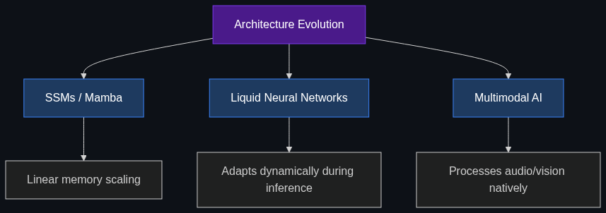

# 🏗️ Architecture Evolution (Beyond the Basic LLM)

> **Transformers have dominated the AI landscape, but new architectures are trending in the industry to solve their inefficiencies.**

This module explores the cutting-edge models designed to address the scaling, memory, and adaptability limits of traditional Large Language Models.

---

## 📚 Topics Covered

| # | Topic | File | Core Idea |
|---|-------|------|-----------|
| 1 | [SSMs / Mamba](01_SSMs_and_Mamba.md) | `01_SSMs_and_Mamba.md` | Linear scaling for massive context windows |
| 2 | [Liquid Neural Networks](02_Liquid_Neural_Networks.md) | `02_Liquid_Neural_Networks.md` | Adaptive networks for robotics and real-time changing environments |
| 3 | [Multimodal AI](03_Multimodal_AI.md) | `03_Multimodal_AI.md` | Native processing of audio, vision, and text simultaneously |

---

## 🗺️ How These Topics Connect

---

## 🎯 Learning Path

1. **Start** with [SSMs / Mamba](01_SSMs_and_Mamba.md) to understand the alternative to the Transformer's memory bottleneck.
2. **Move to** [Liquid Neural Networks](02_Liquid_Neural_Networks.md) to see how models adapt *after* training.
3. **Finish with** [Multimodal AI](03_Multimodal_AI.md) to understand how models see and hear the world natively.

---

*Each topic file follows the [Educator Skill](../../.github/Educator_skill.md) 6-phase teaching methodology: Foundations → Anatomy → Enterprise Patterns → Implementation → Interview Prep → Cheatsheet.*
