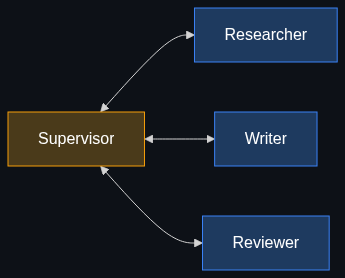

# 🎼 Multi-Agent Orchestration

> **Moving away from a single "do-it-all" AI. This is the enterprise architecture where a "Conductor" AI manages a team of specialized "Worker" AI agents.**

---

## Phase 1: Core Foundations & Pre-requisites

### Prerequisites
- **Agents** — What an autonomous agent is (see [Module 1](../../01_Agents_and_Action_The_Doing_Layer/01_Agents_Autonomous_Agents.md)).
- **Prompting** — System prompts and role-playing.

### Definition
**Multi-Agent Orchestration** is a system architecture where a complex task is broken down and distributed across multiple specialized AI models (agents), rather than asking one single LLM to do everything. A central "Orchestrator" (or Supervisor) agent acts as a manager—planning the workflow, assigning tasks to the worker agents, and reviewing their outputs.

### The Problem It Solves

| Single Prompt ("God Prompt") | Multi-Agent Orchestration |
|------------------------------|---------------------------|
| "Research this topic, draft a blog post, check for compliance, and publish it." | Supervisor breaks task into 4 distinct phases. |
| The LLM gets confused, hallucinates, or skips steps entirely. | Each agent has *one* strict job and *one* specific prompt. |
| Impossible to debug where it failed. | Traceable pipeline: "The draft was good, but the compliance agent failed." |
| Every step uses the most expensive model (GPT-4o). | Research uses a cheap model; Writing uses a creative model; Compliance uses a strict logic model. |

### 🧩 Mini-Quiz

> **Q1:** Why is it cheaper to run a multi-agent system than a single "do-it-all" AI for a complex task?
> <details><summary>Answer</summary>Model routing. You don't need a massive, expensive $20/million-token model to do basic data extraction or grammar checking. In orchestration, the Supervisor can route simple tasks to cheap, fast SLMs (Small Language Models), and only call the expensive, heavy models for the complex reasoning phases.</details>

---

## Phase 2: Anatomy & Internal Mechanisms

### The Orchestration Flow



1. **State:** The central data object (like a shared dictionary) that all agents read from and write to.
2. **Supervisor Agent:** Receives the user request. Reads the State. Decides which Worker to call next based on the workflow graph.
3. **Worker Agents:** 
   - *Researcher:* Tool access to the Web.
   - *Writer:* Prompted for specific tone/style.
   - *Compliance:* Prompted with strict legal guidelines.
4. **Handoff:** The Worker completes its task, updates the State, and hands control back to the Supervisor.

### Frameworks

| Framework | Approach | Best For |
|-----------|----------|----------|
| **LangGraph** | Graph-based state machines. Highly controllable, cyclic workflows. | **Production Enterprise apps.** |
| **CrewAI** | Role-playing agents ("You are a senior analyst..."). Sequential workflows. | **Rapid prototyping and simple workflows.** |
| **AutoGen (Microsoft)** | Conversational agents. Agents literally talk to each other in a chat loop to solve problems. | **Code generation and complex problem solving.** |

### 🃏 Flashcard

> **Front:** What is "State" in the context of LangGraph and Orchestration?
> <details><summary>Flip</summary>State is the shared memory or context object that is passed between agents. It holds the original user request, the history of what agents have done so far, and the drafts/outputs produced. The Orchestrator looks at the State to decide if the overall task is complete or if another agent needs to be called.</details>

---

## Phase 3: Advanced / Enterprise Patterns & Pitfalls

### Enterprise Patterns

| Pattern | Description |
|---------|-------------|
| **Routing / Triage** | An initial Orchestrator agent acts like a receptionist. It looks at an incoming support ticket and routes it to either the `BillingAgent`, `TechSupportAgent`, or `HumanAgent`. |
| **Evaluator-Optimizer Loop** | The `WriterAgent` generates code. The `TesterAgent` tries to run the code. If it fails, the `Tester` passes the error logs back to the `Writer` to try again. This loops until the tests pass. |
| **Human-in-the-Loop (HITL)** | The graph halts before a destructive action (like sending an email or deleting a file) and requires a human to click "Approve" in the UI to update the State. |

### Anti-Patterns

- ❌ **Infinite Loops** → A Writer and an Editor debating a comma forever. Always hardcode a `max_steps` limit into the orchestration graph to force it to stop.
- ❌ **Making agents too broad** → Creating an agent called "MarketingBot". It should be broken down into "HeadlineGenerator", "SEOSpecialist", and "ImagePrompter".
- ❌ **Over-engineering** → Building a 5-agent LangGraph system to summarize a short text. Use traditional, single-shot LLM calls for simple tasks.

---

## Phase 4: Practical Implementation

### Conceptualizing a LangGraph Workflow (Python)

*LangGraph treats multi-agent systems as a mathematical Graph (Nodes and Edges).*

```python
# Pseudo-code representation of LangGraph concepts
from langgraph.graph import StateGraph, END

# 1. Define the State (The shared memory)
class WorkflowState(TypedDict):
    request: str
    research_notes: str
    draft: str
    feedback: str

# 2. Define the Nodes (The Agents)
def researcher_node(state):
    # LLM call with web search tools
    notes = run_research(state["request"])
    return {"research_notes": notes}

def writer_node(state):
    # LLM call instructed to write based on notes
    draft = write_draft(state["research_notes"], state["feedback"])
    return {"draft": draft}

def reviewer_node(state):
    # Strict LLM call to check compliance
    feedback = check_compliance(state["draft"])
    return {"feedback": feedback}

# 3. Define the Routing Logic (The Edges)
def should_continue(state):
    # If the reviewer says "APPROVED", end the graph.
    # Otherwise, loop back to the writer.
    if "APPROVED" in state["feedback"]:
        return "end"
    return "rewrite"

# 4. Build the Graph
workflow = StateGraph(WorkflowState)

workflow.add_node("Researcher", researcher_node)
workflow.add_node("Writer", writer_node)
workflow.add_node("Reviewer", reviewer_node)

# Set the flow
workflow.set_entry_point("Researcher")
workflow.add_edge("Researcher", "Writer")
workflow.add_edge("Writer", "Reviewer")

# Conditional loop based on the Reviewer's feedback
workflow.add_conditional_edges(
    "Reviewer",
    should_continue,
    {
        "rewrite": "Writer", # Loop back
        "end": END           # Finish
    }
)

app = workflow.compile()
```

---

## Phase 5: Interview Preparation

### Q1: "We have an LLM writing compliance reports, but it keeps hallucinating citations. How would you fix the architecture?"
<details><summary><b>STAR Answer</b></summary>

**Situation:** A single LLM prompt was tasked with analyzing raw data, writing a highly technical compliance report, and ensuring all citations were accurate. It was failing and hallucinating.

**Task:** Redesign the system to guarantee citation accuracy.

**Action:**
1. **Separation of Concerns:** Split the process into a Multi-Agent architecture using LangGraph.
2. **Specialized Agents:** 
   - Agent 1 (Drafter) focuses purely on writing the narrative from the raw data.
   - Agent 2 (Fact-Checker) receives the draft. Its *only* job, via its system prompt, is to extract every claim made in the draft and query our internal vector database (RAG) to verify it.
3. **Cyclic Graph:** If the Fact-Checker finds an unverified claim, it updates the State with an error report and loops back to the Drafter to rewrite that specific section.

**Result:** Eliminated citation hallucinations completely, as the system physically cannot reach the `END` node until the Fact-Checker agent signs off on the final state.
</details>

---

## Phase 6: Summary Cheatsheet & Action Plan

### 📋 TL;DR

| Concept | Key Point |
|---------|-----------|
| **Multi-Agent Orchestration** | Managing multiple specialized AIs to complete one large task. |
| **Supervisor** | The manager AI that routes work to the right specialized agents. |
| **State** | The shared memory passed between agents. |
| **LangGraph** | The industry-standard framework for building cyclic, production-ready agent workflows. |

### 🚀 Do These Now
1. **Read the LangGraph Docs:** Review the LangGraph documentation from LangChain. It is the defining orchestration framework of 2024/2025.
2. **Break down a task:** Take a task from your daily job (e.g., "Code Review"). Write out how you would split it into 3 distinct agents (e.g., SyntaxChecker, SecurityScanner, StyleReviewer) and draw the flow between them.
