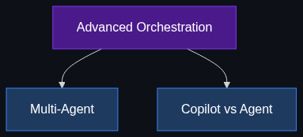

# ⚙️ Advanced Orchestration (The "Workflow" Layer)

> **Moving away from a single "do-it-all" AI toward highly managed teams of specialized AI agents.**

This module explores how enterprises manage complex workflows by stitching multiple AI agents together, creating deterministic pipelines out of non-deterministic models.

---

## 📚 Topics Covered

| # | Topic | File | Core Idea |
|---|-------|------|-----------|
| 1 | [Multi-Agent Orchestration](01_Multi_Agent_Orchestration.md) | `01_Multi_Agent_Orchestration.md` | Conductor AIs managing Worker AIs in a graph |
| 2 | [Copilots vs. Agents](02_Copilots_vs_Agents.md) | `02_Copilots_vs_Agents.md` | Human-in-the-loop vs. autonomous background execution |

---

## 🗺️ How These Topics Connect

---

## 🎯 Learning Path

1. **Start** with [Multi-Agent Orchestration](01_Multi_Agent_Orchestration.md) to understand how breaking tasks into smaller agents solves hallucination and complexity.
2. **Move to** [Copilots vs. Agents](02_Copilots_vs_Agents.md) to understand the security, latency, and business implications of removing the human from the loop.

---

*Each topic file follows the [Educator Skill](../../.github/Educator_skill.md) 6-phase teaching methodology: Foundations → Anatomy → Enterprise Patterns → Implementation → Interview Prep → Cheatsheet.*
