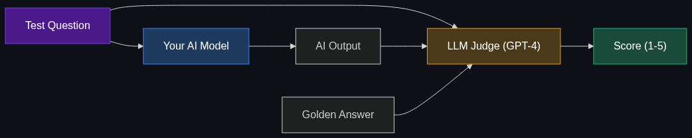

# 📏 Evals (Evaluations)

> **The rigorous, standardized testing frameworks used to benchmark an AI's performance, accuracy, and safety before it's deployed to the public. You don't just guess an AI is smart; you run it through "evals."**

---

## Phase 1: Core Foundations & Pre-requisites

### Prerequisites
- **LLM Non-determinism** — The fact that models generate different answers every time.
- **RAG** — Retrieval-Augmented Generation (see [Module 2](../../02_Data_and_Context_The_Knowing_Layer/01_RAG.md)).

### Definition
**Evals** are automated software pipelines designed to grade an AI's outputs. Because AI text generation is non-deterministic, you cannot write a simple unit test like `assert answer == "Paris"`. Instead, Evals use sophisticated grading rubrics (often employing other, smarter AI models as the judge) to score outputs on metrics like accuracy, tone, relevance, and safety across thousands of test queries.

### The Problem It Solves

| Without Evals ("Vibes-based" Testing) | With Evals |
|---------------------------------------|------------|
| Developers manually test 5 prompts and say "Looks good!" | Pipeline tests 5,000 prompts automatically on every code commit. |
| You update the System Prompt, but don't realize it broke the math logic. | The Eval pipeline catches a 15% drop in math accuracy before deployment (Regression). |
| You can't prove your new fine-tuned model is better than GPT-4. | You have a dashboard showing a 92% win-rate against GPT-4 on your golden dataset. |

### 🧩 Mini-Quiz

> **Q1:** Why can't we just use traditional software unit testing for LLMs?
> <details><summary>Answer</summary>Because language is fluid. If the correct answer is "The sky is blue", the LLM might output "It is a clear blue sky." A traditional string-matching unit test will mark this as a failure, even though it is semantically correct. Evals use semantic grading (often via another LLM) to understand that both answers mean the same thing.</details>

---

## Phase 2: Anatomy & Internal Mechanisms

### The "LLM-as-a-Judge" Architecture



Because human grading is too slow and expensive, enterprises use a larger, smarter model (like GPT-4o or Claude 3.5 Sonnet) to grade the outputs of their production models.

1. **The Golden Dataset:** A list of 1,000 questions and their *perfect* human-written answers.
2. **Generation:** Your production AI answers all 1,000 questions.
3. **The Judge:** The Judge AI is given the Question, the Golden Answer, and the Production AI's Answer.
4. **The Rubric:** The Judge is instructed: *"Score the AI's answer from 1-5 based on factual alignment with the Golden Answer. Deduct points for hallucination."*
5. **The Score:** The pipeline aggregates the scores into a final dashboard.

### RAG Evals (RAGAS)
If you are evaluating a RAG system, you grade distinct components separately:
- **Context Relevance:** Did the database fetch the right document?
- **Answer Faithfulness:** Did the LLM stick to the document, or did it hallucinate outside info?
- **Answer Relevance:** Did the LLM actually answer the user's question, or just summarize the document?

### 🃏 Flashcard

> **Front:** What is a "Regression" in AI development, and how do evals catch it?
> <details><summary>Flip</summary>A regression is when an update (like tweaking the system prompt to make the bot more polite) accidentally breaks a previously working feature (the bot suddenly refuses to write code). Automated evals catch this by running the entire historical test suite on the new version and comparing the aggregate score to the previous version before deployment.</details>

---

## Phase 3: Advanced / Enterprise Patterns & Pitfalls

### Enterprise Frameworks

| Framework | What it does |
|-----------|--------------|
| **RAGAS** | Open-source framework specifically designed to evaluate RAG pipelines. |
| **LangSmith** | Enterprise tracing and evaluation platform by LangChain. Allows visual debugging of agent workflows. |
| **OpenAI Evals** | Open-source registry of benchmarks to test OpenAI models. |
| **TruLens** | Evaluates LLM apps using "Feedback Functions" to track metrics over time. |

### Anti-Patterns

- ❌ **Testing on the training data** → If you evaluate the model on the exact same questions it was trained/fine-tuned on, you will get a 100% score (Overfitting). Always use a held-out test set.
- ❌ **Using a weak judge** → Using a cheap 8B parameter model to grade a 70B parameter model. The judge must be smarter than the student.
- ❌ **Relying solely on AI judges for safety** → For extreme safety issues (medical advice, legal), human expert review is still mandatory for a statistically significant sample of the evals.

---

## Phase 4: Practical Implementation

### Building a Simple LLM-as-a-Judge (Python)

```python
from openai import OpenAI

client = OpenAI()

def evaluate_answer(question: str, golden_answer: str, test_answer: str) -> int:
    """Uses GPT-4o to grade an answer on a scale of 1 to 5."""
    
    prompt = f"""
    You are an expert evaluator. Score the TEST ANSWER from 1 to 5 based on how well it matches the facts in the GOLDEN ANSWER.
    1 = Completely wrong or missing key facts
    5 = Perfect factual alignment
    
    Question: {question}
    Golden Answer: {golden_answer}
    Test Answer: {test_answer}
    
    Respond with ONLY the integer score (1, 2, 3, 4, or 5).
    """
    
    response = client.chat.completions.create(
        model="gpt-4o",
        temperature=0,
        messages=[{"role": "user", "content": prompt}]
    )
    
    try:
        return int(response.choices[0].message.content.strip())
    except:
        return 1 # Fail safe

# Example Eval Run
q = "What is the capital of France?"
gold = "Paris is the capital."
test_good = "The capital city of France is Paris."
test_bad = "I think it is London or maybe Berlin."

print(f"Good answer score: {evaluate_answer(q, gold, test_good)}") # Expected: 5
print(f"Bad answer score: {evaluate_answer(q, gold, test_bad)}")   # Expected: 1
```

---

## Phase 5: Interview Preparation

### Q1: "We are updating our RAG application's embedding model. How do we ensure it doesn't break the application?"
<details><summary><b>STAR Answer</b></summary>

**Situation:** Changing a core architectural component (the embedding model) risks degrading search retrieval quality across the entire enterprise application.

**Task:** Prove the new model is better before deploying it to production.

**Action:**
1. **Golden Dataset:** Assembled a test suite of 5,000 historical user questions mapped to the exact document IDs that *should* answer them.
2. **Offline Evaluation:** Ran both the old and new embedding models through the pipeline.
3. **Retrieval Metrics:** Measured Hit Rate (was the correct document in the top 3 results?) and MRR (Mean Reciprocal Rank).
4. **Generation Evals:** Used an LLM-as-a-judge (RAGAS framework) to score the final generated answers for "Faithfulness" and "Answer Relevance".

**Result:** The Eval dashboard proved the new embedding model increased Hit Rate by 12% without degrading generation quality. We deployed confidently, avoiding any "vibes-based" guesswork.
</details>

---

## Phase 6: Summary Cheatsheet & Action Plan

### 📋 TL;DR

| Concept | Key Point |
|---------|-----------|
| **Evals** | Automated testing for non-deterministic AI models. |
| **LLM-as-a-Judge** | Using a powerful AI to grade the outputs of a production AI. |
| **Golden Dataset** | A curated list of questions and perfect answers used as the benchmark. |
| **RAGAS / LangSmith** | Industry-standard tools for running these evaluations at scale. |

### 🚀 Do These Now
1. **Look up RAGAS:** Read the documentation on how RAGAS calculates "Faithfulness" (checking if the LLM hallucinated outside the provided context).
2. **Build a Golden Dataset:** Create a simple spreadsheet with 10 rows: `Question | Golden Answer`. This is the first step of any enterprise Eval pipeline.
