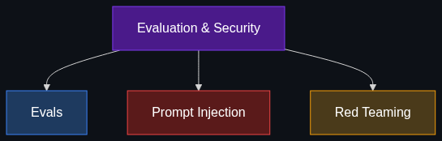

# 🛡️ Evaluation & Security (The "Testing" Layer)

> **How does an industry know if an AI is actually good or if it's easily hackable? This layer is where data science meets cybersecurity.**

This module covers the rigorous testing frameworks and adversarial attack vectors that every enterprise must understand before putting an AI system into production.

---

## 📚 Topics Covered

| # | Topic | File | Core Idea |
|---|-------|------|-----------|
| 1 | [Evals (Evaluations)](01_Evals.md) | `01_Evals.md` | Standardized testing frameworks for AI performance |
| 2 | [Prompt Injection](02_Prompt_Injection.md) | `02_Prompt_Injection.md` | Hacking an AI by overriding its system instructions |
| 3 | [Red Teaming](03_Red_Teaming.md) | `03_Red_Teaming.md` | Deliberately attacking your own AI to find vulnerabilities |

---

## 🗺️ How These Topics Connect

---

## 🎯 Learning Path

1. **Start** with [Evals](01_Evals.md) to learn how we measure "good" AI mathematically.
2. **Move to** [Prompt Injection](02_Prompt_Injection.md) to understand the most dangerous attack vector in Generative AI.
3. **Finish with** [Red Teaming](03_Red_Teaming.md) to see how enterprises hunt for these vulnerabilities before hackers do.

---

*Each topic file follows the [Educator Skill](../../.github/Educator_skill.md) 6-phase teaching methodology: Foundations → Anatomy → Enterprise Patterns → Implementation → Interview Prep → Cheatsheet.*
