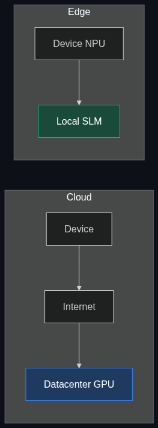

# 📱 Edge AI

> **Running AI models directly on local devices (like your phone, a smartwatch, or a factory machine) rather than sending data back and forth to a distant cloud server.**

---

## Phase 1: Core Foundations & Pre-requisites

### Prerequisites
- **SLMs vs LLMs** — Why small models matter (see [Module 3](../../03_Models_and_Architectures/01_LLMs_vs_SLMs_vs_VLMs.md)).
- **Quantization** — Compressing models to fit in memory (see [Module 4](../../04_Training_and_Tweaking/03_LoRA_QLoRA.md)).

### Definition
**Edge AI** refers to the deployment of artificial intelligence algorithms physically close to the source of the data—on the "edge" of the network. Instead of a smartphone recording audio, uploading it to an AWS data center, waiting for an LLM to process it, and downloading the answer, the smartphone processes the audio using an AI chip located directly on its own motherboard.

### The Problem It Solves

| Cloud AI (The Problem) | Edge AI (The Solution) |
|------------------------|------------------------|
| **Latency:** Takes 1-3 seconds to bounce data to the cloud and back. | **Speed:** Processes locally in <50 milliseconds. |
| **Connectivity:** Fails if the user enters a tunnel or airplane mode. | **Offline:** Works perfectly with zero internet connection. |
| **Privacy:** Sensitive corporate/personal data is sent over the internet to a vendor. | **Security:** Data never leaves the physical device. |
| **Bandwidth:** Sending 4K security video to the cloud 24/7 destroys network bandwidth. | **Efficiency:** AI analyzes the 4K video locally, only sending an alert if a threat is detected. |

### 🧩 Mini-Quiz

> **Q1:** Why don't we run GPT-4 on iPhones if Edge AI is so much faster and more private?
> <details><summary>Answer</summary><b>Hardware limitations.</b> GPT-4 is estimated to be over 1 Trillion parameters, requiring terabytes of VRAM to hold in memory. Even the best iPhones only have ~8GB of unified memory. Edge AI relies strictly on Small Language Models (SLMs) (e.g., 3 Billion to 8 Billion parameters) that have been heavily quantized (compressed) to fit onto mobile hardware.</details>

---

## Phase 2: Anatomy & Internal Mechanisms

### The Edge Pipeline vs Cloud Pipeline



### Neural Processing Units (NPUs)
To make Edge AI possible without draining a device's battery in 5 minutes, hardware manufacturers (Apple, Qualcomm, Intel) are adding **NPUs** to their chips. 
- CPUs are good for general tasks.
- GPUs are good for graphics and parallel math.
- **NPUs** are mathematically optimized *specifically* for the matrix multiplication required by neural networks, executing them at incredibly low power.

### Quantization (The Key to the Edge)
To fit a model on an Edge device, its weights (the numbers representing its brain) are rounded down.
- **FP16 (Cloud standard):** Takes 16 bits of memory per weight. A 7B model takes ~14GB of RAM.
- **INT4 (Edge standard):** Takes 4 bits per weight. The same 7B model now takes ~3.5GB of RAM, easily fitting on a standard smartphone.

### 🃏 Flashcard

> **Front:** What is the "Hybrid AI" approach used by companies like Apple?
> <details><summary>Flip</summary>A routing architecture where the device attempts to process the user's request using a local SLM on the Edge first (for speed and privacy). If the local model determines the request is too complex (e.g., "Write a 5-page essay on Quantum Physics"), it routes the request up to a massive Cloud LLM (like Private Cloud Compute or ChatGPT) as a fallback.</details>

---

## Phase 3: Advanced / Enterprise Patterns & Pitfalls

### Enterprise Use Cases

| Industry | Edge Application |
|----------|------------------|
| **Defense / Military** | Drones and field radios running facial recognition or translation offline in deep-combat zones with jammed internet. |
| **Manufacturing** | Cameras on the assembly line running local visual AI to detect defective parts at 60 frames-per-second (Cloud latency would miss the part moving down the belt). |
| **Healthcare** | Wearable heart monitors predicting cardiac arrest locally, guaranteeing patient privacy and zero reliance on hospital Wi-Fi. |

### Anti-Patterns

- ❌ **Assuming Edge AI = Cheap** → While you save on Cloud API costs, deploying to the Edge requires intense engineering to compress models, handle battery drain, and update the models across millions of physical devices (OTA updates).
- ❌ **Using Edge for highly complex reasoning** → SLMs on the Edge are great at extraction, summarization, and basic routing. They fail at complex math, deep logic, or writing complex code.

---

## Phase 4: Practical Implementation

### Running Edge Inference Locally (MacBook / Apple Silicon)

*If you own a modern Mac, it has an NPU (Neural Engine) and Unified Memory. You can run Edge AI right now using Apple's MLX framework.*

```python
# pip install mlx-lm
from mlx_lm import load, generate

# 1. Load an SLM that has been quantized to 4-bit (INT4).
# This entire model is only ~2GB and downloads directly to your local machine.
model_id = "mlx-community/Phi-3-mini-4k-instruct-4bit"
model, tokenizer = load(model_id)

# 2. Execute Inference locally. 
# Disconnect your Wi-Fi, and this will still work perfectly.
prompt = "Explain why running AI locally on a device is good for privacy."
formatted_prompt = f"<|user|>\n{prompt}\n<|end|>\n<|assistant|>"

print("Generating locally...")
response = generate(
    model, 
    tokenizer, 
    prompt=formatted_prompt, 
    max_tokens=150, 
    verbose=True
)

print(f"\nResponse: {response}")
# Notice the speed: Because data doesn't travel to a server, Time-To-First-Token (TTFT) is near zero.
```

---

## Phase 5: Interview Preparation

### Q1: "We are building an AI app for construction workers to talk to their manuals. What deployment architecture do you suggest?"
<details><summary><b>STAR Answer</b></summary>

**Situation:** Construction sites frequently have terrible Wi-Fi and cell service, rendering cloud-based AI apps useless.

**Task:** Design an architecture with high availability regardless of connectivity.

**Action:**
1. **Model Selection:** Selected a high-quality Small Language Model (SLM) like Llama-3-8B.
2. **Compression:** Quantized the model to INT4 and converted it to the GGUF format so it could run on standard iOS/Android processors.
3. **Local RAG:** Deployed a local vector database directly onto the mobile device containing the construction manuals.
4. **Deployment:** Shipped the Model and the Database inside the app payload. 

**Result:** The workers could query their safety and operational manuals instantly, in deep trenches or remote locations, with zero latency and 100% uptime, saving thousands in cloud inference costs.
</details>

---

## Phase 6: Summary Cheatsheet & Action Plan

### 📋 TL;DR

| Concept | Key Point |
|---------|-----------|
| **Edge AI** | Running models locally on hardware (phones, cars, laptops). |
| **Benefits** | Zero latency, offline capability, perfect privacy, no cloud API bills. |
| **Hardware** | Relies on NPUs (Neural Processing Units) for low-power math. |
| **Software** | Relies on SLMs (Small Models) + Quantization (Compression). |

### 🚀 Do These Now
1. **Download an Edge App:** Download an app like `LM Studio` (Desktop) or `PocketPal AI` (Mobile). Download a 3B parameter model and chat with it in Airplane mode.
2. **Check your Hardware:** Look up the specs of your phone or laptop. Does it have an NPU (sometimes called a Neural Engine or Tensor Core)? If so, it is hardware-optimized for Edge AI.
