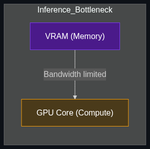

# 🌩️ Inference Compute vs. Training Compute

> **The computational power required to actually run the AI model when you ask it a question. (Contrasted with "Training Compute," which is the power used to build the model in the first place).**

---

## Phase 1: Core Foundations & Pre-requisites

### Prerequisites
- **LLM Tokenization** — How models read and generate text token-by-token.
- **GPUs** — Graphics Processing Units, the engines of AI.

### Definitions

**1. Training Compute**
The computational power used to *build* the model. You take trillions of words of data, pass them through the neural network repeatedly, and adjust the mathematical weights. This requires thousands of GPUs running continuously for months.

**2. Inference Compute**
The computational power required to *run* the model. When a user asks "What is the capital of France?", the model uses inference compute to push that prompt through its pre-trained weights and generate the answer "Paris".

### The Problem It Solves
Understanding this distinction solves the economic problem of deploying AI at scale. 

| Phase | Duration | Economics | Bottleneck |
|-------|----------|-----------|------------|
| **Training** | Months (One-time) | Fixed Cost (CapEx). E.g., $100 Million to train GPT-4 once. | GPU availability and electricity. |
| **Inference** | Milliseconds (Infinite) | Variable Cost (OpEx). E.g., $1 Million *per day* to serve ChatGPT to users. | Memory bandwidth (how fast data moves from RAM to the GPU chip). |

### 🧩 Mini-Quiz

> **Q1:** If you use OpenAI's API to build a chatbot for your company, are you paying for Training Compute or Inference Compute?
> <details><summary>Answer</summary><b>Inference Compute.</b> OpenAI already paid for the Training Compute to build GPT-4. When you send an API call, you are paying them for the electricity and GPU time required to run your specific prompt through their model (Inference). This is why API costs are calculated "per token".</details>

---

## Phase 2: Anatomy & Internal Mechanisms

### The Inference Bottleneck (Memory Wall)



During Training, the bottleneck is **Math** (FLOPs - Floating Point Operations per second). The GPU is constantly crunching numbers.

During Inference, the bottleneck is **Memory Bandwidth**. 
When an LLM generates text, it generates it *one token at a time* (Auto-regressive generation). To generate one word, the GPU must load the *entire* neural network (e.g., 70 Billion parameters) from the GPU's memory (VRAM) into the processing cores, do the math, spit out the word, and then load the entire network *again* for the next word.

The chip spends 90% of its time waiting for the weights to be fetched from memory. This is called the "Memory Wall."

### Key Inference Metrics

| Metric | Meaning | Why it matters |
|--------|---------|----------------|
| **TTFT (Time to First Token)** | How long until the AI starts typing its answer? | Determines if the app feels "laggy" to the user. |
| **Tokens per Second (t/s)** | How fast does it type out the answer? | Determines user experience and how fast background jobs finish. |
| **Batch Size** | How many users the GPU is answering at the exact same time. | Determines the profit margin for the enterprise hosting the model. |

### 🃏 Flashcard

> **Front:** What is "Batching" in the context of Inference Compute?
> <details><summary>Flip</summary>Batching is grouping multiple user requests together. Because loading the 70B parameters from memory takes so much time, if you load the model once, you can have it calculate the math for 32 different user prompts simultaneously (a batch size of 32). This dramatically increases the <b>throughput</b> and cost-efficiency of the GPU, though it slightly increases the TTFT (latency) for the individual users.</details>

---

## Phase 3: Advanced / Enterprise Patterns & Pitfalls

### Enterprise Optimization Strategies

Enterprises spend millions optimizing inference to lower their cloud bills.

| Optimization | How it works | Impact |
|--------------|--------------|--------|
| **Quantization** | Converting 16-bit numbers to 4-bit numbers. | Shrinks the model by 4x, drastically speeding up memory transfer. |
| **Prefix Caching** | If 100 users ask a question with the same massive System Prompt, the model caches the math for that prompt in VRAM. | Saves massive compute on System Prompts and RAG documents. |
| **Speculative Decoding** | Uses a tiny, fast model to guess the next 5 words. The big model then checks the math all at once. | Increases tokens-per-second generation speed by 2x-3x. |

### Anti-Patterns

- ❌ **Focusing on FLOPs for Inference** → Buying a new GPU because it has "faster processing cores." For inference, you should look at the **Memory Bandwidth** (GB/s).
- ❌ **Running LLMs on CPUs** → While possible, CPUs have terrible memory bandwidth compared to GPUs. Inference on a CPU will yield ~2 tokens per second (unusable for chat), whereas a GPU yields ~100 tokens per second.

---

## Phase 4: Practical Implementation

### Understanding Inference APIs (vLLM)

In the enterprise, you don't run inference using simple Python scripts; you use heavily optimized Inference Engines like **vLLM**, which utilize "PagedAttention" to maximize batch sizes.

*Conceptual example of deploying a high-throughput inference server:*

```bash
# 1. Install an enterprise inference engine
pip install vllm

# 2. Launch the server (vLLM optimizes memory to serve hundreds of users simultaneously)
# - PagedAttention manages VRAM like an OS manages virtual memory
# - Tensor Parallelism splits the model across multiple GPUs if needed
python -m vllm.entrypoints.openai.api_server \
    --model meta-llama/Llama-3-8B-Instruct \
    --quantization awq \
    --gpu-memory-utilization 0.9 \
    --max-model-len 4096

# 3. The model is now available at http://localhost:8000/v1/chat/completions
# It can handle massive concurrent requests (batching) far better than the standard HuggingFace library.
```

---

## Phase 5: Interview Preparation

### Q1: "Why does generating a 100-word response cost more compute than reading a 100-word prompt?"
<details><summary><b>STAR Answer</b></summary>

**Situation:** The business wants to understand why their AI cloud bill is so high when users are only reading short answers.

**Task:** Explain the physics of Auto-Regressive Inference.

**Action:**
1. **Prompt Processing (Prefill):** When an LLM reads a 100-word prompt, it processes all 100 words in parallel. It loads the model weights from memory into the GPU cores exactly *one* time. This is highly efficient.
2. **Generation (Decode):** When generating a 100-word response, it must generate word 1, then use word 1 to generate word 2, and so on. It must load the entire multi-gigabyte model from memory into the cores *100 separate times*. 

**Result:** Generation is heavily bottlenecked by Memory Bandwidth (loading weights over and over). Therefore, output tokens are vastly more expensive and slower to compute than input tokens.
</details>

---

## Phase 6: Summary Cheatsheet & Action Plan

### 📋 TL;DR

| Concept | Key Point |
|---------|-----------|
| **Training Compute** | The massive, one-time energy cost to build the model. |
| **Inference Compute** | The ongoing energy cost to run queries through the model. |
| **Memory Wall** | Inference is limited by how fast data moves inside the GPU, not how fast the GPU does math. |
| **Batching** | Grouping user requests together to make Inference economically viable. |

### 🚀 Do These Now
1. **Compare Pricing:** Go to OpenAI's pricing page. Look at the price difference between "Input Tokens" and "Output Tokens". Notice how Output Tokens are usually 3x to 4x more expensive? Now you know why (Inference memory bottlenecks).
2. **Research vLLM:** Look up the vLLM project on GitHub. It is the gold standard open-source tool for optimizing enterprise inference compute.
