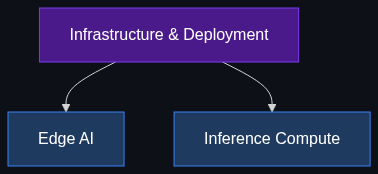

# 🏭 Infrastructure & Deployment (Where AI Lives)

> **The cloud isn't always the answer. Where and how you run an AI model dictates its speed, privacy, and cost.**

This module explores the physical and architectural realities of deploying AI into production, moving beyond the API and into bare metal, mobile chips, and the economics of compute.

---

## 📚 Topics Covered

| # | Topic | File | Core Idea |
|---|-------|------|-----------|
| 1 | [Edge AI](01_Edge_AI.md) | `01_Edge_AI.md` | Running models on phones and local devices for privacy and zero latency |
| 2 | [Inference Compute](02_Inference_Compute.md) | `02_Inference_Compute.md` | The economics and physics of generating AI responses at scale |

---

## 🗺️ How These Topics Connect

---

## 🎯 Learning Path

1. **Start** with [Edge AI](01_Edge_AI.md) to understand how the industry is pushing models off the cloud and onto local devices.
2. **Move to** [Inference Compute](02_Inference_Compute.md) to understand the difference between training models and running them, and why the latter is the true cost bottleneck of AI.

---

*Each topic file follows the [Educator Skill](../../.github/Educator_skill.md) 6-phase teaching methodology: Foundations → Anatomy → Enterprise Patterns → Implementation → Interview Prep → Cheatsheet.*
