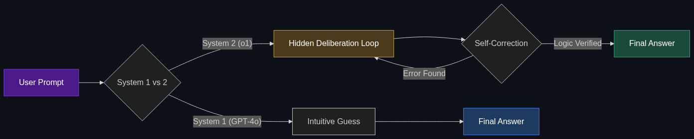

# 🛑 System 2 Thinking

> **A concept from psychology (Daniel Kahneman) now applied to AI. Most LLMs are "System 1" (fast, intuitive, reactive). System 2 refers to models that can pause, deliberate, and use logic before responding (like OpenAI's o1 series).**

---

## Phase 1: Core Foundations & Pre-requisites

### Prerequisites
- **Chain of Thought (CoT)** — Asking an AI to "think step by step" (see Module 5).
- **Auto-regressive Generation** — How LLMs generate text token by token.

### Definition
In psychology, human thought is divided into two systems:
- **System 1:** Fast, instinctive, emotional (e.g., recognizing an angry face, driving a familiar route).
- **System 2:** Slower, deliberative, logical (e.g., solving a complex math equation, parking in a tight space).

Until recently, all LLMs (like GPT-3 or ChatGPT) were purely **System 1**. They reacted instantly, predicting the next word based on intuition and pattern matching. **System 2 AI** (like OpenAI's *o1* or *o3*) has the architectural ability to pause, generate hidden reasoning traces, self-correct, and verify logic before outputting a final answer.

### The Problem It Solves

| System 1 LLM | System 2 LLM |
|--------------|--------------|
| Guesses the answer instantly. | Thinks for 30 seconds before answering. |
| Fails at complex math or long logic puzzles. | Excels at competitive programming and PhD-level physics. |
| Hallucinates confidently. | Realizes a mistake mid-thought and self-corrects. |

### 🧩 Mini-Quiz

> **Q1:** If you prompt a standard LLM to "Take a deep breath and think step-by-step," does that make it a System 2 model?
> <details><summary>Answer</summary>No. That is just Prompt Engineering (forcing a System 1 model to write its thoughts out loud). True System 2 models are <i>trained</i> via Reinforcement Learning to deliberate internally. They have a hidden "thought" process built into their architecture that the user doesn't even see.</details>

---

## Phase 2: Anatomy & Internal Mechanisms

### How System 2 AI Works



Unlike standard models that map `Prompt -> Answer`, System 2 models map `Prompt -> Internal Deliberation -> Answer`.

1. **Reinforcement Learning (RL):** These models are trained heavily with RLHF/RLAIF to *value* getting the right answer over getting a fast answer. They are rewarded for creating long, logical chains of thought.
2. **Hidden Tokens:** When you prompt a System 2 model, it generates thousands of "thinking tokens" that are hidden from the UI. 
3. **Backtracking:** If the model's internal logic hits a dead end (e.g., trying to solve a Sudoku puzzle), it recognizes the flaw, discards that thought branch, and tries a different logical path before responding to the user.

### 🃏 Flashcard

> **Front:** Why did OpenAI hide the "thinking tokens" in their o1 model from the user?
> <details><summary>Flip</summary>Partially for user experience (nobody wants to read 5,000 words of an AI arguing with itself), but primarily to protect their <b>Competitive Advantage</b>. The way the model thinks and breaks down problems is highly valuable intellectual property. Giving users the raw thought process would allow competitors to use that data to train their own System 2 models (Distillation).</details>

---

## Phase 3: Advanced / Enterprise Patterns & Pitfalls

### Enterprise Use Cases

| Industry | System 2 Application |
|----------|----------------------|
| **Software Engineering** | Refactoring entire legacy codebases where variable dependencies stretch across 50 files. Requires deep deliberation, not fast guessing. |
| **Legal / Compliance** | Analyzing a 200-page merger document against tax codes. The AI must cross-reference facts logically before declaring compliance. |
| **Drug Discovery** | Evaluating complex molecular binding pathways where a single logical error invalidates the simulation. |

### Anti-Patterns

- ❌ **Using System 2 for Chat/Routing** → Using an expensive `o1` model to extract a name from an email or power a live customer support chat. It will take 15 seconds to reply to "Hello". Use System 1 models for fast, intuitive tasks.
- ❌ **Assuming System 2 is creative** → System 2 models are optimized for logic, math, and coding (where there is an objective "right" answer). They are often *worse* and more robotic at creative writing than System 1 models.

---

## Phase 4: Practical Implementation

### Using a System 2 API (Conceptual)

When using a System 2 model via an API, you typically cannot control the "temperature" (creativity) or use traditional system prompts, because the model's internal RL dictates its behavior.

```python
from openai import OpenAI

client = OpenAI()

# Standard System 1 Call (Fast, cheap, intuitive)
response_sys1 = client.chat.completions.create(
    model="gpt-4o",
    messages=[{"role": "user", "content": "Write a quick marketing email."}]
)

# System 2 Call (Slow, expensive, logical)
# Notice we use 'o1', and we DO NOT provide a system prompt.
response_sys2 = client.chat.completions.create(
    model="o1-preview",
    messages=[
        {"role": "user", "content": "Write a Python script to solve the Navier-Stokes equation for fluid dynamics in a 2D grid."}
    ]
)

# System 2 might take 45 seconds to return, using massive hidden compute to verify the math.
print(response_sys2.choices[0].message.content)
```

---

## Phase 5: Interview Preparation

### Q1: "We are building an AI financial auditor. Should we use GPT-4o or the new o1 model?"
<details><summary><b>STAR Answer</b></summary>

**Situation:** Financial auditing requires zero hallucinations, deep multi-step logic, and rigorous cross-referencing.

**Task:** Select the correct architectural paradigm.

**Action:** I would select a System 2 model like `o1`. GPT-4o operates on System 1 heuristics—it predicts the next most likely token. In complex accounting, the next most likely token might be grammatically correct but mathematically wrong. A System 2 model utilizes internal deliberation and backtracking, verifying the math and logic before returning the final audit report. 

**Result:** While the API cost and latency will be significantly higher, the accuracy and reliability in a high-stakes financial environment completely justify the tradeoff.
</details>

---

## Phase 6: Summary Cheatsheet & Action Plan

### 📋 TL;DR

| Concept | Key Point |
|---------|-----------|
| **System 1 AI** | Fast, reactive, intuitive (GPT-4o, Claude 3.5). Good for chat and writing. |
| **System 2 AI** | Slow, deliberative, logical (o1). Good for math, coding, and deep reasoning. |
| **Hidden Thoughts** | System 2 models generate thousands of hidden tokens to plan and self-correct. |
| **Trade-off** | You pay in latency and compute cost to guarantee logical accuracy. |

### 🚀 Do These Now
1. **Test the Difference:** If you have ChatGPT Plus, ask GPT-4o a complex riddle: *"I have a 5-liter jug and a 3-liter jug and an unlimited water supply. How do I measure exactly 4 liters?"* Then, ask the `o1` model the same thing and watch the "Thinking..." dropdown to see how much harder it works.
