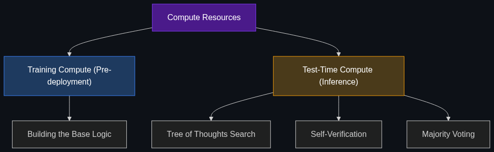

# ⏳ Test-Time Compute

> **The idea that instead of just having a bigger model, we give the model more "thinking time" or processing power at the moment it answers a question to improve accuracy.**

---

## Phase 1: Core Foundations & Pre-requisites

### Prerequisites
- **System 2 Thinking** — The architectural shift toward deliberation (see [01_System_2_Thinking.md](01_System_2_Thinking.md)).
- **Inference vs Training Compute** — The difference between building and running models.

### Definition
Historically, to make an AI smarter, companies spent billions on **Training Compute** (crunching more data on bigger GPUs for months). 

**Test-Time Compute** (or Inference-Time Compute) is the bleeding-edge realization that you can make a smaller, cheaper model significantly smarter by allowing it to "burn" more compute power *during the test* (at inference). Instead of answering instantly, the model runs internal simulations, generates multiple answers, grades them, and picks the best one.

### The Problem It Solves

| Scaling Law (Old Paradigm) | Test-Time Compute (New Paradigm) |
|----------------------------|----------------------------------|
| To get 10% smarter, train a model 10x larger. | To get 10% smarter, let a small model "think" 10x longer. |
| Training costs $1 Billion. | Training costs $10 Million. Inference costs are slightly higher. |
| The model answers instantly, but fails hard logic puzzles. | The model takes 2 minutes, but solves PhD-level problems. |

### 🧩 Mini-Quiz

> **Q1:** If you use Test-Time Compute, are you updating the neural network's weights (learning)?
> <details><summary>Answer</summary>No. Test-Time Compute happens entirely during Inference. The model is not learning new facts permanently; it is simply expending more computational energy to explore logical paths to solve the specific prompt in front of it.</details>

---

## Phase 2: Anatomy & Internal Mechanisms

### How Test-Time Compute Scales



*The revolutionary finding of 2024 (popularized by OpenAI's o1 paper) was a new "Scaling Law": Model accuracy scales linearly with the amount of compute you allow it to use during inference.*

**Mechanisms of Test-Time Compute:**
1. **Search (Tree of Thoughts):** The model doesn't just write one answer. It writes 5 possible next steps, evaluates the probability of each leading to success, picks the best one, and continues.
2. **Self-Verification:** The model writes an answer, then writes a script to test its own answer. If it fails, it burns more compute to rewrite it.
3. **Majority Voting (Ensembling):** The model answers the exact same question 100 times in parallel. The answer that appears most often (the consensus) is presented to the user.

### 🃏 Flashcard

> **Front:** What is the economic trade-off of Test-Time Compute for an enterprise?
> <details><summary>Flip</summary>You are shifting CapEx (Capital Expenditure on massive training runs) to OpEx (Operational Expenditure on inference). You don't need a $100M supercomputer to train a massive model; you can use a smaller model, but your per-query API costs and latency will rise significantly because the model generates 10,000 hidden tokens to answer a single question.</details>

---

## Phase 3: Advanced / Enterprise Patterns & Pitfalls

### Enterprise Allocation of Compute

Enterprises are now implementing "Dynamic Compute Routing". You allocate compute based on the difficulty of the task.

| Task Difficulty | Compute Strategy | Cost/Latency |
|-----------------|------------------|--------------|
| **Triage / Routing** (e.g., "Is this an angry email?") | **Zero Test-Time Compute.** Fast System 1 pass. | $0.001 / 50ms |
| **Drafting** (e.g., "Write an apology email.") | **Low Test-Time Compute.** Standard prompt execution. | $0.01 / 1s |
| **Verification** (e.g., "Is the math in this Q3 earnings report correct?") | **Maximum Test-Time Compute.** Allow the model 2 minutes to generate a Tree of Thoughts and self-verify. | $1.50 / 120s |

### Anti-Patterns

- ❌ **Maxing out compute for simple facts** → Letting a model think for 30 seconds to answer "What is the capital of Spain?" is a massive waste of electricity and money.
- ❌ **Assuming more time = new knowledge** → Test-time compute improves *reasoning*, not *knowledge*. If the model was never trained on quantum physics, giving it 10 minutes to think won't make it invent quantum physics. It will just confidently hallucinate a very logical-sounding wrong answer.

---

## Phase 4: Practical Implementation

### Simulating Test-Time Compute (Python via Majority Voting)

If you don't have access to an `o1` model, you can manually simulate Test-Time Compute in code using a cheaper model.

```python
from openai import OpenAI
from collections import Counter

client = OpenAI()

def test_time_compute_simulate(prompt: str, iterations: int = 5) -> str:
    """
    Simulates test-time compute by running the prompt multiple times
    and returning the most common answer (Majority Voting).
    """
    answers = []
    print(f"Burning compute... running {iterations} iterations.")
    
    for _ in range(iterations):
        response = client.chat.completions.create(
            model="gpt-4o-mini", # Use a cheap, fast model
            messages=[{"role": "user", "content": prompt}],
            temperature=0.7 # Allow variance so it thinks differently each time
        )
        answers.append(response.choices[0].message.content.strip())
        
    # Count the most common answer
    most_common = Counter(answers).most_common(1)[0]
    
    print(f"\nFinal Consensus Answer (Agreed {most_common[1]}/{iterations} times):")
    return most_common[0]

# High-stakes math question
q = "If a bat and a ball cost $1.10, and the bat costs $1.00 more than the ball, how much does the ball cost? Respond with only the number."
print(test_time_compute_simulate(q, iterations=10))
```

---

## Phase 5: Interview Preparation

### Q1: "Explain the shift from Scaling Laws of Training to Scaling Laws of Inference."
<details><summary><b>STAR Answer</b></summary>

**Situation:** For years, the only way to improve AI was to build exponentially larger models (GPT-2 -> GPT-3 -> GPT-4), which hit a physical and financial ceiling (the Training Scaling Law).

**Task:** Explain how the industry bypassed this ceiling to continue improving AI reasoning.

**Action:** The industry discovered Test-Time Compute. Instead of relying solely on pre-trained intuition, researchers found that if you train a model using Reinforcement Learning to deliberate, its accuracy scales proportionally with the amount of compute you allow it to use *during inference*. 

**Result:** This means we can achieve state-of-the-art reasoning on complex tasks using smaller, cheaper-to-train models, simply by allowing the model to "think" (burn more inference compute) for 30 seconds before returning the answer. It shifts the bottleneck from data/training to inference algorithms.
</details>

---

## Phase 6: Summary Cheatsheet & Action Plan

### 📋 TL;DR

| Concept | Key Point |
|---------|-----------|
| **Test-Time Compute** | Giving a model more time/compute to solve a problem during inference. |
| **Mechanism** | Internal simulations, self-correction, Tree of Thoughts, Majority Voting. |
| **The New Scaling Law** | More compute during inference = linearly better reasoning accuracy. |
| **The Cost** | High latency (slow) and higher API costs per prompt. |

### 🚀 Do These Now
1. **Read about AlphaGo:** Look up DeepMind's AlphaGo. Its ability to beat the world champion in Go was based on MCTS (Monte Carlo Tree Search)—the exact foundation of Test-Time Compute being applied to LLMs today.
