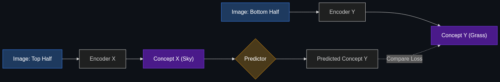

# 🧩 JEPA (Joint-Embedding Predictive Architecture)

> **An architecture championed by Yann LeCun (Meta) that aims to help AI learn more like a human—by predicting the "big picture" of a world state rather than just predicting the next pixel or word.**

---

## Phase 1: Core Foundations & Pre-requisites

### Prerequisites
- **Transformers** — Predicting the next token (auto-regressive).
- **Embeddings / Latent Space** — Mathematical representations of concepts.

### Definition
**JEPA (Joint-Embedding Predictive Architecture)** is a non-generative AI architecture proposed as the successor to LLMs by Yann LeCun (Chief AI Scientist at Meta). 

Current generative models (like ChatGPT or Sora) try to predict the exact next word or the exact next pixel. JEPA argues this is a massive waste of compute because the real world has too much irrelevant detail. Instead of predicting the exact pixels, a JEPA model predicts the *abstract, high-level concept* (the embedding) of what will happen next.

### The Problem It Solves

| Standard Generative AI (Transformers) | JEPA (Predictive Architecture) |
|---------------------------------------|--------------------------------|
| If shown a video of a ball dropping, it tries to predict the exact color and shadow of every pixel as the ball falls. | It predicts: "The embedding of a ball will move downward." |
| Requires massive compute to generate irrelevant noise (the texture of the floor). | Highly efficient; ignores irrelevant noise and focuses on semantic meaning. |
| Hallucinates because it lacks a fundamental understanding of physics. | Learns an internal "World Model" based on high-level physics and logic. |

### 🧩 Mini-Quiz

> **Q1:** Does a JEPA model generate text or images for the user?
> <details><summary>Answer</summary>No. Pure JEPAs are <i>non-generative</i>. They do not output pixels or text; they output mathematical embeddings (abstract concepts). To get a human-readable output, you have to attach a separate decoder/generator to the end of a JEPA. Their primary purpose is to achieve deep, human-like understanding of the world, not to draw pictures.</details>

---

## Phase 2: Anatomy & Internal Mechanisms

### How JEPA Predicts the Future



1. **Context Encoder:** Takes a piece of data (e.g., the top half of an image of a dog) and compresses it into a high-level embedding (a mathematical vector representing "Dog Head").
2. **Target Encoder:** Takes the hidden piece of data (e.g., the bottom half of the image) and compresses it into an embedding ("Dog Body").
3. **The Predictor:** The core of JEPA. It looks at the "Dog Head" embedding and tries to predict the "Dog Body" embedding. 

*Crucially, it never tries to draw the dog's fur pixel-by-pixel. It just predicts that a body should mathematically follow a head.*

### V-JEPA (Video JEPA)
Meta released V-JEPA, which learns physics by watching videos. If it sees a video of a car driving behind a tree, it doesn't need to generate the pixels of the car. It simply maintains the mathematical "concept" of the car in its hidden state, understanding that the car still exists behind the tree (Object Permanence).

### 🃏 Flashcard

> **Front:** Why does Yann LeCun claim that Auto-Regressive LLMs (like GPT-4) will never achieve Artificial General Intelligence (AGI)?
> <details><summary>Flip</summary>Because LLMs merely predict the next token based on statistical patterns in text. They do not possess a "World Model" (an understanding of physical reality, time, or spatial logic). LeCun argues that true intelligence requires predicting the outcomes of actions in the physical world—which is exactly what JEPA is designed to do.</details>

---

## Phase 3: Advanced / Enterprise Patterns & Pitfalls

### Enterprise Use Cases (Future-Leaning)

| Industry | JEPA Application |
|----------|------------------|
| **Autonomous Driving** | A JEPA model acting as the "brain" of a car. It doesn't need to predict every pixel of a leaf blowing across the road; it just extracts the semantic embedding ("Obstacle: None") and drives safely. |
| **Robotics** | Training robots to navigate factory floors. The robot understands the physics of heavy vs. light objects without needing to generate images of them. |
| **Video Analytics** | Scanning 10,000 hours of security footage for anomalies. JEPA is vastly faster than a VLM because it skips pixel generation entirely. |

### Anti-Patterns

- ❌ **Trying to use JEPA as a chatbot** → JEPAs are not LLMs. They are foundational world-understanding models. If you need text generation, stick to Transformers.
- ❌ **Expecting immediate commercial APIs** → As of right now, JEPA is heavily rooted in advanced research (FAIR - Fundamental AI Research at Meta). It is not yet a plug-and-play API like OpenAI's endpoints.

---

## Phase 4: Practical Implementation

### Conceptualizing JEPA logic vs LLM logic

*Understand the philosophical difference in how the math is calculated.*

```python
# 1. The LLM Approach (Generative)
def transformer_predict(image_top_half):
    # Burns massive compute trying to guess the exact RGB hex code 
    # of every single pixel in the bottom half of the image.
    generated_pixels = generate_millions_of_pixels(image_top_half)
    return generated_pixels

# 2. The JEPA Approach (Predictive)
def jepa_predict(image_top_half, image_bottom_half):
    # Compress both halves into abstract mathematical concepts (Embeddings)
    concept_x = encode(image_top_half)    # e.g., Vector[0.8, 0.2] (Meaning: "Sky")
    concept_y = encode(image_bottom_half) # e.g., Vector[0.1, 0.9] (Meaning: "Grass")
    
    # The Predictor learns the relationship between the CONCEPTS, not the pixels.
    # It learns: "If Sky is above, Grass is likely below."
    predicted_concept_y = predictor_network(concept_x)
    
    # Loss is calculated by comparing the predicted concept to the actual concept.
    loss = calculate_distance(predicted_concept_y, concept_y)
    return loss
```

---

## Phase 5: Interview Preparation

### Q1: "What is the primary difference between a Generative AI architecture (like a Diffusion model) and a Predictive architecture like JEPA?"
<details><summary><b>STAR Answer</b></summary>

**Situation:** The industry relies heavily on generative models (predicting exact pixels or text), but they suffer from high compute costs and physical hallucinations.

**Task:** Explain the architectural shift proposed by Yann LeCun.

**Action:** Generative AI operates in the exact data space—it attempts to reconstruct reality pixel by pixel, which wastes massive computational resources modeling unpredictable noise (like the exact ripple of water in a video). 
JEPA (Joint-Embedding Predictive Architecture) operates entirely in the latent space. It uses encoders to compress reality into abstract mathematical embeddings, and then predicts how those abstract embeddings will change over time. 

**Result:** Because JEPA ignores irrelevant background noise and focuses strictly on high-level semantic meaning, it requires vastly less compute, learns much faster, and develops a robust "World Model" (understanding object permanence and physics) that Generative models struggle to achieve.
</details>

---

## Phase 6: Summary Cheatsheet & Action Plan

### 📋 TL;DR

| Concept | Key Point |
|---------|-----------|
| **JEPA** | Joint-Embedding Predictive Architecture (Invented by Meta/Yann LeCun). |
| **The Goal** | Teach AI to build a "World Model" and understand physics. |
| **The Mechanism** | Predicting abstract embeddings (concepts) instead of exact pixels/words. |
| **The Advantage** | Ignores irrelevant noise, saves massive compute, enables AGI research. |

### 🚀 Do These Now
1. **Watch Yann LeCun:** Search YouTube for "Yann LeCun Objective Driven AI" to hear the Godfather of AI explain why LLMs are a technological dead-end for AGI, and why JEPA is the future.
