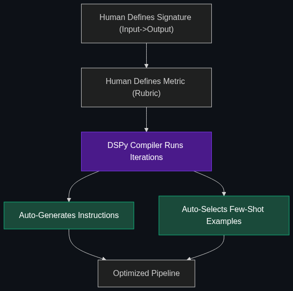

# ⚙️ DSPy (Declarative Self-Improving Language Programs)

> **A framework that is replacing manual "prompt engineering." Instead of you writing prompts, you write code, and DSPy optimizes the prompts for you.**

---

## Phase 1: Core Foundations & Pre-requisites

### Prerequisites
- **Prompt Engineering** — Few-shot prompting and Chain of Thought.
- **Evals** — How we measure if an LLM's output is actually good (see [Evaluation Module](../../02_Enterprise_AI/04_Evaluation_and_Security/01_Evals.md)).

### Definition
**DSPy** (developed by Stanford) is a programming model that abstracts away the manual labor of prompt engineering. 

Normally, developers spend hours tweaking words ("You are a helpful assistant..." vs. "You are an expert..."). If they switch from GPT-4 to Claude 3, the old prompt suddenly breaks, and they have to rewrite it. 
With DSPy, you do not write prompts. You write a **Program** (the logic flow) and provide a **Metric** (how to grade the output). DSPy's compiler runs the program, evaluates it, and *automatically writes and optimizes the prompt for you*—customized for whichever LLM you are currently using.

### The Problem It Solves

| Manual Prompt Engineering | DSPy Optimization |
|---------------------------|-------------------|
| "Vibes-based" tweaking of words by humans. | Algorithmic optimization of words by a compiler. |
| Fragile: Prompts break when the model updates. | Robust: Just hit "re-compile" and DSPy writes the new perfect prompt. |
| Developer manually writes 10 "few-shot" examples. | DSPy automatically searches the dataset and picks the best 10 examples. |

### 🧩 Mini-Quiz

> **Q1:** If you use DSPy, do you still need to hire a "Prompt Engineer"?
> <details><summary>Answer</summary>No. DSPy essentially automates the job of the Prompt Engineer. You hire a Software Engineer who writes the evaluation metrics and the pipeline logic, and the DSPy compiler handles the actual string manipulation and prompt optimization.</details>

---

## Phase 2: Anatomy & Internal Mechanisms

### How the DSPy Compiler Works



1. **Signatures:** You define the input/output structure. (e.g., `question -> answer`). You *do not* write instructions.
2. **Modules:** Built-in techniques like `dspy.ChainOfThought` or `dspy.RetrieveThenRead`. You stack these together like PyTorch layers.
3. **Teleprompters (Optimizers):** The magic. You give the optimizer a small training dataset and a metric (e.g., "Is the answer exactly 1 word?"). 
4. **Compilation:** The optimizer runs the pipeline, tests the LLM, sees where it failed, rewrites the instructions, adds few-shot examples from the dataset, and tries again until the score maximizes.

### 🃏 Flashcard

> **Front:** What happens to your DSPy pipeline if you switch your backend model from Llama-3 to GPT-4o?
> <details><summary>Flip</summary>You simply run the DSPy `compile()` command again. Because different LLMs respond differently to certain words, DSPy will automatically discover the optimal new prompt instructions and few-shot examples that specifically work best for GPT-4o, requiring zero manual rewriting from the developer.</details>

---

## Phase 3: Advanced / Enterprise Patterns & Pitfalls

### Enterprise Use Cases

| Scenario | DSPy Application |
|----------|------------------|
| **Complex RAG Pipelines** | An enterprise RAG app has 5 different LLM calls (Query routing, extraction, summarization). Tweaking 5 prompts manually is a nightmare. DSPy optimizes all 5 simultaneously to maximize the final output score. |
| **Model Migration** | A company wants to switch from expensive OpenAI to open-source Mistral. DSPy recompiles the pipeline for Mistral, achieving the same accuracy without human prompt rewriting. |

### Anti-Patterns

- ❌ **Using DSPy for a simple 1-step chat app** → If you just need an LLM to summarize an email, DSPy is massive overkill. Just write a string prompt.
- ❌ **Failing to define a good Metric** → DSPy is entirely dependent on the grading rubric (the metric) you provide. If your metric is flawed, the compiler will optimize the prompt to produce garbage.

---

## Phase 4: Practical Implementation

### Conceptualizing DSPy (Python)

*Notice how we never write the words "You are a helpful assistant."*

```python
import dspy
from dspy.teleprompt import BootstrapFewShot

# 1. Setup the LLM
lm = dspy.OpenAI(model='gpt-3.5-turbo')
dspy.settings.configure(lm=lm)

# 2. Define the Signature (What goes in, what comes out)
class EmotionClassification(dspy.Signature):
    """Classify the emotion of a given sentence."""
    sentence = dspy.InputField()
    emotion = dspy.OutputField(desc="One of: Happy, Sad, Angry")

# 3. Build the Module
class EmotionBot(dspy.Module):
    def __init__(self):
        super().__init__()
        # We tell it to use Chain of Thought reasoning before answering
        self.generate_emotion = dspy.ChainOfThought(EmotionClassification)

    def forward(self, sentence):
        return self.generate_emotion(sentence=sentence)

# 4. Define a small training dataset and a metric
trainset = [
    dspy.Example(sentence="I won the lottery!", emotion="Happy").with_inputs('sentence'),
    dspy.Example(sentence="My dog ran away.", emotion="Sad").with_inputs('sentence')
]

def exact_match_metric(example, pred, trace=None):
    return example.emotion == pred.emotion

# 5. Compile (The Magic)
# DSPy will automatically test, write the optimal instructions, and pick the best examples.
optimizer = BootstrapFewShot(metric=exact_match_metric, max_bootstrapped_demos=2)
compiled_bot = optimizer.compile(EmotionBot(), trainset=trainset)

# 6. Use the optimized bot
print(compiled_bot(sentence="I can't believe they canceled my flight!").emotion)
# Output: "Angry"
```

---

## Phase 5: Interview Preparation

### Q1: "We have a massive LangChain app with 20 different hardcoded prompts. Every time OpenAI updates their model, our app breaks. How do we fix this?"
<details><summary><b>STAR Answer</b></summary>

**Situation:** Manual prompt engineering is brittle. Hardcoded strings decay over time as foundational models change their alignment and behavior.

**Task:** Build a resilient, model-agnostic prompt pipeline.

**Action:** I would migrate the prompt pipeline from LangChain strings to the **DSPy** framework. In DSPy, we define the *signatures* (Input -> Output) and the *metrics* (how to grade the output), but we leave the actual instruction writing to the DSPy compiler. 

**Result:** When OpenAI updates their model, or if we switch entirely to a cheaper open-source model, we simply run the DSPy compilation step again. The framework automatically runs test inferences, learns the nuances of the new model, and auto-generates the mathematically optimal prompts, dropping our maintenance hours to zero.
</details>

---

## Phase 6: Summary Cheatsheet & Action Plan

### 📋 TL;DR

| Concept | Key Point |
|---------|-----------|
| **DSPy** | Framework for algorithmic prompt optimization. |
| **Signatures** | Defining the inputs and outputs (not the instructions). |
| **Compiler** | The engine that tests the LLM and writes the optimal prompt for you. |
| **The Shift** | Replaces "Prompt Engineering" with "Software Engineering." |

### 🚀 Do These Now
1. **Explore the Docs:** Look up the official Stanford DSPy documentation on GitHub. Read the introductory tutorial to see how it contrasts with standard LangChain/OpenAI API usage.
