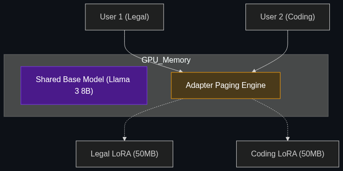

# 🔀 LoRAX (LoRA Exchange)

> **A specialized server technology that allows you to run hundreds of different fine-tuned "specialist" models on a single GPU simultaneously.**

---

## Phase 1: Core Foundations & Pre-requisites

### Prerequisites
- **LoRA (Low-Rank Adaptation)** — The lightweight fine-tuning method (see [Module 4](../../04_Training_and_Tweaking/03_LoRA_QLoRA.md)).
- **Inference Compute** — Understanding GPU memory limits.

### Definition
**LoRAX (LoRA Exchange)** is an open-source serving framework built by Predibase. 

Normally, if an enterprise has 100 different fine-tuned AI models (e.g., one for Legal, one for HR, one for Coding), they would have to buy 100 different GPUs to host them in memory at the same time. This is financially impossible. 
Because LoRA adapters are tiny (e.g., 50MB) compared to the massive Base Model (e.g., 14GB), **LoRAX** loads the massive Base Model into the GPU memory exactly *once*, and then dynamically swaps the tiny LoRA adapters in and out of the GPU cores in milliseconds depending on which user is asking a question.

### The Problem It Solves

| Traditional Deployment | LoRAX Deployment |
|------------------------|------------------|
| 10 Fine-tuned Models = 10 GPUs required. | 100 Fine-tuned Models = 1 GPU required. |
| **Cost:** $20,000 / month in cloud compute. | **Cost:** $2,000 / month in cloud compute. |
| **Architecture:** Monolithic "God Model" trying to do everything. | **Architecture:** Swarm of hundreds of highly specialized micro-models. |

### 🧩 Mini-Quiz

> **Q1:** Does LoRAX help you *train* models faster?
> <details><summary>Answer</summary>No. LoRAX is strictly an <b>Inference</b> server technology. You still train the models using standard LoRA/PEFT techniques. LoRAX is what you use when you are ready to <i>deploy</i> all those trained models to production cheaply.</details>

---

## Phase 2: Anatomy & Internal Mechanisms

### How LoRAX Swaps Adapters



1. **Shared Base Model:** The massive 7B or 70B open-source model (e.g., Llama 3) is loaded into the GPU's VRAM permanently.
2. **Adapter Storage:** Hundreds of tiny LoRA adapters (the fine-tuned specific knowledge) are stored on cheap disk storage or CPU RAM.
3. **Dynamic Routing:** 
   - User A asks a coding question -> The API requests the `coding_lora`.
   - User B asks a legal question -> The API requests the `legal_lora`.
4. **Paging:** LoRAX pulls the specific 50MB LoRA adapter into the GPU on the fly, attaches it to the Base Model, generates the answer, and removes it. 
5. **Heterogeneous Batching:** LoRAX can even process User A's coding prompt and User B's legal prompt *at the exact same time* in the same GPU batch cycle.

### 🃏 Flashcard

> **Front:** Why does the Multi-Agent Orchestration pattern (Module 3) make LoRAX so important?
> <details><summary>Flip</summary>In Multi-Agent Orchestration, a task is broken down into 5 or 10 specialized agents (e.g., Researcher, Writer, Reviewer). If each agent is its own fine-tuned model, hosting 10 different LLMs on traditional infrastructure is incredibly expensive. LoRAX allows you to run all 10 specialized agents on a single GPU concurrently, making complex Multi-Agent systems economically viable for the enterprise.</details>

---

## Phase 3: Advanced / Enterprise Patterns & Pitfalls

### Enterprise Use Cases

| Industry | LoRAX Application |
|----------|-------------------|
| **B2B SaaS (Multi-Tenant)** | A CRM software company fine-tunes a specific LLM for *every single one* of its 10,000 corporate clients. LoRAX serves all 10,000 distinct models from a single GPU cluster. |
| **Personalized AI** | An education app fine-tunes a unique "tutor" LoRA for every single student based on their learning style. |
| **Multi-Agent Systems** | Running 50 distinct highly-specialized agent personas concurrently. |

### Anti-Patterns

- ❌ **Using LoRAX for full-parameter fine-tunes** → LoRAX *only* works if the models were trained using PEFT/LoRA. If you did a full-parameter fine-tune, the resulting model is too massive to swap dynamically.
- ❌ **Using LoRAX for completely different base models** → You cannot host a Llama 3 LoRA and a Mistral LoRA on the same Base Model. The adapters must all share the exact same foundational architecture.

---

## Phase 4: Practical Implementation

### Using the LoRAX API (Conceptual Python)

*Notice how we hit a single API endpoint, but specify the exact `adapter_id` we want to use for the prompt.*

```python
import requests

# The single GPU server running LoRAX and the Base Model
LORAX_URL = "http://localhost:8080/generate"

# 1. Routing a request to the Legal Agent
payload_legal = {
    "inputs": "Draft a non-disclosure agreement.",
    "parameters": {
        # LoRAX dynamically loads the Legal fine-tune
        "adapter_id": "s3://my-bucket/legal_lora_v1" 
    }
}

# 2. Routing a request to the Coding Agent (hitting the EXACT SAME server)
payload_coding = {
    "inputs": "Write a python script to reverse a list.",
    "parameters": {
        # LoRAX dynamically loads the Coding fine-tune
        "adapter_id": "s3://my-bucket/python_lora_v3" 
    }
}

# Both of these requests can be processed concurrently by the same GPU
response = requests.post(LORAX_URL, json=payload_legal)
print(response.json()["generated_text"])
```

---

## Phase 5: Interview Preparation

### Q1: "We are a SaaS company with 500 enterprise clients. We want to give each client a custom fine-tuned LLM. How do we architect this without buying 500 GPUs?"
<details><summary><b>STAR Answer</b></summary>

**Situation:** Scaling fine-tuned models for multi-tenant SaaS applications is economically impossible using traditional 1-to-1 GPU deployment.

**Task:** Design a highly scalable, multi-tenant inference architecture.

**Action:** I would implement a **LoRAX (LoRA Exchange)** architecture. 
First, we mandate that all 500 client customizations are trained using PEFT/LoRA against a single, shared open-source Base Model (e.g., Llama 3). 
During deployment, we load the massive Base Model into the VRAM of a single GPU cluster. When a client makes an API request, the routing layer passes their specific `adapter_id` to LoRAX. LoRAX dynamically pages their tiny 50MB customization into the GPU, processes the prompt, and unloads it in milliseconds.

**Result:** We successfully host 500 distinct, highly-customized models concurrently on a single GPU cluster, reducing infrastructure costs by 99% while maintaining total data isolation for each client.
</details>

---

## Phase 6: Summary Cheatsheet & Action Plan

### 📋 TL;DR

| Concept | Key Point |
|---------|-----------|
| **LoRAX** | An inference server that serves 100s of fine-tuned models on 1 GPU. |
| **How it works** | 1 shared Base Model + dynamic swapping of tiny LoRA adapters. |
| **Multi-Tenancy** | The holy grail for B2B SaaS wanting to offer personalized AI to every client. |
| **Heterogeneous Batching** | Processing different LoRA prompts at the exact same time. |

### 🚀 Do These Now
1. **Look up Predibase:** Search for "Predibase LoRAX GitHub". Read the README to understand how "adapter paging" works similar to operating system memory management.
