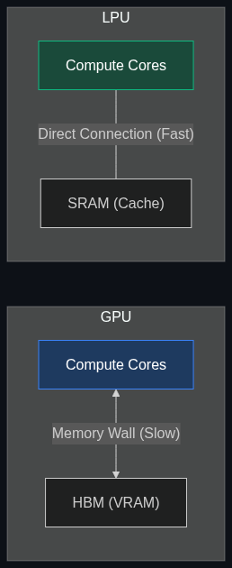

# ⚡ LPUs (Language Processing Units)

> **Specialized chips (like those from Groq) designed specifically for the speed and sequence of language models, making AI responses feel instantaneous rather than "typing" out.**

---

## Phase 1: Core Foundations & Pre-requisites

### Prerequisites
- **Inference Compute** — Generating tokens (see [Module 7](../../02_Enterprise_AI/05_Infrastructure_and_Deployment/02_Inference_Compute.md)).
- **The Memory Wall** — The bottleneck of fetching weights from VRAM to compute cores.

### Definition
An **LPU (Language Processing Unit)** is a custom silicon architecture engineered purely for Large Language Model inference. The term was coined and popularized by **Groq** (not to be confused with Elon Musk's *Grok* AI model). 

While GPUs (Graphics Processing Units) are incredible at parallel math for *training* AI, they are fundamentally bottlenecked by memory bandwidth during *inference*. LPUs abandon the traditional GPU architecture entirely to solve this specific bottleneck, achieving inference speeds 10x to 15x faster than NVIDIA's best GPUs.

### The Problem It Solves

| GPU Inference (NVIDIA) | LPU Inference (Groq) |
|------------------------|----------------------|
| **Speed:** 50 - 100 tokens per second. | **Speed:** 500 - 800 tokens per second. |
| **Experience:** The text "types" out slowly. | **Experience:** The answer appears instantly. |
| **Architecture:** Massive VRAM surrounding tiny compute cores. | **Architecture:** SRAM (ultra-fast memory) fused directly with compute cores. |

### 🧩 Mini-Quiz

> **Q1:** If a company wants to train a massive new foundational LLM from scratch, should they buy 10,000 LPUs or 10,000 GPUs?
> <details><summary>Answer</summary><b>GPUs.</b> LPUs are specifically designed for <i>Inference</i> (running a pre-trained model). Training requires massive parallel mathematical calculations (FLOPs) that NVIDIA GPUs are perfectly optimized for. You train on GPUs, and then deploy to LPUs for fast inference.</details>

---

## Phase 2: Anatomy & Internal Mechanisms

### Bypassing the Memory Wall



**The GPU Problem:** 
A GPU stores the model weights in HBM (High Bandwidth Memory). To generate a word, it must fetch the data from HBM, send it to the compute core, do the math, and send it back. This travel time is the "Memory Wall."

**The LPU Solution:**
Groq's LPU doesn't use HBM. It uses **SRAM** (Static RAM)—the fastest, most expensive memory available, which is physically located *directly next to* the math cores on the chip. 
There is no travel time. The entire model is unrolled across a massive network of interconnected LPUs, and the data flows through the chips in a continuous, deterministic stream without ever stopping to wait for memory fetches.

### 🃏 Flashcard

> **Front:** Why are LPUs critical for the future of Voice AI and Native Multimodal models?
> <details><summary>Flip</summary>Human conversation requires a response latency of less than 300 milliseconds. If an AI takes 2 seconds to generate the first word (TTFT), the conversation feels unnatural and robotic. LPUs generate tokens so incredibly fast that the AI can easily keep up with real-time, interruptible human speech.</details>

---

## Phase 3: Advanced / Enterprise Patterns & Pitfalls

### Enterprise Use Cases

| Industry | LPU Application |
|----------|-----------------|
| **Customer Service** | Real-time, voice-to-voice support agents. |
| **High-Frequency Trading** | AI algorithms that must read breaking news text and execute trades in milliseconds. |
| **Cybersecurity** | Real-time packet inspection where the AI must evaluate network logs as fast as the network transmits them. |

### Anti-Patterns

- ❌ **Using LPUs for massive batch jobs** → If you are running an overnight job to summarize 100,000 documents, latency doesn't matter. You want throughput. GPUs with massive batch sizes are currently more cost-effective for high-throughput background jobs than LPUs.
- ❌ **Expecting massive context windows on LPU** → SRAM is incredibly fast, but physically small and very expensive. Therefore, LPUs currently struggle to hold the massive 1M+ token context windows that GPUs can manage using vast arrays of cheaper HBM memory.

---

## Phase 4: Practical Implementation

### Using an LPU API (Conceptual Python)

*Because Groq provides an OpenAI-compatible API, migrating an enterprise app to LPUs is incredibly simple.*

```python
from openai import OpenAI
import time

# 1. We swap the OpenAI base URL for Groq's LPU API
# (Assuming you have a GROQ_API_KEY set in your environment)
client = OpenAI(
    base_url="https://api.groq.com/openai/v1",
    api_key="gsk_..." 
)

start_time = time.time()

# 2. Make the call to an open-source model running on LPUs
response = client.chat.completions.create(
    model="llama3-70b-8192", # Llama 3 70B
    messages=[
        {"role": "user", "content": "Write a 500 word essay on the French Revolution."}
    ]
)

end_time = time.time()
latency = end_time - start_time
tokens_generated = response.usage.completion_tokens

# 3. Calculate Tokens Per Second
tps = tokens_generated / latency

print(f"Generated {tokens_generated} tokens in {latency:.2f} seconds.")
print(f"Speed: {tps:.2f} Tokens/Second (Blistering Fast!)")
```

---

## Phase 5: Interview Preparation

### Q1: "We are building an AI co-pilot for surgeons to ask questions during operations. What hardware inference architecture do you recommend?"
<details><summary><b>STAR Answer</b></summary>

**Situation:** A surgical environment requires zero-latency answers. If a surgeon asks about a complication, a 5-second GPU generation delay is unacceptable.

**Task:** Select an inference architecture that prioritizes Time-To-First-Token (TTFT) and high-speed generation over batch throughput.

**Action:** I would advise deploying the model on an LPU (Language Processing Unit) cluster, such as Groq. By utilizing SRAM instead of traditional GPU HBM, the LPU bypasses the memory wall, ensuring deterministic, ultra-low latency execution.

**Result:** The surgeon receives real-time, instantaneous vocal responses, perfectly mimicking human conversation speeds, which is critical for high-stakes operational environments.
</details>

---

## Phase 6: Summary Cheatsheet & Action Plan

### 📋 TL;DR

| Concept | Key Point |
|---------|-----------|
| **LPU** | Language Processing Unit (e.g., Groq). |
| **The Goal** | Extreme inference speed (800+ tokens per second). |
| **The Tech** | Fusing compute cores directly with SRAM to bypass the memory wall. |
| **Best For** | Voice AI, real-time agents, low-latency enterprise apps. |

### 🚀 Do These Now
1. **Experience the Speed:** Go to `groq.com`. Create a free account and ask the chat interface a complex question. Watch how the text appears almost instantly—so fast you can't even read it as it types. That is LPU hardware in action.
