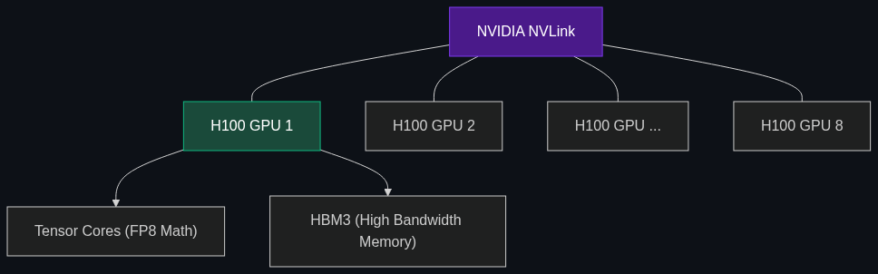

# 🧱 NVIDIA H100 / B200 (Blackwell)

> **The "Gold Standard" GPUs from NVIDIA. If a company says they are "building a cluster," they are usually talking about how many of these specific chips they've bought.**

---

## Phase 1: Core Foundations & Pre-requisites

### Prerequisites
- **Training Compute** — The power required to build a model (see [Module 7](../../02_Enterprise_AI/05_Infrastructure_and_Deployment/02_Inference_Compute.md)).
- **GPUs** — Graphics Processing Units.

### Definition
When the AI industry talks about "compute," they are almost exclusively talking about NVIDIA's flagship datacenter GPUs. 

- **H100 (Hopper Architecture):** The chip that powered the generative AI boom (2023/2024). Training massive models like GPT-4 required tens of thousands of these chips running in parallel.
- **B200 (Blackwell Architecture):** The successor to the H100 (released late 2024). It is significantly faster, more energy-efficient, and optimized specifically for Trillion-parameter models.

### The Problem It Solves

| Older GPUs (A100) | Modern GPUs (H100 / B200) |
|-------------------|---------------------------|
| Training a 1-Trillion parameter model takes 2 years. | **Speed:** Training takes 3 months. |
| Uses massive amounts of electricity. | **Efficiency:** Performs the same math using 1/4th the energy. |
| Standard precision math (FP16). | **Transformer Engine:** Uses FP8 (8-bit math) to double processing speed dynamically. |

### 🧩 Mini-Quiz

> **Q1:** If a startup raises $100 Million, what do they usually spend the majority of that money on?
> <details><summary>Answer</summary><b>NVIDIA GPUs.</b> H100 chips cost roughly $30,000 to $40,000 <i>each</i>. To train a frontier model, a startup needs a cluster of at least 10,000 to 20,000 chips. The primary barrier to entry in foundational AI is simply having the cash to buy the physical hardware.</details>

---

## Phase 2: Anatomy & Internal Mechanisms

### The Anatomy of an AI GPU



1. **Tensor Cores:** While standard GPU cores render video game pixels, *Tensor Cores* are dedicated logic blocks inside the chip designed solely to multiply massive matrices of numbers together—the exact math required by neural networks.
2. **HBM (High Bandwidth Memory):** The chips use specialized memory stacked vertically to push data to the cores as fast as physically possible.
3. **NVLink:** An H100 does not work alone. To train GPT-4, 20,000 chips must talk to each other simultaneously. NVLink is NVIDIA's proprietary networking technology that allows thousands of GPUs to share data at 900 GB/s (orders of magnitude faster than standard ethernet).

### 🃏 Flashcard

> **Front:** Why does Mark Zuckerberg publicly announce that Meta is buying 350,000 H100 GPUs?
> <details><summary>Flip</summary>To signal to AI researchers that Meta has the <b>Compute Capital</b> to train the most advanced AIs in the world. The best AI researchers only want to work at companies where they have unlimited access to compute. GPU clusters are the primary recruiting tool for top talent.</details>

---

## Phase 3: Advanced / Enterprise Patterns & Pitfalls

### Enterprise Procurement Strategies

| Strategy | Pros | Cons |
|----------|------|------|
| **Buy the Metal** (Build a Datacenter) | Total control, data privacy, cheaper over a 5-year timeline. | Massive CapEx ($Millions up front). Requires finding immense electricity/cooling. |
| **Rent Cloud Instances** (AWS/Azure) | Pay by the hour (OpEx). Easy to scale up/down. | Very expensive over time. Vendor lock-in. |
| **GPU-as-a-Service** (Lambda Labs, CoreWeave) | Cheaper than AWS, specifically tailored to AI workloads. | Subject to availability shortages. |

### Anti-Patterns

- ❌ **Over-provisioning hardware** → An enterprise buying ten H100s just to run a small RAG application. Inference for 99% of enterprise applications runs perfectly on much cheaper, older hardware (like L4s or A10Gs). H100s are primarily for *Training* and massive-scale batch inference.
- ❌ **Ignoring interconnects** → Buying 1,000 GPUs but connecting them with slow networking cables. The GPUs will spend 90% of their time idle, waiting for data to arrive from other servers. (The network *is* the computer).

---

## Phase 4: Practical Implementation

### Checking GPU Hardware (Python/PyTorch)

*As an AI engineer, the first thing you do when logging into a cloud instance is verify your hardware.*

```python
import torch

# 1. Check if NVIDIA GPUs are available
if torch.cuda.is_available():
    num_gpus = torch.cuda.device_count()
    print(f"✅ Found {num_gpus} GPU(s).")
    
    # 2. Iterate through and print the exact hardware specs
    for i in range(num_gpus):
        gpu_name = torch.cuda.get_device_name(i)
        
        # Look for "H100", "A100", etc.
        print(f"\nDevice {i}: {gpu_name}")
        
        # Check available memory (Crucial for determining batch size)
        total_memory = torch.cuda.get_device_properties(i).total_memory / 1e9
        print(f"Total VRAM: {total_memory:.2f} GB")
        
        # Check architecture (Compute Capability)
        # 9.0 = Hopper (H100), 8.0 = Ampere (A100)
        capability = torch.cuda.get_device_capability(i)
        print(f"Compute Capability: {capability[0]}.{capability[1]}")
else:
    print("❌ No GPUs found. Running on CPU (This will be incredibly slow).")
```

---

## Phase 5: Interview Preparation

### Q1: "We want to fine-tune a massive 70B open-source model using our proprietary corporate data. What hardware should we provision?"
<details><summary><b>STAR Answer</b></summary>

**Situation:** The enterprise needs to fine-tune a massive model, which requires significant VRAM and parallel math computation.

**Task:** Select the most cost-effective hardware architecture for the job.

**Action:** 
1. **Calculation:** A 70B parameter model in 16-bit precision requires ~140GB of VRAM just to hold the weights, plus gradients and optimizer states during training. 
2. **Selection:** A single GPU cannot hold this. I would provision an AWS instance with an 8x H100 NVLink cluster (which provides 80GB VRAM per chip, totaling 640GB). 
3. **Execution:** By using the NVLink interconnect, the training data and model weights can be distributed across all 8 GPUs seamlessly (using Fully Sharded Data Parallelism - FSDP).

**Result:** The H100 cluster handles the massive VRAM requirements and trains the model rapidly, minimizing the total hourly cloud bill compared to using older, slower hardware.
</details>

---

## Phase 6: Summary Cheatsheet & Action Plan

### 📋 TL;DR

| Concept | Key Point |
|---------|-----------|
| **H100** | NVIDIA's Hopper architecture. The engine of the 2024 AI boom. |
| **B200** | Blackwell architecture. The next-generation successor. |
| **Tensor Cores** | The specific parts of the chip optimized for neural network math. |
| **NVLink** | The high-speed networking allowing 10,000 GPUs to act as one giant brain. |

### 🚀 Do These Now
1. **Check Cloud Pricing:** Go to AWS or Lambda Labs pricing pages. Look up the hourly cost of an `8x H100` instance. (It is usually around $20 to $30 per hour).
