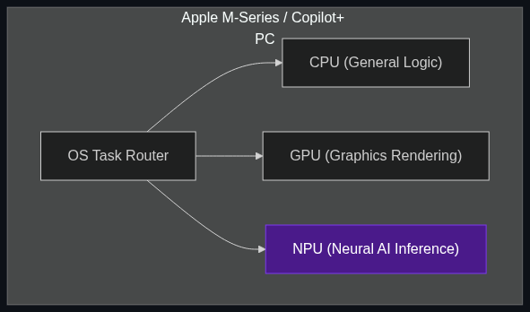

# 🔋 NPUs (Neural Processing Units)

> **A dedicated chip inside new laptops (like "AI PCs") and phones specifically designed to run AI tasks locally without killing your battery.**

---

## Phase 1: Core Foundations & Pre-requisites

### Prerequisites
- **Edge AI** — Why we want to run AI locally (see [Module 7](../../02_Enterprise_AI/05_Infrastructure_and_Deployment/01_Edge_AI.md)).

### Definition
An **NPU (Neural Processing Unit)** is a specialized hardware component integrated directly into the system-on-a-chip (SoC) of modern consumer devices (like Apple's M-Series chips, Intel Core Ultra, and Qualcomm Snapdragon). 

While CPUs are for general logic and GPUs are for graphics/parallel computing, NPUs are designed to do exactly one thing: execute the matrix math required by neural networks at **ultra-low power**.

### The Problem It Solves

| Using CPU/GPU for Local AI | Using NPU for Local AI |
|----------------------------|------------------------|
| **Battery:** Drains laptop battery in 45 minutes. | **Battery:** Can run background AI all day with minimal drain. |
| **Heat:** Laptop fans scream at maximum RPM. | **Heat:** Completely silent and cool to the touch. |
| **Interruption:** The OS stutters because the CPU is maxed out. | **Smoothness:** AI runs on a dedicated chip; CPU remains free for your web browser. |

### 🧩 Mini-Quiz

> **Q1:** If NPUs are so great, why don't data centers just fill their racks with NPUs instead of NVIDIA H100s?
> <details><summary>Answer</summary>Because NPUs prioritize <b>Efficiency over Raw Power</b>. They are designed for <i>Edge Inference</i>—generating an answer for one single user (you) without draining your battery. Datacenter GPUs prioritize raw, massive parallel power and batch processing for 10,000 users simultaneously, regardless of how much electricity it requires.</details>

---

## Phase 2: Anatomy & Internal Mechanisms

### TOPS (Trillion Operations Per Second)

When buying an "AI PC," marketers use the metric **TOPS**. 
- Microsoft requires a minimum of **40 TOPS** for a computer to be officially certified as a "Copilot+ PC."
- TOPS measures how many trillions of math operations the NPU can perform in one second.
- **Why it matters:** Higher TOPS means the NPU can run a larger model (e.g., an 8B parameter model instead of a 3B parameter model) or generate tokens much faster.

### The Heterogeneous Compute Architecture



Modern operating systems (like macOS or Windows 11) use an orchestrator to route tasks to the right hardware automatically:
- **CPU:** Opens a Word document.
- **GPU:** Renders a 3D video game.
- **NPU:** Runs the background AI that blurs your background during a Zoom call, or the local SLM summarizing your emails.

### 🃏 Flashcard

> **Front:** What is Apple's specific brand name for their NPU?
> <details><summary>Flip</summary>The <b>Neural Engine</b>. Apple has actually been including Neural Engines in iPhone chips since 2017 (for FaceID), but they are now heavily marketing them as the hardware backbone for "Apple Intelligence."</details>

---

## Phase 3: Advanced / Enterprise Patterns & Pitfalls

### Enterprise Use Cases

| Industry | NPU Application |
|----------|-----------------|
| **Cybersecurity** | Endpoint security software running locally on an employee's NPU, constantly analyzing user behavior via AI to detect malware, without slowing down the employee's CPU. |
| **Video Conferencing** | Zoom/Teams utilizing the NPU to suppress background noise (dogs barking, sirens) and maintain eye-contact correction in real-time. |
| **Always-On Transcription** | A local app transcribing a doctor's patient interactions all day directly on an iPad, ensuring HIPAA privacy and saving battery life. |

### Anti-Patterns

- ❌ **Assuming NPUs can train models** → NPUs are strictly for inference (running pre-trained models). If you want to train a model or fine-tune it locally, you still need a powerful GPU.
- ❌ **Ignoring software compatibility** → You cannot just run standard Python AI scripts on an NPU. You must use specific frameworks (like Apple's CoreML, Intel's OpenVINO, or Windows ML) that know how to compile the model down to the specific NPU instruction set.

---

## Phase 4: Practical Implementation

### Accessing the NPU (Conceptual Example: Windows ONNX)

*To use an NPU, developers convert their models into standardized formats like ONNX and specify the "Execution Provider".*

```python
import onnxruntime as ort

# 1. Load the AI Model (e.g., a local SLM for summarization)
model_path = "local_summarizer.onnx"

# 2. Define the Execution Providers.
# This tells the software: "Try to run this on the NPU first to save battery.
# If the NPU fails or is busy, fallback to the CPU."
providers = [
    'NpuExecutionProvider', # Routes math to the Neural Processing Unit
    'CPUExecutionProvider'  # Fallback
]

# 3. Create the session
session = ort.InferenceSession(model_path, providers=providers)

print(f"Model loaded. Active provider: {session.get_providers()[0]}")
# Output: "Active provider: NpuExecutionProvider"

# Now, when you run inference, your laptop fan won't spin up.
```

---

## Phase 5: Interview Preparation

### Q1: "We are developing a local dictation app for mobile devices. Users are complaining that the app drains their battery in 2 hours. How do we fix this?"
<details><summary><b>STAR Answer</b></summary>

**Situation:** The local AI dictation app was performing inference on the mobile device's primary CPU, causing massive power draw and thermal throttling.

**Task:** Re-architect the application to maintain local privacy while drastically reducing battery consumption.

**Action:** 
1. **Model Conversion:** I converted our PyTorch audio-transcription model into the specific native format for the target hardware (e.g., CoreML for iOS).
2. **Hardware Routing:** Updated the application code to explicitly target the device's NPU (Neural Engine) rather than the CPU.
3. **Quantization:** Quantized the model to INT8 to ensure it fit entirely within the NPU's localized memory constraints, avoiding costly data transfers to main RAM.

**Result:** Transcription latency dropped by 30%, but more importantly, battery consumption was reduced by 85%, allowing the app to run continuously all day without warming up the device.
</details>

---

## Phase 6: Summary Cheatsheet & Action Plan

### 📋 TL;DR

| Concept | Key Point |
|---------|-----------|
| **NPU** | Neural Processing Unit. A chip inside phones/laptops dedicated to AI. |
| **The Goal** | Low-power, highly efficient local Inference (Edge AI). |
| **TOPS** | The metric used to measure an NPU's speed (Trillion Operations Per Second). |
| **Copilot+ PCs** | The marketing term for Windows laptops with massive 40+ TOPS NPUs. |

### 🚀 Do These Now
1. **Check your OS:** If you are on Windows 11, open the Task Manager and click the "Performance" tab. If you have a modern laptop, you will see a graph for CPU, GPU, and **NPU**.
