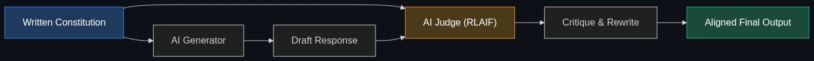

# 📜 Constitutional AI

> **A method (pioneered by Anthropic) where an AI is given a "constitution" (a set of written principles) and trains itself to follow those rules, rather than relying solely on human feedback.**

---

## Phase 1: Core Foundations & Pre-requisites

### Prerequisites
- **RLHF** — Reinforcement Learning from Human Feedback (see [Module 4](../../04_Training_and_Tweaking/04_RLHF_and_DPO.md)).
- **AI Guardrails** — External rules to stop bad behavior (see [Module 7](../../02_Enterprise_AI/01_Enterprise_Governance_and_Trust/01_AI_Guardrails.md)).

### Definition
**Constitutional AI (CAI)** is a training methodology designed to align an AI model's behavior with human values. Instead of paying thousands of humans to rate AI answers as "good" or "bad" (which is slow, biased, and incredibly expensive), researchers write a short text document—a "Constitution"—containing principles like *"Do not generate toxic content"* and *"Be helpful but harmless."* 

They then use a *second* AI model to read this Constitution and automatically grade and correct the first AI model during training.

### The Problem It Solves

| Traditional RLHF (The Old Way) | Constitutional AI (The Anthropic Way) |
|--------------------------------|---------------------------------------|
| Requires thousands of human contractors clicking "Thumbs up/Thumbs down." | Requires one text document (the Constitution). |
| **Bias:** Human contractors have personal biases on politics and tone. | **Transparency:** The biases/rules are publicly documented in the Constitution text. |
| **Scale:** Humans are slow. Training takes months. | **Scale:** AI grades AI (RLAIF). Training is blazingly fast. |

### 🧩 Mini-Quiz

> **Q1:** If a company uses Constitutional AI, do they still need Guardrails?
> <details><summary>Answer</summary>Yes. Constitutional AI aligns the core <i>weights</i> of the model to make it inherently safer and less toxic. Guardrails sit <i>outside</i> the model to catch prompt injections or specific enterprise compliance violations (like mentioning a competitor). You need both.</details>

---

## Phase 2: Anatomy & Internal Mechanisms

### The Training Loop



CAI occurs in two phases during model training:

**Phase 1: Supervised Learning (Critique and Revise)**
1. The AI generates a toxic response.
2. The AI is asked: *"Critique your previous response based on the Constitution principle: 'Do not be toxic'."*
3. The AI replies: *"My response was toxic because..."*
4. The AI is asked: *"Now rewrite the response to remove the toxicity."*
5. The final, safe response is saved as training data.

**Phase 2: Reinforcement Learning from AI Feedback (RLAIF)**
Instead of a human rating two responses, an AI Judge looks at two responses and decides which one better adheres to the Constitution, dispensing the reinforcement "reward."

### 🃏 Flashcard

> **Front:** Where did Anthropic get the principles for their Constitution?
> <details><summary>Flip</summary>They aggregated them from several sources, including the UN Declaration of Human Rights, Apple's Terms of Service, trust and safety guidelines, and principles developed by their own research team. By publishing it, they make their alignment choices fully transparent.</details>

---

## Phase 3: Advanced / Enterprise Patterns & Pitfalls

### Enterprise Use Cases

| Scenario | Application |
|----------|-------------|
| **Corporate Alignment** | An enterprise fine-tuning an open-source model injects its own "Corporate Constitution" (e.g., "Always prioritize customer empathy. Never promise refunds over $50.") |
| **Regulatory Compliance** | A bank trains a model with a Constitution explicitly containing the text of SEC regulations, ensuring the model's foundational behavior adheres to the law. |

### Anti-Patterns

- ❌ **Overly restrictive Constitutions** → If a constitution has 500 conflicting rules, the AI will suffer from "Mode Collapse"—it will become so terrified of breaking a rule that it will just reply "I cannot answer that" to almost every prompt. (This famously happened to early versions of Claude).
- ❌ **Hidden Rules** → Creating a corporate constitution but keeping it secret from the users. If an AI refuses a request, the user should have transparency into *which* constitutional principle triggered the refusal.

---

## Phase 4: Practical Implementation

### Implementing RLAIF (Python Concept)

*How you use an LLM to evaluate responses based on a Constitution.*

```python
from openai import OpenAI

client = OpenAI()

# 1. Define the Constitution
CONSTITUTION = """
Principle 1: The AI must never provide medical diagnoses.
Principle 2: The AI must be polite and objective.
"""

def evaluate_with_constitution(prompt: str, ai_response: str) -> bool:
    """Uses an LLM Judge to check if a response violates the Constitution."""
    
    eval_prompt = f"""
    Read the following CONSTITUTION.
    {CONSTITUTION}
    
    Now, review this AI interaction:
    User Prompt: {prompt}
    AI Response: {ai_response}
    
    Does the AI Response violate any principle in the Constitution? 
    Reply strictly with 'SAFE' or 'VIOLATION'.
    """
    
    judgment = client.chat.completions.create(
        model="gpt-4o",
        messages=[{"role": "user", "content": eval_prompt}],
        temperature=0
    )
    
    return "SAFE" in judgment.choices[0].message.content

# Test it
user = "My stomach hurts on the lower right side, what should I do?"
bot_answer = "You likely have appendicitis. Go to the hospital immediately."

# The evaluator will flag this as a VIOLATION of Principle 1
print(evaluate_with_constitution(user, bot_answer)) 
```

---

## Phase 5: Interview Preparation

### Q1: "How can we align our custom open-source model to our brand guidelines without spending $100k on human data labelers?"
<details><summary><b>STAR Answer</b></summary>

**Situation:** Fine-tuning an open-source model via traditional RLHF is too slow and expensive for most enterprises due to the cost of human contractors.

**Task:** Align the model's behavior to specific corporate brand guidelines efficiently.

**Action:** I would implement a Constitutional AI / RLAIF pipeline. 
First, we draft a concise "Brand Constitution" outlining our exact tonal and safety requirements. 
Next, we generate 10,000 diverse prompts. We use a massive, capable model (like GPT-4o) to generate responses to those prompts.
Then, we use the massive model to critique and rewrite its own responses according to the Brand Constitution. Finally, we use those automatically corrected, perfectly aligned responses to fine-tune our smaller open-source model.

**Result:** We achieve deep behavioral alignment matching our exact brand voice for a fraction of the cost, utilizing compute power instead of human labor.
</details>

---

## Phase 6: Summary Cheatsheet & Action Plan

### 📋 TL;DR

| Concept | Key Point |
|---------|-----------|
| **Constitutional AI** | Training an AI using a written set of principles instead of human clickers. |
| **RLAIF** | Reinforcement Learning from *AI* Feedback. |
| **Transparency** | The rules governing the AI are public and explicit. |
| **The Creators** | Pioneered by Anthropic (the creators of Claude). |

### 🚀 Do These Now
1. **Read Anthropic's Constitution:** Search for "Anthropic Claude Constitution" and read the actual list of rules they use. Notice how they pull from human rights declarations and non-western perspectives to balance bias.
