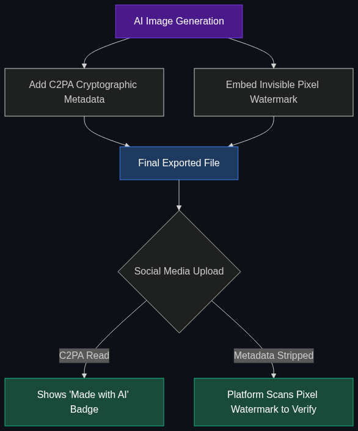

# 🕵️‍♂️ Deepfakes & Watermarking

> **As AI video/audio gets perfect, the industry is moving toward C2PA standards—a digital "nutrition label" baked into files to prove if they were made by a human or an AI.**

---

## Phase 1: Core Foundations & Pre-requisites

### Prerequisites
- **Multimodal AI** — Vision and Audio generation.

### Definition
**Deepfakes** are highly realistic, AI-generated synthetic media (audio, video, or images) designed to mimic real people or events. As models like Midjourney, Sora, and ElevenLabs achieve photorealism and voice cloning, distinguishing truth from AI generation is becoming a massive societal and enterprise challenge.

**Watermarking & C2PA** is the tech industry's response. C2PA (Coalition for Content Provenance and Authenticity) is an open standard that bakes cryptographic metadata directly into a file, acting as a "nutrition label" that travels with the image/video across the internet, proving exactly how and when it was created.

### The Problem It Solves

| Without C2PA | With C2PA |
|--------------|-----------|
| A viral photo shows a politician taking a bribe. | Clicking "Info" on the photo shows "Generated by Midjourney v6". |
| An enterprise receives an audio voicemail from the "CEO" demanding a wire transfer. | The enterprise security system flags the audio as missing a cryptographic human-origin signature. |
| Anyone can strip metadata by taking a screenshot. | Invisible cryptographic watermarks survive screenshots and compression. |

### 🧩 Mini-Quiz

> **Q1:** If I generate an image with AI, open it in Photoshop, and save it as a new file, does the C2PA label disappear?
> <details><summary>Answer</summary>Ideally, no. If Photoshop is C2PA-compliant (which it is), it will update the label to say: "Generated by AI -> Edited in Photoshop." The lineage is tracked. However, bad actors can use non-compliant software to strip metadata, which is why invisible pixel watermarking is also required as a backup.</details>

---

## Phase 2: Anatomy & Internal Mechanisms

### The Dual-Layer Defense



Enterprise systems use two layers to detect AI:

**1. Metadata (C2PA)**
- A cryptographic signature attached to the file header.
- Think of it like a digital certificate on a website (HTTPS).
- Very detailed (shows exactly what AI made it), but can be stripped by malicious software.

**2. Invisible Watermarking (e.g., SynthID by Google)**
- The AI slightly alters the actual pixels (or audio frequencies) in a specific pattern invisible to humans.
- For text, the AI selects specific synonyms in a mathematical pattern.
- Highly robust: Survives screenshots, cropping, compression, and printing. 

### 🃏 Flashcard

> **Front:** Why is the detection of AI text much harder than the detection of AI images?
> <details><summary>Flip</summary>Images have millions of pixels to hide invisible patterns in. Text has very little data structure. Most "AI Text Detectors" (like those used by schools) are notoriously inaccurate, causing massive false positives where human writers are falsely accused of using AI. The industry currently accepts that post-generation text detection is largely a failed pursuit.</details>

---

## Phase 3: Advanced / Enterprise Patterns & Pitfalls

### Enterprise Use Cases

| Industry | Watermarking Application |
|----------|--------------------------|
| **News / Media** | The BBC and NYT attaching C2PA data to photos taken by their journalists. If a photo lacks the BBC signature, it's fake. |
| **Finance** | Requiring biometric/cryptographic voice verification for wire transfers to defeat AI voice-cloning attacks. |
| **Social Media** | LinkedIn and Meta automatically applying "Made with AI" badges to images uploaded by users. |

### Anti-Patterns

- ❌ **Relying on AI to detect AI** → Building an AI classifier to look at a photo and guess if it's a deepfake. As generators get better, detectors fail. Cryptographic provenance (C2PA) is the only mathematically sound solution.
- ❌ **Watermarking Open Source Models** → If you release the weights of an open-source image generator, bad actors can simply delete the watermarking code and compile a malicious version. Watermarking only truly works on closed-API systems.

---

## Phase 4: Practical Implementation

### Checking C2PA Metadata (Conceptual)

*In the future, browsers will do this automatically. For now, developers use libraries to check image provenance.*

```python
# Conceptual implementation using a C2PA parser
from c2pa_validator import verify_image

image_path = "viral_politician_photo.jpg"

result = verify_image(image_path)

if result.is_valid:
    print("✅ Provenance verified cryptographically.")
    print(f"Origin: {result.origin_device}") # e.g., "Sony A7IV"
    
    if result.ai_generated:
        print(f"⚠️ Made with AI: {result.ai_tool}")
else:
    print("❌ No C2PA metadata found. Proceed with caution. Image origin unknown.")
```

---

## Phase 5: Interview Preparation

### Q1: "How do we protect our enterprise executives from targeted deepfake phishing attacks?"
<details><summary><b>STAR Answer</b></summary>

**Situation:** Hackers are using 3-second audio clips from YouTube to clone executive voices (Deepfakes) and leaving voicemails authorizing fraudulent wire transfers.

**Task:** Secure internal communications against synthetic media attacks.

**Action:** 
1. **Procedural Guardrails:** Instituted a policy that no financial transaction can be authorized via voice alone; it requires a multi-factor authentication (MFA) token approval via the corporate app.
2. **Technological Guardrails:** Implemented a unified communications platform that enforces C2PA-style cryptographic signing. Internal calls are cryptographically signed by the employee's device. If a call comes from an external/unsigned source spoofing the caller ID, the system flags it in bright red as "Unverified Origin."

**Result:** Eliminated the risk of deepfake social engineering by shifting the security burden from "guessing if it sounds real" to "mathematically verifying the origin device."
</details>

---

## Phase 6: Summary Cheatsheet & Action Plan

### 📋 TL;DR

| Concept | Key Point |
|---------|-----------|
| **Deepfakes** | Highly realistic, synthetic AI audio/video. |
| **C2PA** | The industry standard metadata label proving how a file was made. |
| **Invisible Watermarking** | Modifying pixels/audio frequencies to survive screenshots/cropping. |
| **The Shift** | Moving from "Detecting AI" to "Verifying Reality." |

### 🚀 Do These Now
1. **Test Content Credentials:** Go to `contentcredentials.org/verify` (the official C2PA site) and upload a recently generated image from ChatGPT or Midjourney. Watch it extract the hidden data proving the AI made it.
