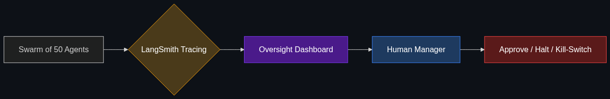

# 🐝 Agentic Oversight

> **The emerging field of how humans manage "swarms" of agents. If you have 50 agents working for you, how do you keep track of them?**

---

## Phase 1: Core Foundations & Pre-requisites

### Prerequisites
- **Multi-Agent Orchestration** — How agents work together (see [Module 3](../../03_Advanced_Orchestration/01_Multi_Agent_Orchestration.md)).
- **Copilots vs Agents** — Human-in-the-loop concepts.

### Definition
**Agentic Oversight** is the UI/UX and management layer required to govern autonomous systems. 

As we move from a world where an employee types a prompt into ChatGPT, to a world where an employee spins up 50 autonomous agents to scour the web, write reports, and email clients concurrently, a new problem emerges: **How do you know what they are doing?** Agentic Oversight provides the dashboards, audit logs, and kill-switches needed to manage AI at scale.

### The Problem It Solves

| 1 Prompt (The Past) | 50 Agents (The Future) |
|---------------------|------------------------|
| You read the output before using it. | 50 agents are doing things while you sleep. |
| If it hallucinates, you just hit "regenerate". | If it hallucinates, it sends an angry email to a client. |
| You manage the AI via a chat box. | You manage the AI via an orchestration dashboard (like an air-traffic controller). |

### 🧩 Mini-Quiz

> **Q1:** What is an "Agentic Kill-Switch"?
> <details><summary>Answer</summary>A fundamental requirement of Agentic Oversight. Because a swarm of agents operates asynchronously and autonomously, a human manager must have a single button that instantly revokes API keys and halts all agent execution across the entire swarm if they detect an error or rogue behavior.</details>

---

## Phase 2: Anatomy & Internal Mechanisms

### The Oversight Dashboard



An enterprise Oversight system requires four core pillars:
1. **Traceability (The "Why"):** You must be able to click on an agent's final action (e.g., "Deleted Database Row") and trace it all the way back through its Chain of Thought to see *why* it made that decision.
2. **Resource Caps (The "Budget"):** Agents can get caught in infinite loops. You must set hard limits: "This swarm cannot spend more than $50 in API compute, or execute more than 100 steps."
3. **Approval Nodes (HITL):** A unified inbox where all agents pause and wait for a human manager to click "Approve" before sending external communications.
4. **Kill-Switch:** The emergency halt button.

### 🃏 Flashcard

> **Front:** What is "Agent Drift"?
> <details><summary>Flip</summary>When an autonomous agent operates for hours or days, its context window fills up with actions, errors, and noise. Over time, it "forgets" its original core objective and starts wandering off-task (e.g., asked to research a company, it gets distracted reading Wikipedia articles about the history of the internet). Oversight tools monitor for drift and forcefully reset the agent if it strays too far.</details>

---

## Phase 3: Advanced / Enterprise Patterns & Pitfalls

### Enterprise Use Cases

| Scenario | Oversight Application |
|----------|-----------------------|
| **Sales Swarms** | 100 agents research 100 different companies, drafting highly personalized cold emails. The Oversight Dashboard shows the human Sales Rep 100 drafts. The human clicks "Approve All" and they send. |
| **Software Testing** | A swarm of 10 QA agents tries to break a codebase. The Engineering Manager uses the dashboard to view the "Agent Attack Logs" and merges the fixes. |

### Anti-Patterns

- ❌ **Alert Fatigue** → If an oversight system sends an email to the human every time an agent completes a minor sub-task, the human will ignore them all. Alerts must be strictly reserved for Blockers or destructive actions.
- ❌ **Black Box Execution** → Deploying agents via pure Python scripts running on a server. If they crash or hallucinate, there is no UI for a non-technical manager to intervene.

---

## Phase 4: Practical Implementation

### Implementing LangSmith Tracing (Conceptual)

*LangSmith is currently the industry standard for Agentic Oversight.*

```python
import os
from langsmith import traceable

# 1. Enable LangSmith tracing in your environment
os.environ["LANGCHAIN_TRACING_V2"] = "true"
os.environ["LANGCHAIN_API_KEY"] = "ls_..."

# 2. Decorate agent functions to make them trackable in the UI
@traceable(name="Lead_Research_Agent")
def research_company(company_url):
    # This entire thought process is now logged in the LangSmith dashboard.
    # A human manager can log in, click the execution, and see exactly
    # what the agent searched for, what it read, and what it output.
    results = run_llm_chain(company_url)
    return results

@traceable(name="Email_Draft_Agent")
def draft_email(research_data):
    draft = write_with_llm(research_data)
    return draft

# Execute the swarm
research = research_company("https://example.com")
email = draft_email(research)
# Note: The code doesn't send the email. The Human reviews the LangSmith dashboard first.
```

---

## Phase 5: Interview Preparation

### Q1: "We are deploying 5 autonomous agents to handle Level 1 IT support tickets. How do we ensure they don't hallucinate and delete user accounts?"
<details><summary><b>STAR Answer</b></summary>

**Situation:** Deploying autonomous agents with destructive tool access (deleting accounts) carries massive enterprise risk.

**Task:** Design an Agentic Oversight layer to manage risk while retaining automation speed.

**Action:** 
1. **Tracing:** I would wrap all agent executions in a tracing framework like LangSmith, logging every LLM thought and tool call to a central dashboard.
2. **Resource Constraints:** I would implement a hard cap: agents can only execute a maximum of 5 tool calls per ticket to prevent infinite loops.
3. **Approval Node (Human-in-the-Loop):** I would structure the workflow so that agents can autonomously *diagnose* the issue, *read* the logs, and *draft* the script to fix the account. However, any script that alters the database is pushed to an "Oversight Queue".
4. **Execution:** A human IT manager reviews the queue, reads the agent's chain-of-thought trace, and clicks "Execute".

**Result:** We automate 90% of the manual labor (the diagnosis and drafting), but retain 100% human oversight on destructive actions, completely nullifying the risk of rogue agents.
</details>

---

## Phase 6: Summary Cheatsheet & Action Plan

### 📋 TL;DR

| Concept | Key Point |
|---------|-----------|
| **Agentic Oversight** | The UI and governance layer to manage autonomous AI swarms. |
| **Traceability** | The ability to view the internal "thoughts" of an agent. |
| **Approval Nodes** | The queue where agents wait for a human to approve an action. |
| **LangSmith** | The industry-standard tool for agent tracing and oversight. |

### 🚀 Do These Now
1. **Watch a LangSmith Demo:** Go to YouTube and search for "LangSmith Agent Tracing". See how developers can click into a visual graph of exactly what an agent was thinking at every step of a complex task.
