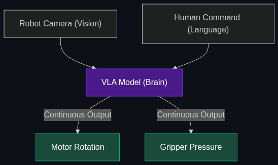

# 🤖 Embodied AI

> **Putting a "brain" (LLM/VLM) into a physical "body" (a robot). This is why you see so many humanoid robot videos lately—they are finally getting brains that can understand natural language instructions.**

---

## Phase 1: Core Foundations & Pre-requisites

### Prerequisites
- **Multimodal AI** — Vision models processing live camera feeds (see [Module 2](../../01_Advanced_Reasoning_and_Architecture/03_Multimodal_AI.md)).
- **World Models** — Understanding physics (see [01_World_Models.md](01_World_Models.md)).

### Definition
**Embodied AI** is the integration of Artificial Intelligence into a physical, mechanical body (a robot or autonomous vehicle) that interacts with the real world. 

Historically, robots (like those building cars in factories) were "dumb." They were hardcoded to move their arm exactly 3 inches to the left, 10,000 times a day. If you dropped a wrench in their path, they would crash into it. **Embodied AI** replaces hardcoded scripts with a Multimodal VLM. The robot looks at the room through cameras, hears a human command ("Clean up this mess"), reasons about the physics of the room, and dynamically generates the motor controls to do it.

### The Problem It Solves

| Traditional Robotics | Embodied AI |
|----------------------|-------------|
| Programmed via complex C++ scripts for exactly one environment. | Programmed via natural language ("Make me a coffee"). |
| Completely fails if the environment changes slightly. | Adapts instantly to new environments using its Vision model. |
| No semantic understanding (Doesn't know what a "cup" is). | Full semantic understanding (Knows what a cup is, what coffee is, and that the cup might be hot). |

### 🧩 Mini-Quiz

> **Q1:** If a company builds an incredibly smart LLM that can write poetry, but they put it inside a speaker on a desk, is that Embodied AI?
> <details><summary>Answer</summary>No. While it has a physical presence (a speaker), it cannot take <i>physical action</i> to alter its environment. Embodied AI requires actuators (motors, wheels, arms) that allow the AI to physically manipulate the real world based on its reasoning.</details>

---

## Phase 2: Anatomy & Internal Mechanisms

### VLA Models (Vision-Language-Action)



Standard AI models are VLMs (Vision-Language Models). Embodied AI runs on **VLA Models** (Vision-Language-Action Models), like Google's RT-X.

1. **Vision:** The robot's cameras stream frames into the model.
2. **Language:** The user gives an audio/text prompt ("Pick up the blue block").
3. **Action:** Instead of outputting text ("I will pick it up"), the VLA model outputs **Continuous Motor Commands** (e.g., `joint_1_rotation: 45deg, gripper_pressure: 12%`).

The VLA model translates human language directly into robot muscle movement.

### 🃏 Flashcard

> **Front:** Why are humanoid robots (like Tesla Optimus or Figure 01) suddenly advancing so rapidly right now?
> <details><summary>Flip</summary>Hardware (motors and batteries) has been good enough for years. What was missing was the "Brain." The breakthrough in Large Vision-Language Models (VLMs) finally provided a brain capable of understanding complex human environments. Companies are simply plugging these new LLM brains into existing robotic bodies.</details>

---

## Phase 3: Advanced / Enterprise Patterns & Pitfalls

### Enterprise Use Cases

| Industry | Embodied AI Application |
|----------|-------------------------|
| **Warehousing (Amazon)** | Robots that don't just follow lines on the floor, but can be told "Go find the box with the red tape that fell off the shelf in aisle 4" and visually hunt for it. |
| **Elder Care** | Humanoid robots that can visually recognize if a person has fallen, understand the medical context, and gently assist them while calling for help. |
| **Hazardous Materials** | Robots sent into nuclear disaster zones that can navigate unstructured, broken environments using pure visual reasoning instead of pre-mapped GPS coordinates. |

### Anti-Patterns

- ❌ **The "Uncanny Valley" deployment** → Deploying humanoid robots into customer-facing retail roles too early. They are currently too slow and physically terrifying to general consumers. Embodied AI is starting in warehouses and factories first.
- ❌ **Ignoring Latency** → If you run a VLA model via a Cloud API, the 1-second lag will cause the robot to drop the glass of water. Embodied AI *must* rely heavily on Edge AI (running the model locally on the robot's internal computer).

---

## Phase 4: Practical Implementation

### Conceptualizing a VLA Loop (Python)

*How natural language translates to physical motors.*

```python
# A conceptual VLA (Vision-Language-Action) loop running on a robot's Edge NPU

class RobotBody:
    def execute_motor_commands(self, commands):
        print(f"Moving arm to {commands['xyz']} with grip {commands['grip_strength']}")

# The VLA Brain (e.g., Google RT-2 or similar open-source model)
vla_model = load_vla_model("rt-2-local")
robot = RobotBody()

def robot_loop():
    while True:
        # 1. Vision
        current_camera_frame = get_camera_feed()
        
        # 2. Language (Instruction)
        instruction = "Gently pick up the fragile egg from the table."
        
        # 3. Action (Inference)
        # The model translates the image and the text directly into motor coordinates
        motor_commands = vla_model.predict_action(current_camera_frame, instruction)
        
        # 4. Execution
        robot.execute_motor_commands(motor_commands)
        
        if motor_commands['status'] == "task_complete":
            break

robot_loop()
```

---

## Phase 5: Interview Preparation

### Q1: "What is the biggest engineering bottleneck preventing Embodied AI from entering homes today?"
<details><summary><b>STAR Answer</b></summary>

**Situation:** The public wants Rosie the Robot to clean their houses, but humanoid robots are still confined to controlled factory environments.

**Task:** Identify the core technical blockers.

**Action:** 
1. **Data Scarcity:** LLMs became smart because we trained them on the entire internet (trillions of words). There is no "internet of robot movement data." We lack massive datasets of how to fold a specific shirt or wipe a specific counter. 
2. **Compute/Battery Constraints:** Running a massive VLA model requires a heavy, power-hungry GPU. You cannot put a datacenter H100 chip inside a walking robot—the battery would die in 5 minutes, and the fans would be deafening.

**Result:** To solve this, the industry must rely on Synthetic Data (simulating millions of robot tasks in video games like Nvidia Omniverse to generate training data) and heavy Model Distillation (shrinking the VLA model to run efficiently on an Edge NPU).
</details>

---

## Phase 6: Summary Cheatsheet & Action Plan

### 📋 TL;DR

| Concept | Key Point |
|---------|-----------|
| **Embodied AI** | AI models interacting with the physical world via robotic bodies. |
| **VLA Models** | Vision-Language-Action. Translates words/video directly into motor movement. |
| **The Shift** | From hardcoded, brittle C++ robotics to natural language, adaptable robotics. |
| **The Bottleneck** | Lack of physical training data and battery/compute limitations on the Edge. |

### 🚀 Do These Now
1. **Watch Figure 01:** Go to YouTube and search for "Figure 01 OpenAI robot demo." Watch how the robot hands the human an apple simply because the human said, "I'm hungry," while simultaneously explaining its reasoning out loud.
