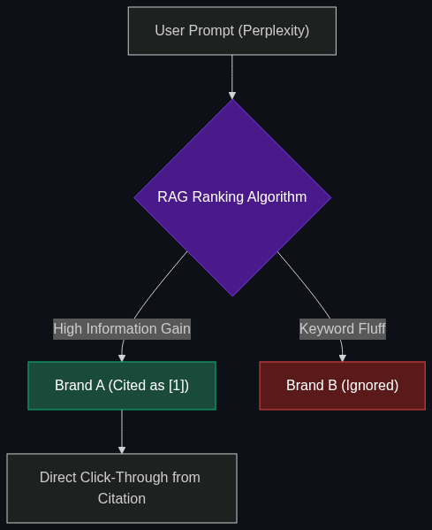

# 📈 GEO (Generative Engine Optimization)

> **The new SEO. It’s the practice of optimizing your content specifically so that AI engines (like Gemini or SearchGPT) cite your brand as the primary source in their summaries.**

---

## Phase 1: Core Foundations & Pre-requisites

### Prerequisites
- **RAG (Retrieval-Augmented Generation)** — How AI searches the web to answer a question.
- **SEO (Search Engine Optimization)** — The traditional way of ranking on Google.

### Definition
For 25 years, marketers used **SEO** to make their websites appear at the top of Google's blue links. Today, users are abandoning search engines to ask questions directly to AI (like Perplexity or ChatGPT). 

**GEO (Generative Engine Optimization)** is the emerging science of formatting your digital content so that when an AI searches the web to build its answer, it chooses *your* data over your competitor's data, and explicitly cites your brand in the conversational output.

### The Problem It Solves

| Traditional SEO | Generative Engine Optimization (GEO) |
|-----------------|--------------------------------------|
| Focuses on keywords and backlinks. | Focuses on dense facts and unique statistics. |
| Goal: Get the user to click a blue link. | Goal: Be the source the AI trusts and quotes. |
| Writes for Google's indexing bot. | Writes for an LLM's semantic reasoning capability. |

### 🧩 Mini-Quiz

> **Q1:** If I stuff my blog post with the exact keyword "Best Running Shoes 2026" 50 times, will it help my GEO?
> <details><summary>Answer</summary>No. That might work for old SEO, but LLMs read for semantic meaning, not keyword frequency. If your article is just keyword fluff, the AI will ignore it. GEO requires high "Information Gain"—giving the AI new, factual data it can't find elsewhere.</details>

---

## Phase 2: Anatomy & Internal Mechanisms

### How AI Decides What to Cite



When a user asks Perplexity, "What is the best CRM for small business?", the AI does not look at backlinks. It uses a **Ranking Algorithm for RAG**:

1. **Relevance (Semantic Match):** Does this page semantically answer the user's intent?
2. **Authority (Brand Mention):** Is this brand frequently mentioned alongside this topic in the AI's pre-training data?
3. **Information Density:** Does the page contain clear bullet points, tables, and statistics, or is it 500 words of rambling text? AI strongly prefers extracting data from tables.
4. **Citation Extraction:** The AI writes the answer and dynamically appends `[1]` linked to the source that provided the most factual density.

### 🃏 Flashcard

> **Front:** What is "Information Gain" in the context of GEO?
> <details><summary>Flip</summary>Information Gain is a metric measuring how much *new* information a source provides compared to what the AI already knows. If your blog post just repeats what Wikipedia says, the AI won't cite you. If you provide a unique, proprietary survey or a new dataset, your Information Gain is high, and the AI will cite you as the primary source.</details>

---

## Phase 3: Advanced / Enterprise Patterns & Pitfalls

### Enterprise Use Cases

| Industry | GEO Application |
|----------|-----------------|
| **SaaS Marketing** | Structuring feature comparison pages in clean Markdown tables so when ChatGPT is asked "HubSpot vs Salesforce", it pulls exactly the bullet points HubSpot's marketing team wants. |
| **E-Commerce** | Writing highly technical, fact-dense product descriptions rather than emotional marketing fluff, because AIs prefer factual extraction. |

### Anti-Patterns

- ❌ **Writing 2,000-word "Fluff" Articles** → AI models summarize. If you write 2,000 words just to say "Buy our shoes," the AI will extract "Buy their shoes" and ignore the rest. You must provide dense value in every paragraph.
- ❌ **Ignoring Authoritative Quotes** → AIs are heavily weighted to trust named experts. GEO strategies now involve interviewing known industry experts and quoting them, as the AI's semantic search will latch onto the expert's name.

---

## Phase 4: Practical Implementation

### Formatting for GEO (Markdown/HTML)

*AIs love structured data. To optimize for GEO, use semantic HTML or Markdown tables rather than raw text.*

**Bad for GEO (Hard for AI to extract):**
> "Our Pro plan costs $50 a month and includes 5 users, which is better than the Starter plan that costs $20 for 1 user. Oh, and the Pro plan also gives you priority support."

**Good for GEO (Easy for AI to extract and cite):**
```html
<!-- The AI will instantly parse this table and use it in a RAG response -->
<h3>Pricing Comparison</h3>
<table>
  <tr>
    <th>Plan</th>
    <th>Price</th>
    <th>Users</th>
    <th>Support Level</th>
  </tr>
  <tr>
    <td>Starter</td>
    <td>$20/mo</td>
    <td>1</td>
    <td>Standard</td>
  </tr>
  <tr>
    <td>Pro</td>
    <td>$50/mo</td>
    <td>5</td>
    <td>Priority</td>
  </tr>
</table>
```

---

## Phase 5: Interview Preparation

### Q1: "Our website traffic is dropping because users are just asking ChatGPT for the answers. How do we adapt our marketing strategy?"
<details><summary><b>STAR Answer</b></summary>

**Situation:** Organic search traffic (SEO) is declining due to users shifting to Generative AI engines like Perplexity and ChatGPT, resulting in fewer clicks to our website.

**Task:** Pivot the marketing strategy to ensure brand visibility within conversational AI outputs.

**Action:** I would implement a **Generative Engine Optimization (GEO)** strategy. 
First, we audit our content and remove keyword fluff, replacing it with high "Information Gain" assets—proprietary data, unique surveys, and expert quotes.
Second, we restructure our HTML and content layout, heavily utilizing tables, bullet points, and clear semantic headings (`<h2>`, `<h3>`), because LLMs strongly favor extracting structured data during RAG (Retrieval-Augmented Generation). 

**Result:** While we may not recover traditional "click-through" traffic, our brand will consistently appear as the primary `[1]` citation in AI summaries, maintaining our market authority and capturing high-intent users who click the citation source.
</details>

---

## Phase 6: Summary Cheatsheet & Action Plan

### 📋 TL;DR

| Concept | Key Point |
|---------|-----------|
| **GEO** | Generative Engine Optimization. Ranking in AI, not Google. |
| **The Goal** | Be the cited source `[1]` in a ChatGPT/Perplexity answer. |
| **How to Win** | High Information Gain (new facts) and structured data (tables/bullets). |
| **The Shift** | From "Keyword Density" to "Fact Density." |

### 🚀 Do These Now
1. **Test your Brand:** Go to Perplexity.ai and ask "What are the top 3 tools for [Your Industry]?" See which companies the AI cites. Look at those companies' websites to see how their data is structured.
