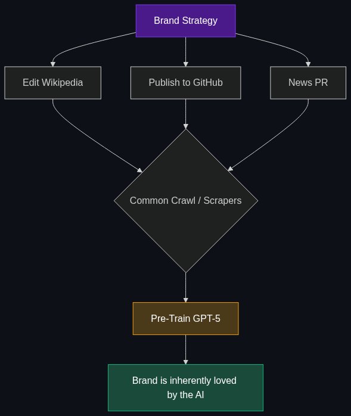

# 🧠 LLMO (Large Language Model Optimization)

> **A deeper version of optimization where companies try to influence the training data or live retrieval of a model to ensure their brand is represented accurately and positively.**

---

## Phase 1: Core Foundations & Pre-requisites

### Prerequisites
- **Pre-Training vs Fine-Tuning** — How a model learns facts.
- **GEO & AEO** — Optimizing content for live retrieval (see [01_GEO.md](01_GEO.md) and [02_AEO.md](02_AEO.md)).

### Definition
While GEO and AEO focus on how your website is formatted *today* to be read by an AI, **LLMO (Large Language Model Optimization)** is a much broader, long-term strategy. 

LLMO is the active pursuit of manipulating the "brain" of the foundational models (like GPT-4 or Claude). It involves public relations, strategic data publishing, and Wikipedia editing to ensure that when an AI is *pre-trained*, your brand is fundamentally baked into the neural network's weights as a positive, authoritative entity.

### The Problem It Solves

| The Problem (AI Hallucination/Bias) | The LLMO Solution |
|-------------------------------------|-------------------|
| ChatGPT thinks your company went bankrupt in 2021. | You aggressively seed the internet with press releases stating record profits so the *next* version of ChatGPT learns the truth. |
| Claude recommends your competitor when asked for a "reliable vendor." | You optimize your brand mentions on high-authority sites (like Reddit and Wikipedia) that LLMs use for heavy training data. |

### 🧩 Mini-Quiz

> **Q1:** If I update my company website today, will it immediately fix a hallucination inside GPT-4?
> <details><summary>Answer</summary>No. GPT-4's base knowledge is frozen at its last training cutoff. Changing your website only helps if the AI uses live web-search (RAG) to find you. To change the AI's <i>inherent</i> knowledge (LLMO), you have to wait for OpenAI to scrape the web again and train GPT-5 on your new data.</details>

---

## Phase 2: Anatomy & Internal Mechanisms

### How LLMs Learn "Truth"



LLMs do not know facts; they know statistical probabilities. If the word "Reliable" is associated with "Brand X" 10,000 times in the training data, the AI believes Brand X is reliable.

**The Target Data Sources for LLMO:**
1. **Wikipedia:** The absolute gold standard of LLM training data. If your company has a Wikipedia page, the AI knows you.
2. **Reddit / Quora:** Used heavily for conversational alignment and human opinions. 
3. **News Publications (NYT, Bloomberg):** High-weight authority domains.
4. **GitHub:** For technical brands, the amount of documentation and stars on GitHub directly dictates if an AI coding assistant will recommend your SDK.

### 🃏 Flashcard

> **Front:** What is "Data Poisoning" and how does it relate to LLMO?
> <details><summary>Flip</summary>Data Poisoning is the malicious/black-hat version of LLMO. It involves a bad actor flooding the internet with millions of fake articles or Reddit comments linking a competitor's brand to a negative concept (e.g., "Company Y causes cancer"). When the next LLM scrapes the web for training, it learns this toxic association.</details>

---

## Phase 3: Advanced / Enterprise Patterns & Pitfalls

### Enterprise Use Cases

| Strategy | LLMO Application |
|----------|------------------|
| **Brand Sentiment AI Analysis** | Using APIs to ask GPT-4, Claude, and Gemini every day: "What are the weaknesses of [Our Brand]?" Tracking the AI's sentiment over time to identify what misinformation is baked into the weights. |
| **Strategic PR Publishing** | Rather than just publishing press releases on their own site, PR teams actively work to get their company mentioned in Wikipedia, GitHub Repos, and major news outlets to ensure inclusion in the next Common Crawl dataset. |

### Anti-Patterns

- ❌ **Trying to "Keyword Stuff" for LLMO** → Posting a blog article with 5,000 keywords will not influence the training of an LLM. Foundational models use massive deduplication and quality filters. Spam is deleted from the training set.
- ❌ **Ignoring Developer Docs** → If your API documentation is locked behind a PDF or a login screen, the LLM web scrapers cannot read it. When developers ask ChatGPT how to use your API, it will hallucinate or recommend a competitor whose docs were open to the public.

---

## Phase 4: Practical Implementation

### Monitoring LLM Sentiment (Conceptual Python)

*Enterprise LLMO starts by tracking what the AIs currently "believe" about your brand.*

```python
from openai import OpenAI

client = OpenAI()

def check_brand_sentiment_in_llm(brand_name, competitor_name):
    """
    Automated script to track how an LLM perceives your brand vs a competitor.
    Run this weekly to track LLMO progress.
    """
    
    prompt = f"""
    You are an unbiased industry analyst. 
    Compare {brand_name} and {competitor_name} in one paragraph. 
    State explicitly which one is generally considered more reliable by the public.
    """
    
    response = client.chat.completions.create(
        model="gpt-4o",
        messages=[{"role": "user", "content": prompt}],
        temperature=0 # Keep it deterministic
    )
    
    return response.choices[0].message.content

# Track this output in a database over time to see if your PR efforts 
# are successfully shifting the model's internal weights.
report = check_brand_sentiment_in_llm("OurBrand", "RivalBrand")
print(report)
```

---

## Phase 5: Interview Preparation

### Q1: "When developers ask Copilot how to integrate our software, it hallucinates fake code. How do we fix this?"
<details><summary><b>STAR Answer</b></summary>

**Situation:** Our proprietary software integration was not represented in the training data of major coding LLMs (like GitHub Copilot), leading to hallucinations and frustrated developers.

**Task:** Execute an LLMO strategy to ensure future AI models understand our SDK.

**Action:** 
1. **Open the Data:** I moved our entire technical documentation out of a gated PDF portal and onto a public, heavily hyperlinked HTML site so web-scrapers (like Common Crawl) could easily index it.
2. **GitHub Seeding:** I created 20 open-source repository templates on GitHub demonstrating our SDK. Since coding AIs heavily weight GitHub repositories during training, this provided high-quality seed data.
3. **StackOverflow:** I had our engineering team actively answer questions about our SDK on StackOverflow, another primary training source for LLMs.

**Result:** Within 6 months (after the next major model training update), Copilot and ChatGPT began accurately writing code for our SDK, recognizing the patterns we strategically placed in the public domain.
</details>

---

## Phase 6: Summary Cheatsheet & Action Plan

### 📋 TL;DR

| Concept | Key Point |
|---------|-----------|
| **LLMO** | Large Language Model Optimization. |
| **The Goal** | Influencing the actual *training data* of foundational models. |
| **The Strategy** | Publishing high-quality data on high-authority sites (Wikipedia, GitHub). |
| **The Metric** | AI Brand Sentiment (Does the AI inherently "like" you?). |

### 🚀 Do These Now
1. **Audit your Brand:** Open ChatGPT, Claude, and Gemini. Type: *"What are the most common complaints about [Your Company/Product]?"* Do not let it search the web. The answer it gives you is the bias currently locked inside its weights. That is what LLMO seeks to change.
